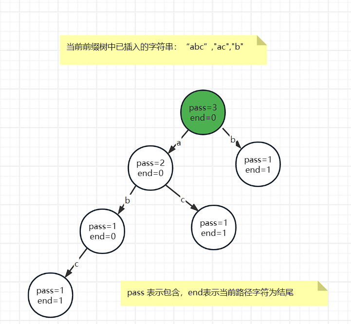

字典树 (Trie)
又称单词查找树、前缀树，是一种树形结构，是一种哈希树的变种。在统计、排序和保存大量的字符串（但不仅限于字符串）是具有更小的时间复杂度，因此可以应用于搜索引擎系统用于文本词频统计。它的优点是：利用字符串的公共前缀来减少查询时间，最大限度地减少无谓的字符串比较，查询效率比哈希树高。

例如我有 “abc”,"ac","b" 这 3 个单词，那么就能够组织成如图所示字典树

字典树的性质

1. 根节点不包含字符，除根节点外每一个节点都只包含一个字符；
2. 从根节点到某一节点，路径上经过的字符连接起来，为该节点对应的字符串；
3. 每个节点的所有子节点包含的字符都不相同。