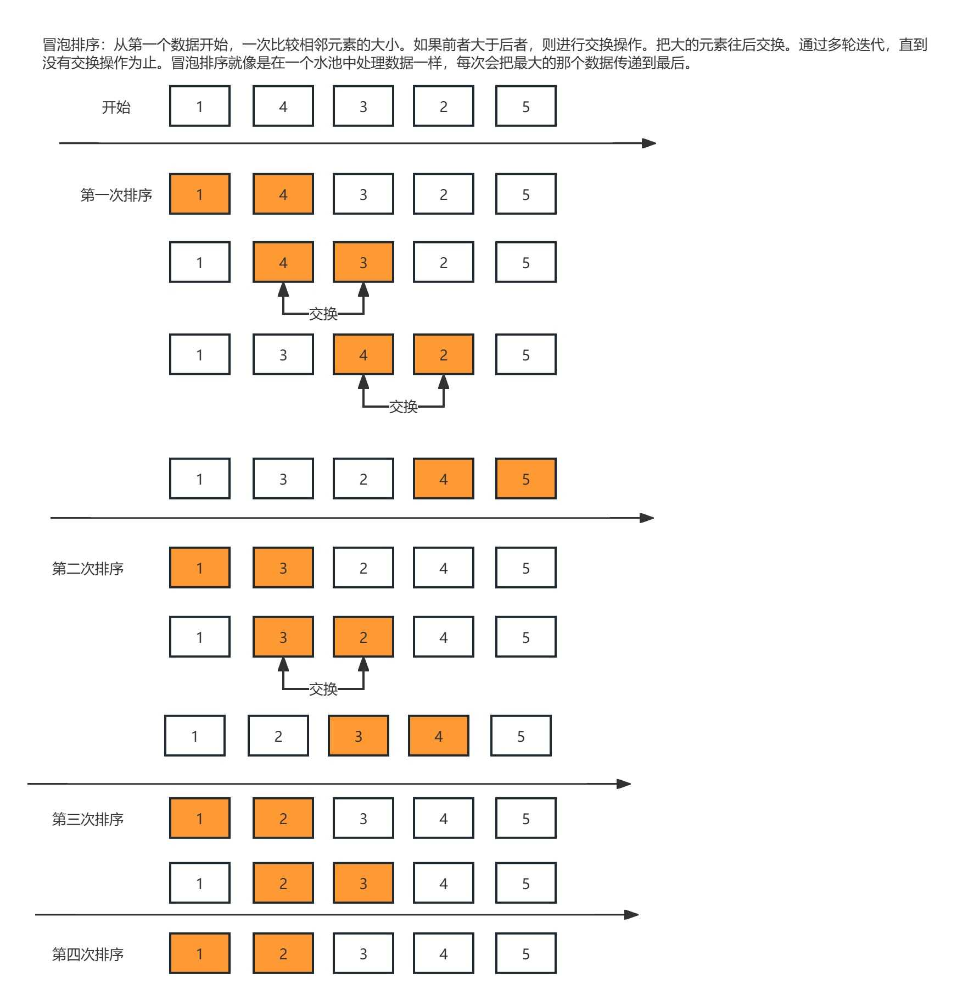

# 冒泡排序 (Bubble Sort)

## 1. 算法介绍

**冒泡排序** 是一种简单的排序算法，它重复遍历要排序的列表，比较相邻的元素并交换它们，使较大的元素逐步“冒泡”到列表的末尾。该算法的时间复杂度为
**O(n²)**，适用于数据量较小且对性能要求不高的场景。

### **算法步骤**

1. 从数组的第一个元素开始，依次比较相邻的两个元素，如果前面的元素比后面的元素大，则交换位置。
2. 每轮遍历后，最大的元素会被“冒泡”到数组的最后一位。
3. 继续对未排序部分重复以上过程，直到整个数组排序完成。



## 2. 实现代码

::: code-group

```java
import java.util.Arrays;
import java.util.Random;

public class BubbleSort {
    public static void main(String[] args) {
        int testTime = 1000; // 测试次数
        int arraySize = 10;  // 数组大小
        int minValue = 0;
        int maxValue = 100;

        boolean success = true;

        for (int i = 0; i < testTime; i++) {
            int[] array1 = generateRandomArray(arraySize, minValue, maxValue);
            int[] array2 = Arrays.copyOf(array1, array1.length); // 复制数组用于标准排序

            // 进行冒泡排序
            bubbleSort(array1);
            // 进行标准排序（对数器验证）
            Arrays.sort(array2);

            // 验证排序结果是否一致
            if (!Arrays.equals(array1, array2)) {
                success = false;
                System.out.println("❌ 测试失败！");
                System.out.println("原始数据: " + Arrays.toString(array2));
                System.out.println("冒泡排序结果: " + Arrays.toString(array1));
                System.out.println("正确结果: " + Arrays.toString(array2));
                break; // 发现错误时终止测试
            }
        }

        if (success) {
            System.out.println("✅ 所有测试通过！排序算法正确！");
        }
    }

    // 冒泡排序实现
    public static void bubbleSort(int[] arr) {
        int n = arr.length;
        boolean swapped;

        for (int i = 0; i < n - 1; i++) {
            swapped = false;
            for (int j = 0; j < n - 1 - i; j++) {
                if (arr[j] > arr[j + 1]) {
                    // 交换 arr[j] 和 arr[j+1]
                    int temp = arr[j];
                    arr[j] = arr[j + 1];
                    arr[j + 1] = temp;
                    swapped = true;
                }
            }
            // 如果本轮没有发生交换，说明数组已排序完毕，提前终止循环
            if (!swapped) {
                break;
            }
        }
    }

    // 生成随机数组
    public static int[] generateRandomArray(int size, int min, int max) {
        Random random = new Random();
        int[] arr = new int[size];

        for (int i = 0; i < size; i++) {
            arr[i] = random.nextInt(max - min + 1) + min;
        }

        return arr;
    }
}

```

```js
// 冒泡排序实现
function bubbleSort(arr) {
    const n = arr.length;
    let swapped;

    for (let i = 0; i < n - 1; i++) {
        swapped = false;
        for (let j = 0; j < n - 1 - i; j++) {
            if (arr[j] > arr[j + 1]) {
                // 交换 arr[j] 和 arr[j+1]
                [arr[j], arr[j + 1]] = [arr[j + 1], arr[j]];
                swapped = true;
            }
        }
        // 如果本轮没有发生交换，说明数组已排序完毕，提前终止循环
        if (!swapped) {
            break;
        }
    }
}
```

::: code-group

## 3. 代码解析

- `generateRandomArray()` 方法用于创建一个指定大小、范围的随机数组。
- `bubbleSort()` 方法实现了基本的冒泡排序逻辑，优化了 **提前终止** 机制，以减少不必要的循环。
- `main()` 方法用于运行测试，输出排序前后的数组。

### **时间复杂度**

- **最坏情况 (O(n²))**：数组元素完全逆序，每次都需要进行交换。
- **最好情况 (O(n))**：数组已排序，仅需进行一次遍历，无需交换。

## 4. 适用场景

- 适用于数据量较小的场景，例如教学演示、简单排序任务。
- 不适用于大规模数据排序，因为性能较低。

