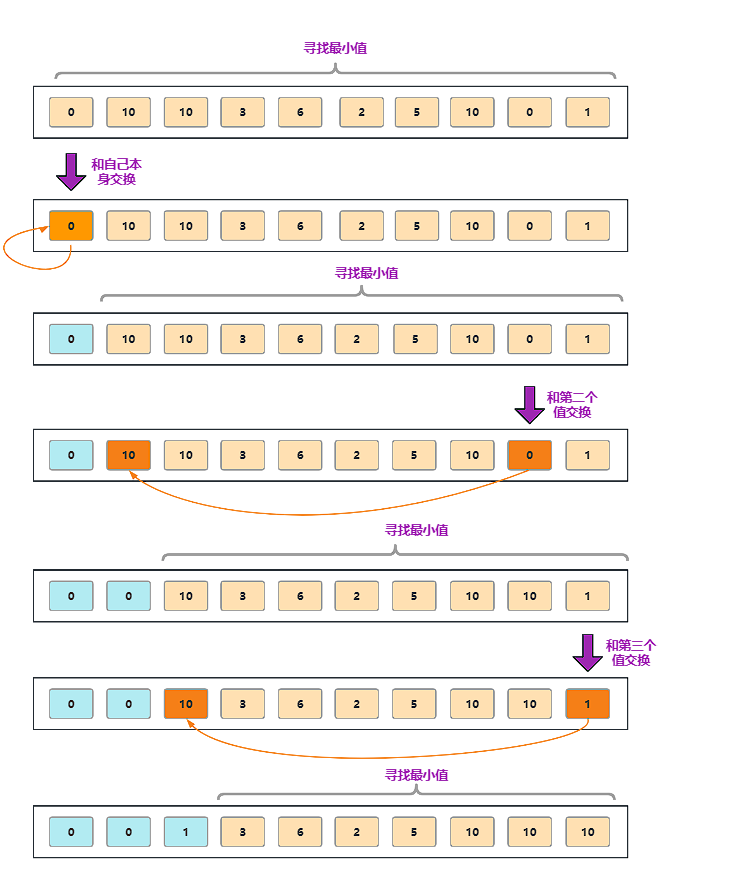

## 选择排序 (Selection Sort) 的 Java 实现

### 选择排序简介

选择排序是一种简单的排序算法，它的基本思想是：

1. 在未排序的部分找到最小（或最大）元素。
2. 将其与未排序部分的第一个元素交换。
3. 重复上述过程，直到整个序列排序完成。

### 选择排序的时间复杂度

- **时间复杂度**: 最好、最坏和平均情况都为 O(n²)，其中 n 是元素的个数。
- **空间复杂度**: O(1)，因为选择排序是原地排序算法。

### 选择排序的步骤

1. 从待排序的数组中找到最小元素。
2. 将该最小元素与数组的第一个元素交换。
3. 然后在剩下的未排序部分继续执行上述步骤，直到排序完成。



### 实现

:::code-group

```java
import java.util.Arrays;
import java.util.Random;

/**
 * 选择排序
 *
 * @author mark
 */


public class SelectionSort {

    public void selectionSort(int[] arr) {
        int length = arr.length;
        for (int i = 0; i < length; i++) {
            int minIndex = i;
            for (int j = i + 1; j < length; j++) {
                if (arr[j] < arr[minIndex]) {
                    minIndex = j;
                }
            }
            if (minIndex != i) {
                int temp = arr[i];
                arr[i] = arr[minIndex];
                arr[minIndex] = temp;
            }
        }
    }

    //for test
    public static void main(String[] args) {
        SelectionSort ss = new SelectionSort();
        int testTime = 1000; // 测试次数
        int arraySize = 10;  // 数组大小
        int minValue = 0;
        int maxValue = 100;

        boolean success = true;

        for (int i = 0; i < testTime; i++) {
            int[] array1 = generateRandomArray(arraySize, minValue, maxValue);
            int[] array2 = Arrays.copyOf(array1, array1.length); // 复制数组用于标准排序

            // 进行选择
            ss.selectionSort(array1);
            // 进行标准排序（对数器验证）
            Arrays.sort(array2);

            // 验证排序结果是否一致
            if (!Arrays.equals(array1, array2)) {
                success = false;
                System.out.println("❌ 测试失败！");
                System.out.println("原始数据: " + Arrays.toString(array2));
                System.out.println("冒泡排序结果: " + Arrays.toString(array1));
                System.out.println("正确结果: " + Arrays.toString(array2));
                break; // 发现错误时终止测试
            }
        }

        if (success) {
            System.out.println("✅ 所有测试通过！排序算法正确！");
        }
    }

    // 生成随机数组
    public static int[] generateRandomArray(int size, int min, int max) {
        Random random = new Random();
        int[] arr = new int[size];

        for (int i = 0; i < size; i++) {
            arr[i] = random.nextInt(max - min + 1) + min;
        }

        return arr;
    }

}


```

```javascript
function selectionSort(arr) {
    const length = arr.length;
    for (let i = 0; i < length; i++) {
        let minIndex = i;
        for (let j = i + 1; j < length; j++) {
            if (arr[j] < arr[minIndex]) {
                minIndex = j;
            }
        }
        if (minIndex !== i) {
            [arr[i], arr[minIndex]] = [arr[minIndex], arr[i]];
        }
    }
}
```

:::

### 总结

选择排序的优点在于它的实现简单且易于理解，但它的时间复杂度为 O(n²)，对于大规模数据来说效率较低。选择排序的空间复杂度为 O(1)
，是一个原地排序算法。

