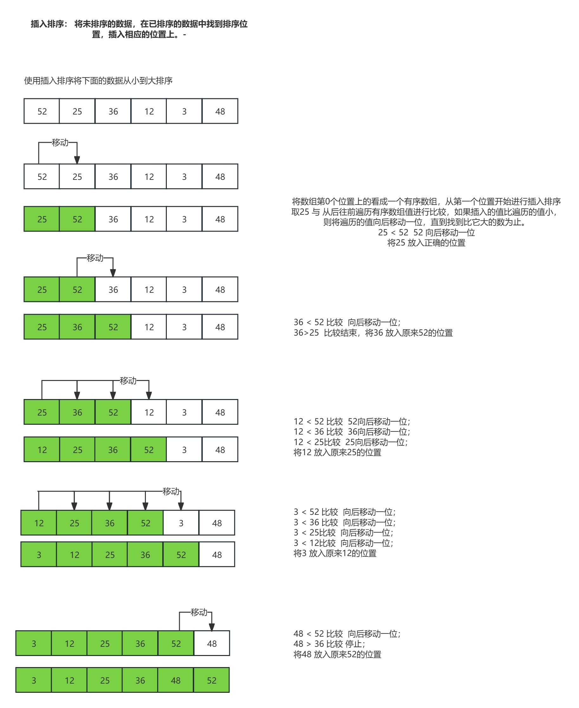

## 插入排序 (Insertion Sort) 的 Java 实现

### 插入排序简介

插入排序是一种简单的排序算法，它的基本思想是：

1. 将待排序的元素分成两部分，一部分是已经排序好的，另一部分是未排序的。
2. 每次从未排序部分选择一个元素，将其插入到已排序部分的正确位置。
3. 这一过程重复进行，直到所有元素都被排序。

### 插入排序的时间复杂度

- **时间复杂度**:
    - 最好情况：O(n)（当输入数组已经是有序的时）
    - 最坏情况：O(n²)（当输入数组是逆序时）
    - 平均情况：O(n²)
- **空间复杂度**：O(1)，因为插入排序是原地排序算法。

### 插入排序的步骤

1. 从数组的第二个元素开始，假设第一个元素是已排序的部分。
2. 逐个从未排序部分中取出元素，找到它在已排序部分的插入位置。
3. 将该元素插入到适当位置，并将大于它的元素后移。
4. 重复步骤2和步骤3，直到所有元素都排序完毕。



### Java 实现

```java
package lesson;

import java.util.Arrays;
import java.util.Random;

/**
 * 插入排序
 *
 * @author mark
 */


public class InsertionSort {
    public void insertionSort(int[] arr) {
        if (null == arr || arr.length < 2) {
            return;
        }
        int length = arr.length;
        for (int i = 0; i < length; i++) {
            // 每次都是 0 ~ i 做到有序,此时新增arr[j+1]
            for (int j = i - 1; j >= 0 && arr[j] > arr[j + 1]; j--) {
                int temp = arr[j];
                arr[j] = arr[j + 1];
                arr[j + 1] = temp;
            }
        }
    }

    //for test
    public static void main(String[] args) {
        InsertionSort is = new InsertionSort();
        int testTime = 1000; // 测试次数
        int arraySize = 10;  // 数组大小
        int minValue = 0;
        int maxValue = 100;

        boolean success = true;

        for (int i = 0; i < testTime; i++) {
            int[] array1 = generateRandomArray(arraySize, minValue, maxValue);
            int[] array2 = Arrays.copyOf(array1, array1.length); // 复制数组用于标准排序

            // 进行选择
            is.insertionSort(array1);
            // 进行标准排序（对数器验证）
            Arrays.sort(array2);

            // 验证排序结果是否一致
            if (!Arrays.equals(array1, array2)) {
                success = false;
                System.out.println("❌ 测试失败！");
                System.out.println("原始数据: " + Arrays.toString(array2));
                System.out.println("冒泡排序结果: " + Arrays.toString(array1));
                System.out.println("正确结果: " + Arrays.toString(array2));
                break; // 发现错误时终止测试
            }
        }

        if (success) {
            System.out.println("✅ 所有测试通过！排序算法正确！");
        }
    }

    // 生成随机数组
    public static int[] generateRandomArray(int size, int min, int max) {
        Random random = new Random();
        int[] arr = new int[size];

        for (int i = 0; i < size; i++) {
            arr[i] = random.nextInt(max - min + 1) + min;
        }

        return arr;
    }


}

```

### 总结

插入排序的优点在于：

- 对于部分有序的数组，表现非常优秀，时间复杂度接近 O(n)。
- 适合小规模数据，且是稳定的排序算法。

但对于大规模数据，插入排序效率较低，时间复杂度为 O(n²)，因此不适合用在大数据量的排序中。