[MySQL优化官网参考](https://dev.mysql.com/doc/refman/8.0/en/optimization.html)

## 如何优化

- 设计数据库时：数据库表、字段的设计，存储引擎
- 利用好MySQL自身提供的功能，如索引等
- 横向扩展：MySQL集群、负载均衡、读写分离
- SQL语句的优化（收效甚微）

## 字段设计

> 字段类型的选择，设计规范，范式，常见设计案例


### 存储IP地址

**常规做法**： varchar（15）

**优化选择**：int unsigned，占用4个字节，节省空间，IP运算速度块

> inet_aton；
>
> inet_ntoa;
>
> a—address,n----number

### 尽量使用整数去表示字符串

**整型的优势**：存储空间固定。往往是少量空间,运算速度块

> MySQL 内部的枚举（单选）类型和集合（多选）类型但是，**实操的时候enum和set很少用**
>
> **原因**：维护成本高
>
> **使用的替代方案**：关联表

### 存储金额

**金额，价格，统计数据的存储**：对数据的精度要求高,

**优化选择**：

1. **price decimal（8，2）**；定点数，有两位小数的定点数。

2. price int ，bigint，整数，小单位-->大数额，如**9.01   在数据库中存储2为901，在程序中进行相关处理**

	> 注意：定点数，支持很大的数，
	>
	> 转成小单位后，整数存储不了！

### 定长数据类型和变长数据类型的选择

**定点数和浮点数的选择**

**定点数**：不会精度丢失。 占用空间随者数字的增加而增加

**浮点数**：导致精度丢失 。占用固定的存储空间，无论存储多大的数据，占用的空间是固定的（类似于int）

**定长类型**：存储空间固定：int，float,double.char,date,time,datetime,year,timestamp

**变长类型**：存储空间可变：varchar,decimal,text

### 字符串类型的选择

**使用varchar**

> char(10) 如果你存abc，需要空间为10，3个存abc，7个存空字符，因为char是固定长度
>
> varchar(10)如果你存abc，需要空间为4，3个存abc，1个存长度，varchar是可变长度
>
> **超过10的部分，都会被截断**

**text,类型独立存储，不占用字段总空间**

### 尽可能选择小的数据类型和指定短的长度

### 尽可能使用 not null

**非`null`字段的处理要比`null`字段的处理高效些**！且不需要判断是否为`null`。

`null`在MySQL中，不好处理，**存储需要额外空间，运算也需要特殊的运算符**。如`select null = null`和`select null <> null`（`<>`为不等号）有着同样的结果，只能通过`is null`和`is not null`来判断字段是否为`null`。

> MySQL中每条记录都需要额外的存储空间，表示每个字段是否为`null`。因此通常使用特殊的数据进行占位，比如`int not null default 0`、`string not null default ‘’`

### 字段注释要完整，见名知意

### 单表字段不宜过多

> 当单表字段字段过多，可以考虑拆成多张表，将小长度的字段放在一张表，其余的放在其他表中

### 可以预留字段

> 优先满足业务，可以预留一些字段

## 关联表的设计

> 外键`foreign key`只能实现一对一或一对多的映射

### 一对多

> 使用外键

### 多对多

> 使用中间表存储两表之间的关联关系

### 一对一

> 如商品的基本信息（`item`）和商品的详细信息（`item_intro`），通常使用相同的主键或者增加一个外键字段（`item_id`）

## 索引

> 关键字与数据的映射关系称为索引（==包含关键字和对应的记录在磁盘中的地址==）。关键字是从数据当中提取的用于标识、检索数据的特定内容。

### 索引检索为什么快

1. 关键字相对于数据本身，==数据量小==

2. 关键字是==有序==的，二分查找可快速确定位置

	> 图书馆为每本书都加了索引号（类别-楼层-书架）、字典为词语解释按字母顺序编写目录等都用到了索引。

### MySQL中索引类型

1. **普通索引**（`key`）
2. **唯一索引**（`unique key`）
3. **主键索引**（`primary key`）
4. **全文索引**（`fulltext key`）

#### 索引的关键字有不同的限制：

- **普通索引：**对关键字没有限制
- **唯一索引：**要求记录提供的关键字不能重复
- **主键索引：**要求关键字唯一且不为null

### 索引管理语法

#### 查看索引

```sql
--查看建表语句
show create table 表名;

show CREATE table `user`;
--查看表中字段
desc 表名;
desc user;
--查看表中所有索引
SHOW index FROM `表名`
SHOW keys FROM `表名`;
SHOW index FROM `user_index`;
SHOW keys FROM `user_index`;
```

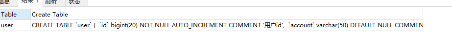

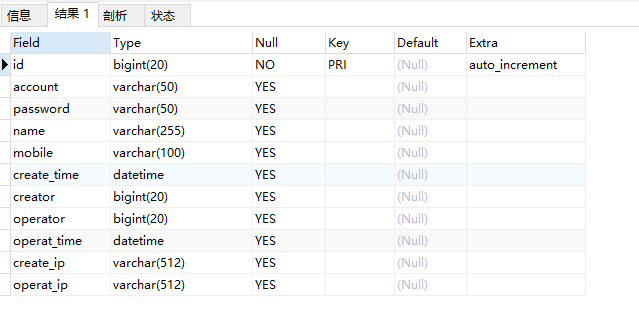

#### 创建索引

##### 创建表之后建立索引

```sql
create TABLE user_index(
	id int auto_increment primary key,
	first_name varchar(16),
	last_name VARCHAR(16),
	id_card VARCHAR(18),
	information text
);

-- 创建一个first_name和last_name的复合索引，并命名为name
alter table user_index add key name (first_name,last_name),
-- 创建一个id_card的唯一索引，默认以字段名作为索引名
alter table user_index add UNIQUE KEY (id_card),
-- 鸡肋，全文索引不支持中文
alter table user_index add FULLTEXT KEY (information);

```

##### 创建表时指定索引

```sql
CREATE TABLE user_index2 (
	id INT auto_increment PRIMARY KEY,
	first_name VARCHAR (16),
	last_name VARCHAR (16),
	id_card VARCHAR (18),
	information text,
	KEY name (first_name, last_name),
	FULLTEXT KEY (information),
	UNIQUE KEY (id_card)
);

```

#### 删除索引

##### 删除普通索引、唯一索引、全文索引

根据索引名删除普通索引、唯一索引、全文索引：`alter table 表名 drop KEY 索引名`

```sql
-----删除普通索引、唯一索引、全文索引
alter table 表名 drop KEY 索引名

alter table user_index drop KEY name;
alter table user_index drop KEY id_card;
alter table user_index drop KEY information;
```

##### 删除主键索引

删除主键索引：`alter table 表名 drop primary key`（因为主键只有一个）。这里值得注意的是，如果主键自增长，那么不能直接执行此操作（自增长依赖于主键索引）：

```sql
---删除主键索引
alter table 表名 drop primary key
alter table user_index drop primary key
```

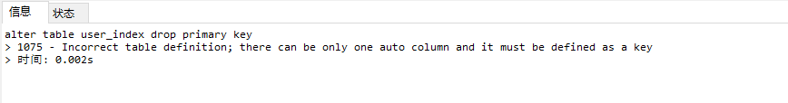

**需要取消自增长**：

```sql
--取消主键自增
ALTER TABLE `表名` MODIFY COLUMN 字段名 字段类型（长度） NOT NULL FIRST ;
ALTER TABLE `user_index` MODIFY COLUMN id int(10) NOT NULL FIRST ;
---删除主键索引
alter table 表名 drop primary key
alter table user_index drop primary key
```

### 索引失效

1. **like 以%开头**，索引无效；**当like前缀没有%，后缀有%时，索引有效**。

	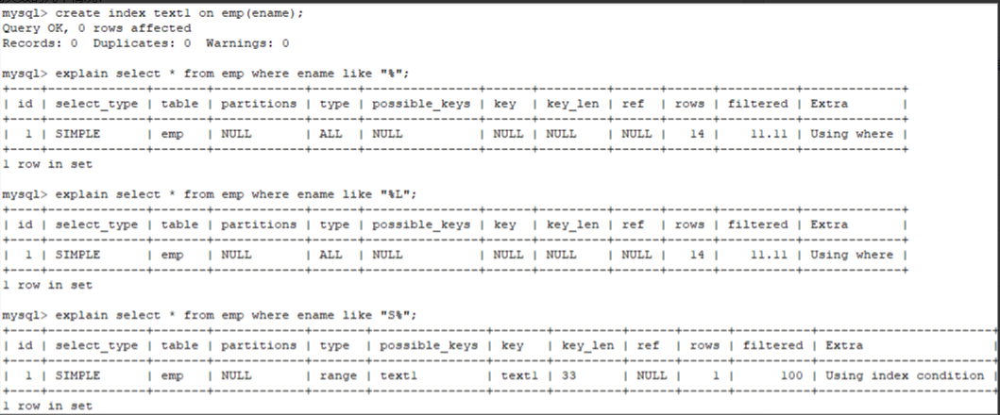

2. **or语句前后没有同时使用索引**。当or左右查询字段只有一个是索引，该索引失效，只有当or左右查询字段均为索引时，才会生效

	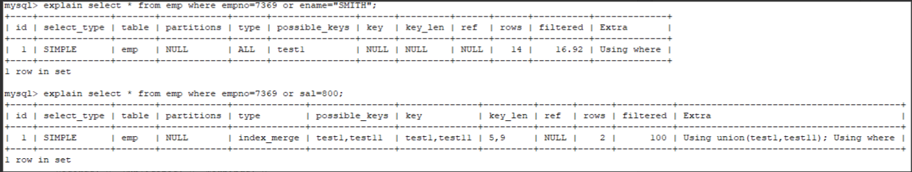

3. **组合索引，不是使用第一列索引**，索引失效。

	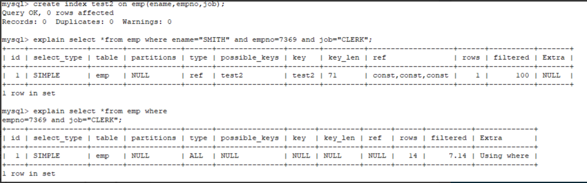

4. **数据类型出现隐式转化**。如varchar不加单引号的话可能会自动转换为int型，使索引无效，产生全表扫描。

	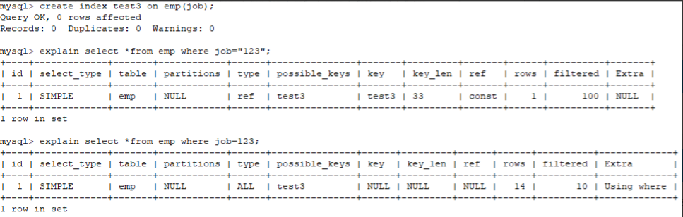

5. **<font color=red>在索引列上使用 IS NULL 或 IS NOT NULL操作，索引不一定失效，可能在某些情况会失效</font>**

	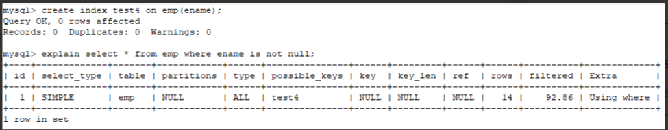

	此处我将重新创建一个emp表（**此处索引为InnoDB类型索引**）

	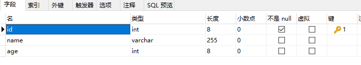

	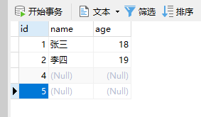

	```sql
	----创建新索引
	create index test2 on emp(name)
	```

	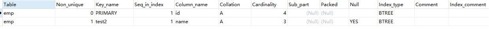

	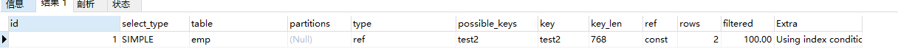

	

6. **在索引字段上使用not，<>，!=**。不等于操作符是永远不会用到索引的，因此对它的处理只会产生全表扫描。 优化方法： key<>0 改为 key>0 or key<0。

7. **当全表扫描速度比索引速度快时，mysql会使用全表扫描，此时索引失效。**

8. **不要在字段中做运算**

	```sql
	----下面两条SQL语句在语义上相同，(id为主键)但是第一条会使用主键索引而第二条不会。
	select * from user where id = 20-1;
	select * from user where id+1 = 20;
	```

	

## 索引使用场景（重点）

### where

根据`id`查询记录，因为`id`字段仅建立了主键索引，因此此SQL执行可选的索引只有主键索引，如果有多个，最终会选一个较优的作为检索的依据。

```sql
-- 增加一个没有建立索引的字段
alter table innodb1 add sex char(1);
-- 按sex检索时可选的索引为null
EXPLAIN SELECT * from innodb1 where sex='男';

```

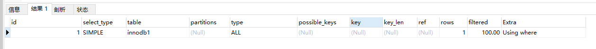

> 可以尝试在一个字段未建立索引时，根据该字段查询的效率，然后对该字段建立索引（`alter table 表名 add index(字段名)`），同样的SQL执行的效率，你会发现查询效率会有明显的提升（数据量越大越明显）。

### order by

- **该字段没有建立索引**

	将**查询出的所有数据使用外部排序**（将数据从硬盘分批读取到内存使用内部排序，最后合并排序结果）

- **该字段建立索引**

	直接**按照索引的顺序和映射关系逐条取出数据**。而且如果分页的，那么只用**取出索引表某个范围内的索引对应的数据**

### join

> 对`join`语句匹配关系（`on`）涉及的字段建立索引能够提高效率

### 索引覆盖

如果要查询的字段都建立过索引，那么引擎会直接在索引表中查询而不会访问原始数据（否则只要有一个字段没有建立索引就会做全表扫描），这叫索引覆盖。因此我们需要尽可能的在`select`后==只写必要的查询字段==，以增加索引覆盖的几率。


### 高性能的索引使用策略

#### 不在索引列上做任何操作

我们通常会看到一些查询不当地使用索引，或者使得MySQL无法使用已有的索引。如果查询中的列不是独立的，则 MySQL就不会使用索引。“独立的列”是指索引列不能是表达式的一部分，也不能是函数的参数。

例如，我们假设id上有主键索引，但是下面这个查询无法使用主键索引:

```
EXPLAIN SELECT * FROM order_exp WHERE id + 1 = 17;
```

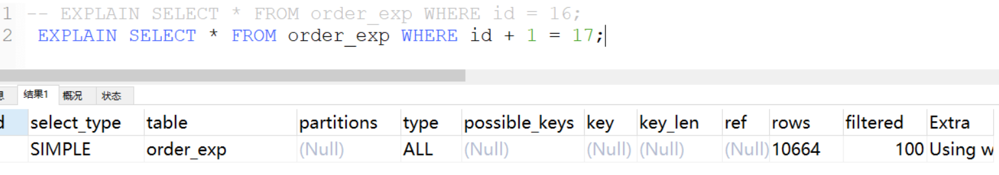

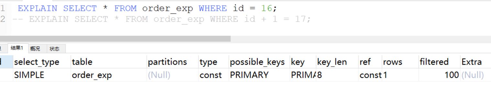

凭肉眼很容易看出 WHERE中的表达式其实等价于id= 16，但是MySQL无法自动解析这个方程式。这完全是用户行为。我们应该养成简化WHERE条件的习惯，始终将索引列单独放在比较符号的一侧。

下面是另一个常见的错误:

在索引列上使用函数，也是无法利用索引的。

```
EXPLAIN SELECT * from order_exp WHERE YEAR(insert_time)=YEAR(DATE_SUB(NOW(),INTERVAL 1 YEAR));
```

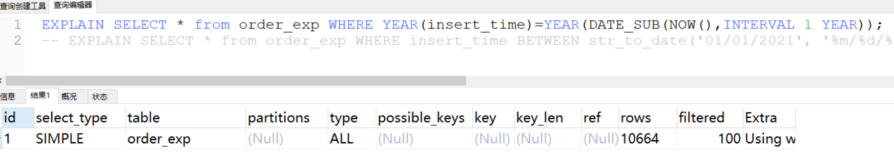

```
EXPLAIN SELECT * from order_exp WHERE insert_time BETWEEN str_to_date('01/01/2021', '%m/%d/%Y') and str_to_date('12/31/2021', '%m/%d/%Y');
```

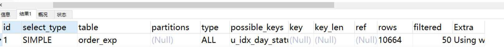

#### 尽量全值匹配

建立了联合索引列后，如果我们的搜索条件中的列和索引列一致的话，这种情况就称为全值匹配，比方说下边这个查找语句：

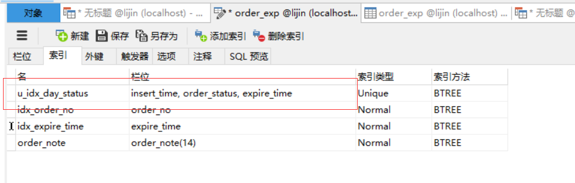

```
 EXPLAIN select * from order_exp where insert_time='2021-03-22 18:34:55' and order_status=0 and expire_time='2021-03-22 18:35:14';
```

我们建立的u_idx_day_statusr索引包含的3个列在这个查询语句中都展现出来了，联合索引中的三个列都可能被用到。

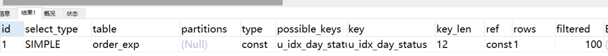

有的同学也许有个疑问，WHERE子句中的几个搜索条件的顺序对查询结果有啥影响么？也就是说如果我们调换 `insert_time`, `order_status`, `expire_time`这几个搜索列的顺序对查询的执行过程有影响么？比方说写成下边这样：

```
EXPLAIN select * from order_exp where  order_status=0 and insert_time='2021-03-22 18:34:55'  and expire_time='2021-03-22 18:35:14';
```

放心，MySQL没这么蠢，查询优化器会分析这些搜索条件并且按照可以使用的索引中列的顺序来决定先使用哪个搜索条件，后使用哪个搜索条件。

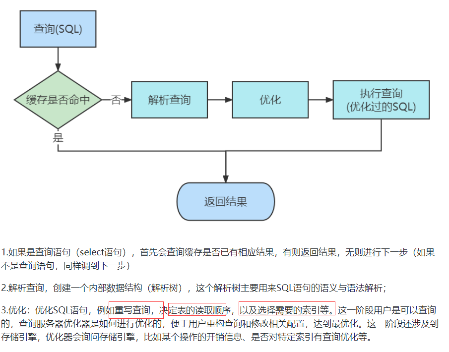

所以，当建立了联合索引列后，能在where条件中使用索引的尽量使用。

#### 最佳左前缀法则

建立了联合索引列，如果搜索条件不够全值匹配怎么办？在我们的搜索语句中也可以不用包含全部联合索引中的列，但要遵守最左前缀法则。指的是查询从索引的最左前列开始并且不跳过索引中的列。

搜索条件中必须出现左边的列才可以使用到这个B+树索引

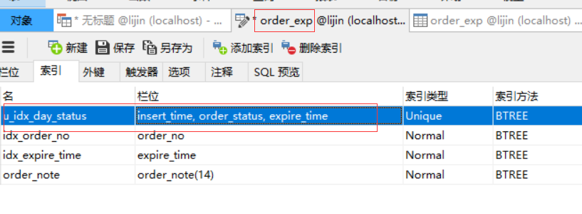

```
EXPLAIN select * from order_exp where insert_time='2021-03-22 18:23:42' and order_status=1;
```

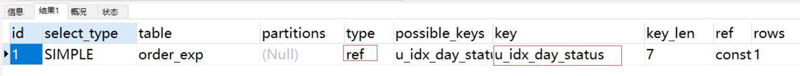

```
EXPLAIN select * from order_exp where insert_time='2021-03-22 18:23:42' ;
```

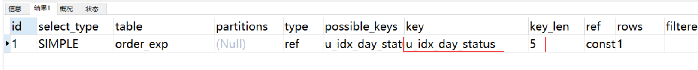

搜索条件中没有出现左边的列不可以使用到这个B+树索引

```
EXPLAIN SELECT * FROM order_exp WHERE order_status=1;
```

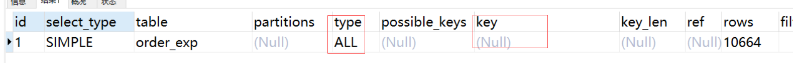

```
EXPLAIN Select * from s1 where order_status=1 and expire_time='2021-03-22 18:35:14';
```

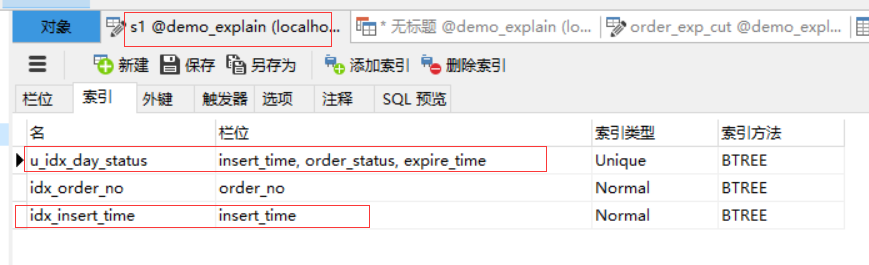

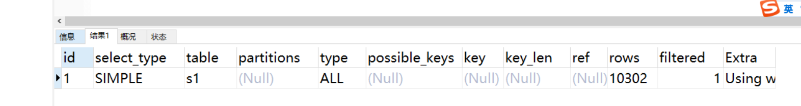

那为什么搜索条件中必须出现左边的列才可以使用到这个B+树索引呢？比如下边的语句就用不到这个B+树索引么？

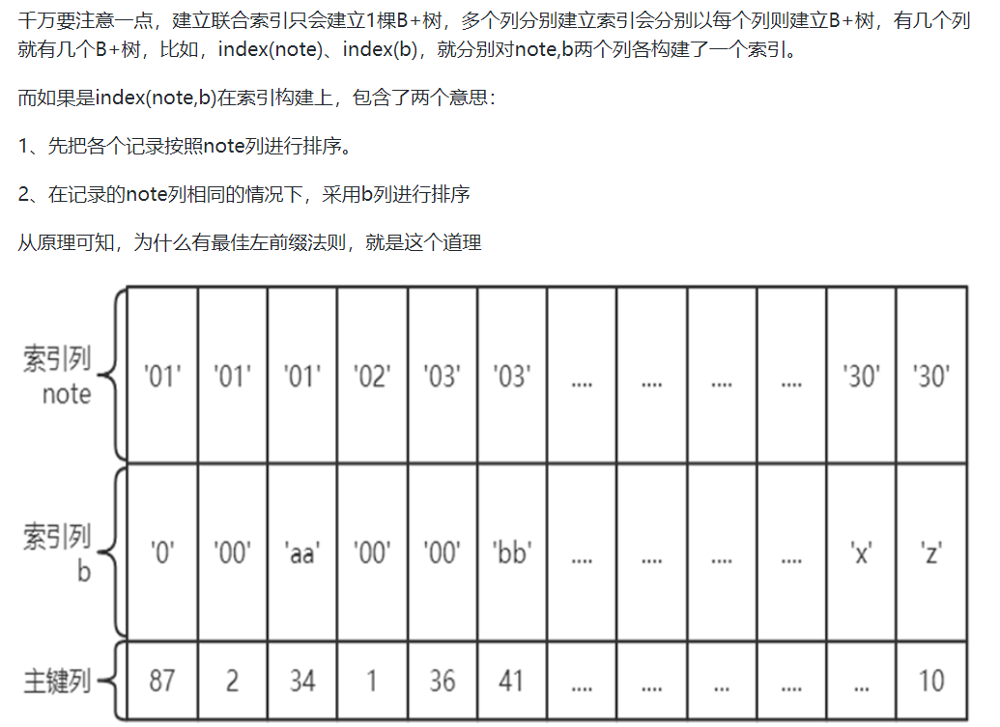

因为B+树的数据页和记录先是按照insert_time列的值排序的，在insert_time列的值相同的情况下才使用order_status列进行排序，也就是说insert_time列的值不同的记录中order_status的值可能是无序的。而现在你跳过insert_time列直接根据order_status的值去查找，怎么可能呢？expire_time也是一样的道理，那如果我就想在只使用expire_time的值去通过B+树索引进行查找咋办呢？这好办，你再对expire_time列建一个B+树索引就行了。

但是需要特别注意的一点是，如果我们想使用联合索引中尽可能多的列，搜索条件中的各个列必须是联合索引中从最左边连续的列。比方说联合索引u_idx_day_status中列的定义顺序是 `insert_time`, `order_status`, `expire_time`，如果我们的搜索条件中只有insert_time和expire_time，而没有中间的order_status，

```
EXPLAIN select * from order_exp where insert_time='2021-03-22 18:23:42' and expire_time='2021-03-22 18:35:14';
```

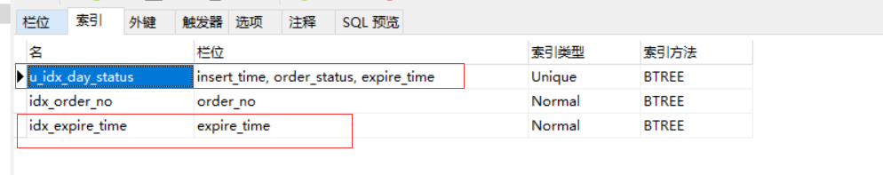

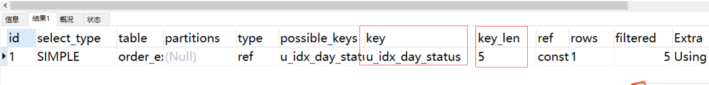

请注意key_len,只有5，说明只有insert_time用到了，其他的没有用到。

#### 范围条件放最后

这一点，也是针对联合索引来说的，前面我们反复强调过，所有记录都是按照索引列的值从小到大的顺序排好序的，而联合索引则是按创建索引时的顺序进行分组排序。

比如：

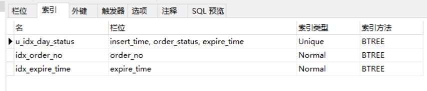

```
EXPLAIN select * from order_exp_cut where insert_time>'2021-03-22 18:23:42' and insert_time<'2021-03-22 18:35:00';
```

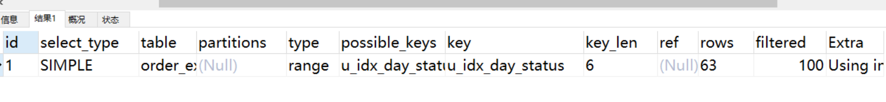

由于B+树中的数据页和记录是先按insert_time列排序的，所以我们上边的查询过程其实是这样的：

找到insert_time值为'2021-03-22 18:23:42' 的记录。

找到insert_timee值为'2021-03-22 18:35:00'的记录。

由于所有记录都是由链表连起来的，所以他们之间的记录都可以很容易的取出来，找到这些记录的主键值，再到聚簇索引中回表查找完整的记录。

但是如果对多个列同时进行范围查找的话，只有对索引最左边的那个列进行范围查找的时候才能用到B+树索引：

```
select * from order_exp_cut where insert_time>'2021-03-22 18:23:42' and insert_time<'2021-03-22 18:35:00' and order_status > -1;
```

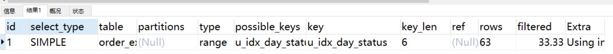

上边这个查询可以分成两个部分：

通过条件insert_time>'2021-03-22 18:23:42' and insert_time&#x3c;'2021-03-22 18:35:00' 来对insert_time进行范围，查找的结果可能有多条insert_time值不同的记录，

对这些insert_time值不同的记录继续通过order_status>-1条件继续过滤。

这样子对于联合索引u_idx_day_status来说，只能用到insert_time列的部分，而用不到order_status列的部分（这里的key_len和之前的SQL的是一样长），因为只有insert_time值相同的情况下才能用order_status列的值进行排序，而这个查询中通过insert_time进行范围查找的记录中可能并不是按照order_status列进行排序的，所以在搜索条件中继续以order_status列进行查找时是用不到这个B+树索引的。

**所以对于一个联合索引来说，虽然对多个列都进行范围查找时只能用到最左边那个索引列，但是如果左边的列是精确查找，则右边的列可以进行范围查找：**

```
EXPLAIN select * from order_exp_cut
where insert_time='2021-03-22 18:34:55' and order_status=0 and expire_time>'2021-03-22
18:23:57' and expire_time<'2021-03-22 18:35:00' ;
```

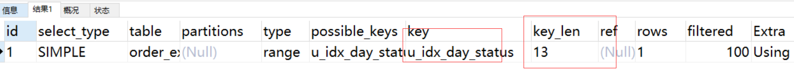

**而中间有范围查询会导致后面的列全部失效，无法充分利用这个联合索引：**

```
EXPLAIN select * from order_exp_cut
where insert_time='2021-03-22 18:23:42' and order_status>-1 and expire_time='2021-03-22
18:35:14';
```

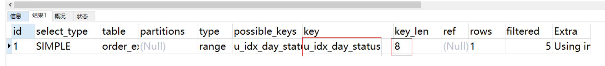

#### 覆盖索引尽量用

覆盖索引是非常有用的工具，能够极大地提高性能，三星索引里最重要的那颗星就是宽索引星。考虑一下如果查询只需要扫描索引而无须回表，会带来多少好处:

索引条目通常远小于数据行大小，所以如果只需要读取索引，那 MySQL就会极大地减少数据访问量。这对缓存的负载非常重要，因为这种情况下响应时间大部分花费在数据拷贝上。覆盖索引对于I/O密集型的应用也有帮助，因为索引比数据更小,更容易全部放入内存中。

因为索引是按照列值顺序存储的，所以对于I/O密集型的范围查询会比随机从磁盘读取每一行数据的I/O要少得多。

由于InnoDB的聚簇索引，覆盖索引对InnoDB表特别有用。InnoDB的二级索引在叶子节点中保存了行的主键值，所以如果二级主键能够覆盖查询，则可以避免对主键索引的二次查询。

尽量使用覆盖索引(只访问索引的查询(索引列和查询列一致))，不是必要的情况下减少select*，除非是需要将表中的全部列检索后，进行缓存。

```
EXPLAIN  select * from
order_exp_cut where insert_time='2021-03-22 18:34:55' and order_status=0 and
expire_time='2021-03-22 18:35:04' ;
```

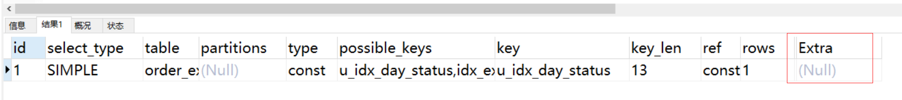

使用具体名称取代*

```
EXPLAIN  select expire_time,id from
order_exp_cut where insert_time='2021-03-22 18:34:55' and order_status=0 and
expire_time='2021-03-22 18:35:04' ;
```

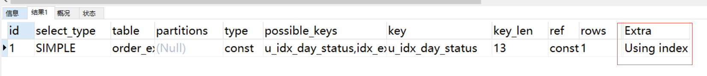

**解释一下Extra中的Using index**

当我们的查询列表以及搜索条件中只包含属于某个索引的列，也就是在可以**使用索引覆盖的情况**下，在Extra列将会提示该额外信息。以上的查询中只需要用到u_idx_day_status而不需要回表操作：

#### 不等于要慎用

mysql 在使用不等于(!= 或者&#x3c;>)的时候无法使用索引会导致全表扫描

```
EXPLAIN  SELECT * FROM order_exp WHERE order_no <> 'DD00_6S';
```

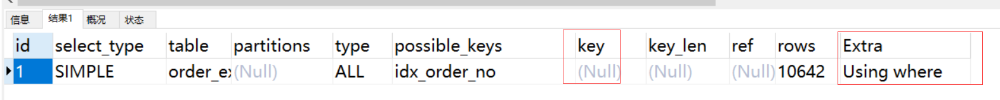

**解释一下Extra中的Using where**
当我们使用全表扫描来执行对某个表的查询，并且该语句的WHERE子句中有针对该表的搜索条件时，在Extra列中会提示上述额外信息。

#### Null/Not 有影响

需要注意null/not null对索引的可能影响

**表order_exp的order_no为索引列，同时不允许为null，**

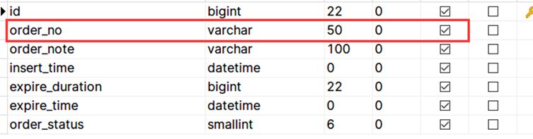

```
explain SELECT * FROM order_exp WHERE order_no is null;
explain SELECT * FROM order_exp WHERE order_no is not null;
```

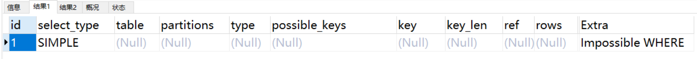

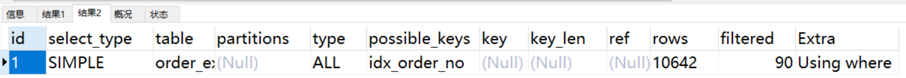

可以看见，order_no is null的情况下，MySQL直接表示Impossible WHERE(查询语句的WHERE子句永远为FALSE时将会提示该额外信息)，对于 is not null直接走的全表扫描。

**表order_exp_cut的order_no为索引列，同时允许为null，**

```
explain SELECT * FROM order_exp_cut WHERE order_no is null;
explain SELECT * FROM order_exp_cut WHERE order_no is not null;
```

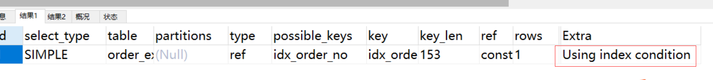

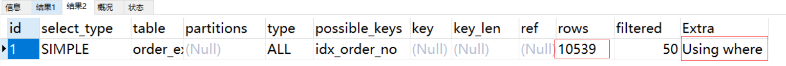

is null会走ref类型的索引访问，is not null;依然是全表扫描。所以总结起来：

is not null容易导致索引失效，is null则会区分被检索的列是否为null，如果是null则会走ref类型的索引访问，如果不为null，也是全表扫描。

**但是当联合索引上使用时覆盖索引时，情况会有一些不同(order_exp_cut表的order_no可为空)：**

```
explain SELECT order_status,expire_time FROM order_exp WHERE insert_time is null;
explain SELECT order_status,expire_time FROM order_exp WHERE insert_time is not null;
```

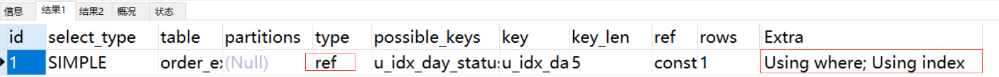

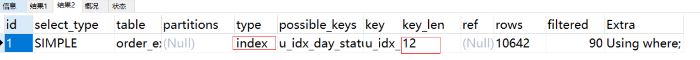

```
explain SELECT order_status,expire_time FROM order_exp_cut WHERE insert_time is null;
explain SELECT order_status,expire_time FROM order_exp_cut WHERE insert_time is not null;
```

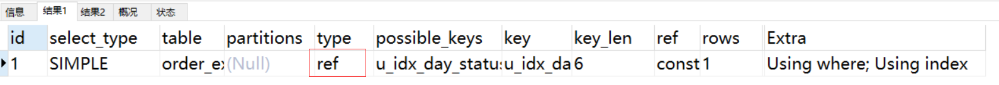

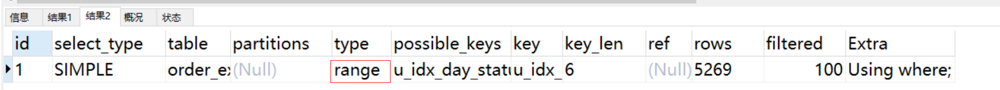

根据system>const>eq_ref>ref>range>index>ALL 的原则，看起来在联合索引中，is not null的表现会更好（如果列可为null的话），但是key_len的长度增加了1。所以总的来说，在设计表时列尽可能的不要声明为null。

#### Like查询要当心

like以通配符开头('%abc...')，mysql索引失效会变成全表扫描的操作

```
explain SELECT * FROM order_exp WHERE order_no like '%_6S';
```

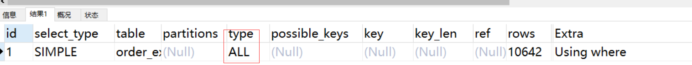

此时如果使用覆盖索引可以改善这个问题

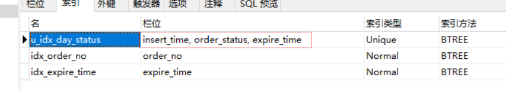

```
explain SELECT order_status,expire_time FROM order_exp_cut WHERE insert_time like '%18:35:09';
```


#### 1.3.6.9.字符类型加引号

字符串不加单引号索引失效

```
explain SELECT * FROM order_exp WHERE order_no = 6;
explain SELECT * FROM order_exp WHERE order_no = '6';
```

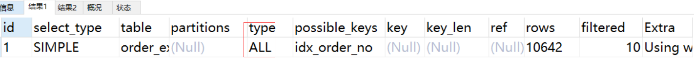

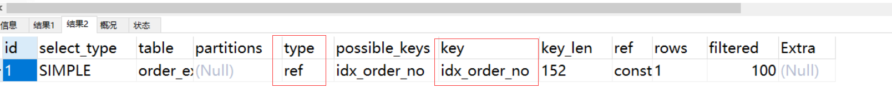

MySQL的查询优化器，会自动的进行类型转换，比如上个语句里会尝试将order_no转换为数字后和6进行比较，自然造成索引失效。

#### 使用or关键字时要注意

```
explain SELECT * FROM order_exp WHERE order_no = 'DD00_6S' OR order_no = 'DD00_9S';
explain SELECT * FROM order_exp WHERE expire_time= '2021-03-22 18:35:09'  OR order_note = 'abc';
```


表现是不一样的，第一个SQL的or是相同列，相当于产生两个扫描区间，可以使用上索引。

第二个SQL中or是不同列，并且order_note不是索引。所以只能全表扫描

当然如果两个条件都是索引列，情况会有变化：

```
explain  SELECT * FROM order_exp WHERE expire_time= '2021-03-22 18:35:09'  OR order_no = 'DD00_6S';
```


这也给了我们提示，如果我们将 SQL改成union all

```
explain SELECT * FROM order_exp WHERE expire_time= '2021-03-22 18:35:09' 
					union all SELECT * FROM order_exp WHERE order_note = 'abc';
```


当然使用覆盖扫描也可以改善这个问题：

```
explain SELECT order_status,id FROM order_exp_cut WHERE insert_time='2021-03-22 18:34:55' or expire_time='2021-03-22 18:28:28';
```


#### 使用索引扫描来做排序和分组

MySQL有两种方式可以生成有序的结果﹔通过排序操作﹔或者按索引顺序扫描施﹔如果EXPLAIN出来的type列的值为“index”，则说明MySQL使用了索引扫描来做排序。

扫描索引本身是很快的，因为只需要从一条索引记录移动到紧接着的下一条记录。但如果索引不能覆盖查询所需的全部列，那就不得不每扫描一条索引记录就都回表查询一次对应的行。这基本上都是随机I/O，因此按索引顺序读取数据的速度通常要比顺序地全表扫描慢，尤其是在IO密集型的工作负载时。

MySQL可以使用同一个索引既满足排序，又用于查找行。因此，如果可能，设计索引时应该尽可能地同时满足这两种任务，这样是最好的。

只有当索引的列顺序和ORDER BY子句的顺序完全一致，并且所有列的排序方向（倒序或正序）都一样时，MySQL才能够使用索引来对结果做排序。如果查询需要关联多张表，则只有当0RDER BY子句引用的字段全部为第一个表时，才能使用索引做排序。

#### 排序要当心

**ASC、DESC别混用**

对于使用联合索引进行排序的场景，我们要求各个排序列的排序顺序是一致的，也就是要么各个列都是ASC规则排序，要么都是DESC规则排序。

**排序列包含非同一个索引的列**

用来排序的多个列不是一个索引里的，这种情况也不能使用索引进行排序

```
explain
SELECT * FROM order_exp order by
order_no,insert_time;
```


#### 尽可能按主键顺序插入行

最好避免随机的（不连续且值的分布范围非常大）聚簇索引，特别是对于I/O密集型的应用。例如，从性能的角度考虑，使用UUID来作为聚簇索引则会很糟糕，它使得聚簇索引的插入变得完全随机，这是最坏的情况，使得数据没有任何聚集特性。

最简单的方法是使用AUTO_INCREMENT自增列。这样可以保证数据行是按顺序写入，对于根据主键做关联操作的性能也会更好。

注意到向UUID主键插入行不仅花费的时间更长，而且索引占用的空间也更大。这一方面是由于主键字段更长﹔另一方面毫无疑问是由于页分裂和碎片导致的。

因为主键的值是顺序的，所以InnoDB把每一条记录都存储在上一条记录的后面。当达到页的最大填充因子时(InnoDB默认的最大填充因子是页大小的15/16，留出部分空间用于以后修改)，下一条记录就会写入新的页中。一旦数据按照这种顺序的方式加载,主键页就会近似于被顺序的记录填满,这也正是所期望的结果。

如果新行的主键值不一定比之前插入的大，所以InnoDB无法简单地总是把新行插入到索引的最后，而是需要为新的行寻找合适的位置-—通常是已有数据的中间位置——并且分配空间。这会增加很多的额外工作，并导致数据分布不够优化。下面是总结的一些缺点:

写入的目标页可能已经刷到磁盘上并从缓存中移除，或者是还没有被加载到缓存中，InnoDB在插入之前不得不先找到并从磁盘读取目标页到内存中。这将导致大量的随机IO。

因为写入是乱序的，InnoDB不得不频繁地做页分裂操作，以便为新的行分配空间。页分裂会导致移动大量数据，一次插入最少需要修改三个页而不是一个页。

所以使用InnoDB时应该尽可能地按主键顺序插入数据，并且尽可能地使用单调增加的聚簇键的值来插入新行。

#### 优化Count查询

首先要注意，COUNT()是一个特殊的函数，有两种非常不同的作用:它可以统计某个列值的数量，也可以统计行数。

在统计列值时要求列值是非空的（不统计NULL)。

COUNT()的另一个作用是统计结果集的行数。常用的就是就是当我们使用COUNT(*)。实际上，它会忽略所有的列而直接统计所有的行数。


```
select count(*) from test;
select count(c1) from test;
```


通常来说，COUNT()都需要扫描大量的行（意味着要访问大量数据）才能获得精确的结果，因此是很难优化的。在MySQL层面能做的基本只有索引覆盖扫描了。如果这还不够,就需要考虑修改应用的架构，可以用估算值取代精确值，可以增加汇总表，或者增加类似Redis这样的外部缓存系统。

#### 优化limit分页

在系统中需要进行分页操作的时候，我们通常会使用LIMIT加上偏移量的办法实现，同时加上合适的ORDER BY子句。

一个非常常见又令人头疼的问题就是，在偏移量非常大的时候，例如可能是

```
select * from order_exp limit 10000,10;
```


这样的查询，这时MySQL需要查询10010条记录然后只返回最后10条，前面10 000条记录都将被抛弃，这样的代价非常高。

优化此类分页查询的一个最简单的办法是

会先查询翻页中需要的N条数据的主键值，然后根据主键值回表查询所需要的N条数据，在此过程中查询N条数据的主键id在索引中完成，所以效率会高一些。

```
EXPLAIN SELECT * FROM (select id from order_exp limit 10000,10) b,order_exp
					a where a.id = b.id;
```


从执行计划中可以看出，首先执行子查询中的order_exp表，根据主键做索引全表扫描，然后与a表通过id做主键关联查询，相比传统写法中的全表扫描效率会高一些。

从两种写法上能看出性能有一定的差距，虽然并不明显，但是随着数据量的增大，两者执行的效率便会体现出来。

上面的写法虽然可以达到一定程度的优化，但还是存在性能问题。最佳的方式是在业务上进行配合修改为以下语句：

```
EXPLAIN select * from order_exp where id > 67 order by id limit 10;
```


采用这种写法，需要前端通过点击More来获得更多数据，而不是纯粹的翻页，因此，每次查询只需要使用上次查询出的数据中的id来获取接下来的数据即可，但这种写法需要业务配合。

#### 关于Null的特别说明

对于Null到底算什么，存在着分歧：

1、有的认为NULL值代表一个未确定的值，MySQL认为任何和NULL值做比较的表达式的值都为NULL，包括select
null=null和select null!=null;


所以每一个NULL值都是独一无二的。

2、有的认为其实NULL值在业务上就是代表没有，所有的NULL值和起来算一份；

3、有的认为这NULL完全没有意义，所以在统计数量时压根儿不能把它们算进来。

假设一个表中某个列c1的记录为(2,1000,null,null)，在第一种情况下，表中c1的记录数为4，第二种表中c1的记录数为3，第三种表中c1的记录数为2。


在对统计索引列不重复值的数量时如何对待NULL值，MySQL专门提供了一个innodb_stats_method的系统变量，

https://dev.mysql.com/doc/refman/5.7/en/innodb-parameters.html#sysvar_innodb_stats_method

**这个系统变量有三个候选值：**

nulls_equal：认为所有NULL值都是相等的。这个值也是innodb_stats_method的默认值。

如果某个索引列中NULL值特别多的话，这种统计方式会让优化器认为某个列中平均一个值重复次数特别多，所以倾向于不使用索引进行访问。

nulls_unequal：认为所有NULL值都是不相等的。

如果某个索引列中NULL值特别多的话，这种统计方式会让优化器认为某个列中平均一个值重复次数特别少，所以倾向于使用索引进行访问。

nulls_ignored：直接把NULL值忽略掉。

而且有迹象表明，在MySQL5.7.22以后的版本，对这个innodb_stats_method的修改不起作用，MySQL把这个值在代码里写死为nulls_equal。也就是说MySQL在进行索引列的数据统计行为又把null视为第二种情况（NULL值在业务上就是代表没有，所有的NULL值和起来算一份），看起来，MySQL中对Null值的处理也很分裂。所以总的来说，对于列的声明尽可能的不要允许为null。