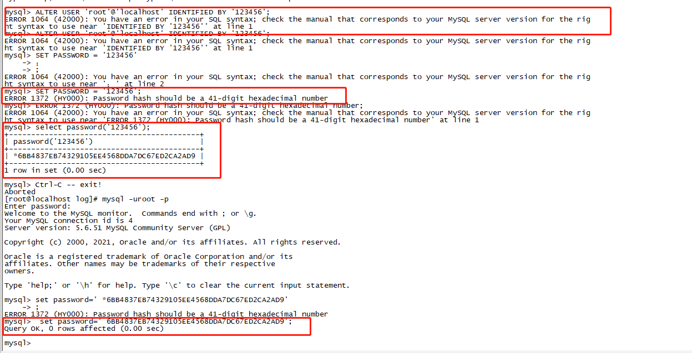
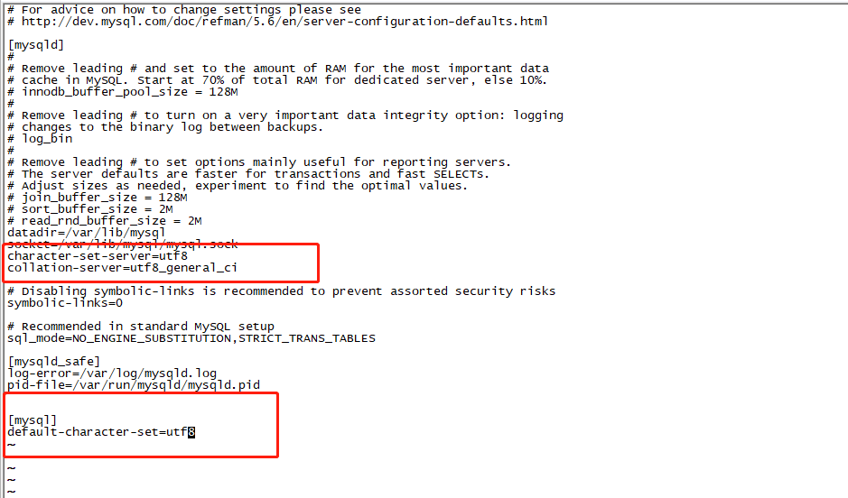

**相关环境**

操作系统：centos7

mysql版本：mysql 5.7

## MySQL 5.7 的安装

#### 检测系统是否自带安装mysql

```shell
yum list installed | grep mysql
```


#### 删除系统自带的mysql及其依赖（防止冲突）

```shell
#此处对应的是自身版本
yum -y remove mysql-libs.x86_64
```

#### 安装wget命名

```shell
yum install wget -y 
```

#### 下载并安装MySQL官方的 Yum Repository

由于CentOS 的yum源中没有mysql，需要到mysql的官网下载yum repo配置文件。并进行安装

```shell
wget dev.mysql.com/get/mysql-community-release-el6-5.noarch.rpm
 yum install mysql-community-release-el6-5.noarch.rpm -y
```

#### 使用yum安装mysql

```shell
yum install mysql-community-server -y
```

#### 启动mysql服务并设置开机启动

```shell
#启动之前需要生成临时密码，需要用到证书，可能证书过期，需要进行更新操作
yum update -y
#启动mysql服务
service mysqld start
#设置mysql开机启动
chkconfig mysqld on
```

#### 获取mysql的临时密码

```shell
grep "password" /var/log/mysqld.log
#没有获取到说明没有密码可以直接登陆
```

#### 使用临时密码登录

```shell
mysql -uroot -p 密码
```

#### 修改密码

```sql
set global validate_password_policy=0;
set global validate_password_length=1;
ALTER USER 'root'@'localhost' IDENTIFIED BY '123456';
#上面这条命令不行时，使用下面这条命令
#6BB4837EB74329105EE4568DDA7DC67ED2CA2AD9 对应123456
#也可以通过 select password('123456')获取
 set password=' 6BB4837EB74329105EE4568DDA7DC67ED2CA2AD9';
```



#### 允许远程连接数据库

```sql

grant all privileges on *.* to 'root'@'%' identified by '123456' with grant option;

flush privileges;
```

#### 设置字符集为utf-8

```shell
#在[mysqld]部分添加：
character-set-server=utf8
#在文件末尾新增[client]段，并在[client]段添加：
default-character-set=utf8
#重启mysql
service mysqld restart
```



## Linux下mysql的彻底卸载

#### 查看mysql的安装情况

```shell
rpm -qa | grep -i mysql
```


#### 删除上图安装的软件

```shell
rpm -ev mysql-community-libs-5.6.51-2.el6.x86_64
rpm -ev mysql-community-server-5.6.51-2.el6.x86_64
rpm -ev mysql-community-release-el6-5.noarch
rpm -ev mysql-community-common-5.6.51-2.el6.x86_64
rpm -ev  mysql-community-client-5.6.51-2.el6.x86_64
```

#### 都删除成功之后，查找相关的mysql的文件

```shell
find / -name mysql
```


#### 删除全部文件

```shell
rm -rf /etc/logrotate.d/mysql
rm -rf /etc/selinux/targeted/active/modules/100/mysql
rm -rf /var/lib/mysql
rm -rf /var/lib/mysql/mysql
rm -rf /usr/bin/mysql
rm -rf /usr/lib64/mysql
rm -rf /usr/share/mysql
```

#### 再次执行命令

```shell
rpm -qa | grep -i mysql
#如果没有显式则表示卸载完成
```

