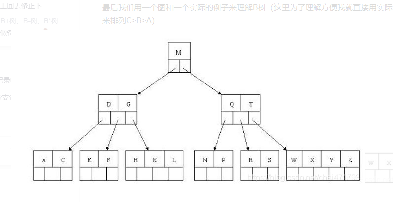
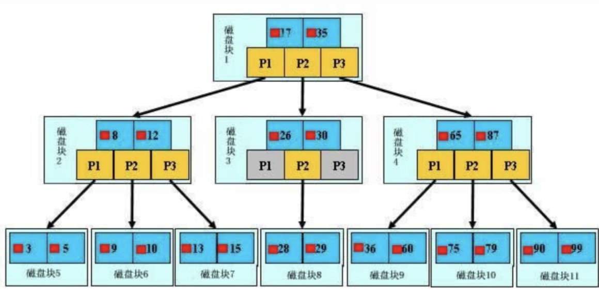
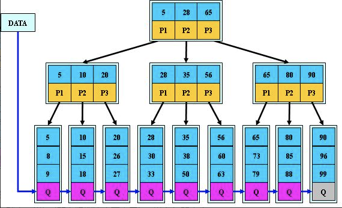
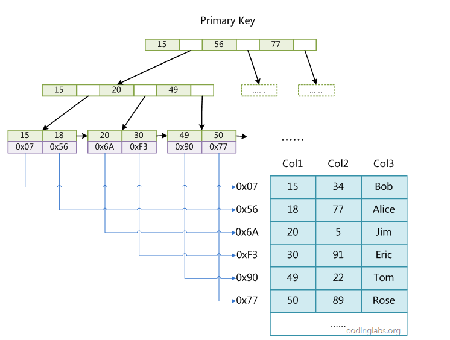
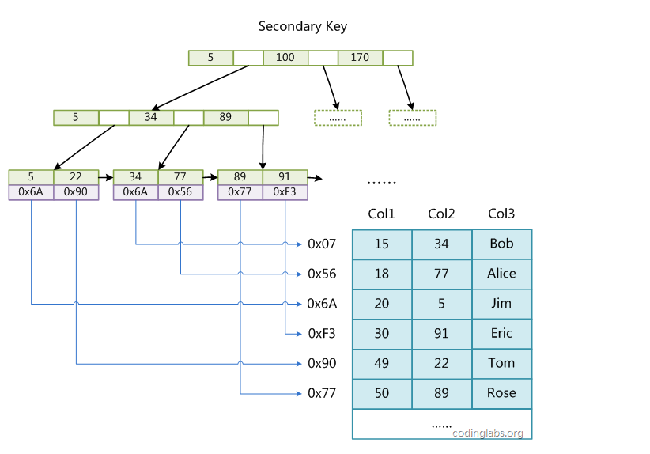
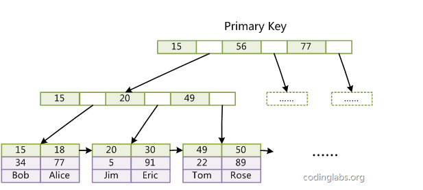
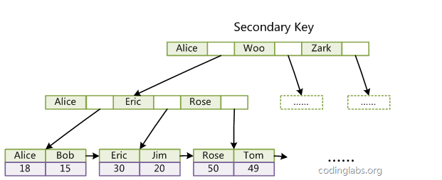

## 索引是什么？

索引是什么了，查阅了官方文档。官方文档写了索引的作用和没有索引会带来全表扫描，非常费时间。
`Indexes are used to find rows with specific column values quickly. Without an index, MySQL must begin with the first row and then read through the entire table to find the relevant rows.`
简单的说索引是提高查询速度。这个很好理解，就像是以前的英文词典，找单词如果没有前面目录的话，效率很低，得全文找一遍。

## 索引实现原理

要搞清楚索引的实现原理，先看看索引的底层实现，**MySQL索引大部分采用B-Tree实现，B-Tree又有B-树和B+树**。还有一些使用Hash索引。

### 二叉搜索树

再说B-Tree之前，先简单了解一下二叉搜索树（Binary Search Trees）。

理解二叉搜索树，对于后面理解B-和B+树很有帮助，因为这2种有些特性跟二叉搜索树很像。二叉搜索树的特点是左孩子的值小于父亲节点的值，父亲节点的值小于右孩子的值，即按二叉树的中序遍历，刚好是一个按小到大排序的。二叉搜索树的查找就可以使用二分查找，如果要查找10，因为10比27小，所以往左孩子找，10<
14，还在左孩子找。最坏的情况下，**查找的次数等于树的高度**。

### B树

**B树和B-tree理解成了两种不同类别的树，其实这两个是同一种树;**

#### 概念

B树和平衡二叉树稍有不同的是B树属于多叉树又名平衡多路查找树（查找路径不只两个），数据库索引技术里大量使用者B树和B+树的数据结构

#### 规则

1. 排序方式：所有节点关键字是按递增次序排列，并遵循左小右大原则；
2. 子节点数：非叶节点的子节点数>1，且<=M ，且M>=2，空树除外（注：M阶代表一个树节点最多有多少个查找路径，M=M路,当M=2则是2叉树,M=3则是3叉）；
3. 关键字数：枝节点的关键字数量大于等于ceil(m/2)-1个且小于等于M-1个（注：ceil()是个朝正无穷方向取整的函数 如ceil(1.1)
   结果为2);
4. 所有叶子节点均在同一层、叶子节点除了包含了关键字和关键字记录的指针外也有指向其子节点的指针只不过其指针地址都为null对应下图最后一层节点的空格子;

#### B树查询流程

从上图中找到E字母，查找流程如下

1. 获取根节点的关键字进行比较，当前根节点关键字为M，E<M（26个字母顺序），所以往找到指向左边的子节点（二分法规则，左小右大，左边放小于当前节点值的子节点、右边放大于当前节点值的子节点）；
2. 拿到关键字D和G，D<E<G 所以直接找到D和G中间的节点；
3. 拿到E和F，因为E=E 所以直接返回关键字和指针信息（如果树结构里面没有包含所要查找的节点则返回null）；

#### B树插入节点流程

节点要处于违规状态，它必须包含在可接受范围之外数目的元素。

1. 首先，查找要插入其中的节点的位置。接着把值插入这个节点中。
2. 如果没有节点处于违规状态则处理结束。
3. 如果某个节点有过多元素，则把它分裂为两个节点，每个都有最小数目的元素。在树上递归向上继续这个处理直到到达根节点，如果根节点被分裂，则创建一个新根节点。为了使它工作，元素的最小和最大数目典型的必须选择为使最小数不小于最大数的一半。

#### B树删除节点流程

1. 首先，查找要删除的值。接着从包含它的节点中删除这个值。
2. 如果没有节点处于违规状态则处理结束。
3. 如果节点处于违规状态则有两种可能情况：
    1. 它的兄弟节点，就是同一个父节点的子节点，可以把一个或多个它的子节点转移到当前节点，而把它返回为合法状态。如果是这样，在更改父节点和两个兄弟节点的分离值之后处理结束。
    2.
   它的兄弟节点由于处在低边界上而没有额外的子节点。在这种情况下把两个兄弟节点合并到一个单一的节点中，而且我们递归到父节点上，因为它被删除了一个子节点。持续这个处理直到当前节点是合法状态或者到达根节点，在其上根节点的子节点被合并而且合并后的节点成为新的根节点。

### B+树

#### 概念

B+树是B树的一个升级版，相对于B树来说B+树更充分的利用了节点的空间，让查询速度更加稳定，其速度完全接近于二分法查找。

#### 规则

1. B+跟B树不同B+树的非叶子节点不保存关键字记录的指针，只进行数据索引，这样使得B+树每个非叶子节点所能保存的关键字大大增加；
2. B+树叶子节点保存了父节点的所有关键字记录的指针，所有数据地址必须要到叶子节点才能获取到。所以每次数据查询的次数都一样；
3. B+树叶子节点的关键字从小到大有序排列，左边结尾数据都会保存右边节点开始数据的指针。
4. **非叶子节点的子节点数=关键字数（来源百度百科）（根据各种资料
   这里有两种算法的实现方式，另一种为非叶节点的关键字数=子节点数-1（来源维基百科)，虽然他们数据排列结构不一样，但其原理还是一样的Mysql
   的B+树是用第一种方式实现）**;

#### 特点

1. B+树的层级更少：相较于B树B+每个非叶子节点存储的关键字数更多，树的层级更少所以查询数据更快
2. B+树查询速度更稳定：B+所有关键字数据地址都存在叶子节点上，所以每次查找的次数都相同所以查询速度要比B树更稳定;
3. B+树天然具备排序功能：B+树所有的叶子节点数据构成了一个有序链表，在查询大小区间的数据时候更方便，数据紧密性很高，缓存的命中率也会比B树高。
4. B+树全节点遍历更快：B+树遍历整棵树只需要遍历所有的叶子节点即可，，而不需要像B树一样需要对每一层进行遍历，这有利于数据库做全表扫描。

> B树相对于B+树的优点是，如果经常访问的数据离根节点很近，而B树的非叶子节点本身存有关键字其数据的地址，所以这种数据检索的时候会要比B+树快。

## 为什么是B-Tree(B+)来实现数据库索引

### 磁盘存取原理

数据导论书中开头就是说： B树是为磁盘或其他直接存取的辅助存储设备而设计的一种平衡搜索树,计算机系统有主存和基于磁盘的辅存，主存通常就是我们说的RAM，也就是内存，这里不展开说它。
**索引文件本身很大，一般不会存在内存里，因此索引往往是以文件的形式存储在磁盘里，所以索引检索需要磁盘I/O操作**

为了缩短磁盘读取的时间，计算机做了一些优化：磁盘预读。磁盘预读是基于局部性原理：当一个数据被用到时，其附近的数据也通常会马上被使用。所以磁盘I/O操作时不光把当前磁盘地址的数据，而是把相邻的数据也都读取到内存缓冲区内，因为局部性原理告诉我们，
**当计算机访问一个地址的数据的时候，与其相邻的数据也会很快被访问到**.

预读的长度一般为页（page）的整倍数。页是计算机管理存储器的逻辑块，硬件及操作系统往往将主存和磁盘存储区分割为连续的大小相等的块，每个存储块称为一页（在许多操作系统中，页得大小通常为4k），主存和磁盘以页为单位交换数据。

- 文件很大，不可能全部存储在内存中，故要存储到磁盘上。
- 索引的结构组织要尽量减少查找过程中磁盘I/O的存取次数，因为每次磁盘I/O消耗时间都是非常多的。
- 局部性原理与磁盘预读，预读的长度一般为页（page）的整倍数。

### B-/B+的查找性能

数据库系统巧妙利用了磁盘预读原理，将一个节点的大小设为等于一个页，这样每个节点只需要一次I/O就可以完全载入。B-树也利用这一点，每次新建节点时，直接申请一个页的空间，这样就保证一个节点物理上也存储在一个页里，加之计算机存储分配都是按页对齐的，就实现了一次磁盘I/O就读取了一页的数据。下面是B-树的示例图：

根据B-Tree的定义，可知检索一次最多需要访问h个节点（h个树的高度）。
**B-Tree中一次检索最多需要h-1次I/O（根节点常驻内存），渐进复杂度为O(h)=O(logdN)
。一般实际应用中，出度d是非常大的数字，通常超过100，因此h非常小（通常不超过3）。所以B-Tree作为索引效率是非常高，相比平衡二叉树、红黑树要高很多，
**
因为这些树的h一般都比较深。

### B+树的直观图

B+树比B-树更加适合作为磁盘的索引数据结构，原因是B+树的内部结点不存储data，内部结点的出度d越大，那么渐进复杂度越小。出度d的上限取决于节点内key和data的大小：
**dmax=floor(pagesize/(keysize+datasize+pointsize))**

一般3层B+树可以存储上百万的数据，也就是读取上百万的数据，只需要3次磁盘I/O，可见这效率，大大提升了。

## 不同引擎的索引实现原理

### MyISAM索引实现

MyISAM的索引采用B+树实现，MyISAM的索引和数据时分开的，叶子节点data存取的是数据的地址，要根据索引找到数据，先根据索引找到叶子节点，再根据叶子节点找到数据的地址，然后再根据数据地址取出数据

#### 主键索引：

MyISAM引擎使用B+Tree作为索引结构，叶节点的data域存放的是数据记录的地址。
下图是MyISAM主键索引的原理图：

这里设表一共有三列，假设我们以Col1为主键，图myisam1是一个MyISAM表的主索引（Primary key）示意。可以看出MyISAM的索引文件仅仅保存数据记录的地址。

#### 辅助索引（Secondary key）

**在MyISAM中，主索引和辅助索引在结构上没有任何区别，只是主索引要求key是唯一的，而辅助索引的key可以重复。**
如果我们在Col2上建立一个辅助索引，则此索引的结构如下图所示：

同样也是一颗B+Tree，data域保存数据记录的地址。**MyISAM中索引检索的算法为首先按照B+Tree搜索算法搜索索引,如果指定的Key存在,则取出其data域的值,然后以data域的值为地址,读取相应数据记录.**
MyISAM的索引方式也叫做“非聚集”的，之所以这么称呼是为了与InnoDB的聚集索引区分。

### InnoDB索引实现

虽然InnoDB也使用B+Tree作为索引结构，但具体实现方式却与MyISAM截然不同。

1. **第一个重大区别是InnoDB的数据文件本身就是索引文件。**
2. InnoDB的辅助索引data域存储相应记录主键的值而不是地址。

#### 主键索引：

MyISAM索引文件和数据文件是分离的，索引文件仅保存数据记录的地址。而在InnoDB中，表数据文件本身就是按B+Tree组织的一个索引结构，这棵树的叶节点data域保存了完整的数据记录。这个索引的key是数据表的主键，因此InnoDB表数据文件本身就是主索引。

以上是InnoDB主索引（同时也是数据文件）的示意图，可以看到叶节点包含了完整的数据记录。这种索引叫做**聚集索引**
。因为InnoDB的数据文件本身要按主键聚集，所以InnoDB要求表必须有主键（MyISAM可以没有），如果没有显式指定，则MySQL系统会自动选择一个可以唯一标识数据记录的列作为主键，如果不存在这种列，则MySQL自动为InnoDB表生成一个隐含字段作为主键，这个字段长度为6个字节，类型为长整形。

#### InnoDB的辅助索引

InnoDB的所有辅助索引都引用主键作为data域。例如，下图为定义在Col3上的一个辅助索引：

**InnoDB 表是基于聚簇索引建立的**。
因此InnoDB 的索引能提供一种非常快速的主键查找性能。不过，它的辅助索引（Secondary Index，
也就是非主键索引）也会包含主键列，
**所以，如果主键定义的比较大，其他索引也将很大。如果想在表上定义很多索引，则争取尽量把主键定义得小一些。**
InnoDB 不会压缩索引。

文字符的ASCII码作为比较准则。
**聚集索引这种实现方式使得按主键的搜索十分高效，但是辅助索引搜索需要检索两遍索引：首先检索辅助索引获得主键，然后用主键到主索引中检索获得记录
**

不同存储引擎的索引实现方式对于正确使用和优化索引都非常有帮助，例如知道了InnoDB的索引实现后，就很容易明白
为什么不建议使用过长的字段作为主键，因为所有辅助索引都引用主索引，过长的主索引会令辅助索引变得过大。
**用非单调的字段作为主键在InnoDB中不是个好主意，因为InnoDB数据文件本身是一颗B+Tree，非单调的主键会造成在插入新记录时数据文件为了维持B+Tree的特性而频繁的分裂调整，十分低效，而使用自增字段作为主键则是一个很好的选择。
**

### InnoDB索引**和**MyISAM索引的区别：

一是主索引的区别，InnoDB的数据文件本身就是索引文件。而MyISAM的索引和数据是分开的。

二是辅助索引的区别：InnoDB的辅助索引data域存储相应记录主键的值而不是地址。而MyISAM的辅助索引和主索引没有多大区别。

#### 意义

InnoDB辅助索引搜索需要检索两遍索引：首先检索辅助索引获得主键，然后用主键到主索引中检索获得记录，不建议使用过长的字段作为主键，因为
**所有辅助索引都引用主索引，过长的主索引会令辅助索引变得过大。**

**不建议用非单调的字段作为InnoDB的主键**，因为InnoDB数据文件本身是一颗B+Tree，
**非单调的主键会造成在插入新记录时，数据文件为了维持B+Tree的特性而频繁的分裂调整，十分低效，所以一般使用自增字段作为主键。**

