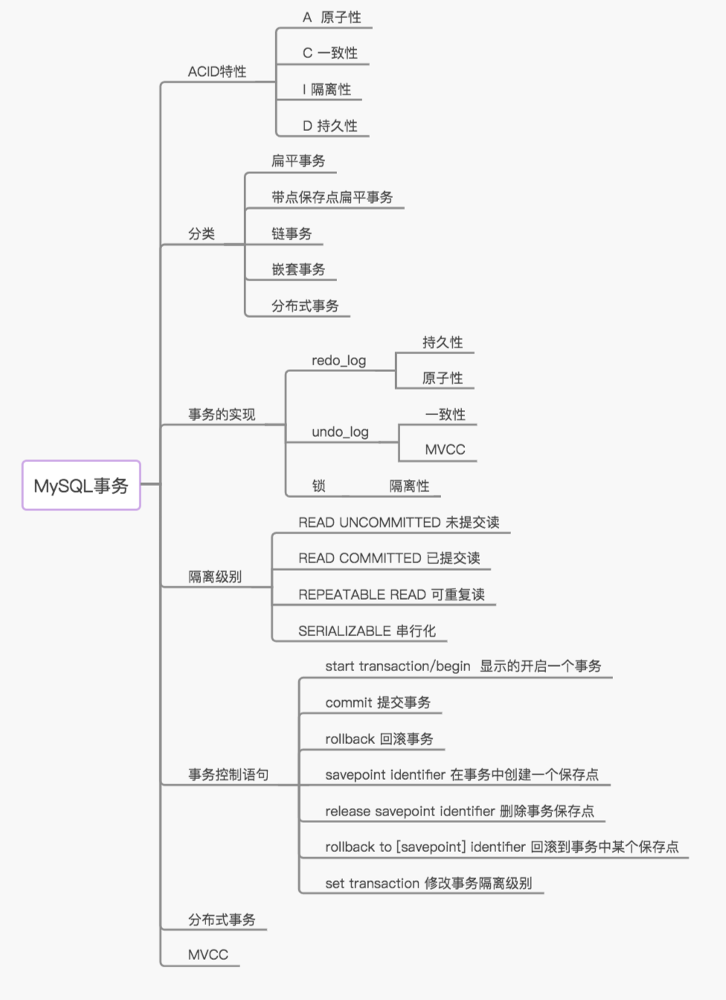

## 为什么要有事务

**数据库引入事务的主要目的是事务会把数据库会从一种一致状态转换到另一种一致状态，数据库提交工作时可以确保要么所有修改都保存，要么所有修改都不保存。**

### 事务的四大特性（ACID）

- **A(Atomicity) 原子性**
- **C(Consistency) 一致性**
- **I(Isolation) 隔离性**
- **D(Durability) 持久性**

#### A(Atomicity) 原子性

原子性是**整个数据库事务是不可分割的工作单位**，只有<font color=red>事务中的所有的数据库操作都执行成功，才算整个事务成功。事务中任何一个SQL执行失败，已经执行成功的SQL语句也必须撤销，回到执行事务的之前的状态</font>。

#### C(Consistency) 一致性

一致性是指事务将数据库从一种一致性状态变为下一种一致性状态。<font  color=red>在事务开始之前和之后，数据库的完整性约束没有被破坏。</font>

#### I(Isolation) 隔离性

隔离性要求<font color=red>每个读写事务对其他事务的操作对象能相互分离。</font>

#### D(Durability) 持久性

持久性指<font color=red>事务一旦提交，其结果就是永久性的。</font>

## 事务的实现

事务的实现就是如何实现ACID特性，下面一图下概况下：

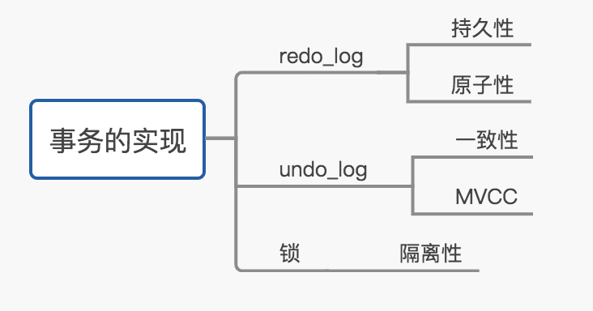

<font color=red>事务的实现通过 redo_log 和 undo_log， 以及锁实现，锁实现事务的</font>

<font color=blue>redo_log 实现持久化和原子性，而undo_log实现一致性，二种日志均可以视为一种恢复操作，redo_log是恢复提交事务修改的页操作，而undo_log是回滚行记录到特定版本。二者记录的内容也不同，redo_log是物理日志，记录页的物理修改操作，而undo_log是逻辑日志，根据每行记录进行记录。</font>

###  redo log 重做日志

**redo_log 重做日志上面已经提到实现持久化和原子性**，重做日志由两部分组成，<font color=red>一是内存中的重做日志缓存(redo log buffer)，这部分是容易丢失的。二是重做日志文件(redo log file)，这部分是持久的</font>

#### redo log更新流程

redo log的更新流程如下图，以一次Update 操作为例。

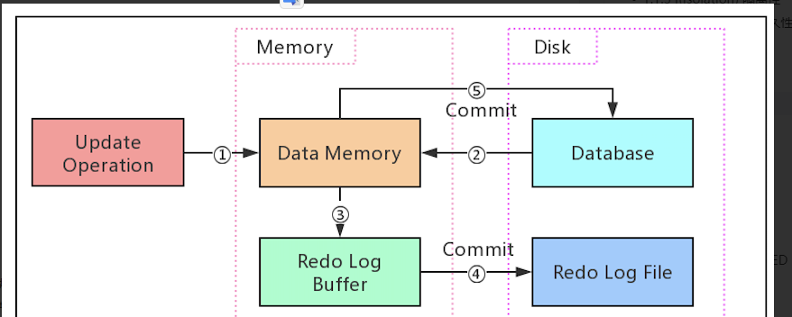

1. 执行update操作。
2. 先将原始数据从磁盘读取到内存，修改内存中的数据。
3. 生成一条重做日志写入redo log buffer，记录数据被修改后的值。
4. 当事务提交时，需要将redo log buffer中的内容刷新到redo log file。
5. 事务提交后，也会将内存中修改数据的值写入磁盘。

> 为了确保每次日志都写入重做日志文件，<font color=red>InnoDB存储引擎会调用一次fsync操作。</font>

#### 存储格式内容

##### mysql的binlog与redo log区别

1. 首先2者都是记录数据的改变，不同的是，binlog是记录所有数据的改变信息，而innodb的redo log只是记录所有innodb表数据的变化。
2. binlog是记录已经提交完毕之后的dml以及ddl sql语句，而innodb  redo log是正在执行中的dml以及ddl语句
3. binlog可以作为恢复数据使用 ，redo log可以作为异常down机或者介质故障后的数据恢复使用
4. 在db文件目录下，也分属于不同的日志文件中。

##### mysql的binlog与redo log的写入方式

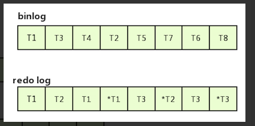

binlog是每次事务才写入，所以**每个事务只会有一条日志，记录的逻辑日志，也可以说记录的就是SQL语句。**

redo log是事务开始就开始写入，***T1表示事务提交**。**记录的是物理格式日志**，即每个页的修改。

redo log默认是以block(块)的方式为单位进行存储，每个块是512个字节。不同的数据库引擎有对应的重做日志格式，Innodb的存储管理是基于页的，所以其重做日志也是基于页的。

redo log格式:


- redo_log_type 重做日志类型
- space 表空间的ID
- page_no 页的偏移量
- redo_log_body 存储内容

执行一条插入语句，重做日志大致为:

```sql
INSERT INTO user SELECT 1,2;
           |
page(2,3), offset 32, value 1,2 # 主键索引
page(2,4), offset 64, value 2   # 辅助索引

```

#### 恢复机制

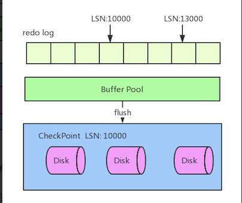

**LSN(Log Sequence Number) 日志序列号**，Innodb里，LSN占8个字节，且是单调递增的，**代表的含义**有: 重做日志写入的总量、checkpoint的位置、页的版本。

假设在LSN=10000的时候数据库出现故障，磁盘中checkpoint为10000，表示磁盘已经刷新到10000这个序列号，当前redolog的checkpoint是13000，则需要恢复10000-13000的数据。

#### redo log为什么可以实现事务的原子性和持久性。

- 原子性，是redo log记录了事务期间操作的物理日志，事务提交之前，并没有写入磁盘，保存在内存里，如果事务失败，数据库磁盘不会有影响，回滚掉事务内存部分即可。
- 持久性，redo log 会在事务提交时将日志存储到磁盘redo log file，保证日志的持久性。

### undo log

redo log一旦提交意味着持久化了，但是有时候需要对其进行rollback操作，那就需要undo log。

undo log是逻辑日志，只是将数据库逻辑的恢复到原来的样子。并不能将数据库物理地恢复到执行语句或者事务之前的样子。虽然所有的逻辑修改均被取消了，但是数据结构和页本身在回滚前后可能不一样了。

既然是逻辑日志，可以<font color=red>理解为它存储的是SQL, 在事务中使用的每一条 INSERT 都对应了一条 DELETE，每一条 UPDATE 也都对应一条相反的 UPDATE 语句。</font>


- undo log 存放在数据库内部的一个特殊段(segment)中，也叫undo段，存在于共享表空间中。

- undo log实现了事务的一致性，可以通过undo log恢复到事务之前的逻辑状态，保证一致性。
- undo log 还可以实现MVCC（Multi-Version Concurrency Control ，多版本并发控制），<font color=red>多版本并发控制其实可以通过 undo log 形成一个事务执行过程中的版本链，每一个写操作会产生一个版本，数据库发生读的并发访问时，读操作访问版本链，返回最合适的结果直接返回</font>。从而读写操作之间没有冲突，提高了性能。

## 事务控制语句

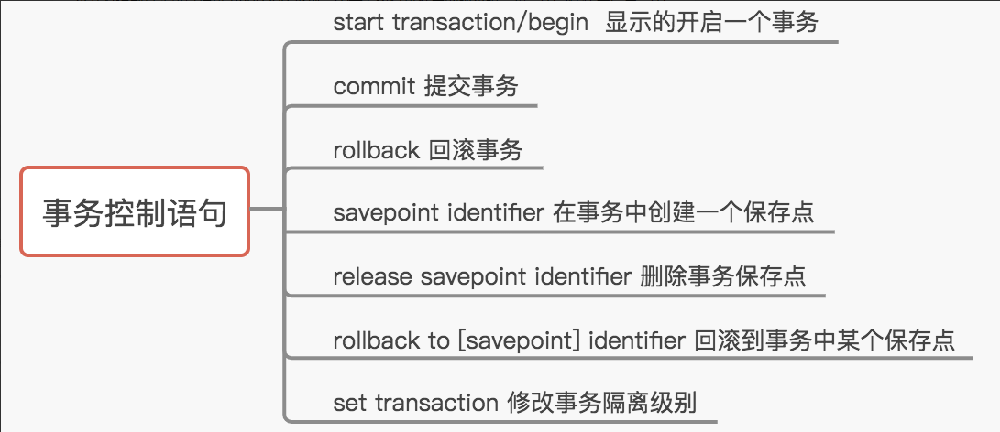

> set transaction 修改事务隔离级别，比如修改会话级别的事务:
>
> **set session transaction isolation level read committed;**

## 事务隔离级别

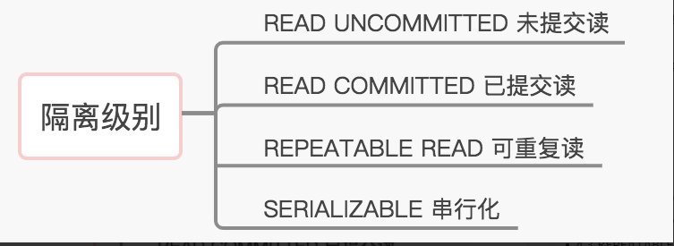

四种隔离级别，按READ-UNCOMMITTED、READ-COMMITTED、REPEATABLE-READ、SERIALIZABLE顺序，隔离级别是从低到高**，InnoDB默认是REPEATABLE-READ级别，此级别在其余数据库中是会引起幻读问题，InnoDB采用Next-Key Lock锁算法避免了此问题**

### READ-UNCOMMITTED

READ-UNCOMMITTED 中文叫**未提交读**，即一个事务读到了另一个未提交事务修改过的数据，整个过程如下图:

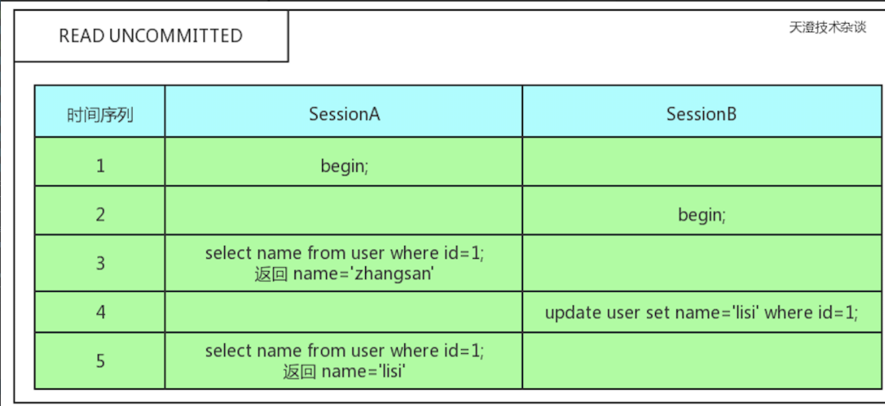

<font color=red>SessionA和SessionB分别开启一个事务，SessionB中的事务先将id为1的记录的name列更新为'lisi'，然后Session 中的事务再去查询这条id为1的记录，那么在未提交读的隔离级别下，查询结果由'zhangsan'变成了'lisi'，也就是说某个事务读到了另一个未提交事务修改过的记录。但是如果SessionB中的事务稍后进行了回滚，那么SessionA中的事务相当于读到了一个不存在的数据，这种现象也称为脏读。</font>可见READ-UNCOMMITTED是非常不安全

### READ COMMITTED

READ COMMITTED 中文叫**已提交读，或者叫不可重复读**。<font color=red>即一个事务能读到另一个已经提交事务修改后的数据，如果其他事务均对该数据进行修改并提交，该事务也能查询到最新值。</font>

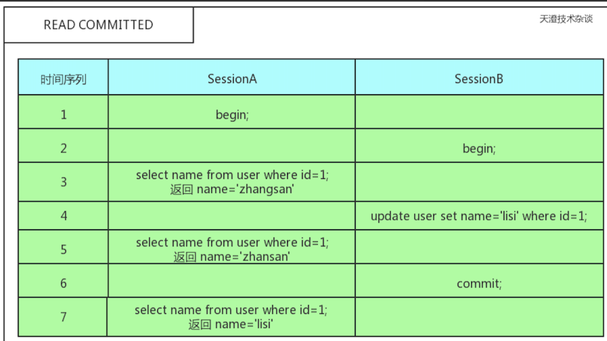

<font color=red>SessionB 修改后，如果未提交，SessionA是读不到，但SessionB一旦提交后，SessionA即可读到SessionB修改的内容。</font>不可重复读是违反事务的隔离性的。

### REPEATABLE READ

REPEATABLE READ 中文叫可重复读，<font color=red>即事务能读到另一个已经提交的事务修改过的数据，但是第一次读过某条记录后，即使后面其他事务修改了该记录的值并且提交，该事务之后再读该条记录时，读到的仍是第一次读到的值，而不是每次都读到不同的数据。</font>如下图:

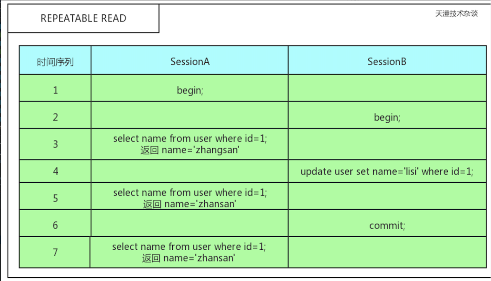

InnoDB默认是这种隔离级别，SessionB无论怎么修改id=1的值，SessionA读到依然是自己开启事务第一次读到的内容。

### SERIALIZABLE

SERIALIZABLE 叫串行化， 上面三种隔离级别可以进行 读-读 或者 读-写、写-读三种并发操作，而<font color=red>SERIALIZABLE不允许读-写，写-读的并发操作</font>。 如下图:

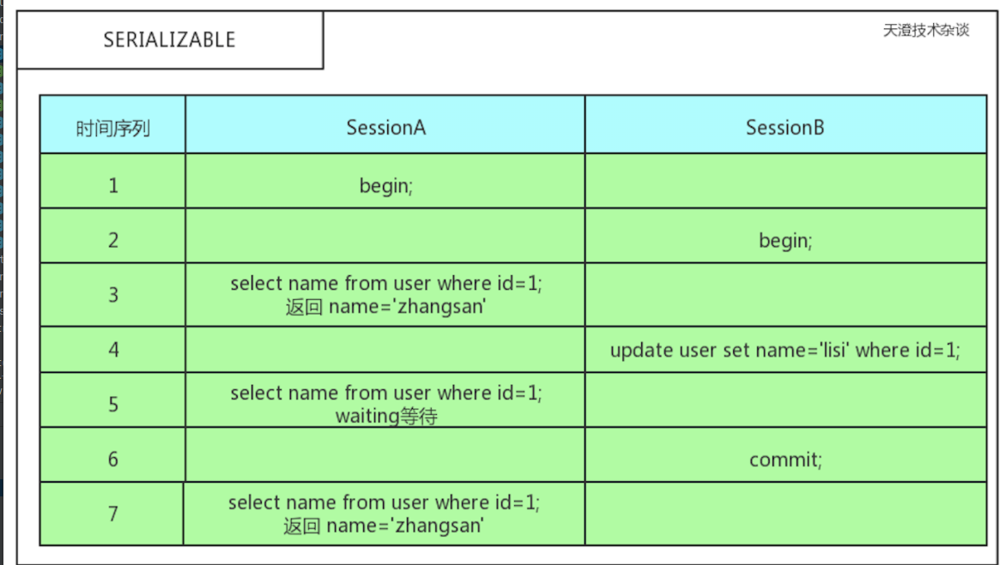

SessionB 对 id=1 进行修改的时候，SessionA 读取id=1则需要等待 SessionB 提交事务。可以理解SessionB在更新的时候加了锁。

## 分布式事务

分布式事务指**允许多个独立的事务资源参与到一个全局的事务中。全局事务要求在其中的所有参与的事务要么都提交，要么都回滚。**

### InnoDB 分布式事务

InnoDB 是支持分布式事务，由一个或多个资源管理器（Resource Managers），一个事务管理器(Transaction Manager)，以及一个应用程序(Application Program)组成。

- 资源管理器（Resource Managers），提供访问事务资源的方法，一般一个数据库就是一个资源管理器。
- 事务管理器(Transaction Manager)，协调参与全局事务中的各个事务，需要和参与全局事务的所有资源管理器进行通信。
- 应用程序(Application Program) 定义事务的边界，指定全局事务中的操作。

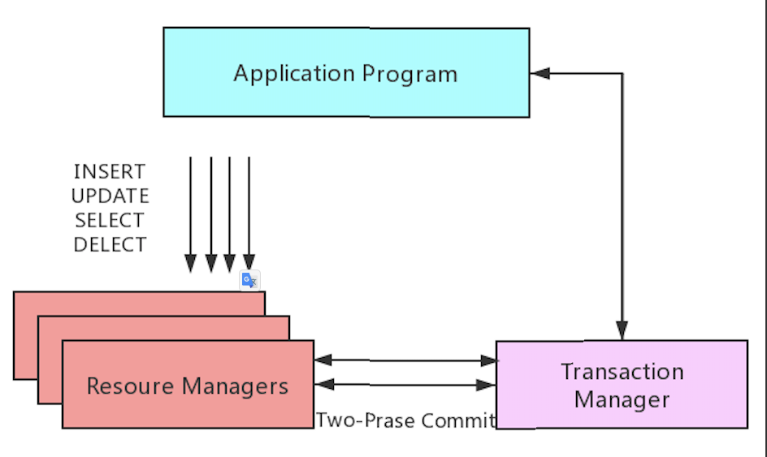

应用程序向一个或多个数据库执行事务操作，**事务管理器进行管理事务，通过二段式提交，第一阶段所有参与的全局事务的节点都开始准备，告诉事务管理器都准备好了，可以提交了。第二阶段，事务管理器告诉每一个资源管理器是执行Commit 还是 Rollback。如果任何一个节点显示不能提交，则所有的节点被告知需要回滚**。

###  TCC分布式事务

**InnoDB的分布式是数据库实现的, 数据库外常见的分布式事务是TCC分布式事务**

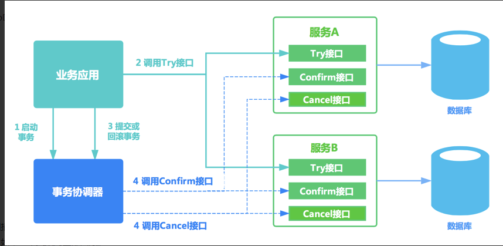

上图描述了TCC分布式事务的流程，假设电商业务中，支付后需要修改库存，积分，物流仓储的数据，如果一个失败则全部回滚。

TCC分布式事务，有三个阶段，Try，Confirm, Cancel。也就是说每个参与事务的服务都需要实现这三个接口，库存、积分、仓储都需要实现这三个接口。

第一阶段，Try，业务应用调取各个服务的Try接口，告诉他们给我预留一个商品，有人要购买，可以理解为冻结，每一步都不执行成功，只是标记更新状态。

第二阶段，Confirm，确认阶段，即事务协调器调取每个服务Confirm执行事务操作，如果某一个服务的Confirm失败，则有第三个阶段。如果成功则结束事务。

第三个阶段，Cancel，如果在第二个阶段有一个事务提交失败，则事务协调器调取所有业务的Cancel接口，回滚事务，将第一阶段冻结的商品恢复。