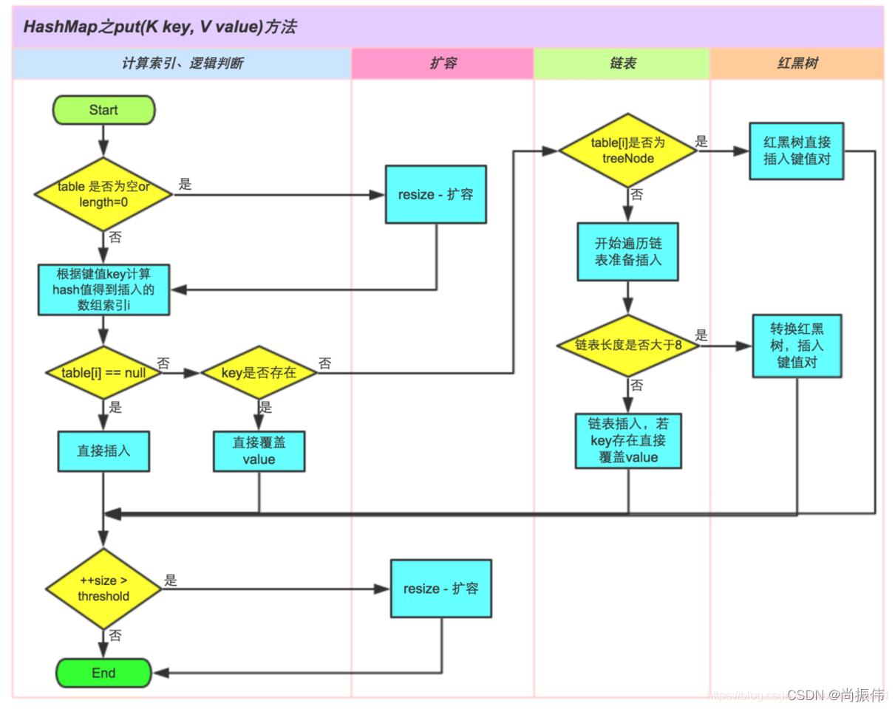

### List, Set, Queue, Map 四者的区别

| 特性/接口    | `List`                    | `Set`                | `Queue`                       | `Map`                |
|----------|---------------------------|----------------------|-------------------------------|----------------------|
| 是否允许重复元素 | ✅ 允许                      | ❌ 不允许                | ✅ 允许                          | ✅ 值可重复，键不可重复         |
| 是否有序     | ✅ 有序（插入顺序）                | ❌ 通常无序（可排序）          | ✅ 通常按队列顺序（FIFO）               | ❌ 无序（可按 key 排序）      |
| 元素访问方式   | 下标访问                      | 无索引，迭代器              | 队头/队尾操作                       | 通过 `key` 访问 `value`  |
| 数据结构特征   | 动态数组或链表                   | 哈希或树结构               | 环形数组/链表/优先队列等                 | 哈希表、红黑树等结构           |
| 典型场景     | 有序集合、频繁查找                 | 去重集合、快速包含判断          | 消息队列、任务排队                     | 键值映射、缓存              |
| 主要实现类    | `ArrayList`, `LinkedList` | `HashSet`, `TreeSet` | `LinkedList`, `PriorityQueue` | `HashMap`, `TreeMap` |

### ArrayList 和 LinkedList 的区别

> 开发中基本不使用LinkedList

| 特性      | `ArrayList`                           | `LinkedList`                                                     |
|---------|---------------------------------------|------------------------------------------------------------------|
| 数据结构    | 动态数组                                  | 双向链表                                                             |
| 内存占用    | 内存连续，开销小                              | 每个元素有额外的指针开销，内存不连续                                               |
| 随机访问    | 快速（O(1)）                              | 慢（O(n)），需要遍历链表                                                   |
| 插入/删除性能 | 慢（O(n)），需要移动元素                        | 快（O(1)），只需修改指针                                                   |
| 迭代器性能   | 快（基于数组）                               | 慢（基于链表）                                                          |
| 适用场景    | 频繁随机访问，少量插入/删除操作                      | 频繁插入/删除操作，少量随机访问操作                                               |
| 内存使用    | 内存使用较少，适合存储大量数据                       | 内存使用较多，适合频繁变动的数据结构                                               |
| 线程安全    | 非线程安全，需手动同步                           | 非线程安全，需手动同步                                                      |
| 主要方法    | `get()`, `set()`, `add()`, `remove()` | `get()`, `set()`, `add()`, `remove()`, `addFirst()`, `addLast()` |

### ArrayList的扩容机制

1. **扩容时机**：当添加元素时，如果当前容量已满，则触发扩容。
2. **扩容策略**：通常是将容量增加到原来的1.5
3. **实现原理**：创建一个新的数组，将原数组的元素复制到新数组中，然后将新数组赋值给原数组引用。
4. **性能影响**：扩容操作是O(n)，因为需要复制所有元素，但通常不会频繁发生。

### HashMap,hashTable,LinkedHashMap的区别

| 特性              | `HashMap`               | `Hashtable`              | `LinkedHashMap`                   |
|-----------------|-------------------------|--------------------------|-----------------------------------|
| 是否线程安全          | ❌ 否                     | ✅ 是（方法加了 `synchronized`） | ❌ 否                               |
| 效率（单线程）         | ✅ 高                     | ❌ 低                      | ✅ 高                               |
| 是否允许 `null` 键/值 | ✅ 允许 1 个 `null` 键 & 多个值 | ❌ 都不允许                   | ✅ 允许，行为与 `HashMap` 一致             |
| 元素是否有序          | ❌ 无序                    | ❌ 无序                     | ✅ 有序（插入顺序 or 访问顺序）                |
| 替代建议            | 推荐使用                    | 不推荐（JDK 1.0 遗产）          | 用于需要保序的场景                         |
| 底层结构            | 哈希表 + 链表 / 红黑树（JDK8）    | 哈希表                      | 哈希表 + 双向链表                        |
| 线程安全替代方案        | `ConcurrentHashMap`     | ❌（老旧）                    | 用 `Collections.synchronizedMap()` |

### HashMap的底层实现

| 特性     | JDK 1.7         | JDK 1.8                  |
|--------|-----------------|--------------------------|
| 冲突结构   | 链表              | 链表 + 红黑树                 |
| 链表插入方式 | 头插法（快但容易反转）     | 尾插法（防止死循环）               |
| 是否线程安全 | ❌ 否             | ❌ 否                      |
| 扩容机制   | 2 倍扩容 + 重新 hash | 同上，但优化了 hash 分布          |
| 树化条件   | ❌ 不支持           | 链表长度 > 8 且 table 长度 ≥ 64 |
| 死循环风险  | ✅ 有，在多线程中可能出现   | ❌ 无头插法，避免链表反转            |

> HashMap中key存放到数组中，value存放到链表或红黑树中。
> JDK1.8 版本的 HashMap 在链表长度超过 8 且数组长度超过 64 时会将链表转换为红黑树，
> 将链表换成红⿊树前会判断，如果当前数组的⻓度⼩于 64,会优先数组扩容，⽽不是 换为红⿊树。

### HashMap的put过程

