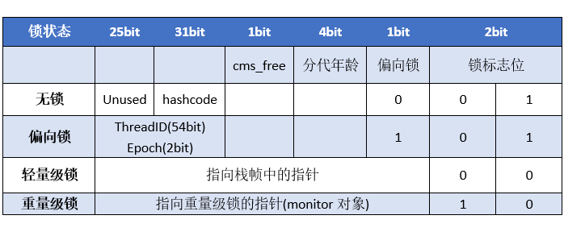

## 线程状态变迁

## sleep和wait的区别

| 特性                  | `sleep()`            | `wait()`                            |
|---------------------|----------------------|-------------------------------------|
| 所属类                 | `Thread` 类           | `Object` 类                          |
| 是否需要 `synchronized` | 不需要                  | 必须在 `synchronized` 代码块或方法中使用        |
| 是否释放锁               | **不释放**当前对象锁         | **释放**当前对象锁                         |
| 唤醒方式                | 时间到自动唤醒              | 需要其他线程调用 `notify()` 或 `notifyAll()` |
| 用途                  | 用于线程睡眠/暂停            | 用于线程间通信/协调                          |
| 是否可以中断              | 可以用 `interrupt()` 中断 | 可以用 `interrupt()` 中断（会抛出异常）         |
| 作用对象                | 当前线程                 | 任意对象的监视器（锁）                         |

## 线程锁升级过程

> 无锁>>偏向锁>>轻量级锁>>重量级锁

## synchronized和Lock的区别

| 功能点      | `synchronized`          | `Lock`（如 ReentrantLock）         |
|----------|-------------------------|---------------------------------|
| **可中断锁** | 不可中断                    | `lockInterruptibly()` 可响应中断     |
| **尝试锁**  | 不支持                     | `tryLock()` 可尝试获取锁              |
| **公平锁**  | 非公平                     | 可设置为公平锁,具体为方法实现                 |
| **读写锁**  | 不支持                     | `ReadWriteLock` 支持读写分离          |
| **重入性**  | 支持（自动）                  | 支持（如 `ReentrantLock`）           |
| **超时锁**  | 不支持                     | `tryLock(timeout)` 支持设置超时时间     |
| **条件变量** | 使用 `Object.wait/notify` | 使用 `Condition.await/signal` 更强大 |
| **自动释放** | 自动释放（方法/代码块结束）          | 必须手动释放，易出错                      |

## 线程池的7大参数

1. corePoolSize：核心线程数，线程池中始终保持的线程数量。
2. maximumPoolSize：最大线程数，线程池允许的最大线程数量。
3. keepAliveTime：非核心线程的存活时间，当线程数超过核心线程数时，多余的线程在空闲时会被销毁。
4. unit：keepAliveTime的时间单位。
5. workQueue：任务队列，用于存放等待执行的任务。
6. threadFactory：线程工厂，用于创建新线程。
7. handler：拒绝策略，当线程池和队列都满了时，如何处理新提交的任务。
### 拒绝策略

| 策略类                   | 名称       | 行为描述                                 |
| --------------------- | -------- | ------------------------------------ |
| `AbortPolicy`（默认）     | 中止策略     | 直接抛出 `RejectedExecutionException` 异常 |
| `CallerRunsPolicy`    | 调用者运行策略  | 由提交任务的线程（一般是主线程）执行该任务                |
| `DiscardPolicy`       | 丢弃策略     | 直接丢弃任务，不抛异常，不执行                      |
| `DiscardOldestPolicy` | 丢弃最旧任务策略 | 丢弃队列中最老的任务，然后重新尝试提交当前任务              |
