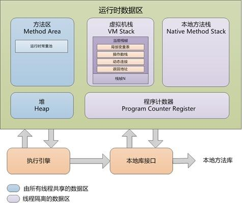

## Java基础

### 面向对象的三大特性

1. 封装：将数据和操作数据的方法封装在一起，隐藏内部实现细节。
2. 继承：允许一个类继承另一个类的属性和方法，促进代码复用。
3. 多态：允许不同类的对象以相同的方式调用方法，具体实现由对象的实际类型决定。

### Java的基本数据类型

Java的基本数据类型包括：

- 整数类型：`byte`, `short`, `int`, `long`
- 浮点类型：`float`, `double`
- 字符类型：`char`
- 布尔类型：`boolean`

### Java的基础类型和包装类型区别

1. 基本类型有默认值，而包装类型默认为null。
2. 包装类型可以用于泛型和集合，而基本类型不能。
3. 包装类型是对象，具有方法和属性，而基本类型是原始数据
4. `基本数据类型的局部变量`存放在jvm的局部变量表中，而`包装类型的局部变量`存放在堆中。

### Java的包装类型的封箱和拆箱

- 装箱：将基本类型⽤它们对应的引⽤类型包装起来,实际是调用了xxxValueOf方法；
    - 例如：`int a = 10; Integer b = Integer.valueOf(a);`
- 拆箱：将包装类型转换为基本数据类型,实际是调用了xxxValue方法；
    - 例如：`Integer b = Integer.valueOf(10); int a = b.intValue();`

### Java的包装类型的缓存机制

* **`Byte`**: 缓存范围是 **-128 到 127**。
* **`Short`**: 缓存范围是 **-128 到 127**。
* **`Integer`**: 缓存范围是 **-128 到 127**。
* **`Long`**: 缓存范围是 **-128 到 127**。
* **`Character`**: 缓存范围是 **0 到 127** (即 ASCII 字符范围)。
* **`Boolean`**: 缓存了 `TRUE` 和 `FALSE` 两个常量对象。

**`Float` 和 `Double` 没有缓存机制。** 这是因为浮点数没有固定且精确的有限范围，并且浮点数的比较涉及精度问题，缓存会带来额外的复杂性且收益不大。

* **性能优化：** 减少了频繁创建小整数、字符和布尔值对象的开销，尤其是在大量使用这些值的情况下。
* **内存节省：** 避免了为相同的小值重复创建对象，从而降低了内存占用。

#### 缓存机制是如何工作的

当你在以上缓存范围内的值进行**自动装箱**（例如 `Integer i = 100;`）时，JVM 会执行以下步骤：

1. **检查缓存：** 它会首先检查内部缓存中是否已经存在一个表示该值的对象。
2. **返回引用：** 如果存在，JVM 会直接返回该对象的引用，而不是创建一个新的 `Integer` 对象。
3. **创建新对象：** 如果缓存中不存在该值，或者该值超出了缓存范围，JVM 才会创建新的对象。对于 `Integer`、`Byte` 等类型，这通常通过调用
   `valueOf()` 方法来实现，而 `valueOf()` 方法内部就包含了缓存逻辑。

```java
public class WrapperCacheExample {
    public static void main(String[] args) {
        // Integer 缓存示例
        Integer a = 100; // 自动装箱，100 在缓存范围内
        Integer b = 100;
        System.out.println("Integer 100 == 100: " + (a == b)); // true，因为它们引用同一个缓存对象

        Integer c = 200; // 自动装箱，200 超出缓存范围
        Integer d = 200;
        System.out.println("Integer 200 == 200: " + (c == d)); // false，因为它们是不同的对象

        // Character 缓存示例
        Character ch1 = 'a'; // 自动装箱，'a' 的 ASCII 值在缓存范围内
        Character ch2 = 'a';
        System.out.println("Character 'a' == 'a': " + (ch1 == ch2)); // true

        Character ch3 = '€'; // 自动装箱，欧元符号的 Unicode 值通常超出 127
        Character ch4 = '€';
        System.out.println("Character '€' == '€': " + (ch3 == ch4)); // false

        // Boolean 缓存示例
        Boolean bool1 = true; // 自动装箱，true 缓存
        Boolean bool2 = true;
        System.out.println("Boolean true == true: " + (bool1 == bool2)); // true
    }
}
```

### 重载和重写的区别

1. **定义**：
    - **重载（Overloading）**：同一个类中，方法名相同但参数列表不同（参数类型、数量或顺序不同）。
    - **重写（Overriding）**：子类重新定义父类中的方法，方法名、返回类型和参数列表都必须相同。
2. **目的**：
    - **重载**：提供多种方式来调用同一方法，增强代码
    - **重写**：实现多态性，允许子类提供特定的实现。
3. **编译时和运行时**：
    - **重载**：在编译时决定调用哪个方法（静态绑定）。
    - **重写**：在运行时决定调用哪个方法（动态绑定）。
4. **参数**：
    - **重载**：参数列表必须不同（类型、数量或顺序）。
    - **重写**：参数列表必须完全相同。
5. **返回类型**：
    - **重载**：可以有不同的返回类型。
    - **重写**：返回类型必须相同或是父类返回类型的

### 静态方法为什么不能被重写

静态方法不能被重写的原因是因为静态方法属于类而不是实例。它们在编译时就已经确定了调用哪个方法，
而不是在运行时根据对象的实际类型来决定。因此，静态方法的调用是基于引用类型而不是对象类型。

### 静态方法为什么不能调用非静态方法

静态方法不能直接调用非静态方法，因为非静态方法依赖于实例对象的状态，而静态方法属于类本身，不依赖于任何实例对象。
在静态方法中没有 `this` 引用，因此无法访问非静态方法和属性。

### 接口和抽象类的区别

1. **定义**：
    - **接口（Interface）**：只包含方法的声明，没有方法的实现。可以包含常量。
    - **抽象类（Abstract Class）**：可以包含方法的声明和部分实现，也可以包含常量和实例变量。
2. **继承**：
    - **接口**：一个类可以实现多个接口（多重继承）。
    - **抽象类**：一个类只能继承一个抽象类（单继承）。
3. **方法实现**：
    - **接口**：所有方法默认是 `public` 和 `abstract`，从 Java 8 开始可以有默认方法（`default`）和静态方法。
    - **抽象类**：可以有 `public`、`protected` 和 `private` 方法，可以有具体方法的实现。
4. **构造函数**：
    - **接口**：没有构造函数，因为接口不能被实例化。
    - **抽象类**：可以有构造函数，可以被实例化为子类的对象。
5. **字段**：
    - **接口**：只能包含 `public static final` 常量。
    - **抽象类**：可以包含实例变量，可以有不同的访问修饰符。
6. **使用场景**：
    - **接口**：适用于定义一组行为或功能，强调的是能力和契约。
    - **抽象类**：适用于定义一组相关的类，强调的是共享的状态和行为。

### 深拷贝和浅拷贝的区别

1. **定义**：
    - **浅拷贝（Shallow Copy）**：创建一个新对象，但只复制对象的引用，对于引用类型的属性，仍然指向原对象的内存地址。
    - **深拷贝（Deep Copy）**：创建一个新对象，并递归地复制所有属性，包括引用类型的属性，确保新对象和原对象完全独立。
2. **内存分配**：
    - **浅拷贝**：新对象和原对象共享引用类型属性的内存地址。
    - **深拷贝**：新对象和原对象的所有属性都在不同的内存地址上，完全独立。
3. **影响**：
    - **浅拷贝**：修改新对象的引用类型属性会影响原对象，因为它们指向同一内存地址。
    - **深拷贝**：修改新对象的引用类型属性不会影响原对象，因为它们有各自独立的内存地址。
4. **实现方式**：
    - **浅拷贝**：通常使用 `clone()` 方法或构造函数来实现。
    - **深拷贝**：可以通过序列化和反序化、手动复制每个属性或使用第三方库（如 Apache Commons Lang 的 `SerializationUtils`
      ）来实现。

### Object类的常用方法

- `equals(Object obj)`：比较两个对象是否相等。
- `hashCode()`：返回对象的哈希码，用于哈希表等数据结构。
- `toString()`：返回对象的字符串表示形式。
- `getClass()`：返回对象的运行时类。
- `clone()`：创建并返回对象的一个副本（浅拷贝）。
- `finalize()`：在垃圾回收前调用，用于清理资源（不推荐使用）。
- `notify()`：唤醒在此对象监视器上等待的单个线程。
- `notifyAll()`：唤醒在此对象监视器上等待的所有线程。
- `wait()`：使当前线程等待，直到其他线程调用 `notify()` 或 `notifyAll()` 方法。
- `wait(long timeout)`：使当前线程等待，直到其他线程调用 `notify()` 或 `notifyAll()` 方法，或等待超时。
- `wait(long timeout, int nanos)`：使当前线程等待，直到其他线程调用 `notify()` 或 `notifyAll()` 方法，或等待超时和纳秒。
- `getClassLoader()`：返回加载此类的类加载器。
- `getClass()`: 返回对象的运行时类。

### 为什么重写`equals`方法时也要重写`hashCode`方法

重写 `equals` 方法时也要重写 `hashCode` 方法的原因是：

1. **一致性**：如果两个对象通过 `equals` 方法被认为是相等的，那么它们的 `hashCode` 方法也必须返回相同的哈希码。
2. **哈希表的正确性**：在使用哈希表（如 `HashMap`）等数据结构时，哈希码用于定位对象的位置。如果两个相等的对象具有不同的哈希码，可能导致哈希表无法正确找到或存储对象。
3. **性能优化**：哈希码可以加速对象的查找和比较操作。如果 `equals` 方法被重写而 `hashCode`
   方法没有被重写，可能会导致哈希表的性能下降，因为相等的对象可能会被分配到不同的桶中。

### equal和`==`的区别，及比较的类型

1. 基本类型比较
   ==: 当用于基本数据类型（如int, char, boolean等）时，==比较的是它们的值是否相等。
2. 引用类型比较
    - ==: 当用于引用类型（如对象、数组）时，==比较的是两个对象的引用是否指向堆内存中的同一个地址，也就是说，它们是否是同一个对象的实例。即使两个对象的内容完全相同，但如果它们是在内存中的不同位置创建的，==也会判断为不相等。
    - equals(): equals()方法默认的行为同样是比较对象的引用是否相同，但是很多类（如String, Integer等）都重写了equals()
      方法，使其比较的是对象的内容是否相等，而不是引用是否相同。这意味着，对于这些类的实例，如果你使用equals()
      来比较，它会检查两个对象的内容（比如字符串的字符序列，Integer的值等）是否相等。

### String, StringBuffer, StringBuilder的区别

| 特性      | `String`         | `StringBuffer`             | `StringBuilder` |
|---------|------------------|----------------------------|-----------------|
| 是否可变    | ❌ 不可变（**final**） | ✅ 可变                       | ✅ 可变            |
| 线程安全    | ✅ 线程安全（**加锁**）   | ✅ 线程安全（方法加 `synchronized`） | ❌ 非线程安全         |
| 性能（单线程） | 最差（每次操作新建对象）     | 较差（加锁带来开销）                 | 最快（无锁、原地操作）     |
| 使用场景    | 小量字符串、不频繁修改      | 多线程环境中字符串频繁修改              | 单线程环境中字符串频繁修改   |

### String为什么不可变

因为String 被final修饰，不能被继承，
所以String类的实例一旦创建就不能被修改。不可变字符串的设计有以下几个好处：

1. 安全性：防止被串改，导致攻击
2. 线程安全
3. 性能优化：字符串常量池，避免重复创建相同内容的字符串对象
4. 内存优化：不可变字符串可以被共享，减少内存占用
5. 作为HashMap的key时，保证hash值不变

### String s1=new String("abc")创建了几个字符串对象

> **最多创建了 2 个对象**，分别是：
>
> 1. 字符串常量 `"abc"`（在字符串常量池中）
> 2. 通过 `new` 创建的堆内存中的一个 `String` 对象（内容是 `"abc"` 的副本）

| 表达式                             | 常量池中对象   | 堆中对象 | 说明         |
|---------------------------------|----------|------|------------|
| `String s = "abc";`             | 1        | 0    | 只创建常量池对象   |
| `String s = new String("abc");` | 1（如果未存在） | 1    | 最多创建 2 个对象 |

### 什么是反射，反射的作用

反射是指在运行时动态地获取类的信息（如类名、方法、字段等）
以及操作类的实例（如调用方法、修改字段值等）的能力。Java中的反射机制允许程序在运行时检查和操作类的结构。

反射的作用包括：

1. **动态加载类**：可以在运行时加载类，而不需要在编译时确定类的类型。
2. **获取类的信息**：可以获取类的名称、方法、字段、构造函数等信息。
3. **动态调用方法**：可以在运行时调用类的方法，而不需要在编译时确定方法的名称和参数。
4. **修改字段值**：可以在运行时修改类的字段值，即使这些字段是私有的。
5. **实现通用框架**：反射可以用于实现通用的框架和库，如依赖注入、ORM（对象关系映射）等。

### 什么是SPI，以及SPI的作用

SPI（Service Provider Interface）是一种服务提供者接口的机制，用于在Java中实现模块化和插件化。它允许开发者定义一组接口，并让其他模块或库提供这些接口的具体实现。
SPI的作用包括：

1. **模块化设计**：通过SPI，可以将应用程序分成多个模块，每个模块可以独立开发和测试。
2. **插件化架构**：允许第三方开发者提供插件，实现特定功能，而不需要修改主应用程序代码。
3. **解耦合**：SPI使得应用程序的核心逻辑与具体实现解耦，便于替换和扩展。
4. **动态加载**：可以在运行时动态加载和使用服务提供者的实现，而不需要在编译时确定具体的实现类。
5. **增强可维护性**：通过SPI，可以轻松添加、删除或替换服务提供者的实现，而不影响主应用程序的代码。

### 序列化的作用

| 作用         | 说明                          |
|------------|-----------------------------|
| ✅ 网络传输     | 对象在网络上传输前必须变成字节流，比如 RPC、RMI |
| ✅ 本地持久化    | 将对象写入文件/数据库，如缓存或快照          |
| ✅ 分布式系统通信  | 多个服务之间传输数据对象时使用序列化          |
| ✅ 跨 JVM 使用 | 不同 JVM 间共享数据或调用服务时使用        |

### 为什么不推荐JDK自带的序列化

| 问题点    | 说明                              |
|--------|---------------------------------|
| ❌ 体积大  | 带有很多类结构信息（类名、字段、继承结构等），**数据臃肿** |
| ❌ 性能差  | 序列化/反序列化速度慢，**不适合高并发场景**        |
| ❌ 不跨语言 | 只能在 Java 内部使用，**无法与其他语言交互**     |
| ❌ 可读性差 | 序列化后的数据是二进制，不可读，不便调试            |
| ❌ 不灵活  | 对象结构一旦改变（加字段、删字段），**兼容性差**，容易出错 |
| ❌ 安全隐患 | 反序列化可被攻击（如反序列化漏洞、反射攻击）          |

## Java的集合

### Java集合的常见类型

- List：
    - ArrayList: 动态数组实现，支持随机访问，适合频繁读取。
    - LinkedList: 双向链表实现，支持高效的插入和删除操作，适合频繁修改。
    - Vector: 线程安全的动态数组实现，性能较低，已不推荐使用。
    - Stack: 继承自 Vector，表示后进先出（LIFO）的栈结构，已不推荐使用。
- Set:
    - HashSet: 基于哈希表实现，元素唯一，无序。
    - LinkedHashSet: 基于哈希表和链表实现，元素唯一，保持插入顺序。
    - TreeSet: 基于红黑树实现，元素唯一，按自然顺序或指定比较器排序。
- Map:
    - HashMap: 基于哈希表实现，键值对存储，键唯一，无序。key可以为null
    - LinkedHashMap: 基于哈希表和链表实现，键值对存储，键唯一，保持插入顺序。
    - TreeMap： 基于红黑树实现，键值对存储，键唯一，按自然顺序或指定比较器排序。
    - Hashtable： 基于哈希表实现，线程安全，键值对存储，键唯一，无序。key不可以为null
    - ConcurrentHashMap： 基于分段锁的哈希表实现，线程安全，键值对存储，键唯一，无序。key不可以为null
- Queue:
    - PriorityQueue： 基于优先级堆实现，元素按优先级排序，允许重复元素。
    - LinkedList（也可以作为队列使用）： 双向链表实现，支持队列操作（FIFO）。
    - ArrayDeque： 基于动态数组实现的双端队列，支持队列和栈操作。

### ArrayList能否存放null

是的，`ArrayList` 可以存放 `null` 值。`ArrayList` 是一个动态数组实现的集合类，它允许存储 `null` 元素。你可以在 `ArrayList`
中添加多个 `null` 值，或者将某个索引位置的元素设置为 `null`。

### ArrayList和LinkedList的区别

| 特性       | ArrayList      | LinkedList         |
|----------|----------------|--------------------|
| 存储结构     | 动态数组（基于数组实现）   | 双向链表（基于节点实现）       |
| 随机访问性能   | 快速（O(1)）       | 慢（O(n)），需要遍历链表     |
| 插入和删除性能  | 慢（O(n)），需要移动元素 | 快（O(1)），只需修改指针     |
| 内存使用     | 内存连续，空间利用率高    | 内存不连续，每个节点有额外的指针开销 |
| 线程安全     | 非线程安全（需要手动同步）  | 非线程安全（需要手动同步）      |
| 适用场景     | 频繁读取，少量插入和删除操作 | 频繁插入和删除操作，较少读取操作   |
| 是否支持null | 可以存放 null 值    | 可以存放 null 值        |

### ArrayList的扩容机制

`ArrayList` 的扩容机制是当添加元素时，如果当前数组的容量不足以容纳新元素，`ArrayList` 会自动扩容。具体过程如下：

1. **检查容量**：当添加新元素时，首先检查当前数组的长度是否小于 `size`（当前元素数量）。
2. **扩容**：如果容量不足，`ArrayList` 会创建一个新的数组，通常是当前容量的 1.5 倍
3. **复制元素**：将原数组中的元素复制到新数组中。
4. **更新引用**：将 `ArrayList` 的内部数组引用指向新数组。
5. **添加新元素**：将新元素添加到新数组的末尾。
6. **更新大小**：更新 `size` 属性，表示当前元素数量。
7. **释放旧数组**：原数组会被垃圾回收器回收（如果没有其他引用指向它）。

### HashMap,Hashtable,ConcurrentHashMap的区别

| 特性            | HashMap                                        | Hashtable                                      | ConcurrentHashMap          |
|---------------|------------------------------------------------|------------------------------------------------|----------------------------|
| 是否线程安全        | ❌ 非线程安全                                        | ✅ 线程安全（使用同步方法）                                 | ✅ 线程安全（使用分段锁）              |
| 是否允许 null 键或值 | ✅ 允许 null 键和 null 值                            | ❌ 不允许 null 键和 null 值                           | ❌ 不允许 null 键和 null 值       |
| 性能            | 较快（无锁）                                         | 较慢（锁竞争）                                        | 较快（分段锁，减少锁竞争）              |
| 初始容量和负载因子     | 可设置初始容量和负载因子（默认 16 和 0.75）                     | 可设置初始容量和负载因子（默认 11 和 0.75）                     | 可设置初始容量和负载因子（默认 16 和 0.75） |
| 遍历方式          | 使用迭代器遍历，可能抛出 `ConcurrentModificationException` | 使用迭代器遍历，可能抛出 `ConcurrentModificationException` | 使用迭代器遍历，线程安全，不抛出异常         |
| 键值对存储方式       | 基于哈希表实现，允许重复键（覆盖旧值）                            | 基于哈希表实现，允许重复键（覆盖旧值）                            | 基于分段哈希表实现，允许重复键（覆盖旧值）      |
| 适用场景          | 单线程或少量线程环境，快速查找和插入                             | 多线程环境，线程安全但性能较低                                | 多线程环境，性能较高，适合高并发场景         |

### HashMap的底层实现（JDK1.7和JDK1.8）

| 特性       | JDK 1.7       | JDK 1.8                 |
|----------|---------------|-------------------------|
| 数据结构     | 数组 + 链表（链地址法） | 数组 + 链表 + 红黑树（链表过长转红黑树） |
| 头插 or 尾插 | 头插法（新节点放在前面）  | 尾插法（保持原顺序，利于树化）         |
| 哈希冲突处理方式 | 链地址法（单向链表）    | 链地址 + 树化优化              |
| 线程安全     | ❌ 不安全         | ❌ 不安全                   |
| 容量默认     | 16            | 16                      |
| 加载因子     | 0.75          | 0.75                    |
| 触发树化条件   | 无             | 链表长度 > 8 且数组长度 ≥ 64     |

### HashMap的key可以为null吗，为什么CurrentHashMap的key不可以为null

`HashMap` 的 key 可以为 `null`，而 `ConcurrentHashMap` 的 key 不可以为 `null`。

1. **HashMap 的 key 可以为 null**
   在 Java 的 `HashMap` 中，允许将 `null` 作为键（key）。这是因为 `HashMap` 的内部实现明确支持 `null` 键的存储和处理：
    - 当插入 `null` 键时，`HashMap` 会将其存储在哈希表的索引 0 处（即 `table[0]`）。
    - `HashMap` 的 `put` 方法在处理 `null` 键时有专门的逻辑，确保 `null` 键能够被正确存储和检索。
    - 由于 `HashMap` 是非线程安全的，它的设计更注重灵活性和简单性，因此允许 `null` 键和值以便于更广泛的使用场景。
2. **ConcurrentHashMap 的 key 不可以为 null**
   `ConcurrentHashMap` 是线程安全的哈希表实现，设计上不允许 `null` 键（也不允许 `null` 值）。原因如下：
    - **线程安全性和一致性**：`ConcurrentHashMap` 为了保证线程安全，采用了分段锁（在 Java 8 及以上是 CAS 和 `synchronized`
      机制）来管理并发访问。如果允许 `null` 键，会增加复杂性，因为 `null` 键需要特殊的处理逻辑，可能导致并发场景下出现不一致或难以调试的问题。
    - **语义清晰性**：`ConcurrentHashMap` 的设计目标是高并发环境下的高效性和可靠性。`null` 键可能会引发歧义（例如，
      `get(key)` 返回 `null` 可能是键不存在，也可能是键存在但值是 `null`），这在并发环境中会增加开发者的心智负担。
    - **内部实现限制**：`ConcurrentHashMap` 的哈希计算和分段机制假设键是非空的。允许 `null` 键需要额外的检查和特殊处理，这会降低性能并增加代码复杂性。

### HashMap的put方法的过程

1. **处理空键（null key）**：
    - 如果传入的键是 `null`，`HashMap` 会特殊处理，将键值对存储在哈希表的索引 0 处（`table[0]`）。
    - 否则，调用键的 `hashCode()` 方法，并通过内部的 `hash()` 方法对哈希值进行扰动（优化哈希分布，减少冲突）。

2. **计算存储位置**：
    - 使用计算得到的哈希值，通过 `(n - 1) & hash` 确定键值对在哈希表数组（`table`）中的索引位置，其中 `n` 是数组长度。
    - 这一步确保哈希值均匀分布到数组的各个桶（bucket）中。

3. **检查哈希表是否需要初始化或扩容**：
    - 如果哈希表数组（`table`）为 `null` 或为空，调用 `resize()` 方法初始化数组（默认初始容量为 16）。
    - 如果当前键值对的插入会导致 `HashMap` 的元素数量超过阈值（`threshold = capacity * loadFactor`），则调用 `resize()`
      方法扩容（通常容量翻倍）。

4. **处理桶中的冲突**：
    - 根据计算得到的索引，找到对应的桶（`table[i]`）。桶中可能有以下情况：
        - **桶为空**：直接创建一个新节点（`Node`），将键值对插入该桶。
        - **桶不为空**：
            - 如果桶中是单个节点（非链表或红黑树），比较键是否相等（通过 `equals` 方法）：
                - 如果键相等，更新该节点的值（覆盖旧值）。
                - 如果键不相等，创建一个新节点，追加到链表尾部。
            - 如果桶中是链表（多于一个节点），遍历链表：
                - 如果找到相同的键，更新值。
                - 如果没有找到，追加新节点到链表尾部。
            - 如果桶中是红黑树（Java 8 引入，当链表长度超过 8 且数组容量足够时，链表转为红黑树）：
                - 调用红黑树的插入逻辑（`putTreeVal`）插入或更新键值对。
    - 如果链表长度达到 8 且数组容量大于等于 64，调用 `treeifyBin` 将链表转换为红黑树。

5. **更新 size 和 modCount**：
    - 插入新键值对后，`HashMap` 的 `size`（元素数量）加 1。
    - `modCount`（修改计数器）加 1，用于检测并发修改（在迭代器中使用）。
    - 如果 `size` 超过阈值，触发 `resize()` 扩容。

6. **返回旧值**：
    - 如果键已存在，返回旧值（`oldValue`）；否则返回 `null`。

## Java并发

### 线程和进程的区别

进程：运行一个 Java 程序（java MyApp）会启动一个 JVM 进程，包含独立的堆和栈。
线程：在 Java 中，通过 Thread 类或 Runnable 接口创建线程，多个线程共享同一 JVM 进程的堆内存。

### 并发和并行的区别

并发：指在同一时间段内，多个任务交替执行，看起来像是“同时”进行，但实际上可能是在单个处理器上通过时间片轮转（time-slicing）实现的。
并行：指多个任务在同一时刻真正同时执行，通常依赖多核处理器或分布式系统，每个任务在独立的处理器或核心上运行。

### 同步和异步的区别

同步：任务按顺序执行，调用方必须等待当前任务完成才能继续执行后续操作。
异步：任务发起后，调用方无需等待任务完成，可以立即执行后续操作，任务结果通常通过回调、事件或轮询获取。

### Java的线程创建方式

1. **继承 Thread 类**：创建一个新的类继承自 `Thread`，重写 `run()` 方法，然后创建该类的实例并调用 `start()` 方法。
   ```java
   class MyThread extends Thread {
       public void run() {
           System.out.println("Thread is running");
       }
   }
   MyThread thread = new MyThread();
   thread.start();
   ```
2. **实现 Runnable 接口**：创建一个实现 `Runnable` 接口的类，重写 `run()` 方法，然后将该类的实例传递给 `Thread` 的构造函数。
   ```java
   class MyRunnable implements Runnable {
       public void run() {
           System.out.println("Thread is running");
       }
   }
   Thread thread = new Thread(new MyRunnable());
   thread.start();
   ```
3. **使用 Lambda 表达式**（Java 8 及以上）：如果 `run()` 方法没有参数，可以使用 Lambda 表达式简化代码。
   ```java
    Thread thread = new Thread(() -> System.out.println("Thread is running"));
    thread.start();
    ```
4. **使用线程池**：通过 `ExecutorService` 创建线程池，提交任务执行。

::: tip
本质上，最终启动线程的都是new Thread().start()方法，只是通过不同的方式传入了run方法。
:::

### Callable和Runnable的区别

| 特性     | `Runnable`                    | `Callable`                     |
|--------|-------------------------------|--------------------------------|
| 返回值    | 无返回值（`void`）                  | 有返回值（可以指定类型）                   |
| 抛出异常   | 不能抛出检查异常（`checked exception`） | 可以抛出检查异常（`checked exception`）  |
| 线程执行方式 | 通过 `Thread` 类或线程池执行           | 通过 `ExecutorService` 执行，支持异步处理 |
| 使用场景   | 适用于不需要返回结果的任务（如事件处理、日志记录等）    | 适用于需要返回结果或可能抛出异常的任务（如计算、IO操作等） |

### 线程的状态转换


|        线程状态        |                                                       导致状态发生条件                                                        |
|:------------------:|:---------------------------------------------------------------------------------------------------------------------:|
|      NEW(新建)       |                                              线程刚被创建，但是并未启动。还没调用start方法。                                               |
|   Runnable(可运行)    |                                 线程可以在java虚拟机中运行的状态，可能正在运行自己代码，也可能没有，这取决于<br/>操作系统处理器                                  |
|    Blocked(锁阻塞)    |                     当一个线程试图获取一个对象锁，而该对象锁被其他的线程持有，则该线程进入Blocked状<br/>态；当该线程持有锁时，该线程将变成Runnable状态。                      |
|   Waiting(无限等待)    |            一个线程在等待另一个线程执行一个（唤醒）动作时，该线程进入Waiting状态。进入这个<br/>状态后是不能自动唤醒的，必须等待另一个线程调用notify或者notifyAll方法才能够唤醒            |
| TimedWaiting(计时等待) | 同waiting状态，有几个方法有超时参数，调用他们将进入Timed Waiting状态。<br/>这一状态将一直保持到超时期满或者接收到唤醒通知。带有超时参数的常用方法有Thread.sleep ,<br/>Object.wait。 |
|   Teminated(被终止)   |                                        因为run方法正常退出而死亡，或者因为没有捕获的异常终止了run方法而死亡。                                         |

### Thread#sleep()和Object#wait()的区别

| 特性      | `Thread.sleep()`                 | `Object.wait()`                                       |
|---------|----------------------------------|-------------------------------------------------------|
| 所属类     | `Thread` 类（静态方法）                 | `Object` 类（实例方法）                                      |
| 是否释放锁   | ❌ **不释放锁**，仍然持有 `synchronized` 锁 | ✅ **释放锁**，进入等待队列                                      |
| 是否必须持有锁 | ❌ 不需要在同步块中调用                     | ✅ **必须**在 `synchronized` 块中使用，否则抛异常                   |
| 唤醒方式    | 时间到自动唤醒或被中断                      | `notify()` / `notifyAll()` / 时间到自动唤醒                  |
| 抛出异常    | `InterruptedException`           | `InterruptedException`、`IllegalMonitorStateException` |
| 目的      | 暂停线程一段时间                         | 等待某个条件或状态发生改变                                         |
| 使用场景    | 延迟执行、定时器、重试间隔                    | 线程协作，如生产者-消费者模型                                       |

### 直接调用run方法和start方法的区别

run() 是线程类的普通方法调用，不会启动新线程，代码在当前线程中顺序执行；
而 start() 是 Thread 类的方法，会真正启动一个新线程，由
JVM 调用 run() 方法执行任务，实现多线程并发。

### volatile关键字

volatile 修饰的变量，每次读写都直接从主内存中操作，保证可见性，但不保证原子性。
在jvm中是通过禁止指令重排序和缓存来实现的。
在底层会在读写操作前后加上内存屏障（Memory Barrier），确保对 volatile 变量的读写操作不会被重排序。

### 乐观锁和悲观锁的区别

| 特性   | 悲观锁（Pessimistic Lock）               | 乐观锁（Optimistic Lock）                |
|------|-------------------------------------|-------------------------------------|
| 锁策略  | 先加锁，防止并发冲突                          | 不加锁，提交时校验是否有冲突                      |
| 并发粒度 | 粒度粗，适合高冲突场景                         | 粒度细，适合读多写少的场景                       |
| 实现机制 | 依赖数据库或 JVM 的**互斥锁机制**               | 依赖版本号（`version`）或 CAS（原子操作）         |
| 阻塞行为 | 线程可能被阻塞                             | 不会阻塞，冲突时重试                          |
| 性能   | 开销大，影响并发性能                          | 性能高，但有可能多次重试导致失败                    |
| 应用场景 | 银行转账、订单扣库存（强一致性要求）                  | 表单编辑、抢票系统（最终一致性、冲突概率低）              |
| 常见实现 | `synchronized`、`ReentrantLock`、DB行锁 | CAS、`AtomicInteger`、版本号字段、数据库字段版本控制 |

### Synchronized可重入的原理

**重入锁是指一个线程获取到该锁之后，该线程可以继续获得其他锁。**
底层原理维护一个计数器，当线程获取该锁时，计数器加一，再次获得该锁时继续加一，释放锁时，计数器减一，当计数器值为0时，表明该锁未被任何线程所持有，其它线程可以竞争获取锁。

### Synchronized的实现原理

synchronized 是基于 JVM 层的 Monitor（监视器锁） 实现的，
通过 对象头中的 Mark Word + Monitor 对象 + 内置锁机制，实现线程间互斥、可重入和同步。

### 锁升级


### volatile和Synchronized的区别

- volatile本质是保证变量的可见性，只能在变量级别使用，synchronize可以在方法，变量，对象上使用
- volatile只能保证变量可见性，不能保证原子下，synchronize可以都保证（只有当前线程能使用，其他线程需要等待）
- volatile会让当前对象会不会被编译器优化，不会进行指令重排序
- volatile不会造成线程阻塞，synchronize会造成线程阻塞

### Synchronized和lock的区别

1.首先**synchronized是java内置关键字**，在jvm层面，**Lock是个java类**；

2.**synchronized无法判断是否获取锁的状态**，**Lock可以判断是否获取到锁**；

3.**synchronized会自动释放锁**(a 线程执行完同步代码会释放锁 ；b 线程执行过程中发生异常会释放锁)，*
*Lock需在finally中手工释放锁（unlock()方法释放锁**），否则容易造成线程死锁；

4.**用synchronized关键字的两个线程1和线程2，如果当前线程1获得锁，线程2线程等待。如果线程1阻塞，线程2则会一直等待下去**，而*
*Lock锁就不一定会等待下去**，如果尝试获取不到锁，线程可以不用一直等待就结束了；

5.**synchronized的锁可重入、不可中断、非公平**，而**Lock锁可重入、可判断、可公平可非公平**（两者皆可）

6.**Lock锁适合大量同步的代码的同步问题，synchronized锁适合代码少量的同步问题**。

### Java中CAS的实现原理

CAS 是一种原子操作机制，Java 中通过 Unsafe 类调用底层 CPU 原子指令（如 CMPXCHG）实现。它通过比较当前值和预期值是否相同来决定是否更新变量，常用于实现无锁的并发类，如
AtomicInteger。虽然 CAS 性能高，但也存在 ABA 问题、自旋浪费等缺点。

### AQS（非阻塞队列）原理

AQS 是 J.U.C（java.util.concurrent）并发包的核心同步框架，用来构建各种同步器（如
ReentrantLock、CountDownLatch、Semaphore），通过一个 基于 FIFO 的 CLH 队列 实现线程的排队等待。

| 组件             | 说明                               |
|----------------|----------------------------------|
| `state`        | 表示同步状态（一个 int），如锁是否被占、计数、许可等     |
| `Node`         | 内部静态类，封装了每个等待线程的信息（线程、等待状态、前驱后继） |
| `CLH 队列`       | FIFO 队列（双向链表），线程获取锁失败后进入该队列      |
| `acquire()`    | 获取同步状态，不成功则排队阻塞等待                |
| `release()`    | 释放锁，唤醒下一个节点的线程                   |
| `tryAcquire()` | 尝试获取锁，由具体实现类重写                   |
| `tryRelease()` | 尝试释放锁，由具体实现类重写                   |

### ReentrantLock的公平锁和非公平锁

- 公平锁指的是 线程A持有锁，BCD在等待队列中，此时新增E线程，当A释放锁的时候，B线程会先获取锁，E会排到队列的最后面。
- 非公平锁指的是 线程A持有锁，BCD在等待队列中，此时新增E线程，
  当A释放锁的时候，B和E线程会同时进行compareAndSetState操作，E线程可能会先获取锁，B线程继续在队列前面等待。

### ReentrantLock和Synchronized的区别

| 特性       | `synchronized`     | `ReentrantLock`          |
|----------|--------------------|--------------------------|
| 实现方式     | JVM 内部实现（monitor）  | JDK 实现（AQS）              |
| 是否可中断    | ❌ 否                | ✅ 支持 lockInterruptibly() |
| 是否公平锁    | ❌ 否（无控制）           | ✅ 可指定公平或非公平              |
| 是否支持条件变量 | ❌ 否（需 wait/notify） | ✅ 支持 Condition，精准唤醒      |
| 是否必须释放锁  | ❌ JVM 自动释放         | ✅ 必须手动 unlock()，易出错      |
| 可重入性     | ✅ 支持               | ✅ 支持                     |

### ReentrantLock的锁的可重入性


在当前线程获取锁时，计数器加一，如果当前线程再次获取锁，计数器继续加一，此时实现了可重入性。

### ReentrantLock的Condition的工作原理

有Condition的时候，此时线程会加入到Condition的等待队列中，等待被唤醒。
被唤醒之后，线程不是立即执行任务，线程会重新加入到AQS的同步队列中，重新竞争锁。

| 关键词         | 内容                                    |
|-------------|---------------------------------------|
| `Condition` | 类似 `Object.wait/notify`，但支持多个条件队列     |
| `await()`   | 当前线程挂起，并释放锁，加入等待队列                    |
| `signal()`  | 唤醒一个等待线程（搬到 AQS 队列重新竞争锁）              |
| 多等待队列       | 支持多个 `Condition`，实现更复杂的同步逻辑           |
| 核心机制        | ConditionQueue + AQS 的 SyncQueue 协同工作 |

### ThreadLocal作用

ThreadLocal 是 Java 提供的一个线程局部变量机制，用于在多线程环境中为每个线程提供独立的变量副本。每个线程可以通过
ThreadLocal
对象访问自己的副本，而不会影响其他线程的副本。
ThreadLocal 的作用包括：

1. **线程隔离**：每个线程都有自己的变量副本，避免了多线程之间的共享数据冲突。
2. **简化代码**：可以避免使用显式的同步机制（如锁）来保护共享数据，减少了代码复杂性。
3. **性能优化**：在某些场景下，ThreadLocal 可以提高性能，因为它避免了锁的开销。
4. **存储线程上下文信息**：可以用于存储与线程相关的上下文信息，如用户会话、数据库连接等。
5. **避免传递参数**：在需要频繁传递相同参数的情况下，可以使用 ThreadLocal 来存储这些参数，减少方法调用的复杂性。

### ThreadLocal的工作原理

ThreadLocal 的工作原理是通过每个线程维护一个 ThreadLocalMap 来存储线程局部变量。每个 ThreadLocal 对象作为 key，
对应的线程局部变量作为 value 存储在 ThreadLocalMap 中。每个线程都有自己的 ThreadLocalMap，
因此每个线程可以独立地访问和修改自己的变量副本。

### ThreadLocal的内存泄漏问题

ThreadLocal虽然key是弱引用，会被gc回收，
但是value是强引用，所以如果ThreadLocal对象没有被清理掉，value就会一直存在，导致内存泄漏。

### 如何跨线程传递ThreadLocal值

可以通过以下方式跨线程传递 ThreadLocal 值：

1. **手动传递**：在需要传递 ThreadLocal 值的线程中，先获取当前线程的 ThreadLocal 值，然后在新线程中设置该值。
2. **使用继承**：创建一个新的 ThreadLocal 子类，重写 `initialValue()` 方法，在新线程中调用父类的 `get()` 方法获取值。
3. **使用 ExecutorService**：在提交任务时，将 ThreadLocal 值作为参数传递给任务，任务内部可以直接使用该值。

### 常见的线程池类型

| 线程池类型                              | 方法                                    | 优点                              | 缺点                                                        | 适用场景                      |
|------------------------------------|---------------------------------------|---------------------------------|-----------------------------------------------------------|---------------------------|
| **固定线程池**<br>FixedThreadPool       | `Executors.newFixedThreadPool(n)`     | - 线程数量固定，便于控制资源<br>- 线程可复用，效率高  | - 队列是**无界队列**，任务太多可能导致 OOM                                | 稳定并发任务，如文件处理、日志上传等        |
| **单线程池**<br>SingleThreadExecutor   | `Executors.newSingleThreadExecutor()` | - 保证任务按顺序执行<br>- 线程复用，资源消耗小     | - 单线程执行，任务慢时会**拖垮所有任务**<br>- 同样使用**无界队列**，易 OOM           | 串行任务，关键任务串行执行             |
| **可缓存线程池**<br>CachedThreadPool     | `Executors.newCachedThreadPool()`     | - 弹性强，短期任务处理能力强<br>- 空闲线程自动释放   | - **最大线程数无限**，并发高峰时可能创建太多线程→ OOM                          | 短时间并发量大，如消息推送、IO密集型任务     |
| **定时任务线程池**<br>ScheduledThreadPool | `Executors.newScheduledThreadPool(n)` | - 支持**延迟/周期**执行任务               | - 定时任务执行时间不可控，**可能任务堆积**<br>- 非真实时间任务调度（非硬实时）             | 定时轮询、日志归档、心跳检查等           |
| **工作窃取线程池**<br>WorkStealingPool    | `Executors.newWorkStealingPool()`     | - 利用多核优势，支持任务分治<br>- 动态调度、负载均衡好 | - JDK 8+ 才有<br>- 无法控制线程数量<br>- **非显式管理**（ForkJoinPool 内部） | 多核 CPU 密集型并行任务，如图像处理、递归拆分 |

### 为什么不推荐使用内置线程池

- newFixedThreadPool(): 无界队列，任务堆积不拒绝，可能 OOM
- newCachedThreadPool(): 线程池的线程数量没有限制，可能导致系统资源耗尽。无限最大线程数 ➝ OOM 极高风险
- newSingleThreadExecutor(): 只能处理单线程任务，无法利用多核 CPU 的优势。队列无界，任务积压严重 ➝ OOM
- newScheduledThreadPool(): 任务调度不够灵活，无法满足复杂的定时任务需求。长时间堆积任务可能内存泄漏
- newWorkStealingPool(): 需要 JDK 8+，且不支持显式管理线程池。

### 线程池的7大参数

| 参数名称            | 说明                                                                                                | 默认值                              |
|-----------------|---------------------------------------------------------------------------------------------------|----------------------------------|
| corePoolSize    | 核心线程数，线程池中始终保持的线程数量。核心线程会一直存活，除非设置了 allowCoreThreadTimeOut。                                       | 1                                |
| maximumPoolSize | 最大线程数，线程池允许的最大线程数量。超过核心线程数的线程会被回收。                                                                | Integer.MAX_VALUE                |
| keepAliveTime   | 非核心线程的存活时间，当线程空闲超过该时间后会被回收。单位为秒。                                                                  | 60                               |
| unit            | keepAliveTime 的时间单位。可以是 SECONDS、MILLISECONDS 等。                                                   | TimeUnit.SECONDS                 |
| workQueue       | 任务队列，用于存放等待执行的任务。可以是无界队列（如 LinkedBlockingQueue）或有界队列（如 ArrayBlockingQueue）。                       | LinkedBlockingQueue              |
| threadFactory   | 线程工厂，用于创建新线程。可以自定义线程名称、优先级等。                                                                      | Executors.defaultThreadFactory() |
| handler         | 拒绝策略，当线程池和队列都满了时，如何处理新提交的任务。可以是 AbortPolicy、CallerRunsPolicy、DiscardPolicy、DiscardOldestPolicy 等。 | AbortPolicy                      |

### 线程池的拒绝策略

| 拒绝策略名称              | 说明                                                   | 适用场景             |
|---------------------|------------------------------------------------------|------------------|
| AbortPolicy         | 抛出 RejectedExecutionException 异常，默认策略。适用于不允许任务丢失的场景。 | 任务必须被处理，不能丢失或忽略。 |
| CallerRunsPolicy    | 由调用线程处理该任务，当前线程执行任务而不是提交到线程池。适用于任务量较小或可以容忍延迟的场景。     | 任务量小，允许调用线程处理任务。 |
| DiscardPolicy       | 丢弃新提交的任务，不抛出异常。适用于可以容忍任务丢失的场景。                       | 任务不重要，可以丢弃。      |
| DiscardOldestPolicy | 丢弃队列中最旧的任务，然后尝试提交当前任务。适用于可以丢弃旧任务的场景。                 | 任务量大，允许丢弃旧任务。    |

### 线程池处理任务的流程


### 线程池的核心线程数和最大线程数的区别

- 当前已有 2 个核心线程；
- 如果再来任务，先塞进队列（最多 3 个任务）；
- 如果队列也满了，线程池可扩容到最多 5 个线程；
- 超过 5 还是来任务，就会触发拒绝策略。

```java
ThreadPoolExecutor executor = new ThreadPoolExecutor(
        2, // corePoolSize
        5, // maximumPoolSize
        60, TimeUnit.SECONDS,
        new LinkedBlockingQueue<>(3)
);

```

### 线程池中线程异常后是销毁还是复用

如果线程池中执行任务的线程抛出异常，线程会被销毁，不会复用。线程池会根据需要创建新的线程来替代被销毁的线程，以确保线程池中的线程数量保持在核心线程数和最大线程数之间。
但是异常的任务如果被捕获并处理掉，线程不会被销毁，线程池中的线程会继续复用。

### 线程池大小如何设定

IO密集型任务：线程数 = CPU核数 / (1 - 阻塞系数)，阻塞系数一般取0.8~0.9
CPU密集型任务：线程数 = CPU核数 + 1 或 CPU核数 * 2

### 如何动态修改线程池的参数

可以通过 ThreadPoolExecutor 提供的 setCorePoolSize()、setMaximumPoolSize()、setKeepAliveTime() 等方法动态修改线程池的参数。

## JVM

### JVM的内存模型



1. 线程共享区域
    - 堆(heap):线程共享的内存区域，存放对象实例和数组。回收器主要的管理对象
    - 方法区(Method Area):线程共享的内存区域，存放类信息、常量、静态变量等。也称为永久代(PermGen)或元空间(Metaspace)。
2. 线程独享区域
    - 栈(Stack):每个线程独立的内存区域，存放局部变量、操作数栈、动态链接等。每个方法调用都会创建一个栈帧(Frame)。
    - 本地方法栈(Native Method Stack):存放本地方法调用的栈帧，与 Java 栈类似。
    - 程序计数器(Program Counter Register):每个线程独立的内存区域，记录当前线程执行的字节码指令地址。用于线程切换时恢复执行位置。

### JVM中的类加载过程

1. **加载(Loading)**：将类的字节码从文件或网络加载到内存中，生成一个 Class 对象。
2. **链接(Linking)**：
    - **验证(Verification)**：检查字节码的正确性，确保符合 JVM 规范。
    - **准备(Preparation)**：为类的静态变量分配内存，并设置默认值。
    - **解析(Resolution)**：将类中的符号引用转换为直接引用（如方法、字段等）。
3. **初始化(Initialization)**：执行类的静态初始化块和静态变量的赋值操作，完成类的初始化。
4. **使用(Using)**：类被加载并初始化后，可以被应用程序使用。
5. **卸载(Unloading)**：当类不再被使用时，JVM 可以将其从内存中卸载，释放资源。

### 类加载器(双亲委派)

1. 当AppClassLoader加载一个class时，它首先不会自己去尝试加载这个类，而是把类加载请求委派给父类加载器ExtClassLoader去完成。
2. 当ExtClassLoader加载一个class时，它首先也不会自己去尝试加载这个类，而是把类加载请求委派给BootStrapClassLoader去完成。
3. 如果BootStrapClassLoader加载失败(例如在$JAVA_HOME/jre/lib里未查找到该class)，会使用ExtClassLoader来尝试加载；
4. 若ExtClassLoader也加载失败，则会使用AppClassLoader来加载，如果AppClassLoader也加载失败，则会报出异常ClassNotFoundException。

### 什么时候破坏了双亲委派模型

当一个类加载器在加载类时，直接尝试加载该类，而不通过父类加载器进行委派时，就破坏了双亲委派模型。这通常发生在以下情况：

- **自定义类加载器**：如果自定义类加载器在加载类时，直接调用 `findClass()` 方法，而不先调用
- `loadClass()` 方法，则会破坏双亲委派模型。
- **使用 `defineClass()` 方法**：如果直接使用 `defineClass()` 方法加载类，而不通过父类加载器进行委派，也会破坏双亲委派模型。
- **使用 `Class.forName()` 方法**：如果在自定义类加载器中使用 `Class.forName()` 方法加载类，而不通过父类加载器进行委派，也会破坏双亲委派模型。
- **使用 `Thread.currentThread().getContextClassLoader()`**：如果在加载类时，使用当前线程的上下文类加载器，而不是父类加载器，也会破坏双亲委派模型。

### 如何判断一个对象可以回收

1. 根可达性分析算法：从 GC Roots 开始，遍历对象图，判断哪些对象是可达的。不可达的对象会被回收。
2. 引用计数算法：每个对象维护一个引用计数器，当有引用指向该对象时，计数器加一；当引用被移除时，计数器减一。当计数器为零时，对象可以被回收。此方法无法处理循环引用。

### 垃圾回收算法

1. **标记-清除算法**：分为两个阶段，标记阶段标记所有需要回收的对象，清除阶段清除被标记的对象。缺点是会产生内存碎片。
2. **复制算法**：将内存分为两块，每次只使用一块，复制存活对象到另一块内存中，清除原来的内存。优点是没有内存碎片，但需要额外的内存空间。
3. **标记-整理算法**：类似于标记-清除算法，但在清除阶段将存活对象移动到内存的一端，整理内存空间，避免碎片。

### 垃圾收集器

1. **Serial 收集器**：单线程，适用于单核 CPU 或小型应用，使用标记-清除算法。
2. **Parallel 收集器**：多线程，适用于多核 CPU，使用复制算法，适合大多数应用。
3. **CMS（Concurrent Mark-Sweep）收集器**：并发标记-清除算法，适用于低延迟应用，减少停顿时间，但会产生内存碎片。
4. **G1（Garbage-First）收集器**：分代收集器，适用于大内存应用，使用分区算法，目标是减少停顿时间和内存碎片。
5. **ZGC（Z Garbage Collector）**：低延迟收集器，支持大内存，使用分区算法，目标是几乎无停顿时间。

### JVM中的对象在堆中的生命周期

1. 创建对象的时候会优先放入Eden区，大对象会直接放入老年代（Tenured）
2. 当Eden区满了，触发Minor GC，将存活的对象移动到Survivor区
3. 经过多次Minor GC后(默认15次)，存活的对象会被移动到老年代（Tenured）
4. 当对象在老年代存活时间超过阈值或者不再被引用，可能会被标记为可回收

### 什么时候触发Full GC

1. 老年代空间不足: 对象晋升或分配大对象
2. 系统执行system.gc()或Runtime.getRuntime().gc()请求
3. 元空间不足: 类加载器无法加载新类
4. 新生代GC失败

### 处理线上oom的过程

> 一般出现oom都是大任务的定时任务，excel导出等任务，或者是大数据量的查询等。

1. 导出堆转储文件（Heap Dump），使用 jmap 或 jcmd 命令。
2. 重启应用，避免继续占用内存。
3. 分析dump文件，使用工具如 Eclipse MAT、VisualVM 等。
4. 定位内存泄漏或高内存占用的对象，查看对象引用链。

## Spring

### Spring的IOC概念及如何实现

### Spring的Bean作用域的概念

### Spring的Bean的生命周期

### Bean是线程安全吗

### Spring的AOP概念及如何实现

### JDK动态代理和CGLIB的区别

### Spring的事务传播行为

### Spring的事务什么时候会失效

### Spring如何解决循环依赖（不使用三级缓存是否可以）

### Spring中使用的设计模式

### 如果让你实现一个spring容器，你会怎么做

## SpringMVC

### SpringMVC的请求处理流程

### SpringMVC的核心组件

## SpringBoot

### SpringBoot的自动配置原理

### SpringBoot的starter自定义实现

## Mybatis

### `#`和`$`的区别

### XML映射文件中常见标签及其作用

### Dao的接口工作原理，Dao接口的方法参数不同，方法能够重载

### Mybatis如何进行分页

### Mybatis的插件运行原理

### Mybatis的延迟加载

### Mybatis的缓存机制，以及为什么不开启二级缓存

## MySQL

### MySQL文件后缀

### MySQL的存储引擎(InnoDB和MyISAM)

### MySQL为什么使用B+树，而不是红黑树，二叉树，hashMap

### MySQL的事务隔离级别

### redo log为什么可以实现事务的原子性和持久性。

## Binlog和redo log的区别

### MySQL如何实现MVCC

### MySQL的表锁和行锁的区别

### MySQl索引失效场景及解决方案

### 什么是回表查询，为什么会发生回表查询

### char和varchar的区别

### NULL和空字符串的区别

### Boolean类型的存储方式

### 一条sql在mysql的执行流程

### 手机号，ip等数据存储选型

## Redis

### Redis的常见数据类型及数据类型的底层实现

### Redis的持久化方式

### Redis的主从复制和哨兵模式

### Redis快的原因

### Redis的缓存穿透，缓存击穿，缓存雪崩

### Redis的分布式锁

### Redis实现消息队列的方式

### Redis的有序集合为什么要用跳表实现，不用红黑树等其他数据结构

### Redis6之后的多线程模型

### Redis如何判断数据是否过期

### Redis的淘汰策略

### Redis的事务

### Redis如何保持和数据库数据一致性

### Redis的cluster插槽和一致性hash算法的区别

## Zookeeper

### ZAB协议和Paxos算法

## ES

## MQ

### MQ的概念

### MQ的作用

### RocketMQ的架构

### RocketMQ如何保证顺序消费和不重复消费

### RocketMQ的事务消息

## 分布式

### 分布式的概念

### 一致性hash算法

## 注册中心

## RPC

### RPC的基本原理

### 常见的RPC框架

### Dubbo的架构的核心角色

### Dubbo的Invoker概念

### Dubbo的工作原理

### Dubbo的SPI机制

### Dubbo的负载均衡策略

### Dubbo的序列化

## Docker

## 设计模式

## k8s

## 大数据技术栈


