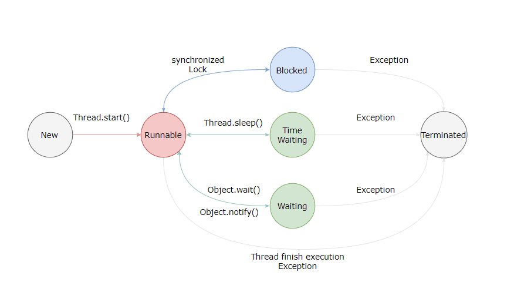
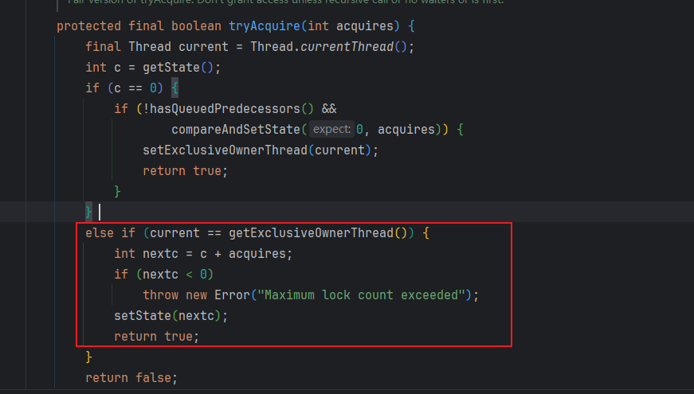
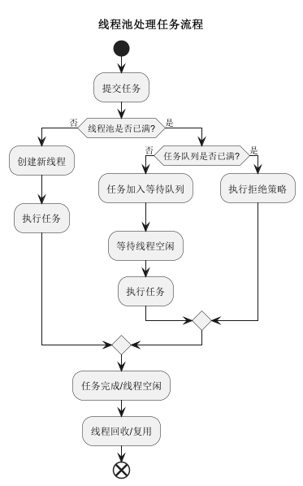
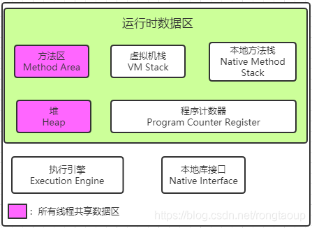
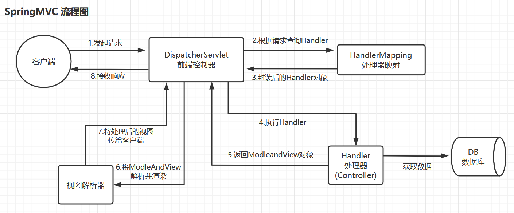
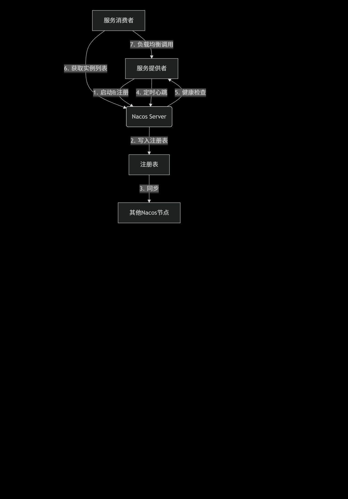

## Java基础

### 面向对象的三大特性

1. 封装：将数据和操作数据的方法封装在一起，隐藏内部实现细节。
2. 继承：允许一个类继承另一个类的属性和方法，促进代码复用。
3. 多态：允许不同类的对象以相同的方式调用方法，具体实现由对象的实际类型决定。

### Java的基本数据类型

Java的基本数据类型包括：

- 整数类型：`byte`, `short`, `int`, `long`
- 浮点类型：`float`, `double`
- 字符类型：`char`
- 布尔类型：`boolean`

### Java的基础类型和包装类型区别

1. 基本类型有默认值，而包装类型默认为null。
2. 包装类型可以用于泛型和集合，而基本类型不能。
3. 包装类型是对象，具有方法和属性，而基本类型是原始数据
4. `基本数据类型的局部变量`存放在jvm的局部变量表中，而`包装类型的局部变量`存放在堆中。

### Java的包装类型的封箱和拆箱

- 装箱：将基本类型⽤它们对应的引⽤类型包装起来,实际是调用了xxxValueOf方法；
    - 例如：`int a = 10; Integer b = Integer.valueOf(a);`
- 拆箱：将包装类型转换为基本数据类型,实际是调用了xxxValue方法；
    - 例如：`Integer b = Integer.valueOf(10); int a = b.intValue();`

### Java的包装类型的缓存机制

* **`Byte`**: 缓存范围是 **-128 到 127**。
* **`Short`**: 缓存范围是 **-128 到 127**。
* **`Integer`**: 缓存范围是 **-128 到 127**。
* **`Long`**: 缓存范围是 **-128 到 127**。
* **`Character`**: 缓存范围是 **0 到 127** (即 ASCII 字符范围)。
* **`Boolean`**: 缓存了 `TRUE` 和 `FALSE` 两个常量对象。

**`Float` 和 `Double` 没有缓存机制。** 这是因为浮点数没有固定且精确的有限范围，并且浮点数的比较涉及精度问题，缓存会带来额外的复杂性且收益不大。

* **性能优化：** 减少了频繁创建小整数、字符和布尔值对象的开销，尤其是在大量使用这些值的情况下。
* **内存节省：** 避免了为相同的小值重复创建对象，从而降低了内存占用。

#### 缓存机制是如何工作的

当你在以上缓存范围内的值进行**自动装箱**（例如 `Integer i = 100;`）时，JVM 会执行以下步骤：

1. **检查缓存：** 它会首先检查内部缓存中是否已经存在一个表示该值的对象。
2. **返回引用：** 如果存在，JVM 会直接返回该对象的引用，而不是创建一个新的 `Integer` 对象。
3. **创建新对象：** 如果缓存中不存在该值，或者该值超出了缓存范围，JVM 才会创建新的对象。对于 `Integer`、`Byte` 等类型，这通常通过调用
   `valueOf()` 方法来实现，而 `valueOf()` 方法内部就包含了缓存逻辑。

```java
public class WrapperCacheExample {
    public static void main(String[] args) {
        // Integer 缓存示例
        Integer a = 100; // 自动装箱，100 在缓存范围内
        Integer b = 100;
        System.out.println("Integer 100 == 100: " + (a == b)); // true，因为它们引用同一个缓存对象

        Integer c = 200; // 自动装箱，200 超出缓存范围
        Integer d = 200;
        System.out.println("Integer 200 == 200: " + (c == d)); // false，因为它们是不同的对象

        // Character 缓存示例
        Character ch1 = 'a'; // 自动装箱，'a' 的 ASCII 值在缓存范围内
        Character ch2 = 'a';
        System.out.println("Character 'a' == 'a': " + (ch1 == ch2)); // true

        Character ch3 = '€'; // 自动装箱，欧元符号的 Unicode 值通常超出 127
        Character ch4 = '€';
        System.out.println("Character '€' == '€': " + (ch3 == ch4)); // false

        // Boolean 缓存示例
        Boolean bool1 = true; // 自动装箱，true 缓存
        Boolean bool2 = true;
        System.out.println("Boolean true == true: " + (bool1 == bool2)); // true
    }
}
```

### 重载和重写的区别

1. **定义**：
    - **重载（Overloading）**：同一个类中，方法名相同但参数列表不同（参数类型、数量或顺序不同）。
    - **重写（Overriding）**：子类重新定义父类中的方法，方法名、返回类型和参数列表都必须相同。
2. **目的**：
    - **重载**：提供多种方式来调用同一方法，增强代码
    - **重写**：实现多态性，允许子类提供特定的实现。
3. **编译时和运行时**：
    - **重载**：在编译时决定调用哪个方法（静态绑定）。
    - **重写**：在运行时决定调用哪个方法（动态绑定）。
4. **参数**：
    - **重载**：参数列表必须不同（类型、数量或顺序）。
    - **重写**：参数列表必须完全相同。
5. **返回类型**：
    - **重载**：可以有不同的返回类型。
    - **重写**：返回类型必须相同或是父类返回类型的

### 静态方法为什么不能被重写

静态方法不能被重写的原因是因为静态方法属于类而不是实例。它们在编译时就已经确定了调用哪个方法，
而不是在运行时根据对象的实际类型来决定。因此，静态方法的调用是基于引用类型而不是对象类型。

### 静态方法为什么不能调用非静态方法

静态方法不能直接调用非静态方法，因为非静态方法依赖于实例对象的状态，而静态方法属于类本身，不依赖于任何实例对象。
在静态方法中没有 `this` 引用，因此无法访问非静态方法和属性。

### 接口和抽象类的区别

1. **定义**：
    - **接口（Interface）**：只包含方法的声明，没有方法的实现。可以包含常量。
    - **抽象类（Abstract Class）**：可以包含方法的声明和部分实现，也可以包含常量和实例变量。
2. **继承**：
    - **接口**：一个类可以实现多个接口（多重继承）。
    - **抽象类**：一个类只能继承一个抽象类（单继承）。
3. **方法实现**：
    - **接口**：所有方法默认是 `public` 和 `abstract`，从 Java 8 开始可以有默认方法（`default`）和静态方法。
    - **抽象类**：可以有 `public`、`protected` 和 `private` 方法，可以有具体方法的实现。
4. **构造函数**：
    - **接口**：没有构造函数，因为接口不能被实例化。
    - **抽象类**：可以有构造函数，可以被实例化为子类的对象。
5. **字段**：
    - **接口**：只能包含 `public static final` 常量。
    - **抽象类**：可以包含实例变量，可以有不同的访问修饰符。
6. **使用场景**：
    - **接口**：适用于定义一组行为或功能，强调的是能力和契约。
    - **抽象类**：适用于定义一组相关的类，强调的是共享的状态和行为。

### 深拷贝和浅拷贝的区别

1. **定义**：
    - **浅拷贝（Shallow Copy）**：创建一个新对象，但只复制对象的引用，对于引用类型的属性，仍然指向原对象的内存地址。
    - **深拷贝（Deep Copy）**：创建一个新对象，并递归地复制所有属性，包括引用类型的属性，确保新对象和原对象完全独立。
2. **内存分配**：
    - **浅拷贝**：新对象和原对象共享引用类型属性的内存地址。
    - **深拷贝**：新对象和原对象的所有属性都在不同的内存地址上，完全独立。
3. **影响**：
    - **浅拷贝**：修改新对象的引用类型属性会影响原对象，因为它们指向同一内存地址。
    - **深拷贝**：修改新对象的引用类型属性不会影响原对象，因为它们有各自独立的内存地址。
4. **实现方式**：
    - **浅拷贝**：通常使用 `clone()` 方法或构造函数来实现。
    - **深拷贝**：可以通过序列化和反序化、手动复制每个属性或使用第三方库（如 Apache Commons Lang 的 `SerializationUtils`
      ）来实现。

### Object类的常用方法

- `equals(Object obj)`：比较两个对象是否相等。
- `hashCode()`：返回对象的哈希码，用于哈希表等数据结构。
- `toString()`：返回对象的字符串表示形式。
- `getClass()`：返回对象的运行时类。
- `clone()`：创建并返回对象的一个副本（浅拷贝）。
- `finalize()`：在垃圾回收前调用，用于清理资源（不推荐使用）。
- `notify()`：唤醒在此对象监视器上等待的单个线程。
- `notifyAll()`：唤醒在此对象监视器上等待的所有线程。
- `wait()`：使当前线程等待，直到其他线程调用 `notify()` 或 `notifyAll()` 方法。
- `wait(long timeout)`：使当前线程等待，直到其他线程调用 `notify()` 或 `notifyAll()` 方法，或等待超时。
- `wait(long timeout, int nanos)`：使当前线程等待，直到其他线程调用 `notify()` 或 `notifyAll()` 方法，或等待超时和纳秒。
- `getClassLoader()`：返回加载此类的类加载器。
- `getClass()`: 返回对象的运行时类。

### 为什么重写`equals`方法时也要重写`hashCode`方法

重写 `equals` 方法时也要重写 `hashCode` 方法的原因是：
hashcode的应用场景一般是在基于哈希的集合中（如 `HashMap`, `HashSet` 等）

1. **一致性**：如果两个对象通过 `equals` 方法被认为是相等的，那么它们的 `hashCode` 方法也必须返回相同的哈希码。
2. **哈希表的正确性**：在使用哈希表（如 `HashMap`）等数据结构时，哈希码用于定位对象的位置。如果两个相等的对象具有不同的哈希码，可能导致哈希表无法正确找到或存储对象。
3. **性能优化**：哈希码可以加速对象的查找和比较操作。如果 `equals` 方法被重写而 `hashCode`
   方法没有被重写，可能会导致哈希表的性能下降，因为相等的对象可能会被分配到不同的桶中。

> 只重写 hashCode() 不重写 equals()，会把你的对象在基于哈希的集合里搞得一团糟，表现出来就是：
> HashSet 会莫名其妙出现看似“重复”的元素
> HashMap 用对象当 key 时会发生键丢失、覆盖失败、取值失败等诡异问题

> 只重写 equals()，不重写 hashCode()，哈希集合会把你的对象“找不到”。表现出来就是：
> HashSet 里明明有对象，你用同内容但不同实例再加一次，它还会再加（去重失败）
> HashMap 用对象当 key，你计算得到的值永远取不出来
> 明明 equals 返回 true，HashMap 甚至不认为这是同一个 key

### equal和`==`的区别，及比较的类型

1. 基本类型比较
   ==: 当用于基本数据类型（如int, char, boolean等）时，==比较的是它们的值是否相等。
2. 引用类型比较
    - ==: 当用于引用类型（如对象、数组）时，==比较的是两个对象的引用是否指向堆内存中的同一个地址，也就是说，它们是否是同一个对象的实例。即使两个对象的内容完全相同，但如果它们是在内存中的不同位置创建的，==也会判断为不相等。
    - equals(): equals()方法默认的行为同样是比较对象的引用是否相同，但是很多类（如String, Integer等）都重写了equals()
      方法，使其比较的是对象的内容是否相等，而不是引用是否相同。这意味着，对于这些类的实例，如果你使用equals()
      来比较，它会检查两个对象的内容（比如字符串的字符序列，Integer的值等）是否相等。

### String, StringBuffer, StringBuilder的区别

| 特性      | `String`         | `StringBuffer`             | `StringBuilder` |
|---------|------------------|----------------------------|-----------------|
| 是否可变    | ❌ 不可变（**final**） | ✅ 可变                       | ✅ 可变            |
| 线程安全    | ✅ 线程安全（**加锁**）   | ✅ 线程安全（方法加 `synchronized`） | ❌ 非线程安全         |
| 性能（单线程） | 最差（每次操作新建对象）     | 较差（加锁带来开销）                 | 最快（无锁、原地操作）     |
| 使用场景    | 小量字符串、不频繁修改      | 多线程环境中字符串频繁修改              | 单线程环境中字符串频繁修改   |

### String为什么不可变

因为String 被final修饰，不能被继承，
所以String类的实例一旦创建就不能被修改。不可变字符串的设计有以下几个好处：

1. 安全性：防止被串改，导致攻击
2. 线程安全
3. 性能优化：字符串常量池，避免重复创建相同内容的字符串对象
4. 内存优化：不可变字符串可以被共享，减少内存占用
5. 作为HashMap的key时，保证hash值不变

### String s1=new String("abc")创建了几个字符串对象

> **最多创建了 2 个对象**，分别是：
>
> 1. 字符串常量 `"abc"`（在字符串常量池中）
> 2. 通过 `new` 创建的堆内存中的一个 `String` 对象（内容是 `"abc"` 的副本）

| 表达式                             | 常量池中对象   | 堆中对象 | 说明         |
|---------------------------------|----------|------|------------|
| `String s = "abc";`             | 1        | 0    | 只创建常量池对象   |
| `String s = new String("abc");` | 1（如果未存在） | 1    | 最多创建 2 个对象 |

### 什么是反射，反射的作用

反射是指在运行时动态地获取类的信息（如类名、方法、字段等）
以及操作类的实例（如调用方法、修改字段值等）的能力。Java中的反射机制允许程序在运行时检查和操作类的结构。

反射的作用包括：

1. **动态加载类**：可以在运行时加载类，而不需要在编译时确定类的类型。
2. **获取类的信息**：可以获取类的名称、方法、字段、构造函数等信息。
3. **动态调用方法**：可以在运行时调用类的方法，而不需要在编译时确定方法的名称和参数。
4. **修改字段值**：可以在运行时修改类的字段值，即使这些字段是私有的。
5. **实现通用框架**：反射可以用于实现通用的框架和库，如依赖注入、ORM（对象关系映射）等。

### 什么是SPI，以及SPI的作用

SPI（Service Provider Interface）是一种服务提供者接口的机制，用于在Java中实现模块化和插件化。它允许开发者定义一组接口，并让其他模块或库提供这些接口的具体实现。
SPI的作用包括：

1. **模块化设计**：通过SPI，可以将应用程序分成多个模块，每个模块可以独立开发和测试。
2. **插件化架构**：允许第三方开发者提供插件，实现特定功能，而不需要修改主应用程序代码。
3. **解耦合**：SPI使得应用程序的核心逻辑与具体实现解耦，便于替换和扩展。
4. **动态加载**：可以在运行时动态加载和使用服务提供者的实现，而不需要在编译时确定具体的实现类。
5. **增强可维护性**：通过SPI，可以轻松添加、删除或替换服务提供者的实现，而不影响主应用程序的代码。

### 序列化的作用

| 作用         | 说明                          |
|------------|-----------------------------|
| ✅ 网络传输     | 对象在网络上传输前必须变成字节流，比如 RPC、RMI |
| ✅ 本地持久化    | 将对象写入文件/数据库，如缓存或快照          |
| ✅ 分布式系统通信  | 多个服务之间传输数据对象时使用序列化          |
| ✅ 跨 JVM 使用 | 不同 JVM 间共享数据或调用服务时使用        |

### 为什么不推荐JDK自带的序列化

| 问题点    | 说明                              |
|--------|---------------------------------|
| ❌ 体积大  | 带有很多类结构信息（类名、字段、继承结构等），**数据臃肿** |
| ❌ 性能差  | 序列化/反序列化速度慢，**不适合高并发场景**        |
| ❌ 不跨语言 | 只能在 Java 内部使用，**无法与其他语言交互**     |
| ❌ 可读性差 | 序列化后的数据是二进制，不可读，不便调试            |
| ❌ 不灵活  | 对象结构一旦改变（加字段、删字段），**兼容性差**，容易出错 |
| ❌ 安全隐患 | 反序列化可被攻击（如反序列化漏洞、反射攻击）          |

## Java的集合

### Java集合的常见类型

- List：
    - ArrayList: 动态数组实现，支持随机访问，适合频繁读取。
    - LinkedList: 双向链表实现，支持高效的插入和删除操作，适合频繁修改。
    - Vector: 线程安全的动态数组实现，性能较低，已不推荐使用。
    - Stack: 继承自 Vector，表示后进先出（LIFO）的栈结构，已不推荐使用。
- Set:
    - HashSet: 基于哈希表实现，元素唯一，无序。
    - LinkedHashSet: 基于哈希表和链表实现，元素唯一，保持插入顺序。
    - TreeSet: 基于红黑树实现，元素唯一，按自然顺序或指定比较器排序。
- Map:
    - HashMap: 基于哈希表实现，键值对存储，键唯一，无序。key可以为null
    - LinkedHashMap: 基于哈希表和链表实现，键值对存储，键唯一，保持插入顺序。
    - TreeMap： 基于红黑树实现，键值对存储，键唯一，按自然顺序或指定比较器排序。
    - Hashtable： 基于哈希表实现，线程安全，键值对存储，键唯一，无序。key不可以为null
    - ConcurrentHashMap： 基于分段锁的哈希表实现，线程安全，键值对存储，键唯一，无序。key不可以为null
- Queue:
    - PriorityQueue： 基于优先级堆实现，元素按优先级排序，允许重复元素。
    - LinkedList（也可以作为队列使用）： 双向链表实现，支持队列操作（FIFO）。
    - ArrayDeque： 基于动态数组实现的双端队列，支持队列和栈操作。

### ArrayList能否存放null

是的，`ArrayList` 可以存放 `null` 值。`ArrayList` 是一个动态数组实现的集合类，它允许存储 `null` 元素。你可以在 `ArrayList`
中添加多个 `null` 值，或者将某个索引位置的元素设置为 `null`。

### ArrayList和LinkedList的区别

| 特性       | ArrayList      | LinkedList         |
|----------|----------------|--------------------|
| 存储结构     | 动态数组（基于数组实现）   | 双向链表（基于节点实现）       |
| 随机访问性能   | 快速（O(1)）       | 慢（O(n)），需要遍历链表     |
| 插入和删除性能  | 慢（O(n)），需要移动元素 | 快（O(1)），只需修改指针     |
| 内存使用     | 内存连续，空间利用率高    | 内存不连续，每个节点有额外的指针开销 |
| 线程安全     | 非线程安全（需要手动同步）  | 非线程安全（需要手动同步）      |
| 适用场景     | 频繁读取，少量插入和删除操作 | 频繁插入和删除操作，较少读取操作   |
| 是否支持null | 可以存放 null 值    | 可以存放 null 值        |

### ArrayList的扩容机制

`ArrayList` 的扩容机制是当添加元素时，如果当前数组的容量不足以容纳新元素，`ArrayList` 会自动扩容。具体过程如下：

1. **检查容量**：当添加新元素时，首先检查当前数组的长度是否小于 `size`（当前元素数量）。
2. **扩容**：如果容量不足，`ArrayList` 会创建一个新的数组，通常是当前容量的 1.5 倍
3. **复制元素**：将原数组中的元素复制到新数组中。
4. **更新引用**：将 `ArrayList` 的内部数组引用指向新数组。
5. **添加新元素**：将新元素添加到新数组的末尾。
6. **更新大小**：更新 `size` 属性，表示当前元素数量。
7. **释放旧数组**：原数组会被垃圾回收器回收（如果没有其他引用指向它）。

### HashMap,Hashtable,ConcurrentHashMap的区别

| 特性            | HashMap                                        | Hashtable                                      | ConcurrentHashMap          |
|---------------|------------------------------------------------|------------------------------------------------|----------------------------|
| 是否线程安全        | ❌ 非线程安全                                        | ✅ 线程安全（使用同步方法）                                 | ✅ 线程安全（使用分段锁）              |
| 是否允许 null 键或值 | ✅ 允许 null 键和 null 值                            | ❌ 不允许 null 键和 null 值                           | ❌ 不允许 null 键和 null 值       |
| 性能            | 较快（无锁）                                         | 较慢（锁竞争）                                        | 较快（分段锁，减少锁竞争）              |
| 初始容量和负载因子     | 可设置初始容量和负载因子（默认 16 和 0.75）                     | 可设置初始容量和负载因子（默认 11 和 0.75）                     | 可设置初始容量和负载因子（默认 16 和 0.75） |
| 遍历方式          | 使用迭代器遍历，可能抛出 `ConcurrentModificationException` | 使用迭代器遍历，可能抛出 `ConcurrentModificationException` | 使用迭代器遍历，线程安全，不抛出异常         |
| 键值对存储方式       | 基于哈希表实现，允许重复键（覆盖旧值）                            | 基于哈希表实现，允许重复键（覆盖旧值）                            | 基于分段哈希表实现，允许重复键（覆盖旧值）      |
| 适用场景          | 单线程或少量线程环境，快速查找和插入                             | 多线程环境，线程安全但性能较低                                | 多线程环境，性能较高，适合高并发场景         |

### ConcurrentHashMap 扩容如何保证线程安全

`ConcurrentHashMap` 通过精妙的设计在扩容时保证了线程安全，它主要依赖以下几个机制：

1. **分段锁（Java 7 及以前）/ CAS + synchronized (Java 8 及以后)**：
    * **Java 7 及以前的版本**：`ConcurrentHashMap` 采用了分段锁（`Segment`）的机制。每个 `Segment` 都是一个独立的锁，负责管理一部分数据。当需要对某个
      `Segment` 进行扩容时，只会锁住当前 `Segment`，而不会影响其他 `Segment` 的操作，从而实现了并发。扩容时，新的元素会插入到新的
      `Segment` 中，旧的 `Segment` 也会逐渐迁移到新的 `Segment`。
    * **Java 8 及以后的版本**：`ConcurrentHashMap` 摒弃了分段锁，转而使用 **CAS（Compare-And-Swap）操作和 `synchronized` 关键字
      **。在扩容时，它会通过 `CAS` 操作尝试设置一个 `sizeCtl`
      字段，表示有线程正在进行扩容。如果设置成功，则由该线程负责扩容。其他线程在访问到正在扩容的哈希桶时，会协助进行数据迁移，或者等待扩容完成。当涉及到具体链表或红黑树的操作时，会使用
      `synchronized` 关键字锁定当前节点，保证了操作的原子性。

2. **“懒惰”扩容与协助扩容**：
    * `ConcurrentHashMap` 的扩容并不是一次性完成的，而是一个渐进的过程。当某个线程检测到需要扩容时（例如，某个哈希桶的链表过长或红黑树节点过多），它会启动扩容过程。
    * 在扩容过程中，旧的哈希表中的元素会逐步迁移到新的哈希表中。
    * 其他线程在访问 `ConcurrentHashMap` 时，如果发现某个哈希桶正在进行迁移（通过 `ForwardingNode` 标记），它们会主动协助完成该桶的迁移工作。这种
      **协助扩容**的机制大大加快了扩容的速度，并且减少了对其他操作的阻塞时间。

3. **ForwardingNode 标记**：
    * 在扩容过程中，旧的哈希桶中已经迁移完成的槽位会被标记为一个特殊的节点 `ForwardingNode`。
    * 当其他线程访问到这个 `ForwardingNode` 时，它们就知道该槽位的元素已经被迁移到了新的哈希表中，然后会转发到新的哈希表进行查找，避免了在旧哈希表中进行无效的查找。

4. **无锁读操作**：
    * `ConcurrentHashMap` 的读操作在大多数情况下是无需加锁的。由于写入操作的内存可见性保证，读操作可以直接读取最新的数据。即使在扩容过程中，读操作也能通过
      `ForwardingNode` 机制找到正确的数据位置。

5. **内存模型保证**：
    * `ConcurrentHashMap` 内部使用了 `volatile` 关键字和 `final` 关键字，以及底层的 `Unsafe` 类提供的 `CAS` 操作，这些都利用了
      Java 内存模型（JMM）的 happens-before 规则，确保了多线程之间对共享变量的可见性和有序性。

### HashMap的扩容过程

1. **触发扩容**：当 `HashMap` 中的元素数量超过当前容量与加载因子（load factor）的乘积时，触发扩容操作。默认加载因子为 0.75。
2. **计算新容量**：新容量通常是当前容量的两倍。如果当前容量为 16，则新容量为 32。
3. **创建新数组**：创建一个新的数组，大小为新容量。
4. **重新哈希和迁移元素**：
    - 遍历旧数组中的每个桶（bucket）。
    - 对于每个非空桶，遍历其中的链表或红黑树节点。
    - 重新计算每个元素在新数组中的位置（索引），并将其插入到新数组的相应位置。
    - 如果链表长度超过阈值（默认是 8），且新数组的长度大于等于 64，则将链表转换为红黑树以提高查找效率。
5. **更新引用**：将 `HashMap` 的内部数组引用指向新数组，完成扩容过程。
6. **释放旧数组**：旧数组会被垃圾回收器回收（如果没有其他引用指向它）。

### HashMap的底层实现（JDK1.7和JDK1.8）

| 特性       | JDK 1.7       | JDK 1.8                 |
|----------|---------------|-------------------------|
| 数据结构     | 数组 + 链表（链地址法） | 数组 + 链表 + 红黑树（链表过长转红黑树） |
| 头插 or 尾插 | 头插法（新节点放在前面）  | 尾插法（保持原顺序，利于树化）         |
| 哈希冲突处理方式 | 链地址法（单向链表）    | 链地址 + 树化优化              |
| 线程安全     | ❌ 不安全         | ❌ 不安全                   |
| 容量默认     | 16            | 16                      |
| 加载因子     | 0.75          | 0.75                    |
| 触发树化条件   | 无             | 链表长度 > 8 且数组长度 ≥ 64     |

### HashMap的key可以为null吗，为什么CurrentHashMap的key不可以为null

`HashMap` 的 key 可以为 `null`，而 `ConcurrentHashMap` 的 key 不可以为 `null`。

1. **HashMap 的 key 可以为 null**
   在 Java 的 `HashMap` 中，允许将 `null` 作为键（key）。这是因为 `HashMap` 的内部实现明确支持 `null` 键的存储和处理：
    - 当插入 `null` 键时，`HashMap` 会将其存储在哈希表的索引 0 处（即 `table[0]`）。
    - `HashMap` 的 `put` 方法在处理 `null` 键时有专门的逻辑，确保 `null` 键能够被正确存储和检索。
    - 由于 `HashMap` 是非线程安全的，它的设计更注重灵活性和简单性，因此允许 `null` 键和值以便于更广泛的使用场景。
2. **ConcurrentHashMap 的 key 不可以为 null**
   `ConcurrentHashMap` 是线程安全的哈希表实现，设计上不允许 `null` 键（也不允许 `null` 值）。原因如下：
    - **线程安全性和一致性**：`ConcurrentHashMap` 为了保证线程安全，采用了分段锁（在 Java 8 及以上是 CAS 和 `synchronized`
      机制）来管理并发访问。如果允许 `null` 键，会增加复杂性，因为 `null` 键需要特殊的处理逻辑，可能导致并发场景下出现不一致或难以调试的问题。
    - **语义清晰性**：`ConcurrentHashMap` 的设计目标是高并发环境下的高效性和可靠性。`null` 键可能会引发歧义（例如，
      `get(key)` 返回 `null` 可能是键不存在，也可能是键存在但值是 `null`），这在并发环境中会增加开发者的心智负担。
    - **内部实现限制**：`ConcurrentHashMap` 的哈希计算和分段机制假设键是非空的。允许 `null` 键需要额外的检查和特殊处理，这会降低性能并增加代码复杂性。

### HashMap的put方法的过程

1. **处理空键（null key）**：
    - 如果传入的键是 `null`，`HashMap` 会特殊处理，将键值对存储在哈希表的索引 0 处（`table[0]`）。
    - 否则，调用键的 `hashCode()` 方法，并通过内部的 `hash()` 方法对哈希值进行扰动（优化哈希分布，减少冲突）。

2. **计算存储位置**：
    - 使用计算得到的哈希值，通过 `(n - 1) & hash` 确定键值对在哈希表数组（`table`）中的索引位置，其中 `n` 是数组长度。
    - 这一步确保哈希值均匀分布到数组的各个桶（bucket）中。

3. **检查哈希表是否需要初始化或扩容**：
    - 如果哈希表数组（`table`）为 `null` 或为空，调用 `resize()` 方法初始化数组（默认初始容量为 16）。
    - 如果当前键值对的插入会导致 `HashMap` 的元素数量超过阈值（`threshold = capacity * loadFactor`），则调用 `resize()`
      方法扩容（通常容量翻倍）。

4. **处理桶中的冲突**：
    - 根据计算得到的索引，找到对应的桶（`table[i]`）。桶中可能有以下情况：
        - **桶为空**：直接创建一个新节点（`Node`），将键值对插入该桶。
        - **桶不为空**：
            - 如果桶中是单个节点（非链表或红黑树），比较键是否相等（通过 `equals` 方法）：
                - 如果键相等，更新该节点的值（覆盖旧值）。
                - 如果键不相等，创建一个新节点，追加到链表尾部。
            - 如果桶中是链表（多于一个节点），遍历链表：
                - 如果找到相同的键，更新值。
                - 如果没有找到，追加新节点到链表尾部。
            - 如果桶中是红黑树（Java 8 引入，当链表长度超过 8 且数组容量足够时，链表转为红黑树）：
                - 调用红黑树的插入逻辑（`putTreeVal`）插入或更新键值对。
    - 如果链表长度达到 8 且数组容量大于等于 64，调用 `treeifyBin` 将链表转换为红黑树。

5. **更新 size 和 modCount**：
    - 插入新键值对后，`HashMap` 的 `size`（元素数量）加 1。
    - `modCount`（修改计数器）加 1，用于检测并发修改（在迭代器中使用）。
    - 如果 `size` 超过阈值，触发 `resize()` 扩容。

6. **返回旧值**：
    - 如果键已存在，返回旧值（`oldValue`）；否则返回 `null`。

## Java并发

### 线程和进程的区别

进程：运行一个 Java 程序（java MyApp）会启动一个 JVM 进程，包含独立的堆和栈。
线程：在 Java 中，通过 Thread 类或 Runnable 接口创建线程，多个线程共享同一 JVM 进程的堆内存。

### 并发和并行的区别

并发：指在同一时间段内，多个任务交替执行，看起来像是“同时”进行，但实际上可能是在单个处理器上通过时间片轮转（time-slicing）实现的。
并行：指多个任务在同一时刻真正同时执行，通常依赖多核处理器或分布式系统，每个任务在独立的处理器或核心上运行。

### 同步和异步的区别

同步：任务按顺序执行，调用方必须等待当前任务完成才能继续执行后续操作。
异步：任务发起后，调用方无需等待任务完成，可以立即执行后续操作，任务结果通常通过回调、事件或轮询获取。

### Java的线程创建方式

1. **继承 Thread 类**：创建一个新的类继承自 `Thread`，重写 `run()` 方法，然后创建该类的实例并调用 `start()` 方法。
   ```java
   class MyThread extends Thread {
       public void run() {
           System.out.println("Thread is running");
       }
   }
   MyThread thread = new MyThread();
   thread.start();
   ```
2. **实现 Runnable 接口**：创建一个实现 `Runnable` 接口的类，重写 `run()` 方法，然后将该类的实例传递给 `Thread` 的构造函数。
   ```java
   class MyRunnable implements Runnable {
       public void run() {
           System.out.println("Thread is running");
       }
   }
   Thread thread = new Thread(new MyRunnable());
   thread.start();
   ```
3. **使用 Lambda 表达式**（Java 8 及以上）：如果 `run()` 方法没有参数，可以使用 Lambda 表达式简化代码。
   ```java
    Thread thread = new Thread(() -> System.out.println("Thread is running"));
    thread.start();
   ```
4. **实现callable接口,最终提交给线程池**：通过 `ExecutorService` 创建线程池，提交任务执行。

::: tip
本质上，最终启动线程的都是new Thread().start()方法，只是通过不同的方式传入了run方法。
:::

### Callable和Runnable的区别

| 特性     | `Runnable`                    | `Callable`                     |
|--------|-------------------------------|--------------------------------|
| 返回值    | 无返回值（`void`）                  | 有返回值（可以指定类型）                   |
| 抛出异常   | 不能抛出检查异常（`checked exception`） | 可以抛出检查异常（`checked exception`）  |
| 线程执行方式 | 通过 `Thread` 类或线程池执行           | 通过 `ExecutorService` 执行，支持异步处理 |
| 使用场景   | 适用于不需要返回结果的任务（如事件处理、日志记录等）    | 适用于需要返回结果或可能抛出异常的任务（如计算、IO操作等） |

### 线程的状态转换



|        线程状态        |                                                       导致状态发生条件                                                        |
|:------------------:|:---------------------------------------------------------------------------------------------------------------------:|
|      NEW(新建)       |                                              线程刚被创建，但是并未启动。还没调用start方法。                                               |
|   Runnable(可运行)    |                                 线程可以在java虚拟机中运行的状态，可能正在运行自己代码，也可能没有，这取决于<br/>操作系统处理器                                  |
|    Blocked(锁阻塞)    |                     当一个线程试图获取一个对象锁，而该对象锁被其他的线程持有，则该线程进入Blocked状<br/>态；当该线程持有锁时，该线程将变成Runnable状态。                      |
|   Waiting(无限等待)    |            一个线程在等待另一个线程执行一个（唤醒）动作时，该线程进入Waiting状态。进入这个<br/>状态后是不能自动唤醒的，必须等待另一个线程调用notify或者notifyAll方法才能够唤醒            |
| TimedWaiting(计时等待) | 同waiting状态，有几个方法有超时参数，调用他们将进入Timed Waiting状态。<br/>这一状态将一直保持到超时期满或者接收到唤醒通知。带有超时参数的常用方法有Thread.sleep ,<br/>Object.wait。 |
|   Teminated(被终止)   |                                        因为run方法正常退出而死亡，或者因为没有捕获的异常终止了run方法而死亡。                                         |

### 线程间通信的方式

线程间通信的方式主要有以下几种：

1. 共享内存:
    - 通过共享变量（如实例变量、静态变量）实现线程间的数据交换。
    - 使用 `volatile` 关键字保证变量的可见性。
2. `wait()` 和 `notify()` 方法:
    - 在 `Object` 类中定义的 `wait()`、`notify()` 和 `notifyAll()` 方法用于线程间的协作。
    - 一个线程可以调用 `wait()` 方法进入等待状态，直到其他线程调用 `notify()` 或 `notifyAll()` 方法唤醒它。
    - 这些方法必须在 `synchronized` 块或方法中调用，以确保线程安全。
3. java.util.concurrent 包中的工具如`CountDownLatch`:
    - `CountDownLatch` 是一个同步辅助类，允许一个或多个线程等待直到一组操作完成。
    - 通过调用 `countDown()` 方法减少计数，当计数为 0 时，等待的线程将被唤醒。
4. join() 方法:
    - `Thread.join()` 方法使当前线程等待另一个线程完成。
    - 当调用 `join()` 的线程执行完毕后，当前线程将继续执行。

### Thread#sleep()和Object#wait()的区别

| 特性      | `Thread.sleep()`                 | `Object.wait()`                                       |
|---------|----------------------------------|-------------------------------------------------------|
| 所属类     | `Thread` 类（静态方法）                 | `Object` 类（实例方法）                                      |
| 是否释放锁   | ❌ **不释放锁**，仍然持有 `synchronized` 锁 | ✅ **释放锁**，进入等待队列                                      |
| 是否必须持有锁 | ❌ 不需要在同步块中调用                     | ✅ **必须**在 `synchronized` 块中使用，否则抛异常                   |
| 唤醒方式    | 时间到自动唤醒或被中断                      | `notify()` / `notifyAll()` / 时间到自动唤醒                  |
| 抛出异常    | `InterruptedException`           | `InterruptedException`、`IllegalMonitorStateException` |
| 目的      | 暂停线程一段时间                         | 等待某个条件或状态发生改变                                         |
| 使用场景    | 延迟执行、定时器、重试间隔                    | 线程协作，如生产者-消费者模型                                       |

### 直接调用run方法和start方法的区别

run() 是线程类的普通方法调用，不会启动新线程，代码在当前线程中顺序执行；
而 start() 是 Thread 类的方法，会真正启动一个新线程，由
JVM 调用 run() 方法执行任务，实现多线程并发。

### volatile关键字

volatile 修饰的变量，每次读写都直接从主内存中操作，保证可见性，但不保证原子性。
在jvm中是通过禁止指令重排序和缓存来实现的。
在底层会在读写操作前后加上内存屏障（Memory Barrier），确保对 volatile 变量的读写操作不会被重排序。

### 乐观锁和悲观锁的区别

| 特性   | 悲观锁（Pessimistic Lock）               | 乐观锁（Optimistic Lock）                |
|------|-------------------------------------|-------------------------------------|
| 锁策略  | 先加锁，防止并发冲突                          | 不加锁，提交时校验是否有冲突                      |
| 并发粒度 | 粒度粗，适合高冲突场景                         | 粒度细，适合读多写少的场景                       |
| 实现机制 | 依赖数据库或 JVM 的**互斥锁机制**               | 依赖版本号（`version`）或 CAS（原子操作）         |
| 阻塞行为 | 线程可能被阻塞                             | 不会阻塞，冲突时重试                          |
| 性能   | 开销大，影响并发性能                          | 性能高，但有可能多次重试导致失败                    |
| 应用场景 | 银行转账、订单扣库存（强一致性要求）                  | 表单编辑、抢票系统（最终一致性、冲突概率低）              |
| 常见实现 | `synchronized`、`ReentrantLock`、DB行锁 | CAS、`AtomicInteger`、版本号字段、数据库字段版本控制 |

### Synchronized可重入的原理

**重入锁是指一个线程获取到该锁之后，该线程可以继续获得其他锁。**
底层原理维护一个计数器，当线程获取该锁时，计数器加一，再次获得该锁时继续加一，释放锁时，计数器减一，当计数器值为0时，表明该锁未被任何线程所持有，其它线程可以竞争获取锁。

### Synchronized的实现原理

synchronized 是基于 JVM 层的 Monitor（监视器锁） 实现的，
通过 对象头中的 Mark Word + Monitor 对象 + 内置锁机制，实现线程间互斥、可重入和同步。

### 锁升级


### volatile和Synchronized的区别

- volatile本质是保证变量的可见性，只能在变量级别使用，synchronize可以在方法，变量，对象上使用
- volatile只能保证变量可见性，不能保证原子下，synchronize可以都保证（只有当前线程能使用，其他线程需要等待）
- volatile会让当前对象会不会被编译器优化，不会进行指令重排序
- volatile不会造成线程阻塞，synchronize会造成线程阻塞

### Synchronized和lock的区别

1.首先**synchronized是java内置关键字**，在jvm层面，**Lock是个java类**；

2.**synchronized无法判断是否获取锁的状态**，**Lock可以判断是否获取到锁**；

3.**synchronized会自动释放锁**(a 线程执行完同步代码会释放锁 ；b 线程执行过程中发生异常会释放锁)，*
*Lock需在finally中手工释放锁（unlock()方法释放锁**），否则容易造成线程死锁；

4.**用synchronized关键字的两个线程1和线程2，如果当前线程1获得锁，线程2线程等待。如果线程1阻塞，线程2则会一直等待下去**，而*
*Lock锁就不一定会等待下去**，如果尝试获取不到锁，线程可以不用一直等待就结束了；

5.**synchronized的锁可重入、不可中断、非公平**，而**Lock锁可重入、可判断、可公平可非公平**（两者皆可）

6.**Lock锁适合大量同步的代码的同步问题，synchronized锁适合代码少量的同步问题**。

### Java中CAS的实现原理

CAS 是一种原子操作机制，Java 中通过 Unsafe 类调用底层 CPU 原子指令（如 CMPXCHG）实现。它通过比较当前值和预期值是否相同来决定是否更新变量，常用于实现无锁的并发类，如
AtomicInteger。虽然 CAS 性能高，但也存在 ABA 问题、自旋浪费等缺点。

### AQS（非阻塞队列）原理

AQS 是 J.U.C（java.util.concurrent）并发包的核心同步框架，用来构建各种同步器（如
ReentrantLock、CountDownLatch、Semaphore），通过一个 基于 FIFO 的 CLH 队列 实现线程的排队等待。

| 组件             | 说明                               |
|----------------|----------------------------------|
| `state`        | 表示同步状态（一个 int），如锁是否被占、计数、许可等     |
| `Node`         | 内部静态类，封装了每个等待线程的信息（线程、等待状态、前驱后继） |
| `CLH 队列`       | FIFO 队列（双向链表），线程获取锁失败后进入该队列      |
| `acquire()`    | 获取同步状态，不成功则排队阻塞等待                |
| `release()`    | 释放锁，唤醒下一个节点的线程                   |
| `tryAcquire()` | 尝试获取锁，由具体实现类重写                   |
| `tryRelease()` | 尝试释放锁，由具体实现类重写                   |

### ReentrantLock的公平锁和非公平锁

- 公平锁指的是 线程A持有锁，BCD在等待队列中，此时新增E线程，当A释放锁的时候，B线程会先获取锁，E会排到队列的最后面。
- 非公平锁指的是 线程A持有锁，BCD在等待队列中，此时新增E线程，
  当A释放锁的时候，B和E线程会同时进行compareAndSetState操作，E线程可能会先获取锁，B线程继续在队列前面等待。

### ReentrantLock和Synchronized的区别

| 特性       | `synchronized`     | `ReentrantLock`          |
|----------|--------------------|--------------------------|
| 实现方式     | JVM 内部实现（monitor）  | JDK 实现（AQS）              |
| 是否可中断    | ❌ 否                | ✅ 支持 lockInterruptibly() |
| 是否公平锁    | ❌ 否（无控制）           | ✅ 可指定公平或非公平              |
| 是否支持条件变量 | ❌ 否（需 wait/notify） | ✅ 支持 Condition，精准唤醒      |
| 是否必须释放锁  | ❌ JVM 自动释放         | ✅ 必须手动 unlock()，易出错      |
| 可重入性     | ✅ 支持               | ✅ 支持                     |

### ReentrantLock的锁的可重入性


在当前线程获取锁时，计数器加一，如果当前线程再次获取锁，计数器继续加一，此时实现了可重入性。

### ReentrantLock的Condition的工作原理

有Condition的时候，此时线程会加入到Condition的等待队列中，等待被唤醒。
被唤醒之后，线程不是立即执行任务，线程会重新加入到AQS的同步队列中，重新竞争锁。

| 关键词         | 内容                                    |
|-------------|---------------------------------------|
| `Condition` | 类似 `Object.wait/notify`，但支持多个条件队列     |
| `await()`   | 当前线程挂起，并释放锁，加入等待队列                    |
| `signal()`  | 唤醒一个等待线程（搬到 AQS 队列重新竞争锁）              |
| 多等待队列       | 支持多个 `Condition`，实现更复杂的同步逻辑           |
| 核心机制        | ConditionQueue + AQS 的 SyncQueue 协同工作 |

### ThreadLocal作用

ThreadLocal 是 Java 提供的一个线程局部变量机制，用于在多线程环境中为每个线程提供独立的变量副本。每个线程可以通过
ThreadLocal
对象访问自己的副本，而不会影响其他线程的副本。
ThreadLocal 的作用包括：

1. **线程隔离**：每个线程都有自己的变量副本，避免了多线程之间的共享数据冲突。
2. **简化代码**：可以避免使用显式的同步机制（如锁）来保护共享数据，减少了代码复杂性。
3. **性能优化**：在某些场景下，ThreadLocal 可以提高性能，因为它避免了锁的开销。
4. **存储线程上下文信息**：可以用于存储与线程相关的上下文信息，如用户会话、数据库连接等。
5. **避免传递参数**：在需要频繁传递相同参数的情况下，可以使用 ThreadLocal 来存储这些参数，减少方法调用的复杂性。

### ThreadLocal的工作原理

ThreadLocal 的工作原理是通过每个线程维护一个 ThreadLocalMap 来存储线程局部变量。每个 ThreadLocal 对象作为 key，
对应的线程局部变量作为 value 存储在 ThreadLocalMap 中。每个线程都有自己的 ThreadLocalMap，
因此每个线程可以独立地访问和修改自己的变量副本。

### ThreadLocal的内存泄漏问题

ThreadLocal虽然key是弱引用，会被gc回收，
但是value是强引用，所以如果ThreadLocal对象没有被清理掉，value就会一直存在，导致内存泄漏。

### 如何跨线程传递ThreadLocal值

可以通过以下方式跨线程传递 ThreadLocal 值：

1. **手动传递**：在需要传递 ThreadLocal 值的线程中，先获取当前线程的 ThreadLocal 值，然后在新线程中设置该值。
2. **使用继承**：创建一个新的 ThreadLocal 子类，重写 `initialValue()` 方法，在新线程中调用父类的 `get()` 方法获取值。
3. **使用 ExecutorService**：在提交任务时，将 ThreadLocal 值作为参数传递给任务，任务内部可以直接使用该值。

### 常见的线程池类型

| 线程池类型                              | 优点                              | 缺点                                                        | 适用场景                      |
|------------------------------------|---------------------------------|-----------------------------------------------------------|---------------------------|
| **固定线程池**<br>FixedThreadPool       | - 线程数量固定，便于控制资源<br>- 线程可复用，效率高  | - 队列是**无界队列**，任务太多可能导致 OOM                                | 稳定并发任务，如文件处理、日志上传等        |
| **单线程池**<br>SingleThreadExecutor   | - 保证任务按顺序执行<br>- 线程复用，资源消耗小     | - 单线程执行，任务慢时会**拖垮所有任务**<br>- 同样使用**无界队列**，易 OOM           | 串行任务，关键任务串行执行             |
| **可缓存线程池**<br>CachedThreadPool     | - 弹性强，短期任务处理能力强<br>- 空闲线程自动释放   | - **最大线程数无限**，并发高峰时可能创建太多线程→ OOM                          | 短时间并发量大，如消息推送、IO密集型任务     |
| **定时任务线程池**<br>ScheduledThreadPool | - 支持**延迟/周期**执行任务               | - 定时任务执行时间不可控，**可能任务堆积**<br>- 非真实时间任务调度（非硬实时）             | 定时轮询、日志归档、心跳检查等           |
| **工作窃取线程池**<br>WorkStealingPool    | - 利用多核优势，支持任务分治<br>- 动态调度、负载均衡好 | - JDK 8+ 才有<br>- 无法控制线程数量<br>- **非显式管理**（ForkJoinPool 内部） | 多核 CPU 密集型并行任务，如图像处理、递归拆分 |

### 为什么不推荐使用内置线程池

- newFixedThreadPool(): 无界队列，任务堆积不拒绝，可能 OOM
- newCachedThreadPool(): 线程池的线程数量没有限制，可能导致系统资源耗尽。无限最大线程数 ➝ OOM 极高风险
- newSingleThreadExecutor(): 只能处理单线程任务，无法利用多核 CPU 的优势。队列无界，任务积压严重 ➝ OOM
- newScheduledThreadPool(): 任务调度不够灵活，无法满足复杂的定时任务需求。长时间堆积任务可能内存泄漏
- newWorkStealingPool(): 需要 JDK 8+，且不支持显式管理线程池。

### 线程池的7大参数

| 参数名称            | 说明                                                                                                | 默认值                              |
|-----------------|---------------------------------------------------------------------------------------------------|----------------------------------|
| corePoolSize    | 核心线程数，线程池中始终保持的线程数量。核心线程会一直存活，除非设置了 allowCoreThreadTimeOut。                                       | 1                                |
| maximumPoolSize | 最大线程数，线程池允许的最大线程数量。超过核心线程数的线程会被回收。                                                                | Integer.MAX_VALUE                |
| keepAliveTime   | 非核心线程的存活时间，当线程空闲超过该时间后会被回收。单位为秒。                                                                  | 60                               |
| unit            | keepAliveTime 的时间单位。可以是 SECONDS、MILLISECONDS 等。                                                   | TimeUnit.SECONDS                 |
| workQueue       | 任务队列，用于存放等待执行的任务。可以是无界队列（如 LinkedBlockingQueue）或有界队列（如 ArrayBlockingQueue）。                       | LinkedBlockingQueue              |
| threadFactory   | 线程工厂，用于创建新线程。可以自定义线程名称、优先级等。                                                                      | Executors.defaultThreadFactory() |
| handler         | 拒绝策略，当线程池和队列都满了时，如何处理新提交的任务。可以是 AbortPolicy、CallerRunsPolicy、DiscardPolicy、DiscardOldestPolicy 等。 | AbortPolicy                      |

### 线程池的拒绝策略

| 拒绝策略名称              | 说明                                                   | 适用场景             |
|---------------------|------------------------------------------------------|------------------|
| AbortPolicy         | 抛出 RejectedExecutionException 异常，默认策略。适用于不允许任务丢失的场景。 | 任务必须被处理，不能丢失或忽略。 |
| CallerRunsPolicy    | 由调用线程处理该任务，当前线程执行任务而不是提交到线程池。适用于任务量较小或可以容忍延迟的场景。     | 任务量小，允许调用线程处理任务。 |
| DiscardPolicy       | 丢弃新提交的任务，不抛出异常。适用于可以容忍任务丢失的场景。                       | 任务不重要，可以丢弃。      |
| DiscardOldestPolicy | 丢弃队列中最旧的任务，然后尝试提交当前任务。适用于可以丢弃旧任务的场景。                 | 任务量大，允许丢弃旧任务。    |

### 线程池处理任务的流程



### 线程池的核心线程数和最大线程数的区别

- 当前已有 2 个核心线程；
- 如果再来任务，先塞进队列（最多 3 个任务）；
- 如果队列也满了，线程池可扩容到最多 5 个线程；
- 超过 5 还是来任务，就会触发拒绝策略。

```java
ThreadPoolExecutor executor = new ThreadPoolExecutor(
        2, // corePoolSize
        5, // maximumPoolSize
        60, TimeUnit.SECONDS,
        new LinkedBlockingQueue<>(3)
);

```

### 线程池中线程异常后是销毁还是复用

如果线程池中执行任务的线程抛出异常，线程会被销毁，不会复用。线程池会根据需要创建新的线程来替代被销毁的线程，以确保线程池中的线程数量保持在核心线程数和最大线程数之间。
但是异常的任务如果被捕获并处理掉，线程不会被销毁，线程池中的线程会继续复用。

### 线程池大小如何设定

IO密集型任务：线程数 = CPU核数 / (1 - 阻塞系数)，阻塞系数一般取0.8~0.9
CPU密集型任务：线程数 = CPU核数 + 1 或 CPU核数 * 2

### 如何动态修改线程池的参数

可以通过 ThreadPoolExecutor 提供的 setCorePoolSize()、setMaximumPoolSize()、setKeepAliveTime() 等方法动态修改线程池的参数。

## JVM

### JVM的内存模型



1. 线程共享区域
    - 堆(heap):线程共享的内存区域，存放对象实例和数组。回收器主要的管理对象,存放新生代和老年代数据,垃圾回收主要就是回收堆。
    - 方法区(Method Area):线程共享的内存区域，存放类信息、常量、静态变量等。也称为永久代(PermGen)或元空间(Metaspace)。
2. 线程独享区域
    - 栈(Stack):每个线程独立的内存区域，存放局部变量、操作数栈、动态链接等。每个方法调用都会创建一个栈帧(Frame)。
    - 本地方法栈(Native Method Stack):存放本地方法调用的栈帧，与 Java 栈类似。
    - 程序计数器(Program Counter Register):每个线程独立的内存区域，记录当前线程执行的字节码指令地址。用于线程切换时恢复执行位置。

### JVM中的类加载过程

1. **加载(Loading)**：将类的字节码从文件或网络加载到内存中，生成一个 Class 对象。
2. **链接(Linking)**：
    - **验证(Verification)**：检查字节码的正确性，确保符合 JVM 规范。
    - **准备(Preparation)**：为类的静态变量分配内存，并设置默认值。
    - **解析(Resolution)**：将类中的符号引用转换为直接引用（如方法、字段等）。
3. **初始化(Initialization)**：执行类的静态初始化块和静态变量的赋值操作，完成类的初始化。
4. **使用(Using)**：类被加载并初始化后，可以被应用程序使用。
5. **卸载(Unloading)**：当类不再被使用时，JVM 可以将其从内存中卸载，释放资源。

### 类加载器(双亲委派)

1. 当AppClassLoader加载一个class时，它首先不会自己去尝试加载这个类，而是把类加载请求委派给父类加载器ExtClassLoader去完成。
2. 当ExtClassLoader加载一个class时，它首先也不会自己去尝试加载这个类，而是把类加载请求委派给BootStrapClassLoader去完成。
3. 如果BootStrapClassLoader加载失败(例如在$JAVA_HOME/jre/lib里未查找到该class)，会使用ExtClassLoader来尝试加载；
4. 若ExtClassLoader也加载失败，则会使用AppClassLoader来加载，如果AppClassLoader也加载失败，则会报出异常ClassNotFoundException。

### 什么时候破坏了双亲委派模型

当一个类加载器在加载类时，直接尝试加载该类，而不通过父类加载器进行委派时，就破坏了双亲委派模型。这通常发生在以下情况：

- **自定义类加载器**：如果自定义类加载器在加载类时，直接调用 `findClass()` 方法，而不先调用
- `loadClass()` 方法，则会破坏双亲委派模型。
- **使用 `defineClass()` 方法**：如果直接使用 `defineClass()` 方法加载类，而不通过父类加载器进行委派，也会破坏双亲委派模型。
- **使用 `Class.forName()` 方法**：如果在自定义类加载器中使用 `Class.forName()` 方法加载类，而不通过父类加载器进行委派，也会破坏双亲委派模型。
- **使用 `Thread.currentThread().getContextClassLoader()`**：如果在加载类时，使用当前线程的上下文类加载器，而不是父类加载器，也会破坏双亲委派模型。

### 如何判断一个对象可以回收

1. 根可达性分析算法：从 GC Roots 开始，遍历对象图，判断哪些对象是可达的。不可达的对象会被回收。
2. 引用计数算法：每个对象维护一个引用计数器，当有引用指向该对象时，计数器加一；当引用被移除时，计数器减一。当计数器为零时，对象可以被回收。此方法无法处理循环引用。

### 垃圾回收算法

1. **标记-清除算法**：分为两个阶段，标记阶段标记所有需要回收的对象，清除阶段清除被标记的对象。缺点是会产生内存碎片。
2. **复制算法**：将内存分为两块，每次只使用一块，复制存活对象到另一块内存中，清除原来的内存。优点是没有内存碎片，但需要额外的内存空间。
3. **标记-整理算法**：类似于标记-清除算法，但在清除阶段将存活对象移动到内存的一端，整理内存空间，避免碎片。

### 垃圾收集器

1. **Serial 收集器**：单线程，适用于单核 CPU 或小型应用，使用标记-清除算法。
2. **Parallel 收集器**：多线程，适用于多核 CPU，使用复制算法，适合大多数应用。
3. **CMS（Concurrent Mark-Sweep）收集器**：并发标记-清除算法，适用于低延迟应用，减少停顿时间，但会产生内存碎片。
4. **G1（Garbage-First）收集器**：分代收集器，适用于大内存应用，使用分区算法，目标是减少停顿时间和内存碎片。
5. **ZGC（Z Garbage Collector）**：低延迟收集器，支持大内存，使用分区算法，目标是几乎无停顿时间。

### JVM中的对象在堆中的生命周期

1. 创建对象的时候会优先放入Eden区，大对象会直接放入老年代（Tenured）
2. 当Eden区满了，触发Minor GC，将存活的对象移动到Survivor区
3. 经过多次Minor GC后(默认15次)，存活的对象会被移动到老年代（Tenured）
4. 当对象在老年代存活时间超过阈值或者不再被引用，可能会被标记为可回收

### 什么时候触发Full GC

1. 老年代空间不足: 对象晋升或分配大对象
2. 系统执行system.gc()或Runtime.getRuntime().gc()请求
3. 元空间不足: 类加载器无法加载新类
4. 新生代GC失败

### 处理线上oom的过程

> 一般出现oom都是大任务的定时任务，excel导出等任务，或者是大数据量的查询等。

1. 导出堆转储文件（Heap Dump），使用 jmap 或 jcmd 命令。
2. 重启应用，避免继续占用内存。
3. 分析dump文件，使用工具如 Eclipse MAT、VisualVM 等。
4. 定位内存泄漏或高内存占用的对象，查看对象引用链。

### CPU高负载处理

1. top 命令查看CPU使用情况，找出高CPU占用的进程。
2. 使用 jstack 命令获取线程堆栈信息，分析线程状态。
3. 使用 profilers（如 YourKit、VisualVM）分析热点方法。
4. 优化代码，减少不必要的计算和循环。

### 内存泄露处理

1. 使用 jmap 命令生成堆转储文件。
2. 使用 Eclipse MAT 等工具分析堆转储文件，查找大量对象和引用链。
3. 定位泄漏源代码，检查对象生命周期和引用关系。
4. 修复代码，确保对象及时释放引用。

## Spring

### Spring的IOC概念及如何实现

IOC(控制反转)是一种设计思想，将对象的创建和管理交给容器来控制，
Spring的IOC容器主要维护bean的生命周期和依赖关系，容器负责非侵入式地管理应用中的对象，简化了编程模型并提高了组件的可重用性
IOC的实现原理是工厂模式加反射机制实现

### Spring的Bean的生命周期

1. 实例化
    - 通过反射创建Bean实例（如newInstance方法，构造器注入）
    - 如果bean存在循环依赖，Spring会将对象放入三级缓存中，其中第三级缓存保存的是能生成`早期代理对象`的工厂（ObjectFactory）
2. 属性填充
    - 通过构造器注入、Setter方法注入或字段注入等方式，将依赖的Bean注入到当前Bean中
    - 如果依赖的Bean尚未初始化，会从三级缓存中获取早期代理对象
    - spring会优先从一级缓存中获取bean，如果一级缓存没有，则从二级缓存获取，如果二级缓存没有，则从三级缓存获取
3. Aware接口回调
    - 如果Bean实现了Aware接口（如BeanNameAware、ApplicationContextAware等），Spring会调用相应的方法进行回调
4. BeanPostProcessor前置处理
    - 调用所有注册的BeanPostProcessor的postProcessBeforeInitialization方法，对Bean进行前置处理
    - AOP的代理对象会在此时创建。主要用过AnnotationAwareAspectJAutoProxyCreator
    - 如果此时Bean被代理会返回一个代理对象，否则返回原始Bean
5. 初始化：此时Bean完全准备好，但是未暴露给外部使用
    - 如果Bean实现了InitializingBean接口，调用afterPropertiesSet方法
    - 如果配置了init-method属性，调用指定的初始化方法
6. BeanPostProcessor后置处理：AOP的代理对象最终会放入一级缓存中
    - 调用所有注册的BeanPostProcessor的postProcessAfterInitialization方法，对Bean进行后置处理
    - 如果是AOP代理对象，Spring会用CGLIB或JDK动态代理创建代理对象
7. Bean就绪：此时Bean已经完全初始化，可以被外部使用
8. 销毁Bean
    - 如果Bean实现了DisposableBean接口，调用destroy方法
    - 如果配置了destroy-method属性，调用指定的销毁方法
    - 销毁时会从一级缓存中移除Bean实例

### Spring的Bean作用域

| 作用域名称         | 关键字             | 描述                                            |
|---------------|-----------------|-----------------------------------------------|
| **单例**        | `singleton`（默认） | 整个 Spring 容器中只创建一个 Bean 实例，所有请求共享同一个实例。       |
| **原型**        | `prototype`     | 每次从容器获取 Bean 时都会创建一个新的实例。                     |
| **请求**        | `request`       | 每次 HTTP 请求创建一个 Bean，仅 Web 环境下有效。              |
| **会话**        | `session`       | 每个用户会话一个 Bean，仅 Web 环境。                       |
| **全局会话**      | `application`   | 所有会话共享一个 Bean，跨 Session，在 Portlet 环境中用到（极少见）。 |
| **WebSocket** | `websocket`     | 每个 WebSocket 会话一个实例。                          |

### Bean是线程安全吗

Spring 不保证 Bean 是线程安全的。默认作用域是 singleton，多个线程共享同一个实例，是否线程安全取决于 Bean 自身的实现。
如果bean中维护了有状态的变量如private int count = 0;，且多个线程同时访问变量count，此时count并非线程安全，需要自己进行同步处理

### BeanFactory和FactoryBean的区别

1. BeanFactory 是SpringIOC容器的核心接口，负责管理Bean的生命周期，
   包括创建，配置，装配和销毁等，常见的有DefaultListableBeanFactory和ApplicationContext等实现类对BeanFactory进行了拓展。
2. FactoryBean 是一个特殊的Bean，它的实现类可以通过getObject()方法返回一个自定义的对象实例，一般用于创建复杂的Bean或第三方库的对象。
   FactoryBean本身也是一个Bean，可以通过配置文件或注解进行定义。如代理对象的创建ProxyFactoryBean,Mybatis
   的SqlSessionFactoryBean等实现。

> FactoryBean的getObject()获取的是自定义的Bean对象，不是FactoryBean本身，提供了更高的灵活性

### BeanFactoryPostProcessor 和BeanPostProcessor的区别

1. BeanFactoryPostProcessor 允许在 Spring 容器加载 Bean 定义（BeanDefinition）后、实例化 Bean 之前，修改 Bean
   定义的元数据（如属性、作用域等）。
   操作的是BeanDefinition，影响的是 Bean 的创建过程。
2. BeanPostProcessor 则允许在 Bean 实例化后、初始化前，对 Bean 进行修改或增强（如 AOP 代理）。注入额外的属性或执行额外的逻辑。操作的是已经创建的
   Bean 实例。

### @Resource和@Autowired的区别

|    方面     |                                @Autowired                                 |                           @Resource                            |
|:---------:|:-------------------------------------------------------------------------:|:--------------------------------------------------------------:|
|  **来源**   |   Spring 框架专有注解（org.springframework.beans.factory.annotation.Autowired）   |      Java EE 标准注解（javax.annotation.Resource），Spring 支持实现       |
| **注入优先级** | 默认按类型（byType）注入： - 先匹配 Bean 类型。 - 如果多个匹配，按名称（byName）解决歧义（需结合 @Qualifier）。 | 默认按名称（byName）注入： - 先匹配 Bean 名称（默认为字段名）。 - 如果未找到，按类型（byType）注入。 |
| **指定名称**  |                  不直接指定名称，但可通过 @Qualifier 注解辅助指定 Bean 名称。                  |   可直接通过 `name` 属性指定 Bean 名称，例如 `@Resource(name = "myBean")`。   |
|  **必需性**  |  默认 `required = true`：如果找不到匹配的 Bean，会抛出异常。 可设置 `required = false` 忽略缺失。   |    无 `required` 属性：如果找不到匹配的 Bean，会抛出异常（类似于 required=true）。     |
| **适用位置**  |                           可用于字段、setter 方法、构造函数。                           |                   可用于字段、setter 方法（不支持构造函数）。                    |
| **歧义解决**  |                如果类型匹配多个 Bean，需要 @Qualifier 或 @Primary 来指定。                |               先名称后类型，如果名称匹配失败再按类型；类型匹配多个时可能抛异常。                |
| **性能与使用** |                         更灵活，常用于复杂场景；Spring 优化较好。                          |                 更简单，适合按名称注入的场景；标准注解，跨框架兼容性更好。                  |

### Spring的AOP如何实现

SpringAOP是基于代理模式实现的，通过JDK动态代理或CGLIB字节码生成技术来创建代理对象。
在Spring容器启动的时候，AOP会扫描被@Aspect注解标记的类，由AnnotationAwareAspectJAutoProxyCreator创建代理对象。
同时解析@Pointcut、@Before、@After、@Around等注解，生成切面逻辑。
根据配置的Advisor（通知）和Pointcut（切点），在方法调用时拦截并执行相应的逻辑。

### JDK动态代理和CGLIB的区别

JDK动态代理和CGLIB是两种实现AOP的方式。
默认情况下如果实现了接口，则使用JDK动态代理；如果没有实现接口，则使用CGLIB。

### 实现自定义注解

可以通过以下步骤实现自定义注解：

1. 定义注解：使用`@interface`定义注解，并指定注解的属性和元注解（如`@Retention`、`@Target`等）。
2. 创建切面：使用`@Aspect`注解标记切面类，并定义切点和通知方法。
3. 使用注解：在需要增强的方法上使用自定义注解。
4. 处理注解：在切面中使用`@Around`、`@Before`等通知方法，获取注解的属性值，并实现相应的逻辑。
5. 注册切面：确保切面类被Spring容器管理，可以通过`@Component`注解或XML配置。

### Spring的事务传播行为

| 枚举常量（`Propagation`） | 中文说明     | 描述                    |
|---------------------|----------|-----------------------|
| **REQUIRED**（默认）    | 支持当前事务   | 没有事务就新建，有就加入（最常见）     |
| **REQUIRES\_NEW**   | 总是新建事务   | 挂起当前事务，重新开启一个新事务      |
| **NESTED**          | 嵌套事务     | 当前存在事务则嵌套一个 savepoint |
| **SUPPORTS**        | 支持事务     | 有事务就加入，没有就非事务运行       |
| **NOT\_SUPPORTED**  | 不支持事务    | 当前有事务就挂起，以非事务方式运行     |
| **NEVER**           | 不能在事务中运行 | 当前存在事务则抛出异常           |
| **MANDATORY**       | 必须存在事务   | 当前没有事务就抛异常            |

### Spring的事务什么时候会失效

1. 同类的内部调用（this调用）导致未交给Spring管理的代理对象，事务无法生效。
2. 方法不是public修饰，Spring AOP无法拦截。
3. 调用方法抛出的异常不是Spring事务管理器配置的回滚异常（如RuntimeException），事务不会回滚。
4. 事务传播行为设置不当，如使用`REQUIRES_NEW`时，外部事务未提交，内部事务无法提交。
5. AOP代理不生效，如用new关键字创建对象，绕过了Spring的代理机制。
6. 用异步方法调用事务方法，异步线程无法感知主线程的事务状态。

### Spring 是如何通过代理实现事务管理的

Spring 声明式事务是基于 AOP 实现的。它通过 @EnableTransactionManagement 注册了一个 Advisor（切点 + 拦截器），在方法执行前后由
TransactionInterceptor 介入事务边界的控制。
该拦截器会根据事务注解配置获取事务属性、使用事务管理器开启/提交/回滚事务。

### Spring如何解决循环依赖（不使用三级缓存是否可以）

Spring 使用 三级缓存机制 解决单例 Bean 的构造循环依赖，核心思路是提前暴露 Bean 的引用对象代理，允许依赖方在 Bean
初始化完成之前就能拿到“还在创建中”的 Bean，从而打破循环引用链。

1. **一级缓存**：存放已创建的 Bean 实例。
2. **二级缓存**：存放 Bean 的早期引用（ObjectFactory），允许依赖方获取到未完全初始化的 Bean。
3. **三级缓存**：存放能够生成早期代理对象的工厂（ObjectFactory），用于解决循环依赖。

如果不使用三级缓存，Spring 只能在 Bean 完全初始化后才能提供依赖方获取 Bean 的能力，这会导致循环依赖无法解决。

### 如果让你实现一个spring容器，你会怎么做

1. 定义核心的接口和组件
    - BeanDefinition：定义 Bean 的元数据，包括类名、作用域、依赖等。
    - BeanDefinitionReader：读取配置文件或注解，解析 BeanDefinition。
    - BeanFactory：核心容器接口，负责管理 Bean 的生命周期和依赖注入。
    - ApplicationContext：扩展 BeanFactory，提供更多功能，如事件发布、国际化等。
2. 实现Bean的加载和注册
    - XML配置或注解配置，通过 BeanDefinitionReader 读取配置文件或注解，解析出 BeanDefinition。
    - BeanDefinitionRegistry：注册 BeanDefinition，将其存储在一个 Map 中。beanName为key，BeanDefinition为value。
3. 管理bean的生命周期
    - 实例化：通过反射创建 Bean 实例。
    - 属性填充：根据 BeanDefinition 中的属性配置，填充 Bean 的属性。
    - 依赖注入：根据 BeanDefinition 中的依赖关系，注入其他 Bean。
    - 初始化：调用初始化方法（如实现 InitializingBean 接口或配置 init-method）。
    - getBean：提供获取 Bean 的方法，支持单例和原型作用域。
    - 销毁：调用销毁方法（如实现 DisposableBean 接口或配置 destroy-method）。
4. 错误处理和异常机制
    - 处理 Bean 的创建异常、依赖注入异常等，提供友好的错误提示。
5. 支持AOP相关
    - 支持切面编程，通过代理模式实现 AOP 功能。
    - 定义切点、通知等概念，解析注解或配置文件中的 AOP 信息。

## SpringMVC

### SpringMVC的请求处理流程



## SpringBoot

### SpringBoot优势？

### SpringBoot的自动配置原理

应用启动时，AutoConfigurationImportSelector会解析EnableAutoConfiguration注解，之后会扫描spring.factories，加载所有AutoConfiguration类。
根据条件注解评估，决定哪些配置生效。
生效的配置会注册相应的Bean（如DataSource、RedisTemplate等）到Spring容器。

1. 核心注解：SpringBootApplication注解中包含@EnableAutoConfiguration，启用自动配置功能.
2. SPI机制: Spring Boot利用Java的SPI机制，通过spring.factories文件注册自动配置类.
3. 条件注解: 自动配置类通常使用@ConditionalOnClass、@ConditionalOnMissingBean等条件注解，决定是否加载配置.

### 过滤器和拦截器的区别

| 特性   | 过滤器（Filter）                 | 拦截器（Interceptor）                          |
|:-----|:----------------------------|:------------------------------------------|
| 定义位置 | 位于Servlet规范中，属于Web容器的一部分    | 位于Spring MVC框架中，属于Spring的一部分              |
| 作用范围 | 作用于所有请求，包括静态资源和动态请求         | 只作用于Spring MVC处理的请求                       |
| 生命周期 | 由Web容器管理，通常在应用启动时创建并初始化     | 由Spring容器管理，通常在Spring上下文初始化时创建            |
| 配置方式 | 通过web.xml或注解（如@WebFilter）配置 | 通过实现HandlerInterceptor接口并注册到Spring MVC配置中 |
| 处理阶段 | 在请求到达Servlet之前和响应返回客户端之前处理  | 在请求处理的不同阶段（前置、后置、完成）处理                    |
| 执行顺序 | 先于拦截器执行                     | 后于过滤器执行                                   |

### SpringBoot的过滤器和拦截器的执行顺序

1. Filter链在DispatcherServlet之前执行，负责请求的预处理和后处理。
2. Interceptor链在DispatcherServlet之后执行，负责请求的拦截和处理
3. Controller逻辑在Interceptor链之间执行，处理具体的业务逻辑。
4. Interceptor链在Controller逻辑之后执行，负责响应的后处理。
5. Filter链在DispatcherServlet之后执行，负责响应的后处理。

### SpringBoot的starter自定义实现

1. 创建一个新的 Maven 模块，命名为 `my-spring-boot-starter`。
2. 在 `my-spring-boot-starter` 模块中创建一个配置类，使用 `@Configuration` 注解标记。
3. 在 `my-spring-boot-starter` 模块的 `pom.xml` 中添加依赖，指定 `spring-boot-starter` 作为依赖。
4. 在 `my-spring-boot-starter` 模块的 `resources/META-INF/spring.factories` 文件中添加自动配置类的全限定名。
5. 可以在配置类中使用 `@ConditionalOnClass`、`@ConditionalOnMissingBean` 等注解来控制自动配置的条件。

## Mybatis

### `#`和`$`的区别

- `#`：使用预编译语句，防止SQL注入，Mybatis会将参数进行类型转换和转义。
- `$`：直接将参数拼接到SQL语句中，不进行任何处理，容易导致SQL注入风险。

### XML映射文件中常见标签及其作用

1. `<select>`：用于查询操作，执行 SQL 查询并返回结果。
2. `<insert>`：用于插入操作，执行 SQL 插入语句。
3. `<update>`：用于更新操作，执行 SQL 更新语句。
4. `<delete>`：用于删除操作，执行 SQL 删除语句。
5. `<resultMap>`：定义结果映射，将查询结果映射到 Java 对象。
6. `<parameterMap>`：定义参数映射，将方法参数映射到 SQL 语句中的参数。
7. `<sql>`：定义可重用的 SQL 片段，可以在其他 SQL 语句中引用。
8. `<include>`：用于引用其他 SQL 片段，支持动态 SQL。
9. `<if>`：用于动态 SQL，根据条件判断是否执行某个 SQL 片段。
10. `<choose>`：类似于 Java 的 switch-case 语句，用于动态选择执行的 SQL 片段。
11. `<foreach>`：用于遍历集合或数组，生成动态 SQL 片段。
12. `<bind>`：用于在动态 SQL 中绑定变量，可以在 SQL 语句中使用。
13. `<trim>`：用于修剪 SQL 片段的前后空格或特定字符，常用于动态 SQL 的拼接。
14. `<set>`：用于动态 SQL 中的更新操作，自动处理逗号和空格。

### Dao的接口工作原理，

1. Mybatis会扫描Mapper接口,生成MapperProxy对象,每次调用接口方法都会有MapperProxy的invoke方法被调用
2. 代理对象会根据接口全类名和方法名查找XML或注解中对应的SQL语句

### Dao接口的方法参数不同，方法能够重载

Mybatis支持方法重载，但需要注意以下几点：

1. 方法参数需要有不同的名称或类型，Mybatis会根据参数类型和名称来区分不同的方法。
2. 如果方法参数是单个对象，可以使用`@Param`注解为参数命名，以便在 XML 映射文件中引用。

### Mybatis如何进行分页

1. 原生sql: 使用`LIMIT`和`OFFSET`关键字进行分页查询。
2. 插件方式: Mybatis提供了分页插件，如PageHelper，可以通过拦截器实现自动分页。
3. XML配置: 在Mapper XML文件中使用`<select>`标签的`<if>`条件判断，根据传入的分页参数动态生成分页SQL。

### Mybatis的插件运行原理

MyBatis 插件是通过 Interceptor 接口 + @Intercepts 注解指定拦截点，再通过 Plugin.wrap() 给核心类生成 JDK 动态代理对象，从而实现在
SQL 执行过程中的 AOP 式增强。

1. **拦截点定义**：通过实现 `Interceptor` 接口，重写 `intercept` 方法，指定需要拦截的操作（如查询、插入、更新等）。
2. **插件注册**：在 MyBatis 配置文件中，通过 `<plugins>` 标签注册插件，并指定拦截器的全限定类名。
3. **代理增强**：MyBatis 在执行 SQL 操作时，会使用 Java 的动态代理机制创建 Mapper 接口的代理对象，并将插件的拦截逻辑织入到代理对象中。
4. **方法执行时触发拦截**：当调用 Mapper 接口的方法时，代理对象会先执行插件的 `intercept` 方法，在该方法中可以对 SQL
   语句进行修改、记录日志、进行权限校验等操作，最后再调用原始的 SQL 执行方法。
5. **返回结果**：拦截器可以对执行结果进行处理，如修改返回值、记录执行时间等，最后将结果返回给调用方。

### Mybatis的缓存机制

Mybatis的缓存机制分为一级缓存和二级缓存。

1. **一级缓存**：默认开启，作用域为 SqlSession，存储在内存中。每次查询都会先检查一级缓存，如果存在则直接返回结果，否则执行 SQL
   查询并将结果存入缓存。
2. **二级缓存**：需要手动配置，作用域为 Mapper 映射文件，存储在内存或磁盘中。可以跨 SqlSession 共享缓存。
   开启二级缓存需要在 Mapper XML 文件中配置 `<cache>` 标签，并在 MyBatis 配置文件中设置 `cacheEnabled` 为 `true`。
   二级缓存的使用需要注意以下几点：

### 为什么不开启二级缓存

1. 数据一致性：多节点环境下，二级缓存可能导致数据不一致，因为不同节点的缓存可能不同步。
2. 隔离性差：二级缓存的作用域是 Mapper 映射文件，无法保证不同 Mapper 之间的数据隔离性，可能会导致数据混乱。
3. 线程安全问题：二级缓存可能会引入线程安全问题，尤其是在多线程环境下，多个线程同时访问同一缓存可能导致数据竞争。

## MySQL

### MySQL文件后缀

**frm是表结构，MYD是数据，MYI是索引**

### MySQL的存储引擎区别(InnoDB和MyISAM)

1. **InnoDB支持事务，MyISAM不支持，对于InnoDB每一条SQL语言都默认封装成事务，自动提交，这样会影响速度，所以最好把多条SQL语言放在begin和commit之间，组成一个事务；
   **
2. **InnoDB支持外键，而MyISAM不支持。对一个包含外键的InnoDB表转为MYISAM会失败**
3. **InnoDB是聚集索引，MyISAM是非聚集索引**
4. **InnoDB不保存表的具体行数，执行select count(\*) from
   table时需要全表扫描。而MyISAM用一个变量保存了整个表的行数，执行上述语句时只需要读出该变量即可，速度很快（注意不能加有任何WHERE条件）
   **
5. **InnoDB支持表、行(默认)级锁(通过给索引添加锁实现行锁），而MyISAM支持表级锁**
6. **InnoDB表必须有唯一索引如主键，没有会有隐藏的**

### MySQL索引类型有哪些

| 索引类型   | 支持存储引擎        | 结构         | 适用查询场景     | 备注          |
|--------|---------------|------------|------------|-------------|
| B-Tree | InnoDB/MyISAM | B+树        | 范围查询、排序、等值 | 默认索引        |
| 哈希索引   | Memory        | 哈希表        | 精确匹配       | 不支持范围查询     |
| 全文索引   | MyISAM/InnoDB | 倒排索引       | 文本模糊搜索     | 支持自然语言搜索    |
| 空间索引   | MyISAM        | R-树        | 空间数据查询     | GIS 应用      |
| 聚簇索引   | InnoDB        | B+树 + 数据存储 | 主键访问、范围扫描  | 主键索引，数据物理排序 |
| 辅助索引   | InnoDB        | B+树        | 非主键查询      | 存储索引列和主键    |

### 聚合索引和非聚合索引的区别

1. **聚合索引**：InnoDB存储引擎的主键索引，数据行存储在叶子节点中，叶子节点包含完整的行数据。聚合索引按主键顺序存储数据，适合范围查询和排序操作。
2. **非聚合索引**：InnoDB存储引擎的辅助索引，叶子节点只存储索引列和主键列，数据行存储在聚合索引中。非聚合索引适合精确匹配查询。
3. **区别**：聚合索引存储完整行数据，非聚合索引只存储索引列和主键列。聚合索引按主键顺序存储数据，非聚合索引按索引列顺序存储。

### MySQL为什么使用B+树，而不是红黑树，二叉树，hashMap

1. 磁盘IO效率：
    - 数据库的数据和索引主要存储在磁盘上，而磁盘的读写是以“块”为单位的（通常 4KB 或 16KB）。
    - B+ 树的节点大小设计接近磁盘块大小，可以最大化利用一次磁盘 IO 读取更多的索引数据，减少磁盘访问次数。
    - 相比红黑树、普通二叉树，B+ 树是多路平衡树，每个节点能存储大量键值，树的高度较低，磁盘访问次数少，性能更优。
2. 范围查询效率
    - B+ 树的叶子节点通过链表连接，可以高效地做范围扫描，顺序读取连续数据。
    - 红黑树、普通二叉树的节点不一定连续，范围查询需要遍历多次不连续节点，性能差。
    - HashMap 天生不支持范围查询，因为哈希值无序。
3. 写入性能
    - B+ 树的节点分裂和合并操作相对简单，适合频繁的插入和删除操作。
    - 红黑树和普通二叉树在插入和删除时需要进行复杂的旋转操作，性能较差。
    - HashMap 在扩容时需要重新计算哈希值，性能开销较大。

### Mysql的表为什么要有主键

1. 唯一标识：主键用于唯一标识表中的每一行数据，确保数据的完整性和一致性，防止重复数据的出现。
2. 索引优化：主键自动创建聚簇索引，优化数据的存储和查询性能，提高数据检索效率。
3. 关系建立：主键用于建立表与表之间的关系，通过外键引用主键实现数据的关联。
4. 数据完整性：主键约束确保每行数据都有唯一标识，防止空值和重复值，提高数据的可靠性。

### Mysql的乐观锁和悲观锁区别

1. 悲观锁：假设数据会被频繁修改，操作数据前先加锁，防止其他事务修改数据。适用于高并发写操作场景。实现方式有行锁、表锁等。
2. 乐观锁：假设数据不会被频繁修改，操作数据时不加锁，提交时检查数据是否被修改。适用于读多写少场景。 实现方式有版本号机制、时间戳机制等。
3. 性能差异：悲观锁在高并发场景下可能导致锁竞争和性能下降，乐观锁通过减少锁的使用提高并发性能，但可能导致冲突重试。

### MySQL的事务隔离级别

| 隔离级别                 | 描述                                       | 可能出现的问题             |
|----------------------|------------------------------------------|---------------------|
| **READ UNCOMMITTED** | 允许读取未提交的数据，最低的隔离级别。                      | 脏读、不可重复读、幻读         |
| **READ COMMITTED**   | 只允许读取已提交的数据，避免脏读，但可能出现不可重复读和幻读。          | 不可重复读、幻读            |
| **REPEATABLE READ**  | 保证在同一事务中多次读取同一数据结果一致，避免脏读和不可重复读，但可能出现幻读。 | 幻读                  |
| **SERIALIZABLE**     | 最高的隔离级别，强制事务串行执行，避免所有并发问题，但性能较低。         | 无脏读、不可重复读、幻读，但性能开销大 |

### redo log为什么可以实现事务的原子性和持久性。

Redo log（重做日志）是 MySQL InnoDB 存储引擎的一种日志机制，用于实现事务的原子性和持久性。

1. **原子性**：Redo log 记录了事务对数据的修改操作，即使在事务执行过程中发生故障，Redo log 可以确保事务要么完全成功，要么完全失败。
    - 当事务提交时，InnoDB 会将修改操作写入 Redo log，并将其标记为已提交。即使系统崩溃，Redo log 中的记录可以用于恢复数据。
    - 在恢复过程中，InnoDB 会根据 Redo log 重做未完成的事务，确保数据的一致性。
    - 如果事务未提交，Redo log 中的记录不会被应用到数据文件中，从而保证了事务的原子性。
2. **持久性**：Redo log 确保已提交事务的修改操作在系统崩溃后仍然可以恢复。
    - 当事务提交时，InnoDB 会将 Redo log 刷新到磁盘，这样即使系统崩溃，Redo log 中的记录仍然存在。
    - 在数据库重启时，InnoDB 会读取 Redo log，根据日志中的记录重做已提交的事务，确保数据的持久性。

### Binlog和redo log,undo log的区别

|   特性    |                Binlog（Binary Log）                 |                      Redo Log（重做日志）                      |       Undo Log（回滚日志 / MVCC）        |
|:-------:|:-------------------------------------------------:|:--------------------------------------------------------:|:----------------------------------:|
|   作用    |    记录已提交事务的逻辑或行级变更，用于主从复制和点\-in\-time 恢复（PITR）    |              记录事务对数据页的重做信息，用于崩溃恢复以保证事务的持久性               |  保存修改前的数据版本，用于事务回滚和实现 MVCC（一致性读）   |
|  存储位置   |       存储在 MySQL 的二进制日志文件（磁盘），由 `mysqld` 管理        |       存储在 InnoDB 的重做日志文件（`ib_logfile*`），位于磁盘并由内存缓冲       | 存储在 InnoDB 的 undo 表空间（磁盘），也会在内存中缓存 |
|  记录内容   | 根据 binlog 格式：`STATEMENT`（SQL）、`ROW`（行事件）或 `MIXED` |                 记录对页的物理/重做信息（不包含原始 SQL）                  |       记录修改前的旧值或反向操作，用于回滚与快照读       |
| 写入/刷新时机 |   一般在事务提交时写入 binlog（与 redo/undo 的持久化顺序有关以保证一致性）   | 在事务执行时写入日志缓冲，是否立刻刷盘由 `innodb_flush_log_at_trx_commit` 决定 |     在事务执行时生成，提交或回滚时用于持久化或释放旧版本     |
|  恢复/用途  |             通过重放 binlog 做逻辑恢复或进行复制同步              |               崩溃恢复时重做已提交但未刷回的数据页，保证原子性和持久性               |       回滚未提交事务、支持多版本并发控制（快照读）       |
| 复制/可见性  |               支持主从复制与 GTID，跨实例传播变更                |                  不用于复制（仅本地恢复），不对从库直接暴露                   |      不直接复制，主要为本实例的事务隔离和回滚提供支持      |

### MySQL如何实现MVCC

MVCC（多版本并发控制）是 MySQL InnoDB 存储引擎实现并发控制的一种机制，主要用于解决读写冲突和提高并发性能。

1. **版本号**：每个数据行都有一个版本号（`DB_TRX_ID`），表示该行数据的创建或修改事务的 ID。
2. **快照读**：在执行查询时，InnoDB 会根据当前事务的隔离级别和版本号，返回一个数据行的快照，而不是最新的数据行。
    - 对于 `REPEATABLE READ` 和 `SERIALIZABLE` 隔离级别，InnoDB 会返回事务开始时的数据快照。
    - 对于 `READ COMMITTED` 隔离级别，InnoDB 会返回每次查询时最新的已提交数据快照。
    - 对于 `READ UNCOMMITTED` 隔离级别，InnoDB 允许读取未提交的数据。
    - 对于 `SERIALIZABLE` 隔离级别，InnoDB 会强制事务串行执行，避免并发冲突。
3. **行锁**：InnoDB 使用行级锁来控制并发访问，避免多个事务同时修改同一行数据。
    - 当一个事务修改某行数据时，会加锁该行，其他事务无法修改该行，直到当前事务提交或回滚。
    - 读取操作不会加锁，但会检查版本号，确保读取到的数据是当前事务可见的。
4. **Undo Log**：InnoDB 使用 Undo Log 来记录数据行的历史版本，以支持快照读和事务回滚。
    - 当一个事务修改数据时，InnoDB 会将修改前的数据保存到 Undo Log 中，以便在需要时恢复到旧版本。
    - 当事务提交时，Undo Log 中的旧版本数据仍然保留，以供其他事务读取。

### Mysql的锁分类

- 表级锁：直接锁定整个表，适合不需要高并发的场景，用 “全表控制” 换简单高效。
- 行级锁：只锁必要的行，通过索引定位锁定范围，用 “精细控制” 换高并发，但依赖索引和事务。
- 意向锁：通过 “提前声明” 减少锁冲突检查的成本，让表锁和行锁协作更高效。
- 间隙锁：通过锁定 “可能插入数据的区间”，解决事务隔离中的幻读问题，保证重复读的一致性。

### MySQL的表锁和行锁的区别

| 特性   | 表锁（Table Lock）          | 行锁（Row Lock）             |
|------|-------------------------|--------------------------|
| 锁粒度  | 锁定整个表，影响整个表的读写操作。       | 锁定特定行，允许其他行的读写操作。        |
| 锁类型  | 共享锁（读锁）和排他锁（写锁）。        | 行级锁，通常是排他锁。              |
| 性能   | 锁定粒度大，性能较差，容易导致锁竞争和阻塞。  | 锁定粒度小，性能较好，允许更高的并发访问。    |
| 并发性  | 并发性差，多个事务同时访问同一表时会发生阻塞。 | 并发性好，多个事务可以同时访问不同的行。     |
| 死锁风险 | 死锁风险较低，因为锁定的是整个表。       | 死锁风险较高，多个事务可能互相等待对方释放行锁。 |
| 使用场景 | 适用于小表或低并发场景，简单的读写操作。    | 适用于大表或高并发场景，复杂的查询和更新操作。  |

### MySQl索引失效场景及解决方案

1. **全表扫描**：当查询条件不使用索引列时，MySQL 会进行全表扫描。
    - 解决方案：确保查询条件使用索引列，或添加合适的索引。
2. **函数或表达式**：在查询条件中使用函数或表达式会导致索引失效。
3. **模糊查询**：使用 `%` 通配符开头的 LIKE 查询会导致索引失效。
    - 解决方案：避免在 LIKE 查询中使用前缀通配符，或使用全文索引。
4. **数据类型不匹配**：查询条件的数据类型与索引列的数据类型不匹配会导致索引失效。
    - 解决方案：确保查询条件的数据类型与索引列一致，或使用显式转换。
5. **OR 条件**：使用 OR 条件时，如果其中一个条件不使用索引，可能导致索引失效。
    - 解决方案：将 OR 条件拆分为多个 UNION 查询，或使用 IN 子句。
6. **索引列的计算**：在查询条件中对索引列进行计算或转换会导致索引失效。
    - 解决方案：避免对索引列进行计算，或使用函数索引。
7. **索引覆盖**：查询的列不在索引中，导致需要回表查询。
    - 解决方案：确保查询的列都包含在索引中，或使用覆盖索引。
8. **联合索引的顺序**：联合索引的列顺序不符合查询条件，可能导致索引失效。
9. **索引选择性差**：索引选择性低（重复值多）会导致索引失效。
    - 解决方案：选择性高的列作为索引，或使用组合索引。
10. **NuLL 值**：索引列包含 NULL 值时，可能导致索引失效。
    - 解决方案：避免在索引列中使用 NULL 值，或使用 IS NULL 条件。
11. **ORDER BY 和 GROUP BY**：如果查询中使用了 ORDER BY 或 GROUP BY，但没有使用索引列，可能导致索引失效。
    - 解决方案：确保 ORDER BY 和 GROUP BY 使用索引列。
12. **LIMIT 和 OFFSET**：使用 LIMIT 和 OFFSET 时，如果没有使用索引列，可能导致索引失效。
    - 解决方案：确保 LIMIT 和 OFFSET 使用索引列，或使用覆盖索引。

### 什么是回表查询，为什么会发生回表查询

回表查询是指在使用索引查询数据时，MySQL 只返回索引列的值，而不包含实际的数据行。当查询的列不在索引中时，需要通过索引中的主键或唯一键再次访问数据表，以获取完整的数据行，这个过程称为回表查询。
回表查询发生的原因包括：

1. **查询的列不在索引中**：如果查询的列不包含在索引中，MySQL 需要回表查询以获取完整的数据行。
2. **索引覆盖不完整**：如果索引只包含部分查询列，而其他列不在索引中，MySQL 需要回表查询以获取缺失的列。
3. **联合索引的列顺序不符合查询条件**：如果联合索引的列顺序不符合查询条件，可能导致 MySQL 需要回表查询以获取完整的数据行。
4. **使用了函数或表达式**：如果查询条件中使用了函数或表达式，可能导致 MySQL 无法使用索引覆盖，从而需要回表查询。
5. **使用了 OR 条件**：如果查询条件中使用了 OR 条件，可能导致 MySQL 无法使用索引覆盖，从而需要回表查询。
6. **使用了模糊查询**：如果使用了 `%` 通配符开头的 LIKE 查询，可能导致 MySQL 无法使用索引覆盖，从而需要回表查询。
7. **数据类型不匹配**：如果查询条件的数据类型与索引列的数据类型不匹配，可能导致 MySQL 无法使用索引覆盖，从而需要回表查询。

### char和varchar的区别

| 特性   | char                    | varchar                   |
|------|-------------------------|---------------------------|
| 存储方式 | 固定长度，存储时会填充空格           | 可变长度，根据实际数据存储             |
| 最大长度 | 0-255 字符（MySQL 5.7 之前）  | 0-65535 字符（MySQL 5.7 之前）  |
| 存储空间 | 占用固定长度的字节数（n 字符占用 n 字节） | 占用实际数据长度 + 1-2 字节（长度前缀）   |
| 性能   | 对于固定长度数据，性能较好           | 对于可变长度数据，性能较差（需要额外存储长度信息） |
| 使用场景 | 适用于长度固定的字符串，如国家代码、性别等   | 适用于长度不固定的字符串，如姓名、地址等      |

### Boolean类型的存储方式

MySQL 中没有原生的 Boolean 类型，通常使用 TINYINT(1) 来表示布尔值。

### 一条sql在mysql的执行流程

1. **解析**：MySQL 接收到 SQL 语句后，首先进行语法解析，检查 SQL 语句的语法是否正确。
2. **预处理**：解析成功后，MySQL 会对 SQL 语句进行预处理，包括查询优化、生成执行计划等。
3. **优化**：MySQL 会根据表的统计信息和索引情况，选择最优的执行计划。优化器会考虑多种因素，如索引使用、连接顺序等。
4. **执行计划生成**：根据优化后的 SQL 语句，生成具体的执行计划，包括访问表的方式、使用的索引等。
5. **执行**：MySQL 根据生成的执行计划，访问数据表，执行查询操作。
6. **结果返回**：执行完成后

### 慢sql的优化流程

1. **分析执行计划**：使用 `EXPLAIN` 命令查看 SQL 语句的执行计划，了解查询的执行方式、使用的索引等信息。
   6个指标 type是否为ref，key是否使用索引，rows扫描行数，Extra额外信息
2. **检查索引使用情况**：确保查询条件中的列有合适的索引，避免全表扫描。
3. **优化查询条件**：简化查询条件，避免使用函数或表达式，减少不必要的计算。
4. **调整表结构**：根据查询需求，调整表结构，如添加或修改索引、分区表等
5. **优化 SQL 语句**：重写 SQL 语句，使用更高效的查询方式，如避免使用子查询、使用 JOIN 替代子查询等。
6. 调整业务逻辑 ：有时慢 SQL 可能是由于业务逻辑设计不合理导致的，优化业务逻辑可以减少不必要的查询操作。

### rr和rc的锁

- 普通读的时候
    - RC的锁在读的时候是每次都会在select的时候生成一个新的MVCC的readView
    - RR是在事务开始的时候生成一个readView
- 当前读写操作(update/delete/insert)
    - RC的写的时候只会添加记录锁,不会添加间隙锁
    - RR在写的时候会添加记录锁+间隙锁 会锁住记录之间的间隙保证在查询放回的时候数据不会出错

## Redis

### Redis的常见数据类型及数据类型的底层实现

| 数据类型           | 描述                                 | 底层实现                      |
|----------------|------------------------------------|---------------------------|
| **String**     | 最基本的数据类型，可以存储字符串、数字等。              | 使用简单动态字符串（SDS）实现，支持二进制安全。 |
| **List**       | 有序的字符串列表，支持从两端插入和删除。               | 使用双向链表实现，支持快速插入和删除操作。     |
| **Set**        | 无序的字符串集合，支持集合操作（如交集、并集、差集）。        | 使用哈希表实现，支持快速查找和插入。        |
| **Sorted Set** | 有序的字符串集合，每个元素都有一个分数（score），根据分数排序。 | 使用跳表和哈希表实现，支持快速查找和范围查询。   |
| **Hash**       | 键值对集合，适合存储对象或结构化数据。                | 使用哈希表实现，支持快速查找和修改。        |
| **Bitmap**     | 位图，适合存储大量的二进制数据，如用户签到状态等。          | 使用字符串实现，按位操作。             |

### Redis的持久化方式

Redis 提供了两种持久化方式：现在采用的都是混合模式RDB追加到AOF中

1. **RDB（Redis Database）**：定期将内存中的数据快照保存到磁盘上，生成一个 RDB 文件。可以通过配置 `save` 指令设置快照的频率。
    - 优点：适合大多数场景，性能较高，恢复速度快。
    - 缺点：在保存快照期间，如果发生故障，可能会丢失最近的修改数据。
2. **AOF（Append Only File）**：将每次写操作追加到一个日志文件中，Redis 启动时会读取 AOF 文件恢复数据。
    - 优点：可以实现更高的数据安全性，几乎不会丢失数据。
    - 缺点：性能较低，AOF 文件可能会变得很大，需要定期重写。
3. **混合持久化**：Redis 4.0 之后引入的混合持久化模式，将 RDB 和 AOF 结合起来，既能享受 RDB 的快速恢复，又能享受 AOF 的数据安全性。

### Redis的持久化的底层原理

Redis 的持久化主要通过 RDB 和 AOF 两种方式实现，底层原理如下：

1. **RDB（Redis Database）**：
    - Redis 在指定的时间间隔内（如每隔 60 秒或每 10000 次写操作）生成数据快照。
    - 快照过程是通过调用 `SAVE` 或 `BGSAVE` 命令实现的，`SAVE` 是阻塞操作，而 `BGSAVE` 是非阻塞的。
    - 在 BGSAVE 模式下，Redis 会 fork 出一个子进程，将当前内存中的数据写入到一个临时 RDB 文件中，然后将该文件重命名为最终的
      RDB 文件。
    - RDB 文件是二进制格式，包含了 Redis 中所有数据的快照。
2. **AOF（Append Only File）**：
    - Redis 在每次写操作时，将操作命令以追加的方式写入到 AOF 文件中。
    - AOF 文件记录了所有的写操作命令，可以通过重放这些命令来恢复数据。
    - Redis 提供了多种 AOF 重写策略，可以定期对 AOF 文件进行压缩，减少文件大小。
    - AOF 文件可以配置为每次写操作后立即同步到磁盘，或定期同步，以平衡性能和数据安全性。

> fork 机制与写时复制（COW）: fork出子线程时，操作系统会使用写时复制（COW）技术，当主线程还在写入数据的时候会触发COW机制，复制被修改的内存页。
> 只有在子进程修改数据时，才会复制原有数据页，这样可以节省内存和提高性能。

### Redis的主从复制

Redis 的主从复制是通过将主节点的数据同步到一个或多个从节点来实现的。主从复制的工作原理如下：

1. **配置主从关系**：在从节点的配置文件中指定主节点的 IP 和端口，或者使用 `SLAVEOF` 命令动态设置主从关系。
2. **全量同步**：从节点启动时，会向主节点发送 `SYNC` 命令，请求全量数据。主节点会将当前数据快照（RDB 文件）发送给从节点。
3. **增量同步**：全量同步完成后，主节点会将后续的写操作（命令）发送给从节点，从节点执行这些命令以保持数据一致。
4. **异步复制**：主从复制是异步的，从节点不会阻塞主节点的写操作。主节点在处理写请求时，会将命令发送给从节点，但不会等待从节点确认。
5. **复制延迟**：由于主从复制是异步的，从节点可能会有一定的延迟，导致从节点的数据与主节点不完全一致。
6. **故障转移**：如果主节点发生故障，可以手动或自动将某个从节点提升为新的主节点，继续提供服务。

### Redis的哨兵模式

Redis 哨兵通过分布式监控、投票机制和自动故障转移，保障 Redis 集群的高可用，自动选举主节点并通知客户端实现无缝切换，避免单点故障带来的服务中断。

### Redis快的原因

1. **内存存储**：Redis 将数据存储在内存中，读写速度极快，远高于磁盘存储。
2. **单线程模型**：Redis 使用单线程处理请求，避免了多线程的上下文切换和锁竞争问题。
3. **高效的数据结构**：Redis 使用高效的底层数据结构（如跳表、哈希表、双向链表等），优化了数据存储和访问速度。

### Redis的缓存穿透，缓存击穿，缓存雪崩

1. **缓存穿透**：指查询一个不存在的数据，导致每次请求都直接访问数据库，绕过缓存。解决方法包括：
    - 使用 Bloom Filter 等布隆过滤器来拦截不存在的请求。
    - 对不存在的数据进行缓存，设置短时间的过期时间。
2. **缓存击穿**：指某个热点数据在缓存中失效，导致大量请求直接访问数据库，造成数据库压力过大。解决方法包括：
    - 对热点数据设置永不过期的缓存。
    - 使用互斥锁或分布式锁，确保同一时间只有一个请求可以访问数据库。
3. **缓存雪崩**：指大量缓存同时过期，导致大量请求直接访问数据库，造成数据库压力过大。解决方法包括：
    - 设置不同的缓存过期时间，避免同一时间大量缓存失效。
    - 使用随机过期时间，增加缓存的随机性。
    - 在高峰期前预热缓存，提前加载热点数据。

### Redis的分布式锁

Redis 分布式锁是通过 Redis 的 SETNX 命令实现的，主要步骤如下：

1. **获取锁**：使用 `SET key value NX PX timeout` 命令尝试获取锁，其中 `NX` 表示只有当键不存在时才设置成功，`PX timeout`
   设置锁的过期时间。
2. **检查锁状态**：如果获取锁成功，返回成功；如果获取锁失败，说明其他客户端已经持有锁。
3. **执行操作**：在持有锁的情况下，执行需要加锁的操作。
4. **释放锁**：操作完成后，使用 `DEL key` 命令释放锁。为了避免误删除，可以在释放锁时检查锁的值是否与当前客户端持有的值相同。

java中一般用Redisson实现分布式锁，Redisson提供了更高级的分布式锁功能，如公平锁、可重入锁等。

### Redis实现消息队列的方式

Redis 实现消息队列的方式主要有两种：使用 List 数据结构和使用 Pub/Sub 机制。

1. **使用 List 数据结构**：
    - 使用 Redis 的 List 数据结构，利用 `LPUSH` 和 `RPOP` 命令实现生产者和消费者模型。
    - 生产者使用 `LPUSH` 将消息推入队列的左端，消费者使用 `RPOP` 从队列的右端获取消息。
    - 这种方式可以保证消息的顺序性，但不支持消息确认和重试机制。
2. **使用 Pub/Sub 机制**：
    - Redis 的 Pub/Sub 机制允许发布者将消息发布到一个频道，订阅者可以订阅该频道接收消息。
    - 这种方式适用于实时消息传递，但不保证消息的持久性和顺序性。
    - 如果需要持久化，可以结合 List 数据结构，将消息存储在 List 中，同时使用 Pub/Sub 进行实时通知。

### Redis的有序集合为什么要用跳表实现，不用红黑树等其他数据结构

Redis 的有序集合（Sorted Set）使用跳表（Skip List）实现，主要是因为跳表在以下几个方面具有优势：

1. **随机化性能**：跳表通过随机化的方式实现多级索引，平均时间复杂度为 O(log n)，在插入、删除和查找操作上性能较好。
2. **空间效率**：跳表的空间复杂度为 O(n)，相比于红黑树等平衡树，跳表在内存使用上更为高效。
3. **实现简单**：跳表的实现相对简单，代码量较少，易于维护和理解。

### Redis6之后的多线程模型

Redis 6 引入了多线程模型，主要是为了提高性能和并发处理能力。多线程模型的工作原理如下：

1. **I/O 多线程**：Redis 6 引入了 I/O 多线程处理机制，将网络 I/O 操作从主线程中分离出来，使用多个线程处理客户端请求的读写操作。
2. **线程池**：Redis 6 使用线程池来管理多个 I/O 线程，线程池中的线程可以并发处理多个客户端请求，提高了 Redis 的吞吐量。
3. **主线程负责命令解析**：主线程仍然负责命令解析和执行，但 I/O 操作（如读取请求、发送响应）可以由多个 I/O 线程并发处理。

### Redis如何判断数据是否过期

Redis 通过两种方式判断数据是否过期：

1. **定期检查**：Redis 会定期扫描所有带有过期时间的键，检查是否有过期的键，并将其删除。这个过程是异步的，不会阻塞客户端请求。
2. **惰性删除**：当客户端访问一个键时，Redis 会检查该键是否存在过期时间。如果键已过期，则删除该键并返回空值。这种方式可以减少定期检查的开销，但可能导致一些过期键在一段时间内仍然存在。

### Redis的淘汰策略

1. LRU（Least Recently Used）：淘汰最近最少使用的键。
2. LFU（Least Frequently Used）：淘汰使用频率最低的键。

### Redis的事务

Redis 的事务通过 MULTI、EXEC、WATCH 等命令实现，主要步骤如下：

1. **开启事务**：使用 `MULTI` 命令开启一个事务，Redis 会将后续的命令放入事务队列中。
2. **添加命令**：在事务中添加多个命令，这些命令会被依次执行，但不会立即生效。
3. **监视键**：使用 `WATCH` 命令监视一个或多个键，如果在事务执行前这些键被修改，事务将被中止。
4. **执行事务**：使用 `EXEC` 命令提交事务，Redis 会依次执行事务队列中的命令。如果在执行前监视的键被修改，事务将被中止，返回空值。
5. **取消事务**：如果在事务执行前需要取消，可以使用 `DISCARD` 命令，清空事务队列。
6. **事务原子性**：Redis 的事务是原子性的，要么全部执行成功，要么全部失败，不会出现部分成功的情况。
7. **事务隔离性**：Redis 的事务隔离性较弱，多个事务之间可能会相互影响，特别是在使用 WATCH 命令时。
8. **事务并发性**：Redis 的事务是串行执行的，多个事务不会并发执行，但可以通过 WATCH 命令实现乐观锁。
9. **事务回滚**：如果事务中的某个命令执行失败，整个事务会被回滚，所有命令都不会生效。
10. **事务性能**：Redis 的事务性能较高，因为它是基于单线程模型，不需要处理复杂的锁机制，但在高并发场景下可能会出现性能瓶颈。

### Redis如何保持和数据库数据一致性

1. 双写一致性：在写入 Redis 的同时，也将数据写入数据库，确保两者数据一致。但是如果没有都成功会导致数据不一致。
2. 延迟双删：在更新数据时，先删除 Redis 中的旧数据，然后写入新数据，最后再删除数据库中的旧数据，确保两者一致。
3. 使用消息队列：将数据变更操作发送到消息队列中，消费者从队列中读取消息并更新 Redis 和数据库，确保两者一致。

### Redis的cluster插槽和一致性hash算法的

Redis Cluster 使用固定的 哈希槽（hash slots）来分配数据，每个节点负责一部分哈希槽。数据通过计算键的哈希值来确定其所在的哈希槽，从而决定存储在哪个节点上。
一致性哈希算法则是通过将数据映射到一个虚拟的环上，节点和数据都在这个环上分布。数据通过计算键的哈希值来确定其在环上的位置，从而决定存储在哪个节点上。

### Redis的部署架构以及优缺点

Redis 的部署架构主要有以下几种：

1. **单实例部署**：最简单的部署方式，适用于小规模应用，但存在单点故障风险。
    - 优点：部署简单，性能高。
    - 缺点：单点故障，无法扩展。
2. **主从复制部署**：通过主从复制实现数据的高可用性，适用于读多写少的场景。
    - 优点：提高读性能，数据备份。
    - 缺点：写性能受限于主节点，存在主节点单点故障风险。
3. **哨兵模式部署**：通过哨兵实现自动故障转移，保障 Redis 集群的高可用性。
    - 优点：自动故障转移，提高可用性。
    - 缺点：配置复杂，增加运维成本。
4. **Cluster 模式部署**：通过分片实现数据的水平扩展，适用于大规模数据存储和高并发场景。
    - 优点：水平扩展，高可用性。
    - 缺点：配置复杂，数据迁移困难。

### Redis哨兵模式的工作原理

1. **监控（Monitoring）**：哨兵节点持续监控主节点和从节点的状态，定期发送心跳检测。
2. **通知（Notification）**：当哨兵检测到主节点不可用时，会通知其他哨兵节点。
3. **选举（Leader Election）**：多个哨兵节点通过投票选举出一个领导者哨兵，负责协调故障转移过程。
4. **故障转移（Failover）**：领导者哨兵选择一个从节点提升为新的主节点，并通知其他从节点和客户端更新主节点信息。
5. **配置更新（Configuration Update）**：哨兵节点会定期更新集群配置，确保所有节点都知道当前的主从关系。

### Redis的redLock原理

1. 客户端 A 向 5 个节点申请锁，假设在 3 个节点上成功了。
2. 其中某个节点（比如节点 1）在未同步数据前就宕机了。
3. 此时，客户端 B 也来申请锁。
    - 它可能能在新上线的节点 1（作为新的主节点）上成功加锁。
    - 但它很难在大多数（3个） 节点上都成功加锁，因为客户端 A 已经在另外 2 个或 3 个节点上持有锁了。

4. 因此，客户端 B 无法满足“大多数”成功的条件，获取锁失败。

### Redisson如何实现分布式锁可重入

Redisson 在 Redis 中存储锁信息时，使用的是 Hash (哈希) 数据结构。这个 Hash 结构通常以锁的名称作为 Key，
Hash 内部存储了两个重要的字段：1. 持有锁的线程标识（Thread ID），2. 重入次数（Reentrancy Count）。

1. **获取锁**：当线程尝试获取锁时，Redisson 会检查当前线程是否已经持有该锁。如果是，则增加重入次数，并返回成功。
2. **释放锁**：当线程释放锁时，Redisson 会检查重入次数，如果重入次数大于 1，则减少重入次数；如果重入次数为 1，则删除锁键，释放锁。
3. **锁过期时间**：Redisson 会为锁设置过期时间，防止死锁。如果线程在持有锁期间崩溃，锁会在过期时间后自动释放。
4. **线程安全**：Redisson 使用 Lua 脚本在 Redis 服务器端执行锁的获取和释放操作，确保操作的原子性和线程安全。

## Zookeeper

### ZAB协议和Paxos算法

ZAB（Zookeeper Atomic Broadcast）协议是 Zookeeper 的核心协议，用于实现分布式系统中的数据一致性和高可用性。ZAB 协议基于 Paxos
算法，主要包括以下几个步骤：

1. **选举 Leader**：在集群启动或 Leader 节点失效时，ZAB 协议会通过投票选举一个新的 Leader 节点。
2. **数据同步**：Leader 节点将最新的数据状态同步到所有 Follower 节点，确保集群中的数据一致性。
3. **事务处理**：Leader 节点接收客户端的写请求，并将请求封装成事务，广播给所有 Follower 节点。
4. **事务确认**：Follower 节点接收到事务后，进行处理并返回确认给 Leader 节点。Leader 节点在收到大多数 Follower 的确认后，将事务提交。
5. **数据广播**：Leader 节点将提交的事务结果广播给所有 Follower 节点，确保所有节点的数据一致性。
6. **故障恢复**：如果 Leader 节点发生故障，ZAB 协议会重新选举新的 Leader，并恢复集群的正常工作。

### Zookeeper如何实现分布式锁

Zookeeper 通过创建临时顺序节点来实现分布式锁，主要步骤如下：

1. **创建锁节点**：客户端在 Zookeeper 上创建一个临时顺序节点，节点名称通常以锁的名称为前缀。
2. **获取锁**：客户端获取锁的方式是检查自己创建的节点是否是所有锁节点中序号最小的节点。如果是，则表示获取锁成功。
3. **等待锁**：如果客户端创建的节点不是序号最小的节点，则需要等待。客户端会监听比自己序号小的节点的删除事件，当该节点被删除时，客户端再次检查自己是否是序号最小的节点。
4. **释放锁**：当客户端完成需要加锁的操作后，删除自己创建的临时顺序节点，释放锁。
5. **故障处理**：如果客户端与 Zookeeper 断开连接，Zookeeper 会自动删除该客户端创建的临时节点，释放锁，避免死锁。

## ES

### 为什么要用Es

Elasticsearch（ES）是一种分布式搜索和分析引擎，主要用于处理大规模数据的搜索和分析需求。使用 ES 的原因包括：

1. **高性能搜索**：ES 基于 Apache Lucene 构建，提供了强大的全文搜索能力，支持复杂的查询和过滤操作，能够快速响应搜索请求。
2. **分布式架构**：ES 采用分布式架构，可以水平扩展，支持大规模数据存储和处理，适合处理海量数据。
3. **实时数据处理**：ES 支持实时数据索引和搜索，能够快速响应数据变化，适合实时分析和监控场景。
4. **丰富的功能**：ES 提供了丰富的功能，如聚合分析、地理位置搜索、自动补全等，满足各种复杂的搜索和分析需求。
5. **易于集成**：ES 提供了丰富的 API 和插件，易于与其他系统集成，如日志分析、监控系统等。

### ES的倒排索引原理

倒排索引是一种用于快速全文搜索的数据结构，ES 使用倒排索引来实现高效的搜索功能。倒排索引的原理如下：

1. **文档分词**：ES 在索引文档时，会将文档内容进行分词处理，将文本拆分成一个个独立的词项（term）。
2. **建立索引**：对于每个词项，ES 会记录包含该词项的文档 ID 列表，形成一个倒排索引结构。倒排索引类似于一个词典，每个词项对应一个文档列表。
3. **存储结构**：倒排索引通常存储在磁盘上，ES 使用压缩技术和数据结构优化来提高存储效率和查询性能。
4. **查询过程**：当用户发起搜索请求时，ES 会根据查询词项查找倒排索引，获取包含该词项的文档列表，然后根据查询条件进行过滤和排序，最终返回符合条件的文档结果。

### ES的一条查询如何执行的

1. **解析查询请求**：ES 接收到查询请求后，首先对查询语句进行解析，确定查询的类型和条件。
2. **路由查询**：ES 根据查询条件，将查询请求路由到包含相关数据的分片（shard）。
3. **分片查询**：每个分片独立处理查询请求，使用倒排索引查找符合条件的文档，并进行过滤和排序。
4. **聚合结果**：分片查询完成后，ES 会将各个分片的查询结果进行聚合，合并成最终的查询结果。
5. **返回结果**：ES 将最终的查询结果返回给客户端。

### ES深分页问题如何解决

ES 深分页问题主要是指在进行大量数据分页查询时，随着页数的增加，查询性能会显著下降。解决深分页问题的方法包括：

1. **使用搜索之后的滚动（Scroll）**：Scroll API 允许在大量数据中进行高效的分页查询，适用于需要遍历大量结果集的场景。
2. **使用搜索之后的游标（Search After）**：Search After API 通过指定上一次查询的最后一个文档的排序值，来获取下一页的数据，避免了深分页的性能问题。
3. **限制最大页数**：通过限制最大页数，避免用户进行过深的分页查询，从而减少性能压力。
4. **优化查询条件**：通过优化查询条件，减少返回的数据量，提高查询效率。
5. **使用聚合查询**：对于需要统计数据的场景，可以使用聚合查询，避免大量数据的分页查询。

## MQ

### RocketMQ的架构

RocketMQ 的架构主要包括以下几个核心组件：

1. **Producer（生产者）**：负责发送消息到 RocketMQ 集群的客户端应用程序。生产者可以选择同步或异步发送消息。
2. **Consumer（消费者）**：负责从 RocketMQ 集群中接收和处理消息的客户端应用程序。消费者可以选择推模式或拉模式消费消息。
3. **Broker（消息代理）**：负责存储和转发消息的服务器端组件。Broker 负责接收生产者发送的消息，并将消息存储在磁盘上，同时将消息推送给消费者。
4. **NameServer（名称服务器）**：负责管理 RocketMQ 集群中的 Broker 信息和路由信息的组件。NameServer
   提供服务发现和负载均衡功能，帮助生产者和消费者找到可用的 Broker。
5. **Topic（主题）**：消息的分类标识，生产者将消息发送到特定的 Topic，消费者订阅特定的 Topic 来接收消息。
6. **Message Queue（消息队列）**：每个 Topic 下可以有多个消息队列，消息队列用于存储和分发消息，支持并发消费和负载均衡。

### RocketMQ如何保证消息不丢失

1. 微服务生产端： 使用同步发送+半提交+失败重试机制，确保消息成功发送到 Broker。对于多次重试失败的数据可以落入到表中通过后续任务再进行重新发送的过程
   半提交保证MQ消息和本地事务的一致性。
2. Broker端：开启消息持久化功能，将消息同步写入磁盘，防止消息丢失。
3. 消费端：通过手动ack+消费位点管理，确保消息被成功消费后才从队列中删除，防止消息丢失。

### RocketMQ如何保证顺序消费

- 生产者顺序生产
    1. 在发送消息时，为同一逻辑上的消息设置相同的消息组（MessageGroup），也称为 Sharding Key（在不同版本或云服务中可能命名不同，如
       orderId、userId 等）。
    2. 对于需要保证顺序的消息，生产者客户端必须采用**同步（Sync）或串行（单线程）**发送的方式。如果使用多线程并发发送，即使设置了相同的
       MessageGroup，消息到达 Broker 的顺序也无法保证。
- 消费端保证消息顺序性
    1. RocketMQ 消费端在顺序消费模式下，会对分配给该消费者的每一个消息队列（Queue）加锁（通常是 Broker 端的分布式锁 +
       客户端的本地锁）。
    2. 在顺序消费的模式下，某条消息消费失败返回RECONSUME_LATER，MQ会暂停该队列的消费，直到该消息被成功消费。

### RocketMQ如何保证不重复消费

**不重复消费**：RocketMQ 通过消息的唯一标识符（Message ID）和幂等性设计来保证不重复消费。

- 每条消息都有一个唯一的 Message ID，消费者在处理消息时，可以记录已处理的 Message ID。
- 如果消费者在处理过程中发生故障，可以通过重试机制重新消费消息，但不会重复处理已成功消费的消息。
- 消费者可以使用幂等操作来确保即使重复消费也不会影响最终结果。

### RocketMQ的事务消息

1. 两段式提交：RocketMQ 的事务消息采用两段式提交机制，分为预提交和提交两个阶段。
    - 预提交阶段：生产者发送事务消息到 Broker，并返回一个事务 ID。此时消息处于半提交状态，消费者无法消费。
    - 提交阶段：生产者在本地事务执行成功后，向 Broker 发送提交请求，Broker 将消息标记为已提交，消费者可以开始消费。
2. 本地事务执行：在预提交阶段，生产者会执行本地事务，并根据执行结果决定是否提交或回滚。
    - 如果本地事务执行成功，发送提交请求；如果失败，发送回滚请求。
3. 提交和回滚：Broker 在接收到提交或回滚请求后，会根据事务 ID 更新消息状态。
    - 如果提交成功，消费者可以消费该消息；如果回滚，消费者无法消费该消息。

## 分布式

### 分布式的概念

### 一致性hash算法

一致性哈希算法是一种分布式系统中常用的负载均衡算法，主要用于解决数据在分布式环境中的分布问题。其核心思想是将数据映射到一个虚拟的环上，节点和数据都在这个环上分布。

1. **虚拟环**：将整个哈希空间看作一个环，节点和数据都通过哈希函数映射到环上的位置。
2. **节点添加和删除**：当添加或删除节点时，只需要重新映射受影响的数据，而不需要重新分配所有数据。这样可以减少数据迁移的开销。
3. **数据分布**：数据根据其哈希值在环上找到对应的节点，数据存储在离其哈希值最近的节点上。
4. **负载均衡**：通过合理的节点数量和数据分布，可以实现负载均衡，避免某些节点过载而其他节点空闲。
5. **容错性**：当某个节点宕机时，数据可以通过哈希环找到下一个可用节点，从而实现容错。

### 分布式事务的处理方式

1. 两阶段提交（2PC）：通过协调者和参与者的方式，确保所有参与者在提交事务前达成一致。
2. 三阶段提交（3PC）：在两阶段提交的基础上增加了一个准备阶段，提高了容错性。
3. 基于消息队列的最终一致性：通过消息队列异步处理事务，确保最终一致性。
   补偿机制：通过补偿操作来撤销已执行的事务，确保数据一致性。
4. TCC（Try-Confirm-Cancel）：将事务分为尝试、确认和取消三个阶段，确保事务的原子性。
5. Saga模式：将长事务拆分为多个短事务，通过补偿操作确保最终一致性。

## 注册中心

### Nacos的服务注册原理



#### 服务提供方

1. 初始化配置：应用通过引入 spring-cloud-starter-alibaba-nacos-discovery 等客户端依赖，在配置文件中指定 Nacos
   服务器的地址（spring.cloud.nacos.discovery.server-addr）以及自己的服务名、IP、端口等元数据。
2. 自动注册：在 Spring Cloud 生态中，当应用启动、Spring 容器准备好后，NacosAutoServiceRegistration 这个自动配置类会监听
   WebServerInitializedEvent 事件。 一旦收到事件（表示内嵌的 Tomcat 等 Web 服务器已启动完毕），它会触发 NacosServiceRegistry
   的 register() 方法，正式开始注册流程。
3. 发送注册请求:客户端会组装一个包含 服务名、分组名、实例 IP、端口、集群名、健康状态、元数据 等信息的实例对象。 通过 HTTP REST
   API（POST /nacos/v1/ns/instance）将这个实例信息发送到 Nacos 服务器集群中的一个节点。

4. 定时发送心跳: 注册成功后，客户端会启动一个定时任务，周期性地（默认每 5 秒）向 Nacos 服务器发送心跳。
5. 服务下线：当应用正常关闭时（例如收到 SIGTERM 信号），Spring 容器会触发销毁事件，客户端会主动调用 Nacos 的注销接口（DELETE
   /nacos/v1/ns/instance），从注册列表中移除自己。这保证了服务下线的及时性。

#### 服务消费方

1. 处理注册请求：

    - 服务器收到客户端的注册请求后，不会直接写入磁盘数据库，而是先将其 写入内存中的一个并发容器（ConcurrentHashMap）。这个内存注册表提供了极高的读写性能。
    - 然后，服务器会通过 Raft 协议（在 Nacos 1.3.0 之前）或 自研的 Distro 协议（1.3.0 及之后，主要用于 AP
      场景的服务发现）将这条注册信息异步地同步到集群中的其他节点，保证最终一致性。
2. 维护注册表：
    - 这个内存中的 Map 结构大致是：Map<namespace, Map<group::serviceName, Service>>。
    - Service 对象内部又包含一个 Map<String, Cluster>，Cluster 内部则包含了该集群下的所有
      Instance（实例）列表。这种结构非常清晰，支持命名空间、分组、集群的多级隔离。

3. 健康检查：

    - 客户端心跳上报模式（默认）：服务器会记录每个实例的最后一次心跳时间。如果超过 15 秒 没有收到心跳，则会将该实例的健康状态设置为
      false（不健康但未删除）。如果超过 30 秒 没有心跳，则直接剔除该实例。
    - 服务器端主动探测：Nacos 也支持服务器主动发送检测请求（如 TCP/HTTP/Mysql 探测）到实例，根据响应判断健康状态。这种方式对客户端无侵入，但服务器压力更大。

4. 服务发现与通知：
    - 当服务消费者（Consumer）查询健康实例列表时（GET /nacos/v1/ns/instance/list），Nacos 服务器会从内存注册表中筛选出健康的实例列表返回。
    - Nacos 支持 推送（Push） 和 拉取（Pull） 相结合的模式。当服务列表发生变化时（如实例上线、下线、不健康），Nacos 服务器会通过
      UDP 的方式主动向订阅了该服务的消费者推送变更信息，这样消费者就能近乎实时地感知到变化，而不需要等待自己下一次的定时拉取（默认也是30秒）。

### Nacos如何实现配置动态生效

1. 客户端主要依靠监听机制和刷新机制
    - 在**首次拉取**客户端会主动向 Nacos Server 发起 HTTP 请求，拉取 指定 dataId 和 group 的配置信息，并缓存在本地
    - 启动之后会通过注册监听器和长轮询监听是否有发生变化
    - 当有配置变化之后，更新本地的缓存同时发布配置刷新事件（RefreshScope事件）
    - spring环境动态生效，有两种方式
        1. 使用 @RefreshScope 注解标注的 Bean 会在配置变化时重新创建实例，从而应用新的配置值。
        2. 使用 @NacosValue 注解标注的字段会在配置变化时自动更新字段的值。
2. 服务端（后台配置）
    1. 配置存储：Nacos 将配置信息存储在关系型数据库中（如 MySQL），并通过内存缓存提高读取性能。
    2. 配置监听：Nacos Server 维护了一个监听器列表，当配置发生变化时，会通知所有注册了该配置的客户端。
    3. 长轮询机制：客户端通过长轮询的方式向服务器发送请求，服务器在配置变化时立即响应，通知客户端更新配置。

## RPC

### RPC的基本原理

### 常见的RPC框架

### Dubbo的架构的核心角色

| 角色            | 中文名    | 职责描述                                               |
|---------------|--------|----------------------------------------------------|
| **Provider**  | 服务提供者  | 暴露服务的接口实现，向注册中心注册自己。相当于“服务端”。                      |
| **Consumer**  | 服务消费者  | 调用远程服务，通过代理对象发起调用请求。相当于“客户端”。                      |
| **Registry**  | 注册中心   | 保存服务提供者的地址信息，提供服务发现功能，让消费者能找到可用的服务。                |
| **Monitor**   | 监控中心   | 负责统计调用次数、调用时间、成功率、异常率等信息，用于性能监控和报警。                |
| **Container** | 服务运行容器 | 用于启动、加载、运行 Provider（常见的有 Spring 容器、Spring Boot 等）。 |

### Dubbo的Invoker概念

```pgsql
┌──────────────────────────────────────────────┐
│                   Consumer端                 │
└──────────────────────────────────────────────┘
        │
        ▼
  (1) 动态代理对象 Proxy
        │  用户调用接口方法 sayHello()
        ▼
  (2) InvokerInvocationHandler
        │  将调用转换为 Invocation 对象
        ▼
  (3) ClusterInvoker
        │  负责集群容错、失败重试、路由
        ▼
  (4) LoadBalance
        │  选择一个可用 Provider Invoker
        ▼
  (5) DubboInvoker
        │  具体协议实现的 Invoker（远程调用体）
        │  通过 Protocol → Exchange → Transport 层
        ▼
  (6) NettyClient 发送请求（编码序列化）
        │
        │  === 网络传输 ===>
        │
        ▼
┌──────────────────────────────────────────────┐
│                   Provider端                 │
└──────────────────────────────────────────────┘
        │
  (7) NettyServer 接收请求（解码反序列化）
        ▼
  (8) DubboProtocol → RequestHandler
        │  查找对应的 Invoker
        ▼
  (9) Invoker（本地服务调用包装）
        │  调用实际的 Service 实现类
        ▼
 (10) UserServiceImpl.sayHello()
        │
        ▼
  (11) 返回结果 → Result → 网络返回给 Consumer
        │
        ▼
  (12) Consumer 端接收 → Filter → Proxy 返回

```

### Dubbo的工作原理

1. **服务暴露**：Provider 启动时，将服务接口及其实现类注册到注册中心（Registry），并将服务的元数据（如地址、端口、协议等）一并注册。
2. **服务发现**：Consumer 启动时，从注册中心获取可用的服务列表，并根据负载均衡策略选择一个或多个服务提供者。
3. **服务调用**：Consumer 通过代理对象发起远程调用请求，Invoker 负责将请求发送到选定的 Provider。
4. **请求处理**：Provider 接收到请求后，调用相应的服务实现类处理请求，并将结果返回给 Consumer。
5. **结果返回**：Consumer 接收到响应结果后，返回给调用方。

### Dubbo的SPI机制

Dubbo SPI 是一种服务扩展机制，用于动态加载实现类，允许开发者在不修改 Dubbo 核心代码的情况下，扩展协议、序列化、负载均衡、集群容错等功能。Dubbo
通过配置文件和注解动态发现并加载扩展点的实现。

#### **与 Java SPI 的区别**

- **Java SPI**：
    - 基于 `META-INF/services/` 目录下的配置文件，文件名是接口全限定名，内容是实现类的全限定名。
    - 加载所有实现类，缺乏灵活性，无法动态选择或配置。
    - 不支持扩展点的元数据或条件加载。

- **Dubbo SPI**：
    - 配置文件位于 `META-INF/dubbo/` 或 `META-INF/dubbo/internal/`，文件名是接口全限定名，内容是 `key=value` 格式的键值对。
    - 支持按需加载，通过 `key` 指定扩展点实现。
    - 支持 `@Adaptive` 注解，动态生成适配器类，根据参数选择具体实现。
    - 支持扩展点的自动注入（IoC）和 AOP 包装。

#### **Dubbo SPI 的核心组件**

- **ExtensionLoader**：Dubbo SPI 的核心类，负责加载和管理扩展点。
- **@SPI**：标注在接口上，声明这是一个 SPI 扩展点接口，可指定默认实现。
- **@Adaptive**：标注在方法或类上，用于生成适配器类，动态选择扩展实现。
- **配置文件**：定义扩展点的实现类，格式为 `key=实现类全限定名`。
- **@Activate**：标注在实现类上，指定自动激活的条件（如 group、value）。

#### **工作原理**

Dubbo SPI 通过以下步骤实现扩展点的加载和使用：

1. **读取配置文件**：
    - ExtensionLoader 扫描 `META-INF/dubbo/`、`META-INF/dubbo/internal/` 或 `META-INF/services/` 目录下的配置文件。
    - 配置文件内容示例（以负载均衡接口为例）：
      ```
      random=com.alibaba.dubbo.rpc.cluster.loadbalance.RandomLoadBalance
      roundrobin=com.alibaba.dubbo.rpc.cluster.loadbalance.RoundRobinLoadBalance
      ```

2. **加载扩展实现**：
    - ExtensionLoader 根据接口类型（如 `LoadBalance.class`）加载所有实现类。
    - 缓存已加载的实现类，避免重复加载。

3. **动态适配（Adaptive）**：
    - 如果接口方法标注了 `@Adaptive`，Dubbo 会动态生成适配器类。
    - 适配器根据 URL 参数动态选择具体实现。例如，负载均衡策略可通过 `loadbalance=random` 参数指定使用 `RandomLoadBalance`。

4. **依赖注入（IoC）**：
    - ExtensionLoader 支持为扩展实现注入依赖（如通过 setter 方法注入其他扩展点）。

5. **AOP 包装**：
    - 支持通过 Wrapper 类对扩展实现进行 AOP 增强，类似装饰器模式。

#### **关键特性**

- **按需加载**：通过 `key` 获取指定实现，避免加载所有实现类。
- **动态适配**：`@Adaptive` 注解支持根据 URL 参数动态选择实现。
- **自动激活**：`@Activate` 注解支持根据条件（如 group、value）自动加载扩展。
- **依赖注入**：支持扩展点之间的依赖注入，简化配置。
- **AOP 支持**：通过 Wrapper 类实现扩展点的拦截和增强。

#### **典型应用场景**

- **协议扩展**：支持 Dubbo 协议、HTTP 协议、gRPC 协议等。
- **序列化扩展**：支持 Hessian、Kryo、Protobuf 等序列化方式。
- **负载均衡**：提供 Random、RoundRobin、LeastActive 等策略。
- **集群容错**：支持 Failover、Failfast、Failsafe 等容错机制。
- **过滤器**：通过 Filter 接口实现请求拦截、日志记录等。

#### **注意事项**

- **配置文件路径**：确保配置文件放在正确的目录（`META-INF/dubbo/` 或 `META-INF/dubbo/internal/`）。
- **命名规范**：`key` 需唯一，通常与实现类功能相关。
- **性能优化**：ExtensionLoader 内部会缓存加载的扩展点，避免重复解析。
- **线程安全**：ExtensionLoader 是线程安全的，可在多线程环境下使用。

### Dubbo的负载均衡策略

| 策略名                                   | 配置值              | 主要逻辑                                             | 适用场景                          |
|---------------------------------------|------------------|--------------------------------------------------|-------------------------------|
| **随机 (RandomLoadBalance)**            | `random`         | 按权重随机选择一个 Provider。权重越大，被选中的概率越高。                | 默认策略。适用于绝大多数场景。支持动态权重调整。      |
| **轮询 (RoundRobinLoadBalance)**        | `roundrobin`     | 按权重进行轮询调度（加权轮询），逐个选中 Provider。                   | 请求量较为均衡、服务节点性能相近的场景。          |
| **最少活跃数 (LeastActiveLoadBalance)**    | `leastactive`    | 选择当前活跃调用数（未返回的调用）最少的 Provider，活跃数相同则按权重随机。       | 当 Provider 性能差异较大时，能动态调节负载分配。 |
| **一致性哈希 (ConsistentHashLoadBalance)** | `consistenthash` | 对请求参数进行哈希映射到固定 Provider，同样参数的请求总是落在同一个 Provider。 | 有“会话粘性”需求，如购物车、缓存、用户状态等。      |

### Dubbo如何实现远程调用

1. 服务暴露（Provider 端）：
    - 服务提供者在启动时，通过 Dubbo 的 @Service 注解（或 XML 配置）将服务注册到注册中心。
    - Dubbo 使用动态代理（基于 JDK 或 Javassist）为服务生成代理对象。
    - 服务信息（接口名、IP、端口等）存储在注册中心，供消费者发现。

2. 服务引用（Consumer 端）：

    - 消费者通过 @Reference 注解（或 XML 配置）引用远程服务。
    - Dubbo 为消费者生成动态代理(**Javassist或者jdk动态代理**)，代理对象交给本地的invoke处理。
    - 消费者从注册中心订阅服务地址，获取提供者的 IP 和端口。

3. 远程调用：
    - 消费者通过代理对象调用方法，代理将请求封装为 RPC 调用。
    - 请求数据（方法名、参数等）通过序列化（如 Hessian）转为字节流。
    - 通过网络传输（默认 Dubbo 协议，基于 Netty）发送到服务提供者。

4. 服务执行：
    - 提供者接收请求，反序列化后调用实际的服务实现。
    - 执行结果序列化后通过网络返回给消费者。

5. 结果返回：
    - 消费者接收到响应后，反序列化得到结果，代理对象将结果返回给调用方。

## Docker

## 设计模式

## k8s

## 大数据技术栈

## 场景题

### 全局唯一id

雪花算法

1位符号位 + 41位时间戳 + 5位机器ID + 5位数据中心 + 12位序列号
| 0 |<--- 41位时间戳 --->|<5位DC>|<5位Worker>|<---- 12位序列号 ---->|

### 链路追踪如何生成唯一id并传递

1. **唯一 ID 生成**：链路追踪系统通常使用分布式唯一 ID 生成器（如 UUID、Snowflake 等）来生成唯一的追踪
   ID。每个请求在进入系统时都会生成一个唯一的追踪 ID。
2. **传递 ID**：在微服务架构中，追踪 ID 通常通过 HTTP 头部（如 `X-Trace-ID`）或 gRPC 元数据传递给下游服务。
   每个服务在处理请求时都会读取并传递该追踪 ID，确保整个调用链中的请求都携带相同的追踪 ID。

### Sharding-JDBC如何拦截sql并进行分片

1. **SQL 拦截**：Sharding-JDBC 通过实现 `StatementInterceptor` 接口来拦截 SQL 语句。在执行 SQL 前，拦截器会对 SQ L 进行解析和处理。
2. **分片规则**：Sharding-JDBC 使用配置的分片规则（如基于哈希、范围等）来确定数据应该存储在哪个分片上。拦截器会根据 SQL
   中的条件（如主键、分片键等）来计算目标分片。
3. **路由执行**：拦截器根据分片规则将 SQL 路由到对应的分片数据库，并执行相应的 SQL 语句。对于查询操作，拦截器会将结果合并返回给调用方。

### Sharding-JDBC不支持的sql

1. 复杂的 JOIN 操作：Sharding-JDBC 对跨分片的 JOIN 操作支持有限，可能无法正确处理多表关联查询。
2. 子查询：对于涉及多个分片的子查询，Sharding-JDBC 可能无法正确路由和执行。
3. 存储过程和触发器：Sharding-JDBC 对存储过程和触发器的支持有限，可能无法正确处理这些操作。
4. UNION 操作：对于跨分片的 UNION 查询，Sharding-JDBC 可能无法正确合并结果集。

### 五台机器，负载均衡的实现

1. 硬件负载均衡：使用硬件负载均衡器（如 F5、Nginx 等）将请求分发到五台机器上。
2. 软件负载均衡：使用软件负载均衡器（如 Nginx、HAProxy 等）配置五台机器的 IP 地址和端口，将请求分发到不同的机器上。
3. DNS 负载均衡：通过 DNS 解析将请求分发到五台机器的 IP 地址上，客户端根据 DNS 响应选择不同的机器。

### 设计一个分布式锁

1. Zookeeper 分布式锁：使用 Zookeeper 的节点创建和删除机制实现分布式锁。
    - 创建一个临时顺序节点，其他客户端只能获取到比自己小的节点作为锁。
    - 当持有锁的客户端释放锁时，删除自己的节点，唤醒等待的客户端。
2. Redis 分布式锁：使用 Redis 的 SETNX 命令实现分布式锁。
    - 使用 `SET key value NX PX timeout` 命令尝试获取锁，如果获取成功则返回成功，否则返回失败。
    - 在操作完成后，使用 `DEL key` 命令释放锁。
    - 可以使用 Redisson 等库来简化 Redis 分布式锁的实现。

### 在springCloud的项目中，存在1000qbs的接口，8个实例的pod的k8s节点，如何配置pod配置以及接口如何优化

生产上配置：memory request: 1Gi,memory limit 2G cpu: 1core

1. Pod 配置优化：
    - 资源请求和限制：为每个 Pod 设置合理的 CPU 和内存请求与限制，确保每个实例有足够的资源运行，同时避免资源争用。
    - 水平扩展：根据负载情况，配置自动扩展（Horizontal Pod Autoscaler），在高负载时自动增加 Pod 数量，低负载时减少 Pod 数量。
    - 亲和性和反亲和性：配置节点亲和性（Node Affinity）和 Pod 反亲和性（Pod Anti-Affinity），确保 Pod 分布在不同节点上，提高可用性。
    - 使用 Init 容器：如果有初始化任务，可以使用 Init 容器来完成，确保主容器启动前的准备工作。
    - 健康检查：配置就绪探针（Readiness Probe）和存活探针（Liveness Probe），确保 Pod 处于健康状态时才接收流量。
    - 日志和监控：集成日志收集和监控工具（如 Prometheus、Grafana），实时监控 Pod 的性能和状态。
2. 接口优化：
    - 接口拆分：将大接口拆分为多个小接口，减少单次请求的数据量，提高响应速度。
    - 异步处理：对于耗时操作，使用异步处理机制，避免阻塞主线程，提高接口响应速度。
    - 缓存机制：使用缓存（如 Redis）存储频繁访问的数据，减少数据库查询次数，提高接口响应速度。
    - 限流和熔断：使用限流（Rate Limiting）和熔断（Circuit Breaker）机制，防止接口过载，提高系统稳定性。
    - 数据库优化：优化数据库查询，使用索引、分库分片等技术，提高数据访问速度。
    - 使用 gRPC 或 HTTP/2：对于高频调用的接口，考虑使用 gRPC 或 HTTP/2，提高传输效率。
    - 批量处理：对于需要处理大量数据的接口，使用批量处理方式，减少请求次数，提高处理效率。

### ES的写入瓶颈如何优化解决

1. **索引设计优化**：合理设计索引结构，避免过多的字段索引，减少索引大小，提高写入性能。
2. **批量写入**：使用批量写入（Bulk API）方式，减少网络开销，提高写入效率。
3. **刷新策略调整**：调整索引的刷新策略，增加刷新间隔，减少写入时的刷新操作，提高写入性能。
4. **副本数调整**：在写入高峰期，可以临时减少副本数，降低写入压力，写入完成后再恢复副本数。
5. **硬件资源优化**：增加节点的 CPU、内存和磁盘 I/O 性能，提高写入能力。
6. **分片数调整**：根据数据量和写入压力，合理调整分片数，避免单个分片过大或过小。
7. **使用合适的存储引擎**：选择适合写入密集型场景的存储引擎，如使用 SSD 提高磁盘 I/O 性能。
8. **监控和调优**：通过监控写入性能指标，及时发现瓶颈并进行针对性优化。

### 线上oom问题排查

1. 配置启动参数在oom时候自动生成堆内存快照文件
   -XX:+HeapDumpOnOutOfMemoryError -XX:HeapDumpPath=/path/to/heapdump.hprof
2. 使用MAT等工具分析堆内存快照文件，找出内存泄漏或过度使用的对象。
    1. 查看哪些对象占用大空间,一般占用内存多的对象都是问题的根源
    2. 查看对象引用链，找出无法被垃圾回收的对象
    3. 确定为什么无法GC
3. 如果没有配置相关配置则可以通过jmap,jstat等工具在线分析堆内存使用情况
4. 通过jstack工具分析线程堆栈，查看是否有死锁或线程阻塞导致的内存问题。

### CPU占用高问题排查

1. 使用top命令查看系统整体CPU使用情况，找出占用CPU高的进程。
2. 用`top -H -p <pid>`命令查看该进程中各个线程的CPU使用情况,找出对应的占用高的线程id(十六进制)
3. 使用jstack命令获取该进程的线程堆栈信息，找出对应线程id的堆栈信息。
4. 还可以用arthas的thread命令查看线程的堆栈信息。查看相关的占用高的线程在执行什么代码。

### sql死锁排查

1. 使用show engine innodb status 命令查看当前InnoDB存储引擎的状态信息，找到死锁相关的信息。
2. 根据死锁信息中的事务ID，使用show processlist命令查看相关的事务信息，找出涉及死锁的SQL语句。
3. 分析死锁的原因，可能是由于多个事务同时锁定了相同的资源，导致相互等待。
4. 根据sql和相关日志定位代码位置判断是否有优化空间，比如减少
5. 锁定范围，调整事务隔离级别等。

### JVM排查问题常见命令

1. 基础进程信息查看
    - `top -H -p <pid>`  查看进程和线程的CPU和内存使用情况
    - `ps -ef | grep <process_name>`  查看进程启动参数
2. cpu线程定位
    - `top -Hp <pid>` # 查看哪个线程占用 CPU
    - 假设找到线程 tid 12345，转十六进制并在 jstack 中搜索
      `printf "%x\n" 12345` # 输出 0x3039
    - `jstack -l <pid> > jstack.lo`g # 获取线程堆栈信息
3. 内存与堆快照
    - `jmap -heap <pid>`
    - `jmap -histo:live <pid>` # GC 后统计
    - `jmap -dump:format=b,file=/tmp/heap_<pid>.hprof <pid>`
      使用 MAT 或 Eclipse Memory Analyzer 分析 .hprof
4. GC 实时监控
    - `jstat -gc <pid> 1000` # 每秒输出一次 GC 状态
    - `jstat -gccause <pid> 1000` # 每秒输出一次 GC 原因
5. 线程死锁检测
    - `jstack -l <pid> | grep -i deadlock -A 10`
6. 类加载信息
    - `jcmd <pid> VM.classloader_stats`
7. 综合诊断工具
    - `jcmd <pid> VM.system_properties` # 查看系统属性
    - `jcmd <pid> GC.run` # 触发一次 GC
    - `jcmd <pid> Thread.print` # 打印线程堆栈

### JVM排查问题常见步骤

1. 高 CPU：top -Hp → printf 转 hex → jstack 查 nid。
2. 内存泄漏：jmap -histo:live → jmap -dump → MAT 分析。
3. GC 问题：jstat / GC 日志（-Xlog:gc*）→ 调整 GC 策略或扩容/降载。
4. 死锁：jstack -l → 搜 deadlock。
5. FD 泄漏：lsof -p | sort -nr | head