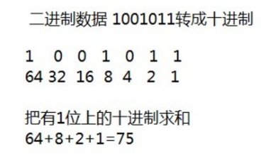
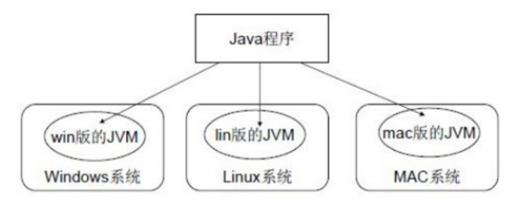

# 开发前言
## Java 语言概述

### 什么是Java语言
Java语言是美国Sun公司（Stanford University Network），在1995年推出的高级的编程语言。所谓编程语言，是
计算机的语言，人们可以使用编程语言对计算机下达命令，让计算机完成人们需要的功能。

### Java语言发展历史

- 1995 年Sun公司发布Java1.0版本
- 1997 年发布Java 1.1版本
- 1998 年发布Java 1.2版本
- 2000 年发布Java 1.3版本
- 2002 年发布Java 1.4版本
- 2004 年发布Java 1.5版本
- 2006 年发布Java 1.6版本

- 2009 年Oracle甲骨文公司收购Sun公司，并于2011发布Java 1.7版本
- 2014 年发布Java 1.8版本
- 2017 年发布Java 9.0版本

### Java语言能做什么
Java语言主要应用在互联网程序的开发领域。常见的互联网程序比如天猫、京东、物流系统、网银系统等，以及服
务器后台处理大数据的存储、查询、数据挖掘等也有很多应用。

## 计算机基础知识

计算机中的数据不同于人们生活中的数据，人们生活采用十进制数，而计算机中全部采用二进制数表示，它只包含
0、1两个数，逢二进一，1+1=10。每一个0或者每一个1，叫做一个bit（比特）。
下面了解一下十进制和二进制数据之间的转换计算

- **十进制数据转成二进制数据**： 使用除以2获取余数的方式

- **二进制数据转成十进制数据**： 使用8421编码的方式


> 小贴士：
> 二进制数系统中，每个0或1就是一个位，叫做bit（比特）

### 字节

字节是我们常见的计算机中最小存储单元。计算机存储任何的数据，都是以字节的形式存储，右键点击文件属性，
我们可以查看文件的字节大小。
8个bit（二进制位） 0000-0000表示为1个字节，写成1 byte或者1 B。

- 8 bit = 1 B
- 1024 B =1 KB
- 1024 KB =1 MB
- 1024 MB =1 GB
- 1024 GB = 1 TB

# 开发环境搭建
## Java 虚拟机——JVM

- **JVM （Java Virtual Machine ）**：Java虚拟机，简称JVM，是运行所有Java程序的假想计算机，是Java程序的运行环境，是Java 最具吸引力的特性之一。我们编写的Java代码，都运行在 JVM 之上。

- **跨平台** ：任何软件的运行，都必须要运行在操作系统之上，而我们用Java编写的软件可以运行在任何的操作系统上，这个特性称为Java语言的跨平台特性。该特性是由JVM实现的，我们编写的程序运行在JVM上，JVM
  运行在操作系统上。



  如图所示，Java的虚拟机本身不具备跨平台功能的，每个操作系统下都有不同版本的虚拟机。


## java环境安装
[Java/JDK下载安装与环境配置（Windows 10 超详细的图文版教程 ）](https://blog.csdn.net/qq_26552691/article/details/94598788)

## 入门程序说明

### 编译和运行是两回事

- **编译** ：是指将我们编写的Java源文件翻译成JVM认识的class文件，在这个过程中， `javac` 编译器会检查我们
  所写的程序是否有错误，有错误就会提示出来，如果没有错误就会编译成功。
- **运行** ：是指将 `class 文件` 交给JVM去运行，此时JVM就会去执行我们编写的程序了。

### 关于main方法

- **main 方法**：称为主方法。写法是固定格式不可以更改。main方法是程序的入口点或起始点，无论我们编写多
  少程序，JVM在运行的时候，都会从main方法这里开始执行。

## 添加注释comment

- **注释** ：就是对代码的解释和说明。其目的是让人们能够更加轻松地了解代码。为代码添加注释，是十分必须要的，它不影响程序的编译和运行。
- Java 中有单行注释和多行注释
  - 单行注释以 // 开头 换行结束
  - 多行注释以 /* 开头  以*/结束

## 关键字keywords

- **关键字** ：是指在程序中，Java已经定义好的单词，具有特殊含义
  - HelloWorld 案例中，出现的关键字有  `public` 、 `class` 、  `static` 、 `void` 等，这些单词已经被
    Java定义好，全部都是小写字母，notepad++中颜色特殊。
  - 关键字比较多，不能死记硬背，学到哪里记到哪里即可

## 标识符

- **标识符** ：是指在程序中，我们自己定义内容。比如类的名字、方法的名字和变量的名字等等，都是标识符。
  - HelloWorld 案例中，出现的标识符有类名字 `HelloWorld`
- **命名规则**：_**硬性要求**_
  - 标识符可以包含 英文字母 26个(区分大小写) 、 0 -9数字 、 $ （美元符号） 和 _ （下划线） 。
  - 标识符不能以数字开头。
  - 标识符不能是关键字
- **命名规范**： _**软性建议**_
  - 类名规范：首字母大写，后面每个单词首字母大写（大驼峰式）。
  - 方法名规范： 首字母小写，后面每个单词首字母大写（小驼峰式）。
  - 变量名规范：全部小写。

## 方法的定义

- 定义格式：

```
  修饰符 返回值类型 方法名 (参数列表)｛
       // 代码...        
      return ;     
  ｝
```

- 定义格式解释

  - 修饰符： 目前固定写法  `public  static` 。
  - 返回值类型： void(无返回值),基本数据类型(int等)，包装类（Integer），对象等。
  - 方法名：为我们定义的方法起名，满足标识符的规范，用来调用方法。
  - 参数列表： 目前无参数， 带有参数的方法在后面的课程讲解。
  - return ：方法结束。因为返回值类型是void，方法大括号内的return可以不写。

## 方法的调用

方法在定义完毕后，方法不会自己运行，必须被调用才能执行，我们可以在主方法main中来调用我们自己定义好的方法。在主方法中，直接写要调用的方法名字就可以调用了。

```java
public static void main(String[] args) {
    //调用定义的方法method
    method();
}
//定义方法，被main方法调用
public static void method() {
   System.out.println("自己定义的方法，需要被main调用运行");  
}
```