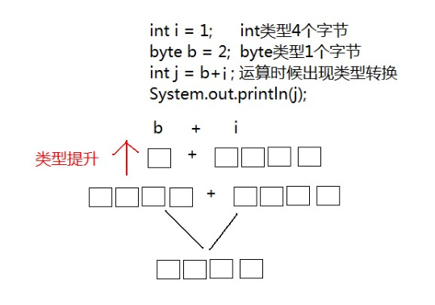
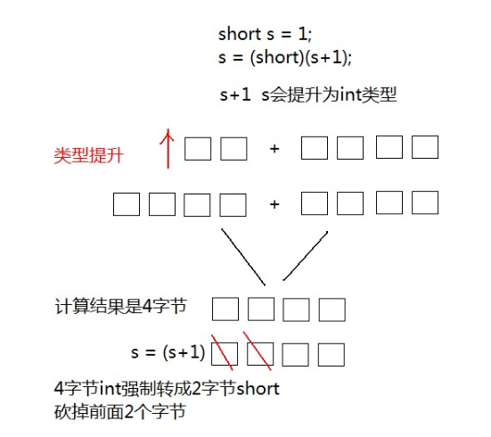

## 常量和变量
### 常量

#### 概述

**常量：是指在Java程序中固定不变的数据。**

#### 分类

| 类型       | 含义                                   | 数据举例                    |
| ---------- | -------------------------------------- | --------------------------- |
| 整数常量   | 所有的整数                             | 0，1， 567， -9             |
| 小数常量   | 所有的小数                             | 0.0， -0.1， 2.55           |
| 字符常量   | 单引号引起来,只能写一个字符,必须有内容 | 'a' ， ' '， '好'           |
| 字符串常量 | 双引号引起来,可以写多个字符,也可以不写 | "A" ，"Hello" ，"你好" ，"" |
| 布尔常量   | 只有两个值                             | true ， false               |
| 空常量     | 只有一个值                             | null                        |

### 变量和数据类型

#### 变量概述

- **变量：常量是固定不变的数据，那么在程序中可以变化的量称为变量。**

  > 数学中，可以使用字母代替数字运算,例如 x=1+5 或者 6=x+5。
  > 程序中，可以使用字母保存数字的方式进行运算，提高计算能力，可以解决更多的问题。比如x保存5，x也可
  > 以保存6，这样x保存的数据是可以改变的，也就是我们所讲解的变量

Java中要求一个变量每次只能保存一个数据，必须要明确保存的数据类型。

## 数据类型
### 数据类型分类
1. 基本数据类型：整数,浮点数,字符,布尔类型
2. **引用数据类型** ：包括  `类` 、 `数组` 、 `接口` 。

|  数据类型  |    关键字     | 内存占用       |         取值范围          |
|:------:|:----------:|------------|:---------------------:|
|  字节型   |    byte    | 1个字节       |       -128~127        |
|  短整型   |   short    | 2个字节       |     -32768~32767      |
|   整型   |  int（默认）   | 4个字节       |   -2的31次方~2的31次方-1    |
|  长整型   |    long    | 8个字节       |   -2的63次方~2的63次方-1    |
| 单精度浮点数 |   float    | 4个字节       | 1.4013E-45~3.4028E+38 |
| 双精度浮点数 | double（默认） | 8个字节       | 4.9E-324~1.7977E+308  |
|  字符型   |    char    | 2个字节       |        0-65535        |
|  布尔类型  |  boolean   | 1个字节       |      true，false       |

> Java中的默认类型：整数类型是 int 、浮点类型是 double 。
> 通常计算机中一个字符8个字节

### 基本数据类型转化
Java程序中要求参与的计算的数据，必须要保证数据类型的一致性，如果数据类不一致将发生类型的转换。

#### 自动转换

一个 int 类型变量和一个 byte 类型变量进行加法运算， 结果会是什么数据类型？

```java
int i = 1;
byte b = 2;
```

运算结果，变量的类型将是 int 类型，这就是出现了数据类型的自动类型转换现象

- **自动转换** ：将 `取值范围小的类型` 自动提升为 `取值范围大的类型` 。

```java
public static void main(String[] args) {
    int i = 1;
    byte b = 2;
   // byte x = b + i; // 报错  
    //int类型和byte类型运算，结果是int类型
    int j = b + i;
    System.out.println(j);
}
```

#### 转换原理图解

`byte` 类型内存占有1个字节，在和 `int` 类型运算时会提升为 `int` 类型 ，自动补充3个字节，因此计算后的结果还是 `int` 类型



同样道理，当一个 `int` 类型变量和一个 `double` 变量运算时， `int` 类型将会自动提升为 `double` 类型进行运算。

```java
public static void main(String[] args) {
    int i = 1;
    double d = 2.5;
    //int类型和double类型运算，结果是double类型
    //int类型会提升为double类型
    double e = d+i;
    System.out.println(e);
}
```

### 转换规则

范围小的类型向范围大的类型提升， `byte` 、`short`、`char` 运算时直接提升为 `int` 。

```java
byte、short、char‐‐>int‐‐>long‐‐>float‐‐>double
```

## 强制转换

将 1.5 赋值到 int 类型变量会发生什么？产生编译失败，肯定无法赋值

```java
int i = 1.5; // 错误
```

`double` 类型内存**8个字节**， `int` 类型内存**4个字节**。 1.5 是 `double` 类型，取值范围大于 `int` 。

想要赋值成功，只有通过强制类型转换，将 double 类型强制转换成 int 类型才能赋值。

- **强制类型转换** ：将 取值范围大的类型 强制转换成 取值范围小的类型 。

比较而言，自动转换是Java自动执行的，而强制转换需要我们自己手动执行

转换格式：

```
数据类型 变量名 = （数据类型）被转数据值
```

将 1.5 赋值到 int 类型，代码修改为：

```java
// double类型数据强制转成int类型，直接去掉小数点。
int i = (int)1.5
```

同样道理，当一个 `short` 类型与 `1` 相加，我们知道会类型提升，但是还想给结果赋值给`short`类型变量，就需要强制转换

```java
public static void main(String[] args) {
     //short类型变量，内存中2个字节
     short s = 1;
     /*
       出现编译失败
       s和1做运算的时候，1是int类型，s会被提升为int类型
       s+1后的结果是int类型，将结果在赋值会short类型时发生错误
       short内存2个字节，int类型4个字节
       必须将int强制转成short才能完成赋值
     */
     s = s + 1；//编译失败
     s = (short)(s+1);//编译成功
}
```

**转换原理图解**



**强烈注意**

- 浮点转成整数，直接取消小数点，可能造成数据损失精度。
- int 强制转成 short 砍掉2个字节，可能造成数据丢失。

```java
// 定义s为short范围内最大值
short s = 32767;
// 运算后，强制转换，砍掉2个字节后会出现不确定的结果
s = (short)(s + 10);
```

## ASCII 编码表

```java
public static void main(String[] args) {
  //字符类型变量
  char c = 'a';
  int i = 1;
  //字符类型和int类型计算
  System.out.println(c+i);//输出结果是98
}
```

在计算机的内部都是二进制的0、1数据，如何让计算机可以直接识别人类文字的问题呢？就产生出了编码表的概念。

- 编码表 ：就是将人类的文字和一个十进制数进行对应起来组成一张表格。

人们就规定

| 字符 | 数值 |
| ---- | ---- |
| 0    | 48   |
| 9    | 57   |
| A    | 65   |
| Z    | 90   |
| a    | 97   |
| z    | 122  |


- 将所有的英文字母，数字，符号都和十进制进行了对应，因此产生了世界上第一张编码表 ASCII（American Standard Code for Information Interchange 美国标准信息交换码）。


> 小贴士：
> 在char类型和int类型计算的过程中，char类型的字符先查询编码表，得到97，再和1求和，结果为98。char类型提升
> 为了int类型。char类型内存2个字节，int类型内存4个字节