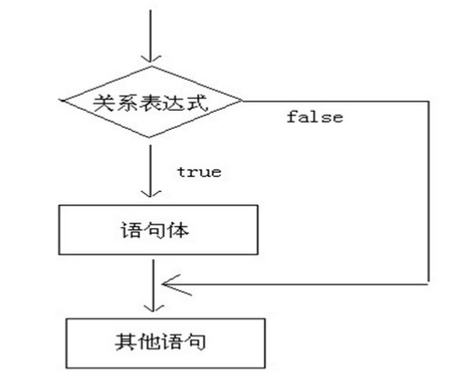
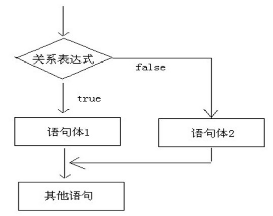
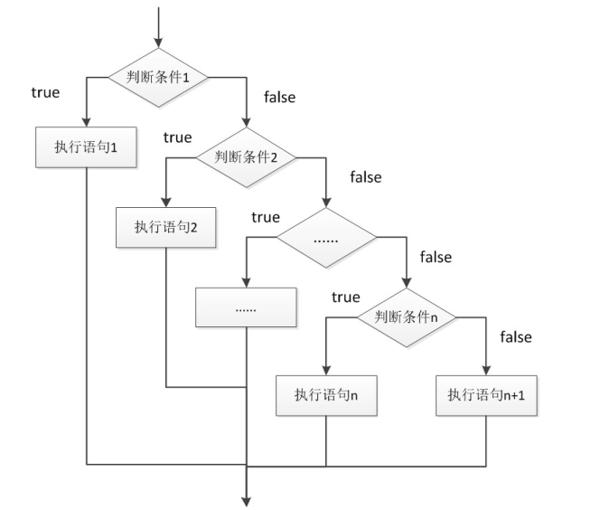
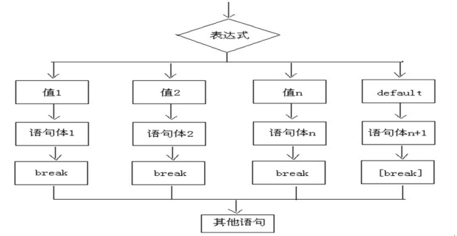
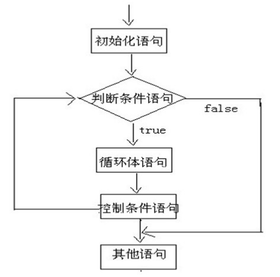

# 流程控制

## 概述

在一个程序执行的过程中，各条语句的执行顺序对程序的结果是有直接影响的。也就是说，程序的流程对运行结果
有直接的影响。所以，我们必须清楚每条语句的执行流程。而且，很多时候我们要通过控制语句的执行顺序来实现
我们要完成的功能。

## 顺序结构

```java
public static void main(String[] args){
    //顺序执行，根据编写的顺序，从上到下运行
    System.out.println(1);
    System.out.println(2);
    System.out.println(3);
}
```

# 判断语句

## 判断语句1--if

- if 语句第一种格式： if

```java
if(关系表达式)｛
   语句体;  
｝
```

- 执行流程

    - 首先判断关系表达式看其结果是 true还是false

    - 如果是 true就执行语句体

    - 如果是 false就不执行语句体

     

```java
public static void main(String[] args){
    System.out.println("开始");
    // 定义两个变量
    int a = 10;
    int b = 20;
    //变量使用if判断
    if (a == b){
       System.out.println("a等于b");  
    }
    int c = 10;
    if(a == c){
       System.out.println("a等于c");  
    }
    System.out.println("结束");
｝ 
```

## 判断语句2--if...else

- **if 语句第二种格式**： if...else

  ```
  if(关系表达式) {
     语句体1;  
  }else {
     语句体2;  
  }
  ```

- 执行流程
    - 首先判断关系表达式看其结果是 true还是false
    - 如果是 true就执行语句体1
    - 如果是 false就执行语句体2



```java
public static void main(String[] args){
    // 判断给定的数据是奇数还是偶数
    // 定义变量
    int a = 1;
    if(a % 2 == 0) {
       System.out.println("a是偶数");  
    } else{
       System.out.println("a是奇数");  
    }
    System.out.println("结束");
}
```

## 判断语句3--if..else if...else

- **if 语句第三种格式**： if...else if ...else

```
if (判断条件1) {
   执行语句1;  
} else if (判断条件2) {
   执行语句2;  
}
...
}else if (判断条件n) {
  执行语句n;   
} else {
   执行语句n+1;  
}
```

- 执行流程
    - 首先判断关系表达式 1看其结果是true还是false
    - 如果是 true就执行语句体1
    - 如果是 false就继续判断关系表达式2看其结果是true还是false
    - 如果是 true就执行语句体2
    - 如果是 false就继续判断关系表达式…看其结果是true还是false
    - 如果没有任何关系表达式为 true，就执行语句体n+1。



```java
public static void main(String[] args) {
    // x和y的关系满足如下：
    // x>=3 y = 2x + 1;
    //‐1<=x<3 y = 2x;
    // x<=‐1 y = 2x – 1;
    // 根据给定的x的值，计算出y的值并输出。
    // 定义变量
    int x = 5;
    int y;
    if (x>= 3) {
       y = 2 * x + 1;  
    } else if (x >= ‐1 && x < 3) {
       y = 2 * x;  
    } else  {
       y = 2 * x ‐ 1;  
    }
    System.out.println("y的值是："+y);
}
```

##  if 语句和三元运算符的互换

在某些简单的应用中，if语句是可以和三元运算符互换使用的

```java
public static void main(String[] args) {
    int a = 10;
    int b = 20;
    //定义变量，保存a和b的较大值
    int c;
    if(a > b) {
       c = a;  
    } else {
       c = b;  
    }
    //可以上述功能改写为三元运算符形式
    c = a > b ? a:b;
}
```

# 选择语句

## 选择语句--switch

- switch 语句格式：

```java
switch(表达式) {
  case 常量值1:
    语句体1;
    break;
  case 常量值2:
    语句体2;
    break;
  ...
  default:
    语句体n+1;
    break;
}
```

- 执行流程
    - 首先计算出表达式的值
    - 其次，和 case依次比较，一旦有对应的值，就会执行相应的语句，在执行的过程中，遇到break就会结
      束。
    - 最后，如果所有的 case都和表达式的值不匹配，就会执行default语句体部分，然后程序结束掉。



```java
public static void main(String[] args) {
    //定义变量，判断是星期几
    int weekday = 6;
    //switch语句实现选择
    switch(weekday) {
        case 1:
          System.out.println("星期一");
          break;
        case 2:
          System.out.println("星期二");
          break;
        case 3:
        System.out.println("星期三");
          break;
        case 4:
          System.out.println("星期四");
          break;
        case 5:
          System.out.println("星期五");
          break;
        case 6:
          System.out.println("星期六");
          break;
        case 7:
          System.out.println("星期日");
          break;
        default:
          System.out.println("你输入的数字有误");
          break;
    }  
}
```

switch 语句中，表达式的数据类型，可以是byte，short，int，char，enum（枚举），JDK7后可以接收字符串。

## case 的穿透性

在switch语句中，如果case的后面不写break，将出现穿透现象，也就是不会在判断下一个case的值，直接向后运行，直到遇到break，或者整体switch结束。

```java
public static void main(String[] args) {
  int i = 5;
  switch (i){
    case 0:
      System.out.println("执行case0");
      break;
    case 5:
      System.out.println("执行case5");
    case 10:
      System.out.println("执行case10");
    default:
      System.out.println("执行default");
  }
}
```

上述程序中，执行case5后，由于没有break语句，程序会一直向后走，不会在判断case，也不会理会break，直接运行完整体switch。

由于case存在穿透性，因此初学者在编写switch语句时，必须要写上break。


# 循环语句

## 循环概述

循环语句可以在满足循环条件的情况下，反复执行某一段代码，这段被重复执行的代码被称为循环体语句，当反复执行这个循环体时，需要在合适的时候把循环判断条件修改为false，从而结束循环，否则循环将一直执行下去，形成死循环。

## 循环语句1--for

- **for 循环语句格式：**

```
for(初始化表达式①; 布尔表达式②; 步进表达式④){
循环体③        
}
```

- 执行流程
    - 执行顺序：①②③④ >②③④>②③④…②不满足为止。
    - ①负责完成循环变量初始化
    - ②负责判断是否满足循环条件，不满足则跳出循环
    - ③具体执行的语句
    - ④循环后，循环条件所涉及变量的变化情况

  

```java
public static void main(String[] args) {
    //控制台输出10次HelloWorld，不使用循环
    System.out.println("HelloWorld");
    System.out.println("HelloWorld");
    System.out.println("HelloWorld");
    System.out.println("HelloWorld");
    System.out.println("HelloWorld");
    System.out.println("HelloWorld");
    System.out.println("HelloWorld");
    System.out.println("HelloWorld");
    System.out.println("HelloWorld");
    System.out.println("HelloWorld");
    System.out.println("‐‐‐‐‐‐‐‐‐‐‐‐‐‐‐‐‐‐‐‐‐‐‐‐‐");
    //用循环改进，循环10次
    //定义变量从0开始，循环条件为<10
    for(int x = 0; x < 10; x++) {
       System.out.println("HelloWorld"+x);  
    }
}
```

- 循环练习：使用循环，计算 1-100之间的偶数和

```java
public static void main(String[] args) {
  //1.定义一个初始化变量,记录累加求和,初始值为0
  int sum = 0;
  //2.利用for循环获取1‐100之间的数字
  for (int i = 1; i <= 100; i++) {
      //3.判断获取的数组是奇数还是偶数
      if(i % 2==0){
        //4.如果是偶数就累加求和
        sum += i;
      }
  }
   //5.循环结束之后,打印累加结果  
   System.out.println("sum:"+sum);  
}
```

## 循环语句2--while

- **while 循环语句格式：**

  ```
  初始化表达式①
    while(布尔表达式②){
      循环体③
      步进表达式④
  }
  ```

- **执行流程**

    - 执行顺序：①②③④ >②③④>②③④…②不满足为止。
    - ①负责完成循环变量初始化。
    - ②负责判断是否满足循环条件，不满足则跳出循环。
    - ③具体执行的语句。
    - ④循环后，循环变量的变化情况。


while循环输出10次HelloWorld

```java
public static void main(String[] args) {
    //while循环实现打印10次HelloWorld
    //定义初始化变量
    int i = 1;
    //循环条件<=10
    while(i<=10){
        System.out.println("HelloWorld");
        //步进
        i++;
    }
}
```

while循环计算1-100之间的和

```java
public static void main(String[] args) {
    //使用while循环实现
    //定义一个变量,记录累加求和
    int sum = 0;
    //定义初始化表达式
    int i = 1;
    //使用while循环让初始化表达式的值变化
    while(i<=100){
        //累加求和
        sum += i ;
        //步进表达式改变变量的值
        i++;
            }
    //打印求和的变量
    System.out.println("1‐100的和是："+sum);
}
```

## 循环语句3--do...while

- **do...while 循环格式**

```java
初始化表达式①
    do{
    循环体③
    步进表达式④
}while(布尔表达式②);
```

- **执行流程**
    - 执行顺序：①③④ >②③④>②③④…②不满足为止。
    - ①负责完成循环变量初始化。
    - ②负责判断是否满足循环条件，不满足则跳出循环。
    - ③具体执行的语句
    - ④循环后，循环变量的变化情况


输出10次HelloWorld

```java
public static void main(String[] args) {
    int x=1;
    do {
      System.out.println("HelloWorld");
      x++;
    }while(x<=10);
}
```

do...while循环的特点：无条件执行一次循环体，即使我们将循环条件直接写成false，也依然会循环一次。这样的循环具有一定的风险性，因此初学者不建议使用do...while循环。

```java
public static void main(String[] args){
    do{
       System.out.println("无条件执行一次");  
    }while(false);
}
```

## 循环语句的区别

- `for` 和  `while` 的小区别：
    - 控制条件语句所控制的那个变量，在 for循环结束后，就不能再被访问到了，而while循环结束还可以继
      续使用，如果你想继续使用，就用while，否则推荐使用for。原因是for循环结束，该变量就从内存中消
      失，能够提高内存的使用效率。
    - 在已知循环次数的时候使用推荐使用 for，循环次数未知的时推荐使用while。

## 跳出语句

### break

- **使用场景：终止 switch或者循环**
    - 在选择结构 switch语句中
    - 在循环语句中
    - 离开使用场景的存在是没有意义的

```java
public static void main(String[] args) {
    for (int i = 1; i<=10; i++) {
        //需求:打印完两次HelloWorld之后结束循环
        if(i == 3){
          break;
        }
        System.out.println("HelloWorld"+i);
    }
}
```

### continue

- **使用场景：结束本次循环，继续下一次的循环**

  ```java
  public static void main(String[] args) {
      for (int i = 1; i <= 10; i++) {
          //需求:不打印第三次HelloWorld
          if(i == 3){
            continue;
          }
          System.out.println("HelloWorld"+i);
   
     }
  }
  ```

# 扩展知识点

## 死循环

- **死循环**： 也就是循环中的条件永远为true，死循环的是永不结束的循环。例如：while(true){}。

  在后期的开发中，会出现使用死循环的场景，例如：我们需要读取用户输入的输入，但是用户输入多少数据我们并
  不清楚，也只能使用死循环，当用户不想输入数据了，就可以结束循环了，如何去结束一个死循环呢，就需要使用
  到跳出语句了。

## 嵌套循环

- **嵌套循环** ，是指一个循环的循环体是另一个循环。比如for循环里面还有一个for循环，就是嵌套循环。总共的循环次数=外循环次数*内循环次数
- **嵌套循环格式**：

```
for(初始化表达式①; 循环条件②; 步进表达式⑦) {
    for(初始化表达式③; 循环条件④; 步进表达式⑥) {
       执行语句⑤;  
    }
}
```

- 嵌套循环执行流程：
    - 执行顺序：①②③④⑤⑥ >④⑤⑥>⑦②③④⑤⑥>④⑤⑥
    - 外循环一次，内循环多次。
    - 比如跳绳：一共跳 5组，每组跳10个。5组就是外循环，10个就是内循环。
- **练习** ：使用嵌套循环，打印5*8的矩形

```java
public static void main(String[] args) {
    //5*8的矩形，打印5行*号，每行8个
    //外循环5次，内循环8次
    for(int i = 0; i < 5; i++){
        for(int j = 0; j < 8; j++){
            //不换行打印星号
            System.out.print("*");
        }
        //内循环打印8个星号后，需要一次换行
        System.out.println();
    }
｝
```

