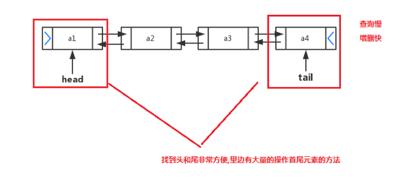

## List接口介绍

`java.util.List`接口继承自`Collection`接口，是单列集合的一个重要分支，习惯性地会将实现了`List`接口的对象称为List集合。在List集合中允许出现重复的元素，所有的元素是以一种线性方式进行存储的，在程序中可以通过索引来访问集合中的指定元素。另外，List集合还有一个特点就是元素有序，即元素的存入顺序和取出顺序一致。

看完API，我们总结一下：

List接口特点：

1. 它是一个元素存取有序的集合。例如，存元素的顺序是11、22、33。那么集合中，元素的存储就是按照11、22、33的顺序完成的）。
2. 它是一个带有索引的集合，通过索引就可以精确的操作集合中的元素（与数组的索引是一个道理）。
3. 集合中可以有重复的元素，通过元素的equals方法，来比较是否为重复的元素。

> tips:我们在基础班的时候已经学习过List接口的子类java.util.ArrayList类，该类中的方法都是来自List中定义。

## List接口中常用方法

List作为Collection集合的子接口，不但继承了Collection接口中的全部方法，而且还增加了一些根据元素索引来操作集合的特有方法，如下：

- `public void add(int index, E element)`: 将指定的元素，添加到该集合中的指定位置上。
- `public E get(int index)`:返回集合中指定位置的元素。
- `public E remove(int index)`: 移除列表中指定位置的元素, 返回的是被移除的元素。
- `public E set(int index, E element)`:用指定元素替换集合中指定位置的元素,返回值的更新前的元素。

List集合特有的方法都是跟索引相关，我们在基础班都学习过，那么我们再来复习一遍吧：

```java
public class ListDemo {
    public static void main(String[] args) {
		// 创建List集合对象
    	List<String> list = new ArrayList<String>();
    	
    	// 往 尾部添加 指定元素
    	list.add("图图");
    	list.add("小美");
    	list.add("不高兴");
    	
    	System.out.println(list);
    	// add(int index,String s) 往指定位置添加
    	list.add(1,"没头脑");
    	
    	System.out.println(list);
    	// String remove(int index) 删除指定位置元素  返回被删除元素
    	// 删除索引位置为2的元素 
    	System.out.println("删除索引位置为2的元素");
    	System.out.println(list.remove(2));
    	
    	System.out.println(list);
    	
    	// String set(int index,String s)
    	// 在指定位置 进行 元素替代（改） 
    	// 修改指定位置元素
    	list.set(0, "三毛");
    	System.out.println(list);
    	
    	// String get(int index)  获取指定位置元素
    	
    	// 跟size() 方法一起用  来 遍历的 
    	for(int i = 0;i<list.size();i++){
    		System.out.println(list.get(i));
    	}
    	//还可以使用增强for
    	for (String string : list) {
			System.out.println(string);
		}  	
	}
}
```

# List的子类

## ArrayList集合

`java.util.ArrayList`集合数据存储的结构是数组结构。元素增删慢，查找快，由于日常开发中使用最多的功能为查询数据、遍历数据，所以`ArrayList`是最常用的集合。

许多程序员开发时非常随意地使用ArrayList完成任何需求，并不严谨，这种用法是不提倡的。

## LinkedList集合

`java.util.LinkedList`集合数据存储的结构是链表结构。方便元素添加、删除的集合。

> LinkedList是一个双向链表链表结构如下



实际开发中对一个集合元素的添加与删除经常涉及到首尾操作，而LinkedList提供了大量首尾操作的方法。这些方法我们作为了解即可：

* `public void addFirst(E e)`:将指定元素插入此列表的开头。
* `public void addLast(E e)`:将指定元素添加到此列表的结尾。
* `public E getFirst()`:返回此列表的第一个元素。
* `public E getLast()`:返回此列表的最后一个元素。
* `public E removeFirst()`:移除并返回此列表的第一个元素。
* `public E removeLast()`:移除并返回此列表的最后一个元素。
* `public E pop()`:从此列表所表示的堆栈处弹出一个元素。
* `public void push(E e)`:将元素推入此列表所表示的堆栈。
* `public boolean isEmpty()`：如果列表不包含元素，则返回true。

LinkedList是List的子类，List中的方法LinkedList都是可以使用，这里就不做详细介绍，我们只需要了解LinkedList的特有方法即可。在开发时，LinkedList集合也可以作为堆栈，队列的结构使用。（了解即可）

方法演示：

 ```java
public class LinkedListDemo {
    public static void main(String[] args) {
        LinkedList<String> link = new LinkedList<String>();
        //添加元素
        link.addFirst("abc1");
        link.addFirst("abc2");
        link.addFirst("abc3");
        System.out.println(link);
        // 获取元素
        System.out.println(link.getFirst());
        System.out.println(link.getLast());
        // 删除元素
        System.out.println(link.removeFirst());
        System.out.println(link.removeLast());

        while (!link.isEmpty()) { //判断集合是否为空
            System.out.println(link.pop()); //弹出集合中的栈顶元素
        }

        System.out.println(link);
    }
}
 ```