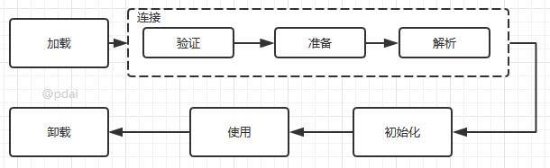

## 类加载

###  类加载的描述

当程序要使用某个类时，如果该类还未被加载到内存中，则系统会通过**类的加载**，**类的连接**，**类的初始**
**化**这三个步骤来对类进行初始化。如果不出现意外情况，JVM将会连续完成这三个步骤，所以有时也把
这三个步骤统称为**类加载或者类初始化**.



- **类的加载**
    - 就是指将 class文件读入内存，并为之创建一个 java.lang.Class 对象
    - 任何类被使用时，系统都会为之建立一个 java.lang.Class 对象
- **类的连接**
    -  验证阶段：用于检验被加载的类是否有正确的内部结构，并和其他类协调一致
    - 准备阶段：负责为类的类变量分配内存，并设置默认初始化值
    - 解析阶段：将类的二进制数据中的符号引用替换为直接引用
- **类的初始化**
    - 在该阶段，主要就是对类变量进行初始化


### 类的初始化步骤

- 假如类还未被加载和连接，则程序先加载并连接该类
- 假如该类的直接父类还未被初始化，则先初始化其直接父类
- 假如类中有初始化语句，则系统依次执行这些初始化语句
- 注意：在执行第 2个步骤的时候，**系统对直接父类的初始化步骤也遵循初始化步骤1-3**

### 创建类的实例的时机

1. 调用类的类方法
2. 访问类或者接口的类变量，或者为该类变量赋值
3. 使用反射方式来强制创建某个类或接口对应的 java.lang.Class对象
4. 初始化某个类的子类
5. 直接使用 java.exe命令来运行某个主类*

## 类加载器

### 类加载器的作用

**负责将 .class文件加载到内存中，并为之生成对应的 java.lang.Class 对象**。

### JVM的类三种加载机制(简单说明)

- **全盘负责**：就是当一个类加载器负责加载某个 Class时，该Class所依赖的和引用的其他Class也将由该类加载
  器负责载入，除非显示使用另外一个类加载器来载入

- **父类委托**：就是当一个类加载器负责加载某个 Class时，先让父类加载器试图加载该Class，只有在父类加载器
  无法加载该类时才尝试从自己的类路径中加载该类

- **缓存机制**：保证所有加载过的 Class都会被缓存，当程序需要使用某个Class对象时，类加载器先从缓存区中搜
  索该Class，只有当缓存区中不存在该Class对象时，系统才会读取该类对应的二进制数据，并将其转换成Class

  对象，存储到缓存区

### Java中的内置类加载器

- **Bootstrap class loader** ：它是虚拟机的内置类加载器，通常表示为null ，并且没有父null
- **Platform class loader** ：平台类加载器可以看到所有平台类 ，平台类包括由平台类加载器或其祖先定义的Java
  SE平台API，其实现类和JDK特定的运行时类
- **System class loader** ：它也被称为应用程序类加载器 ，与平台类加载器不同。 系统类加载器通常用于定义应
  用程序类路径，模块路径和JDK特定工具上的类
- **类加载器的继承关系**： System的父加载器为Platform，而Platform的父加载器为Bootstrap

### ClassLoader 中的两个方法

| 方法名                                    | 说明                       |
| ----------------------------------------- | -------------------------- |
| static ClassLoader getSystemClassLoader() | 返回用于委派的系统类加载器 |
| ClassLoader getParent()                   | 返回父类加载器进行委派     |

```java
public class ClassLoaderDemo {
  public static void main(String[] args) {
    //static ClassLoader getSystemClassLoader()：返回用于委派的系统类加载器
    ClassLoader c = ClassLoader.getSystemClassLoader();
    System.out.println(c); //AppClassLoader
    //ClassLoader getParent()：返回父类加载器进行委派
    ClassLoader c2 = c.getParent();
    System.out.println(c2); //PlatformClassLoader
    ClassLoader c3 = c2.getParent();
    System.out.println(c3); //null
 }
}
```
