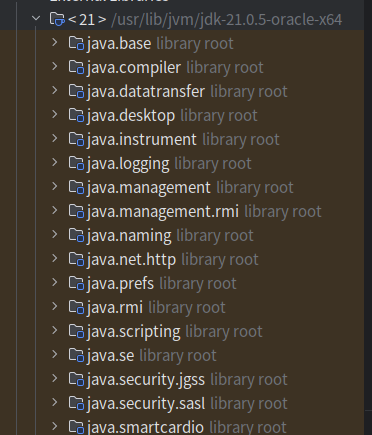

## JDK9

### 模块化系统（Project Jigsaw）

#### 模块化核心概念

- 模块（Module）：模块是代码和资源的集合，类似于包的高级抽象。一个模块由模块声明文件定义。
- 模块声明文件：通过 module-info.java 文件定义模块的名称及其依赖关系。例如：

    ```java
    module com.example.foo {
        requires com.example.bar;
    }
    ```
- 模块路径：模块路径是一组模块的集合，用于编译和运行时查找模块。

#### 主要特性

- 模块化 Java SE 平台：Java 平台本身被拆分为多个模块，例如：
    - java.base（基础模块）：包含 Java 的核心类，例如 java.lang、java.util。
    - java.sql：与数据库交互的模块。
    - java.xml：处理 XML 的模块。
      

- 增强的封装性：模块系统强制模块只能访问显式导出的包，而无法直接访问内部实现细节。
- 显式依赖管理：通过 requires 指令，模块声明了运行时需要依赖的模块，提升了依赖管理的透明度。

#### 优势

- **更小的运行时**：模块化允许创建精简的 Java 运行时镜像（使用 jlink 工具），只包含应用程序所需的模块。
- **更高的安全性**：模块化可以隐藏实现细节，减少外部访问敏感代码的风险。
- **改进的开发效率**：开发者可以更轻松地组织大型代码库，并显式管理依赖。

#### 应用场景

- **构建大型应用程序**：模块化可以帮助开发者更好地组织代码，减少耦合。
- **构建精简的运行时**：通过 jlink 工具，可以构建只包含应用程序所需模块的运行时镜像。

### JShell

JShell 是 JDK 9 引入的一个交互式工具，提供了一个基于 REPL（Read-Eval-Print Loop）的环境，使开发者可以快速编写和测试 Java
代码，而无需创建完整的类或项目。这是 Java 首次支持即时交互式编程，大大提高了试验和学习的效率。

通过JShell命令行，可以直接输入Java代码，然后立即看到结果。

#### JShell 的特点

- **即时反馈**：可以直接输入单行代码或表达式，并立即获得结果。
- **简化实验**：快速测试小段代码或探索 API，无需编译完整的 Java 程序。
- **易用性**：支持自动补全和历史记录，提升用户体验。
- **脚本支持**：可以将 JShell 会话保存为脚本文件，或从文件中加载命令。
- **轻量化**：无需设置复杂的开发环境，适合初学者学习和开发者快速验证代码逻辑。

### Stream API 增强

JDK 9 对 Stream API 进行了增强，引入了一些新的方法，使得流操作更加灵活和强大。其中 takeWhile 和 dropWhile 是两个比较重要的增强

- `takeWhile(Predicate)`: 这个方法接收一个 Predicate (谓词) 作为参数。它从流的开头开始获取元素，直到遇到第一个不满足
  Predicate 的元素为止。一旦遇到不满足条件的元素，流就会立即终止，后面的元素会被忽略。

- `dropWhile(Predicate)`: 这个方法也接收一个 Predicate 作为参数。它从流的开头开始丢弃元素，直到遇到第一个不满足 Predicate
  的元素为止。一旦遇到不满足条件的元素，该元素以及后面的所有元素都会被保留。

- `ofNullable(T)`: 这个方法允许你创建一个包含单个元素的流，如果元素为 null，则创建一个空流。这避免了空指针异常。

- `iterate(T seed, Predicate<? super T> hasNext, UnaryOperator<T> next)`: 这是 iterate 方法的一个新重载版本。它允许你通过一个
  Predicate 来控制流的生成，直到 Predicate 返回 false 为止。这比之前的 iterate 方法更加灵活，之前的版本需要使用 limit
  方法来限制流的长度。

#### 示例

```java

import java.util.Arrays;
import java.util.List;
import java.util.stream.Stream;

public class StreamEnhancements {

    public static void main(String[] args) {
        List<Integer> numbers = Arrays.asList(1, 2, 3, 4, 5, 6, 7, 8, 9, 10);

        // takeWhile 示例
        System.out.println("takeWhile example:");
        numbers.stream()
                .takeWhile(n -> n < 5)
                .forEach(System.out::println); // 输出 1 2 3 4

        // dropWhile 示例
        System.out.println("\ndropWhile example:");
        numbers.stream()
                .dropWhile(n -> n < 5)
                .forEach(System.out::println); // 输出 5 6 7 8 9 10

        // ofNullable 示例
        String nullString = null;
        Stream<String> stream1 = Stream.ofNullable(nullString);
        System.out.println("\nofNullable example (null):");
        System.out.println(stream1.count()); // 输出 0

        String nonNullString = "Hello";
        Stream<String> stream2 = Stream.ofNullable(nonNullString);
        System.out.println("\nofNullable example (not null):");
        stream2.forEach(System.out::println); // 输出 Hello

        // iterate 示例
        System.out.println("\niterate example:");
        Stream.iterate(1, n -> n < 10, n -> n + 2)
                .forEach(System.out::println); // 输出 1 3 5 7 9
    }
}
```

**解释：**

- 在 takeWhile 示例中，我们获取小于 5 的元素，一旦遇到 5，流就停止了。
- 在 dropWhile 示例中，我们丢弃小于 5 的元素，从 5 开始保留所有元素。
- ofNullable 示例展示了如何处理可能为 null 的值，避免空指针异常。
- iterate 示例展示了如何使用 Predicate 来控制流的生成。

## JDK 10

### var 局部变量类型推断

局部变量类型推断允许你在声明局部变量时使用 var 关键字，而无需显式地指定变量的类型。编译器会根据变量的初始化表达式来自动推断变量的类型。

```java
// JDK 10 之前
String message = "Hello, world!";
List<String> names = new ArrayList<>();

// JDK 10 之后
var message = "Hello, world!"; // 推断为 String
var names = new ArrayList<String>(); // 推断为 List<String>
var number = 123; // 推断为 int
var price = 12.5; // 推断为 double
```

#### var的使用限制

- var <font color=red> 只能用于局部变量 </font>，不能用于成员变量、方法参数、构造函数参数等。
- **声明时必须初始化**： 使用 var 声明的变量必须在**声明时进行初始化**，否则编译器无法推断出变量的类型。
- **不能使用 null 初始化**：var 声明的变量不能使用 null 进行初始化，因为编译器无法推断出变量的类型。
- **不能使用 var 声明数组**：var 声明的变量不能用于声明数组，因为编译器无法推断出数组的类型。
- **不能使用 var 声明泛型类型**：var 声明的变量不能用于声明泛型类型，因为编译器无法推断出泛型的类型。
- **不能用于 Lambda 表达式**： 在某些复杂的 Lambda 表达式中，编译器可能无法推断类型，这时需要显式指定类型。

### G1 垃圾回收器的改进

1. 并行 Full GC (Full GC 的并行化)

在 JDK 10 之前，G1 的 Full GC 是单线程的，这在堆内存非常大的情况下会成为性能瓶颈。JDK 10 引入了并行 Full GC，利用多线程来执行
Full GC，显著缩短了 Full GC 的停顿时间，提高了垃圾回收的效率。这对于需要处理大量数据或者对停顿时间非常敏感的应用来说，是一个重要的改进。

2. 改进的并发标记循环 (Improved Concurrent Marking Cycle):
   JDK 10 对 G1 的并发标记循环进行了改进，提高了并发标记的效率，减少了 STW (Stop-The-World) 停顿时间。这些改进包括：
    - **更快的根扫描 (Faster Root Scanning)**: 优化了根扫描的算法，减少了扫描根集合的时间。
    - **更精确的并发标记 (More Accurate Concurrent Marking)**: 提高了并发标记的精度，减少了浮动垃圾 (Floating Garbage)
      的产生。浮动垃圾是指在并发标记过程中新产生的垃圾，只能在下一次 GC 中回收。
    - **更有效的重标记 (More Efficient Remarking):** 优化了重标记阶段的算法，减少了 STW 停顿时间。

3. 堆分配的改进 (Heap Allocation Improvements):
   JDK 10 对 G1 的堆分配也进行了一些改进，提高了对象分配的效率，减少了分配的开销。

## JDK11

### 1. ZGC (Z Garbage Collector)

这是 JDK 11 中最重要的特性之一，是一个可伸缩的低延迟垃圾回收器。ZGC 的目标是实现亚毫秒级的最大 GC 停顿时间，即使在非常大的堆内存（TB
级别）下也能保持较低的停顿。ZGC 采用基于 Region 的内存布局，使用着色指针和读屏障技术来实现并发标记、并发整理和并发重定位，极大地减少了
STW (Stop-The-World) 停顿时间。

### 2. Epsilon 垃圾回收器 (No-Op Garbage Collector)

这是一个实验性的垃圾回收器，也称为“No-Op”回收器。它实际上不做任何垃圾回收工作，只负责内存分配。一旦堆内存耗尽，JVM
就会崩溃。Epsilon GC 主要用于以下场景：

* 性能测试：用于评估应用在没有 GC 开销下的性能表现。
* 极短生命周期的任务：对于一些生命周期非常短的任务，GC 的开销可能比任务本身还要大，这时可以使用 Epsilon GC。

### 3. 局部变量类型推断的增强 (Local-Variable Syntax for Lambda Parameters)

在 JDK 10 中引入了 `var` 关键字用于局部变量类型推断。JDK 11 对此进行了增强，允许在 Lambda 表达式的参数中使用 `var` 关键字。

```java
// JDK 11 之前
(String s)->s.

length()

// JDK 11 之后
(
var s)->s.

length()
```

这个特性使得 Lambda 表达式更加简洁，尤其是在参数类型比较复杂的情况下。

### 4. HTTP 客户端 (Standardized HTTP Client)

JDK 9 引入了孵化中的 HTTP 客户端 API。在 JDK 11 中，这个 API 已经标准化，并得到了进一步的改进。新的 HTTP 客户端 API 支持
HTTP/2 和 WebSocket，提供了更现代、更高效的网络通信方式。

### 5. 字符串 API 的增强 (String API Enhancements)：

JDK 11 为 `String` 类添加了一些新的方法，包括：

* `isBlank()`：判断字符串是否为空白字符串（包括空字符串和只包含空格、制表符、换行符等空白字符的字符串）。
* `lines()`：将字符串拆分为多行字符串流。
* `repeat(int count)`：将字符串重复指定次数。
* `strip()`、`stripLeading()` 和 `stripTrailing()`：去除字符串开头和结尾的空白字符，其中 `strip()` 方法使用 Unicode
  标准定义的空白字符，而 `trim()` 方法只去除 ASCII 码中的空白字符。

### 6. 文件 API 的增强 (File API Enhancements)

JDK 11 增强了文件 API，提供了更方便的文件读写方法，例如：

* `Files.readString(Path)`：将文件内容读取为字符串。
* `Files.writeString(Path, CharSequence)`：将字符串写入文件。

### 7. 嵌套类访问控制的改进 (Nested-Based Access Control)

JDK 11 改进了嵌套类的访问控制，使得嵌套类可以更容易地访问彼此的私有成员。

### 8. 移除 Java EE 和 CORBA 模块 (Remove the Java EE and CORBA Modules)

JDK 11 移除了 Java EE 和 CORBA 相关的模块，这些模块在之前的版本中已经被标记为废弃。

### 9. Flight Recorder 的开源 (Flight Recorder Open Sourced)

Java Flight Recorder (JFR) 是一种用于收集 JVM 运行时数据的工具，之前是商业版的 JDK 才提供的功能。在 JDK 11 中，JFR
已经开源，所有开发者都可以免费使用。

### 10. 其他改进

* 支持 TLS 1.3 协议。
* Unicode 10 支持。
* 动态类文件常量。
* 简化了启动单个源代码文件的方法。

## JDK12

### 1. Switch 表达式增强 (Switch Expressions - Preview)

它对 `switch` 语句进行了增强，使其可以作为表达式使用，并支持更简洁的语法。

* **更简洁的语法：** 引入了 `->` 符号，使得 `case` 语句更加简洁，避免了 `break` 语句的冗余。
* **可以返回值：** `switch` 表达式可以返回值，使得代码更加简洁和易读。

```java
// JDK 12 之前
switch(day){
        case MONDAY:
        System.out.

println("星期一");
        break;
                case TUESDAY:
        System.out.

println("星期二");
        break;
default:
        System.out.

println("其他");
}

// JDK 12 之后 (使用 switch 表达式)
String result = switch (day) {
    case MONDAY -> "星期一";
    case TUESDAY -> "星期二";
    default -> "其他";
};

// 或者使用更复杂的代码块
int numLetters = switch (s) {
    case "Foo" -> 3;
    case "Bar" -> 3;
    default -> {
        int l = s.length();
        if (l > 10) {
            yield 10;
        } else {
            yield l;
        }
    }
};
```

### 2. Shenandoah 垃圾回收器 (Shenandoah GC - Experimental)

Shenandoah 是一个低停顿时间的垃圾回收器，与 ZGC 类似，旨在实现亚毫秒级的 GC 停顿。它与 Java
应用程序的执行线程并发运行，进行垃圾回收和内存回收，从而最大程度地减少停顿时间。Shenandoah 适用于对停顿时间非常敏感的应用。

### 3. JVM 常量 API (JVM Constants API)

引入了新的 API 来建模关键类文件和运行时工件的名义描述，例如类、方法和方法句柄。这使得处理类文件和运行时工件更加方便。

## 4. 字符串 API 增强 (String API Enhancements):

* `indent(int n)`：用于缩进字符串，如果 `n` 为正数，则在每行前面添加 `n` 个空格；如果 `n` 为负数，则删除每行前面最多 `abs(n)`
  个空格；如果 `n` 为 0，则不进行任何操作。
* `transform(Function<String, R> f)`：允许使用函数转换字符串。

```java
String text = "Hello\nWorld";
System.out.

println(text.indent(4)); // 缩进 4 个空格
        System.out.

println(text.transform(s ->s.

toUpperCase())); // 转换为大写
```

## 5. Files.mismatch(Path, Path):

`Files` 类新增了一个 `mismatch` 方法，用于查找两个文件内容首次不同的字节位置。如果两个文件内容完全相同，则返回 -1。

## 6. Teeing Collector:

`Collectors` 类新增了一个 `teeing` 方法，允许将流中的元素传递给两个不同的收集器，并将它们的结果合并为一个新的结果。

```java
List<Integer> numbers = Arrays.asList(1, 2, 3, 4, 5);

var result = numbers.stream().collect(Collectors.teeing(
        Collectors.counting(),
        Collectors.summingInt(i -> i),
        (count, sum) -> "Count: " + count + ", Sum: " + sum));

System.out.

println(result); // 输出：Count: 5, Sum: 15
```

## 7. NumberFormat 的增强 (Compact Number Formatting)

`NumberFormat` 类新增了对紧凑数字格式化的支持，例如将 1000 显示为 1K 或 1 thousand。

```java
NumberFormat fmt = NumberFormat.getCompactNumberInstance(Locale.US, NumberFormat.Style.SHORT);
System.out.

println(fmt.format(1000)); // 输出 1K

fmt =NumberFormat.

getCompactNumberInstance(Locale.US, NumberFormat.Style.LONG);
System.out.

println(fmt.format(1000)); // 输出 1 thousand
```

## 8. 其他改进

* 支持 Unicode 11。
* 默认使用类数据共享 (CDS)。

## JDK13

## 1. 文本块 (Text Blocks - Preview)

这是 JDK 13 中最受关注的新特性之一，它以预览功能的形式引入，并在 JDK 15 中正式成为标准功能。文本块旨在解决 Java
中处理多行字符串时的痛点，提供了一种更简洁、更易读的方式来表示多行字符串。

* **更简洁的语法：** 使用三个双引号 `"""` 来定义文本块，可以包含换行符、引号等特殊字符，无需进行转义。

```java
// JDK 13 之前
String html = "<html>\n" +
                "    <body>\n" +
                "        <p>Hello, world</p>\n" +
                "    </body>\n" +
                "</html>\n";

// JDK 13 之后 (使用文本块)
String html = """
        <html>
            <body>
                <p>Hello, world</p>
            </body>
        </html>
        """;
```

* **自动格式化：** 文本块会自动去除缩进，并保留必要的空格，使得代码更加清晰易读。
* **支持转义序列：** 文本块仍然支持转义序列，例如 `\n` 表示换行，`\"` 表示双引号。

## 2. Switch 表达式增强 (Switch Expressions - Second Preview)

这是对 JDK 12 中引入的 Switch 表达式的进一步增强。JDK 13 中引入了 `yield` 关键字，用于从 switch 表达式中返回值，替代了之前的
`break` 语句。

```java
int numLetters = switch (s) {
    case "Foo" -> 3;
    case "Bar" -> 3;
    default -> {
        int l = s.length();
        if (l > 10) {
            yield 10;
        } else {
            yield l;
        }
    }
};
```

## 3. 动态 CDS 归档 (Dynamic CDS Archives):

CDS (Class-Data Sharing) 允许将类元数据加载到共享归档中，从而减少 JVM 的启动时间和内存占用。JDK 13 引入了动态 CDS
归档，允许在应用程序运行时创建共享归档，而无需事先进行预处理。这使得 CDS 更加易于使用和部署。

## 4. ZGC 增强 (ZGC: Uncommit Unused Memory)

JDK 13 对 ZGC 垃圾回收器进行了增强，使其能够将未使用的堆内存释放回操作系统。这有助于减少内存占用，提高资源利用率。

## 5. Socket API 重构 (Reimplement the Legacy Socket API)

JDK 13 对底层的 Socket API 进行了重构，使用更现代的实现方式，提高了性能和可维护性。

## 6. 其他改进

* 支持 Unicode 12.1。
* 改进了应用程序类加载器。

## JDK14

你问的是 JDK 14 的基本特性。JDK 14 于 2020 年 3 月发布，虽然也是一个短期支持版本，但它引入了一些重要的改进和新功能，其中一些是预览特性，为后续版本的发展奠定了基础。下面我将详细介绍
JDK 14 的主要特性：

## 1. instanceof 模式匹配 (Pattern Matching for instanceof - Preview)

这是一个预览特性，它简化了类型检查和转换的代码。在 JDK 14 之前，我们通常需要先使用 `instanceof`
检查对象的类型，然后再进行强制类型转换。使用模式匹配后，可以一步完成类型检查和转换。

```java
// JDK 14 之前
if(obj instanceof String){
String s = (String) obj;
// 使用 s
    System.out.

println(s.toUpperCase());
        }

// JDK 14 之后 (使用模式匹配)
        if(obj instanceof
String s){
        // 直接使用 s
        System.out.

println(s.toUpperCase());
        }
```

可以看到，使用模式匹配后，代码更加简洁易懂。

## 2. Record 类型 (Records - Preview)

这是一个预览特性，提供了一种简洁的方式来声明不可变的数据类。Record 类型会自动生成构造函数、访问器方法、`equals()`、
`hashCode()` 和 `toString()` 方法，减少了大量的样板代码。

```java
// JDK 14 之后 (使用 Record 类型)
record Point(int x, int y) {
}

// 使用
Point p = new Point(10, 20);
System.out.

println(p.x()); // 输出 10
        System.out.

println(p);      // 输出 Point[x=10, y=20]
```

## 3. 文本块 (Text Blocks - Second Preview)

这是对 JDK 13 中引入的文本块的进一步增强。JDK 14 中添加了两个新的转义序列：

* `\`：表示行尾，不引入换行符。这允许在文本块中编写长字符串，而无需手动换行。
* `\s`：表示单个空格。

```java
String json = """
        {
            "name": "John Doe",\
            "age": 45
        }
        """;

String poem = """
        Roses are red,\s
        Violets are blue,\s
        Sugar is sweet,\s
        And so are you.\
        """;
```

## 4. Switch 表达式 (Switch Expressions - Standard):

在 JDK 12 和 13 中以预览功能引入的 Switch 表达式在 JDK 14 中正式成为标准功能。它使得 `switch` 语句可以作为表达式使用，并支持更简洁的语法。

```java
int numLetters = switch (s) {
    case "Foo" -> 3;
    case "Bar" -> 3;
    default -> {
        int l = s.length();
        if (l > 10) {
            yield 10;
        } else {
            yield l;
        }
    }
};
```

## 5. 有用的 NullPointerExceptions (Helpful NullPointerExceptions)

改进了 `NullPointerException` 的提示信息，使其更加清晰地指出哪个变量为空。这有助于更快地定位和解决空指针异常。

## 6. NUMA 感知的内存分配 (Non-Uniform Memory Access (NUMA)-Aware Memory Allocation for G1)

针对 G1 垃圾回收器进行了 NUMA 架构的优化，提高了在 NUMA 系统上的性能。

**7. 移除 CMS 垃圾回收器 (Remove the Concurrent Mark Sweep (CMS) Garbage Collector):**

CMS 垃圾回收器在之前的版本中已经被标记为废弃，并在 JDK 14 中正式移除。建议使用 G1 或其他更现代的垃圾回收器。

## 8. 其他改进

* 新的监控 API。
* 打包工具 (Packaging Tool - Incubator)。
* 改进了核心库。

## JDK15

JDK 15 于 2020 年 9 月 15 日正式发布，它带来了一些重要的改进和新特性。以下是对 JDK 15 新特性的一个概览，涵盖了语言增强、性能改进、以及其他方面的变化：

### 语言增强 (Language Enhancements):

* **JEP 378: 文本块 (Text Blocks) (正式版):** 文本块提供了一种更简洁、更易读的方式来表示多行字符串字面量。它使用三个双引号
  `"""` 作为开始和结束分隔符，可以避免大量的转义字符，并保留字符串的格式。例如：

  ```java
  String html = """
                <html>
                    <body>
                        <p>Hello, world</p>
                    </body>
                </html>
                """;
  ```

* **JEP 371: 隐藏类 (Hidden Classes):** 隐藏类是一种新的类，只能通过反射访问，而不能通过普通的字节码访问。它们主要用于框架和库，允许动态生成类并限制其可见性，从而提高性能和安全性。

* **JEP 339: Edwards-Curve 数字签名算法 (EdDSA):** EdDSA 是一种现代的、高性能的椭圆曲线数字签名算法。JDK 15 添加了对 EdDSA
  的支持，提供了更安全、更高效的数字签名方案。

* **JEP 373: 密封类 (Sealed Classes) (预览版):** 密封类允许开发者限制哪些类可以继承或实现它们。这提供了一种比 `final`
  关键字更灵活的方式来控制类的继承关系，增强了代码的可维护性和安全性。

* **JEP 373: instanceof 的模式匹配 (预览版):** 模式匹配增强了 `instanceof` 运算符，允许在类型检查的同时进行变量绑定，简化了代码并提高了可读性。例如：

  ```java
  if (obj instanceof String s) {
      // 可以直接使用变量 s，无需再次强制转换
      System.out.println(s.toUpperCase());
  }
  ```

### 性能改进 (Performance Improvements)

* **JEP 373: ZGC: 可伸缩低延迟垃圾收集器 (正式版):** ZGC 是一种并发的、低延迟的垃圾收集器，旨在处理大内存堆，并最大限度地减少垃圾回收对应用程序的影响。在
  JDK 15 中，ZGC 成为正式特性。

### 其他变化 (Other Changes)

* **JEP 372: 移除 Nashorn JavaScript 引擎:** Nashorn JavaScript 引擎已被移除，因为它已经过时且维护成本高昂。

* **JEP 381: 移除 Solaris 和 SPARC 端口:** 由于使用率下降，JDK 15 移除了对 Solaris 和 SPARC 平台的端口支持。

* **JEP 385: 废弃 RMI 激活:** RMI 激活机制已被废弃，并计划在未来的版本中移除。

## JDK16

JDK 16 于 2021 年 3 月 16 日发布，它带来了 17 个 JEP（JDK Enhancement Proposals），涵盖了语言增强、性能改进、工具更新以及其他方面的变化。以下是对
JDK 16 新特性的一个概览：

### 语言增强 (Language Enhancements)

* **JEP 394: instanceof 的模式匹配 (正式版):** 在 JDK 14 中作为预览引入，JDK 16 使其成为正式特性。它允许在 `instanceof`
  检查的同时进行变量绑定，简化了代码并提高了可读性。例如：

  ```java
  if (obj instanceof String s) {
      System.out.println(s.toUpperCase()); // 直接使用 s，无需强制转换
  }
  ```

* **JEP 395: Records (正式版):** Records 是一种简洁的语法，用于声明不可变的数据类。它可以自动生成构造函数、访问器方法、
  `equals()`、`hashCode()` 和 `toString()` 方法，减少了大量的样板代码。例如：

  ```java
  record Point(int x, int y) {}

  Point p = new Point(10, 20);
  System.out.println(p.x()); // 输出 10
  ```

* **JEP 397: 密封类 (Sealed Classes) (第二次预览):** 在 JDK 15 中作为预览引入，JDK 16
  进行了改进。密封类允许开发者限制哪些类可以继承或实现它们，提供了更精细的控制继承关系的方式，增强了代码的可维护性和安全性。

### 性能改进 (Performance Improvements)

* **JEP 376: ZGC: 并发线程堆栈处理:** 改进了 ZGC 垃圾收集器，使其能够并发地处理线程堆栈，进一步减少了垃圾回收的停顿时间。

* **JEP 387: 弹性元空间:** 改进了元空间的管理，使其能够更有效地利用内存，减少了内存占用和碎片。

### 工具更新 (Tool Updates)

* **JEP 392: 打包工具 (jpackage):** jpackage 工具可以将 Java 应用程序打包成平台特定的安装包，例如 `.exe`、`.msi`、`.dmg` 和
  `.deb`，方便应用程序的部署和分发。

## 其他变化 (Other Changes)

* **JEP 338: 向量 API (孵化器):** 提供了一种新的 API，用于执行向量计算，可以提高某些类型计算的性能。

* **JEP 347: 启用 C++14 语言特性:** 允许在 JDK 的 C++ 源代码中使用 C++14 的语言特性，提高了 JDK 的开发效率和代码质量。

* **JEP 380: UNIX 域套接字通道:** 添加了对 UNIX 域套接字的支持，允许在同一主机上的进程之间进行更高效的通信。

* **JEP 390: 基于值的类的警告:** 针对基于值的类（例如 `Integer`、`Double` 等）发出了警告，提醒开发者不要使用身份敏感的操作（例如
  `==`），而应该使用 `equals()` 方法进行比较。

* **JEP 396: 默认情况下强封装 JDK 内部:** 默认情况下，强封装了 JDK 的内部 API，提高了安全性，并鼓励开发者使用公共 API。

* **JEP 389: 外部链接器 API (孵化器):** 提供了一种新的 API，用于与本地代码进行交互。

* **JEP 393: 外部存储器访问 API (第三次孵化):** 提供了一种新的 API，用于访问外部存储器。

* **JEP 357: 从 Mercurial 迁移到 Git:** JDK 的源代码库从 Mercurial 迁移到了 Git。

* **JEP 369: 迁移到 GitHub:** JDK 的源代码库迁移到了 GitHub。

* **JEP 386: Alpine Linux 端口:** 添加了对 Alpine Linux 的支持。

* **JEP 388: Windows/AArch64 端口:** 添加了对 Windows/AArch64 架构的支持。

## JDK17

### JEP 406: switch 的模式匹配 (Pattern Matching for switch)

**详细说明：** 增强了 `switch` 表达式和语句，使其能够使用模式匹配。这使得代码更加简洁、易读，并且避免了冗长的 `if-else if`
链。模式匹配可以匹配类型、值，甚至可以进行更复杂的匹配，例如 null 检查。

```java
public class SwitchPatternMatching {
    public static void main(String[] args) {
        Object obj = "Hello";
        String result = format(obj);
        System.out.println(result); // 输出：String Hello

        obj = 123;
        result = format(obj);
        System.out.println(result); // 输出：int 123

        obj = null;
        result = format(obj);
        System.out.println(result); // 输出：null
    }

    static String format(Object obj) {
        return switch (obj) {
            case String s -> "String " + s;
            case Integer i -> "int " + i;
            case null -> "null"; // 处理 null 情况
            default -> "Other type";
        };
    }
}
 ```

### JEP 409: 密封类 (Sealed Classes)

允许限制哪些类可以继承一个类或实现一个接口。这提供了更强的封装性和类型安全性，尤其在设计 API 时非常有用。使用 `sealed`
关键字声明类或接口为密封的，然后使用 `permits` 关键字指定允许继承或实现的类。

```java
        sealed interface Shape permits Circle, Rectangle, Square {
    double getArea();
}

final class Circle implements Shape {
    double radius;

    // ...
    @Override
    public double getArea() {
        return Math.PI * radius * radius;
    }
}

final class Rectangle implements Shape {
    double length;
    double width;

    // ...
    @Override
    public double getArea() {
        return length * width;
    }
}

final class Square implements Shape {
    double side;

    // ...
    @Override
    public double getArea() {
        return side * side;
    }
}

//不允许其他类继承或实现Shape
//class Triangle implements Shape{} //编译错误
public class SealedClassesExample {
    public static void main(String[] args) {
        Circle circle = new Circle();
        circle.radius = 5;
        System.out.println(circle.getArea());
    }
}
```

### JEP 356: 增强的伪随机数生成器 (Enhanced Pseudo-Random Number Generators)

**详细说明：** 引入了新的接口 `RandomGenerator` 和一些新的实现，提供更灵活、更强大的随机数生成功能。包括可跳过的
PRNG（允许跳到序列中的某个位置）和可分割的 PRNG（允许将一个 PRNG 分割成多个独立的 PRNG）。
**实例：**

 ```java
      import java.util.random.RandomGenerator;
import java.util.random.L128X256MixRandom;

public class RandomGeneratorExample {
    public static void main(String[] args) {
        RandomGenerator generator = new L128X256MixRandom();
        int randomInt = generator.nextInt();
        System.out.println("Random Integer: " + randomInt);

        long randomLong = generator.nextLong();
        System.out.println("Random Long: " + randomLong);

        double randomDouble = generator.nextDouble();
        System.out.println("Random Double: " + randomDouble);
    }
}
```

### JEP 415: 上下文相关的反序列化过滤器 (Context-Specific Deserialization Filters)

* **详细说明：** 允许根据反序列化的上下文配置不同的过滤器，提供更精细的反序列化控制，增强安全性。这有助于防止反序列化漏洞。

### JEP 412: 外部函数和内存 API (Foreign Function & Memory API) (孵化中)

提供了一种更安全、更高效的方式来访问本机代码（例如 C/C++ 库）和外部内存。这是一个孵化 API，仍在开发中。旨在替代
Java Native Interface (JNI)。

### JEP 398: 弃用 Applet API 以便移除 (Deprecate the Applet API for Removal)

正式标记 Applet API 为弃用，并计划在未来的版本中移除。Applet 技术已经过时，很少被使用。开发者应该迁移到其他技术，例如
Java Web Start 或其他 Web 技术。

## JDK18

JDK 18 带来了 9 个主要的新特性，涵盖了语言增强、工具改进、性能提升等方面。以下是一些关键特性：

* **JEP 400: UTF-8 by Default (默认使用 UTF-8 编码)**：指定 UTF-8 为标准 Java API 的默认字符集。这意味着如果没有明确指定字符集，Java
  将默认使用 UTF-8 编码，这简化了跨平台和国际化的开发。

* **JEP 408: Simple Web Server (简易 Web 服务器)**：引入了一个命令行工具，用于启动一个简单的静态文件 Web
  服务器。这对于快速原型开发、测试和教育非常有用。

* **JEP 413: Code Snippets in Java API Documentation (Java API 文档中的代码片段)**：允许在 Java API 文档中使用 `@snippet`
  标签嵌入代码片段，这使得文档更加清晰和易懂，方便开发者理解和使用 API。

* **JEP 416: Reimplement Core Reflection with Method Handles (使用方法句柄重新实现核心反射)**
  ：使用方法句柄重新实现了核心反射的底层实现。这提高了反射的性能，并为未来的改进奠定了基础。

* **JEP 417: Vector API (Third Incubator) (向量 API (第三次孵化))**：对向量 API 进行了改进和增强。向量 API 旨在利用 CPU
  的向量指令进行并行计算，从而提高性能，尤其在处理大量数据时非常有效。

* **JEP 418: Internet-Address Resolution SPI (互联网地址解析 SPI)**：定义了一个服务提供者接口 (SPI)，用于主机名和 IP
  地址的解析。这允许自定义地址解析器，例如使用 DNS 以外的其他服务。

* **JEP 419: Foreign Function & Memory API (Second Incubator) (外部函数和内存 API (第二次孵化))**：改进了外部函数和内存
  API，该 API 旨在提供一种更安全、更高效的方式来访问本机代码和外部内存。

* **JEP 420: Pattern Matching for switch (Second Preview) (switch 的模式匹配 (第二次预览))**：对 switch 表达式的模式匹配进行了改进。这是在
  JDK 17 中正式发布的功能的进一步完善。

* **JEP 421: Deprecate Finalization for Removal (弃用 Finalization 以便移除)**：正式标记 `finalize()` 方法为弃用，并计划在未来的版本中移除。
  `finalize()` 方法存在一些问题，例如性能开销和不确定性。

**更详细的特性说明及实例 (部分)**

1. **JEP 400: 默认使用 UTF-8 编码**

    * **详细说明：** 这是一个重要的改进，它简化了字符编码的处理。在 JDK 18 之前，Java 的默认字符编码取决于操作系统。现在，所有
      Java 实现都将 UTF-8 作为默认编码，除非通过命令行参数或系统属性显式指定了其他编码。

    * **影响：** 这使得 Java 程序在不同平台上的行为更加一致，减少了字符编码相关的错误。

        2. **JEP 408: 简易 Web 服务器**

            * **详细说明：** 引入了一个名为 `jwebserver` 的命令行工具，可以快速启动一个简单的 HTTP 服务器，用于提供静态文件。

            * **实例：**

              在包含 `index.html` 文件的目录下，在命令行中执行：

              ```bash
              jwebserver
              ```

              这将启动一个在 8000 端口监听的服务器。可以通过 `http://localhost:8000` 访问。可以使用 `-p` 参数指定端口，使用
              `-d`
              参数指定目录。

              ```shell
              jwebserver -p 8081 -d mywebsite
              ```

3. **JEP 413: Java API 文档中的代码片段**

    * **详细说明：** 允许使用 `@snippet` 标签在 Java API 文档中嵌入可编译的代码片段。

    * **示例：**

      ```java
      /**
       * Returns the sum of {@code a} and {@code b}.
       *
       * @param a an operand
       * @param b an operand
       * @return the sum of {@code a} and {@code b}
       *
       * {@snippet :
       * int x = 2;
       * int y = 3;
       * int sum = Math.addExact(x, y);
       * System.out.println(sum); // Output: 5
       * }
       */
      public static int addExact(int a, int b) {
          return Math.addExact(a, b);
      }
      ```

4. **JEP 420: switch 的模式匹配 (第二次预览)**

    * **详细说明：** 在 JDK 17 中引入的 switch 模式匹配在 JDK 18 中继续改进。

    * **示例：** （与 JDK 17 的示例类似，但可能有一些语法上的微调）

      ```java
      String formatted = switch (obj) {
          case Integer i -> String.format("int %d", i);
          case String s -> String.format("String %s", s);
          default -> obj.toString();
      };
      ```

## JDK19

### JEP 405: Record Patterns (记录模式) (预览)

* **详细说明：** 记录模式增强了模式匹配，允许更简洁地解构记录类。这使得从记录中提取数据变得更加容易，尤其是在 `switch`
  表达式和语句中。

* **示例：**

```java
        record Point(int x, int y) {
}

public class RecordPatternsExample {
    public static void main(String[] args) {
        Point p = new Point(10, 20);
        printCoordinates(p); // 输出：x = 10, y = 20

        Object obj = new Point(5, 8);
        printCoordinatesEnhanced(obj); // 输出：x = 5, y = 8

        Object obj2 = "Not a point";
        printCoordinatesEnhanced(obj2); // 输出：Not a point
    }

    public static void printCoordinates(Point p) {
        if (p instanceof Point(int x, int y)) {
            System.out.println("x = " + x + ", y = " + y);
        }
    }

    public static void printCoordinatesEnhanced(Object obj) {
        String result = switch (obj) {
            case Point(int x, int y) -> "x = " + x + ", y = " + y;
            default -> obj.toString();
        };
        System.out.println(result);
    }
}
```

### JEP 422: Linux/RISC-V Port (Linux/RISC-V 端口)

* **详细说明：** 将 JDK 移植到 Linux/RISC-V 架构。这意味着 Java 可以在 RISC-V 处理器上运行，扩展了 Java 的应用范围。

* **示例：** (此特性是平台支持，开发者无需编写特定的代码来演示。)

### JEP 424: Foreign Function & Memory API (外部函数和内存 API) (预览)

* **详细说明：** 改进了外部函数和内存 API，提供了一种更安全、更高效的方式来访问本机代码（例如 C/C++ 库）和外部内存。这是对
  JNI 的改进和替代方案。

* **示例：** (由于是预览 API，且较为复杂，这里提供一个简化的概念性示例。)

```java
      // (概念性示例，实际使用需要引入相关模块)
// MemorySegment segment = MemorySegment.allocateNative(100);
// segment.set(ValueLayout.JAVA_INT, 0, 123);
// int value = segment.get(ValueLayout.JAVA_INT, 0);
```

### JEP 425: Virtual Threads (虚拟线程) (预览)

* **详细说明：** 引入了虚拟线程，这是一种轻量级的线程实现，旨在显著减少编写、维护和观察高吞吐量并发应用程序的工作量。虚拟线程由
  JVM 管理，而不是由操作系统管理，因此可以创建大量的虚拟线程而不会导致性能问题。

* **示例：**

```java
      public class VirtualThreadsExample {
    public static void main(String[] args) {
        try (var executor = Executors.newVirtualThreadPerTaskExecutor()) {
            for (int i = 0; i < 10; i++) {
                int taskNumber = i;
                executor.submit(() -> {
                    System.out.println("Task " + taskNumber + " running on " + Thread.currentThread());
                    try {
                        Thread.sleep(1000);
                    } catch (InterruptedException e) {
                        e.printStackTrace();
                    }
                });
            }
        } // ExecutorService 会自动关闭
    }
}
```

### JEP 426: Vector API (Fourth Incubator) (向量 API (第四次孵化))

* **详细说明：** 对向量 API 进行了改进和增强。向量 API 旨在利用 CPU 的向量指令进行并行计算，从而提高性能，尤其在处理大量数据时非常有效。

* **示例：** (由于是孵化 API，API 可能会在未来的版本中发生变化，这里不提供过于详细的示例。)

### JEP 427: Pattern Matching for switch (Third Preview) (switch 的模式匹配 (第三次预览))

* **详细说明：** 这是对 switch 模式匹配的进一步完善。

* **示例：** (与之前的示例类似，但可能有一些语法上的微调，具体请参考 JDK 19 的官方文档。)

### JEP 428: Structured Concurrency (结构化并发) (孵化)

* **详细说明：** 引入了结构化并发，这是一种处理并发的新方法，旨在简化多线程编程。它将多个并发任务视为一个单独的工作单元，从而简化错误处理、取消和监控。

* **示例：**

```java
     import java.util.concurrent.StructuredTaskScope;

public class StructuredConcurrencyExample {
    public static void main(String[] args) throws InterruptedException {
        try (var scope = new StructuredTaskScope.ShutdownOnFailure()) {
            var userFuture = scope.fork(() -> findUser());
            var orderFuture = scope.fork(() -> findOrder());

            scope.join(); // 等待两个任务完成

            var user = userFuture.resultNow();
            var order = orderFuture.resultNow();

            System.out.println("User: " + user);
            System.out.println("Order: " + order);
        }
    }

    static String findUser() throws InterruptedException {
        Thread.sleep(1000);
        return "User 123";
    }

    static String findOrder() throws InterruptedException {
        Thread.sleep(500);
        return "Order 456";
    }
}
```

## JDK20

### JEP 429: Scoped Values (作用域值) (孵化)

作用域值允许在线程内和线程之间共享不可变数据，而无需使用方法参数。与线程局部变量相比，作用域值更可取，尤其是在使用大量虚拟线程时。作用域值允许在大型程序中的组件之间安全有效地共享数据。

```java
import jdk.incubator.concurrent.ScopedValue;

public class ScopedValuesExample {

    private static final ScopedValue<String> USER_ID = ScopedValue.newInstance();

    public static void main(String[] args) throws InterruptedException {
        ScopedValue.runWhere(USER_ID, "user123", () -> {
            printUserId();
            Thread.startVirtualThread(() -> printUserId());
        });
    }

    static void printUserId() {
        System.out.println("User ID: " + USER_ID.get());
    }
}
```

在这个例子中，`USER_ID` 是一个作用域值。`ScopedValue.runWhere` 方法将值 "user123" 绑定到 `USER_ID`，并在提供的 lambda
表达式中执行代码。在这个 lambda 表达式内部和它创建的虚拟线程中，都可以通过 `USER_ID.get()` 获取到该值。

### JEP 432: Record Patterns (记录模式) (第二次预览)

记录模式增强了模式匹配，允许更简洁地解构记录类。这使得从记录中提取数据变得更加容易，尤其是在 `switch`表达式和语句中。

```java
record Point(int x, int y) {
}

public class RecordPatternsExample {
    public static void main(String[] args) {
        Point p = new Point(10, 20);
        printCoordinates(p); // 输出：x = 10, y = 20

        Object obj = new Point(5, 8);
        printCoordinatesEnhanced(obj); // 输出：x = 5, y = 8

        Object obj2 = "Not a point";
        printCoordinatesEnhanced(obj2); // 输出：Not a point
    }

    public static void printCoordinates(Point p) {
        if (p instanceof Point(int x, int y)) {
            System.out.println("x = " + x + ", y = " + y);
        }
    }

    public static void printCoordinatesEnhanced(Object obj) {
        String result = switch (obj) {
            case Point(int x, int y) -> "x = " + x + ", y = " + y;
            default -> obj.toString();
        };
        System.out.println(result);
    }
}
```

### JEP 433: Pattern Matching for switch (switch 的模式匹配) (第四次预览)

对 switch 模式匹配的进一步完善。允许在 switch 语句和表达式中使用模式匹配，使代码更加简洁和易读。

 ```java
public class SwitchPatternMatchingExample {
    public static void main(String[] args) {
        printFormatted(123);        // Output: Integer: 123
        printFormatted("Hello");    // Output: String: Hello
        printFormatted(3.14);       // Output: Other: 3.14
        printFormatted(null);       // Output: Null value
    }

    public static void printFormatted(Object obj) {
        String formatted = switch (obj) {
            case Integer i -> "Integer: " + i;
            case String s -> "String: " + s;
            case null -> "Null value"; // 处理 null 情况
            default -> "Other: " + obj;
        };
        System.out.println(formatted);
    }
}
```

### JEP 434: Foreign Function & Memory API (外部函数和内存 API) (第二次预览)

改进了外部函数和内存 API，提供了一种更安全、更高效的方式来访问本机代码（例如 C/C++ 库）和外部内存。这是对 JNI 的改进和替代方案。
(由于是预览 API，且较为复杂，这里提供一个简化的概念性示例。实际使用需要引入相关模块。)

```java
      // (概念性示例，实际使用需要引入相关模块和配置)
// MemorySegment segment = MemorySegment.allocateNative(100);
// segment.set(ValueLayout.JAVA_INT, 0, 123);
// int value = segment.get(ValueLayout.JAVA_INT, 0);
```

### JEP 436: Virtual Threads (虚拟线程) (第二次预览)

引入了虚拟线程，这是一种轻量级的线程实现，旨在显著减少编写、维护和观察高吞吐量并发应用程序的工作量。虚拟线程由
JVM 管理，而不是由操作系统管理，因此可以创建大量的虚拟线程而不会导致性能问题。

```java
import java.util.concurrent.Executors;

public class VirtualThreadsExample {
    public static void main(String[] args) {
        try (var executor = Executors.newVirtualThreadPerTaskExecutor()) {
            for (int i = 0; i < 10; i++) {
                int taskNumber = i;
                executor.submit(() -> {
                    System.out.println("Task " + taskNumber + " running on " + Thread.currentThread());
                    try {
                        Thread.sleep(1000);
                    } catch (InterruptedException e) {
                        e.printStackTrace();
                    }
                });
            }
        } // ExecutorService 会自动关闭
    }
}
```

### JEP 437: Structured Concurrency (结构化并发) (第二次孵化)

引入了结构化并发，这是一种处理并发的新方法，旨在简化多线程编程。它将多个并发任务视为一个单独的工作单元，从而简化错误处理、取消和监控。

```java
import java.util.concurrent.StructuredTaskScope;

public class StructuredConcurrencyExample {
    public static void main(String[] args) throws InterruptedException {
        try (var scope = new StructuredTaskScope.ShutdownOnFailure()) {
            var userFuture = scope.fork(() -> findUser());
            var orderFuture = scope.fork(() -> findOrder());

            scope.join(); // 等待两个任务完成

            var user = userFuture.resultNow();
            var order = orderFuture.resultNow();

            System.out.println("User: " + user);
            System.out.println("Order: " + order);
        }
    }

    static String findUser() throws InterruptedException {
        Thread.sleep(1000);
        return "User 123";
    }

    static String findOrder() throws InterruptedException {
        Thread.sleep(500);
        return "Order 456";
    }
}
```

### JEP 438: Vector API (向量 API) (第五次孵化)

* **详细说明：** 对向量 API 进行了改进和增强。向量 API 旨在利用 CPU 的向量指令进行并行计算，从而提高性能，尤其在处理大量数据时非常有效。
* **示例：** (由于是孵化 API，API 可能会在未来的版本中发生变化，这里不提供过于详细的示例。)

## JDK21

### JEP 431: 序列集合 (Sequenced Collections)

引入了新的接口来表示具有定义良好排序的集合。这包括新的接口 `SequencedCollection`、`SequencedSet` 和 `SequencedMap`
，以及对现有集合类（如 `List`、`Deque` 和 `SortedSet`）的修改。这些接口提供了一致的方式来访问集合的第一个和最后一个元素，以及以反向顺序遍历集合。

```java
        import java.util.ArrayList;
import java.util.SequencedCollection;

public class SequencedCollectionsExample {
    public static void main(String[] args) {
        SequencedCollection<String> list = new ArrayList<>();
        list.add("A");
        list.add("B");
        list.add("C");

        System.out.println("First: " + list.getFirst()); // 输出：First: A
        System.out.println("Last: " + list.getLast());   // 输出：Last: C

        System.out.println("Reversed: " + list.reversed()); // 输出：Reversed: [C, B, A]
    }
}
 ```

### JEP 442: 外部函数和内存 API (第三次预览)

改进了外部函数和内存 API，提供了一种更安全、更高效的方式来访问本机代码（例如 C/C++ 库）和外部内存。这是对 JNI 的改进和替代方案。

```java
        // (概念性示例，实际使用需要引入相关模块和配置)
// MemorySegment segment = MemorySegment.allocateNative(100);
// segment.set(ValueLayout.JAVA_INT, 0, 123);
// int value = segment.get(ValueLayout.JAVA_INT, 0);
```

### JEP 444: 虚拟线程 (Virtual Threads)

引入了虚拟线程，这是一种轻量级的线程实现，旨在显著减少编写、维护和观察高吞吐量并发应用程序的工作量。虚拟线程由
JVM 管理，而不是由操作系统管理，因此可以创建大量的虚拟线程而不会导致性能问题。

```java
      import java.util.concurrent.Executors;

public class VirtualThreadsExample {
    public static void main(String[] args) {
        try (var executor = Executors.newVirtualThreadPerTaskExecutor()) {
            for (int i = 0; i < 10; i++) {
                int taskNumber = i;
                executor.submit(() -> {
                    System.out.println("Task " + taskNumber + " running on " + Thread.currentThread());
                    try {
                        Thread.sleep(1000);
                    } catch (InterruptedException e) {
                        e.printStackTrace();
                    }
                });
            }
        } // ExecutorService 会自动关闭
    }
}
```

### JEP 446: 作用域值 (预览)

作用域值允许在线程内和线程之间共享不可变数据，而无需使用方法参数。与线程局部变量相比，作用域值更可取，尤其是在使用大量虚拟线程时。作用域值允许在大型程序中的组件之间安全有效地共享数据。

### JEP 448: 向量 API (第六次孵化器)

对向量 API 进行了改进和增强。向量 API 旨在利用 CPU 的向量指令进行并行计算，从而提高性能，尤其在处理大量数据时非常有效。

### JEP 453: 结构化并发 (预览)

引入了结构化并发，这是一种处理并发的新方法，旨在简化多线程编程。它将多个并发任务视为一个单独的工作单元，从而简化错误处理、取消和监控。

### JEP 430: 字符串模板 (预览)

字符串模板允许通过嵌入表达式来更简洁地创建字符串。这类似于其他语言中的字符串插值。

```java
String name = "Alice";
int age = 30;

// 使用字符串模板
String message = STR."Hello, \{name}! You are \{age} years old.";
      System.out.

println(message); // 输出：Hello, Alice! You are 30 years old.

//更复杂的表达式
int x = 10;
int y = 20;
String equation = STR."\{x} + \{y} = \{x + y}";
System.out.

println(equation); //输出：10 + 20 = 30
```

### JEP 440: 记录模式

记录模式增强了模式匹配，允许更简洁地解构记录类。

### JEP 441: switch 模式匹配

对 switch 模式匹配的进一步完善。允许在 switch 语句和表达式中使用模式匹配，使代码更加简洁和易读。

### JEP 443: 未命名模式和变量 (预览)

引入了未命名模式和变量，允许在模式匹配中省略不需要使用的变量，从而使代码更加简洁。

```java

record Point(int x, int y) {
}

public class UnnamedPatternsExample {
    public static void main(String[] args) {
        printX(new Point(10, 20)); // 输出：x = 10
    }

    static void printX(Object obj) {
        if (obj instanceof Point(int x, _)) { // 使用 _ 表示不需要 y 的值
            System.out.println("x = " + x);
        }
    }
}
```

### JEP 445: 未命名类和实例主方法 (预览)

允许省略单文件程序中的类声明和 `main` 方法的 `public static` 修饰符，从而简化小型程序的编写。

```java
      // 文件名：Hello.java
void main() { // 省略了 class 和 public static
    System.out.println("Hello, world!");
}

// 可以直接运行：java Hello.java
```

