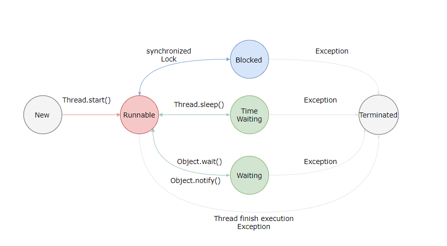

## 线程的状态转换



|        线程状态        |                                                       导致状态发生条件                                                        |
|:------------------:|:---------------------------------------------------------------------------------------------------------------------:|
|      NEW(新建)       |                                              线程刚被创建，但是并未启动。还没调用start方法。                                               |
|   Runnable(可运行)    |                                 线程可以在java虚拟机中运行的状态，可能正在运行自己代码，也可能没有，这取决于<br/>操作系统处理器                                  |
|    Blocked(锁阻塞)    |                     当一个线程试图获取一个对象锁，而该对象锁被其他的线程持有，则该线程进入Blocked状<br/>态；当该线程持有锁时，该线程将变成Runnable状态。                      |
|   Waiting(无限等待)    |            一个线程在等待另一个线程执行一个（唤醒）动作时，该线程进入Waiting状态。进入这个<br/>状态后是不能自动唤醒的，必须等待另一个线程调用notify或者notifyAll方法才能够唤醒            |
| TimedWaiting(计时等待) | 同waiting状态，有几个方法有超时参数，调用他们将进入Timed Waiting状态。<br/>这一状态将一直保持到超时期满或者接收到唤醒通知。带有超时参数的常用方法有Thread.sleep ,<br/>Object.wait。 |
|   Teminated(被终止)   |                                        因为run方法正常退出而死亡，或者因为没有捕获的异常终止了run方法而死亡。                                         |

## 线程的使用方式

1. 实现Runnable接口
2. 实现callable接口
3. 继承Thread类

实现 Runnable 和 Callable 接口的类只能当做一个可以在线程中运行的任务，不是真正意义上的线程，因此最后还需要通过 Thread
来调用。可以说任务是通过线程驱动从而执行的。

### 实现runnable接口

实现run()方法，通过Thread.start()方法启动线程

```java
public class MyRunnable implements Runnable {
    public void run() {
        // ...
    }
}
```

```java
public static void main(String[] args) {
    MyRunnable instance = new MyRunnable();
    Thread thread = new Thread(instance);
    thread.start();
}
```

### 实现callable接口

与 Runnable 相比，Callable 可以有返回值，返回值通过 FutureTask 进行封装。

```java
public class MyCallable implements Callable<Integer> {
    public Integer call() {
        return 123;
    }
}
```

```java
public static void main(String[] args) throws ExecutionException, InterruptedException {
    MyCallable mc = new MyCallable();
    FutureTask<Integer> ft = new FutureTask<>(mc);
    Thread thread = new Thread(ft);
    thread.start();
    System.out.println(ft.get());
}
```

#### Runnable和Callable区别

Java中的 `Runnable` 和 `Callable` 接口都是用于实现多线程的接口，但它们之间存在一些关键的区别：

**返回值**

* `Runnable` 接口的 `run()` 方法没有返回值，它只用于执行一段任务。
* `Callable` 接口的 `call()` 方法可以返回一个结果，这个结果可以是任意类型。

**异常处理**

* `Runnable` 接口的 `run()` 方法只能抛出运行时异常（unchecked exceptions），且无法捕获处理。
* `Callable` 接口的 `call()` 方法允许抛出任何类型的异常，包括检查型异常（checked exceptions）和运行时异常。

**使用场景**

* `Runnable` 接口通常用于执行那些不需要返回值的任务，例如更新 GUI 界面或进行 I/O 操作。
* `Callable` 接口通常用于执行那些需要返回值的任务，例如计算结果或从数据库中获取数据。

**以下表格总结了 `Runnable` 和 `Callable` 接口的主要区别：**

|  特性  | `Runnable` | `Callable`  |
|:----:|------------|-------------|
| 返回值  | 无          | 有           |
| 异常处理 | 只能抛出运行时异常  | 可以抛出任何类型的异常 |
| 使用场景 | 不需要返回值的任务  | 需要返回值的任务    |

**此外，`Callable` 接口还提供了以下优势：**

* 可以使用 `Future` 类来获取 `call()` 方法的返回值。
* 可以使用 `ExecutorService` 类来更轻松地管理多线程。

### 继承Thread类
同样也是需要实现 run() 方法，因为 Thread 类也实现了 Runable 接口。
当调用 start() 方法启动一个线程时，虚拟机会将该线程放入就绪队列中等待被调度，当一个线程被调度时会执行该线程的 run() 方法。
```java
public class MyThread extends Thread {
    public void run() {
        // ...
    }
}
```

```java
public static void main(String[] args) {
    MyThread mt = new MyThread();
    mt.start();
}
```


