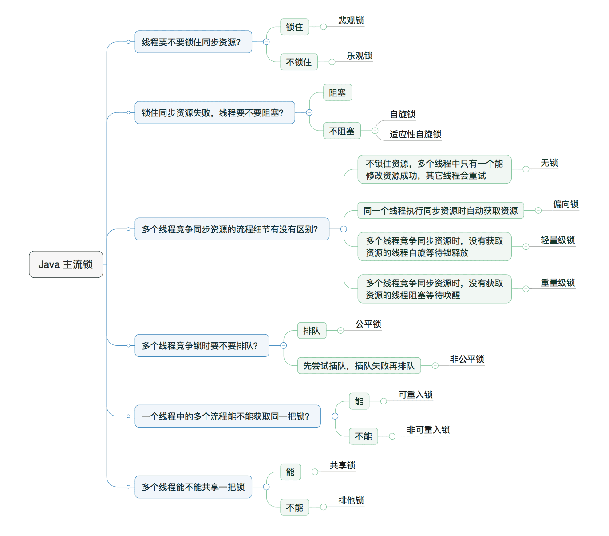
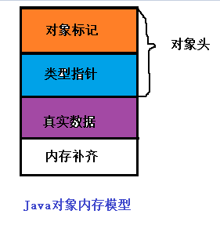
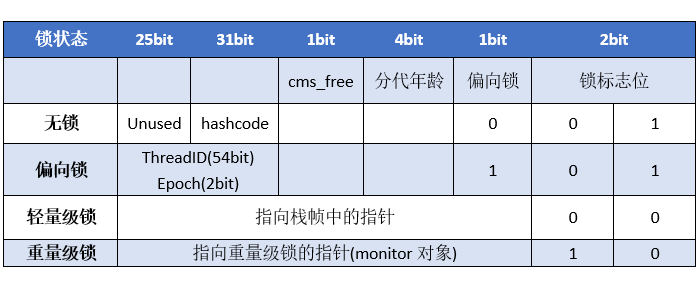
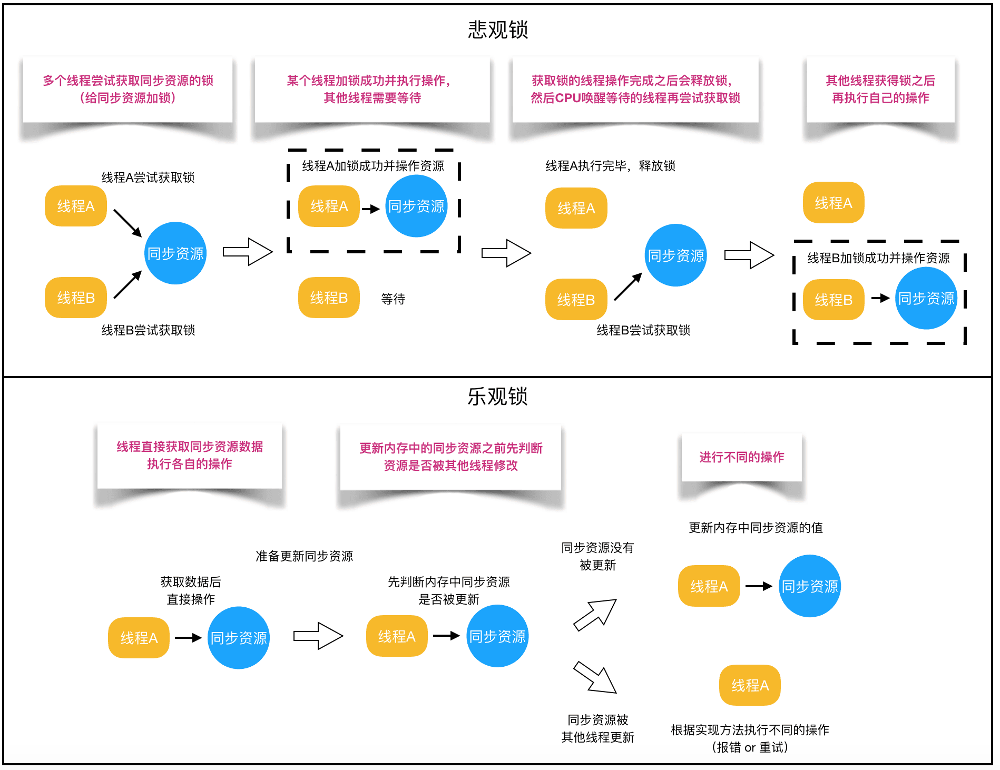
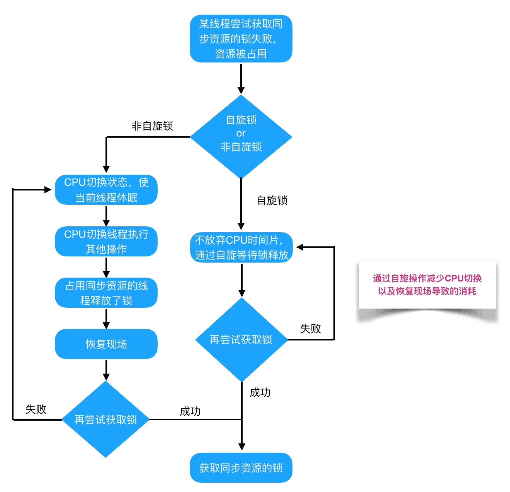
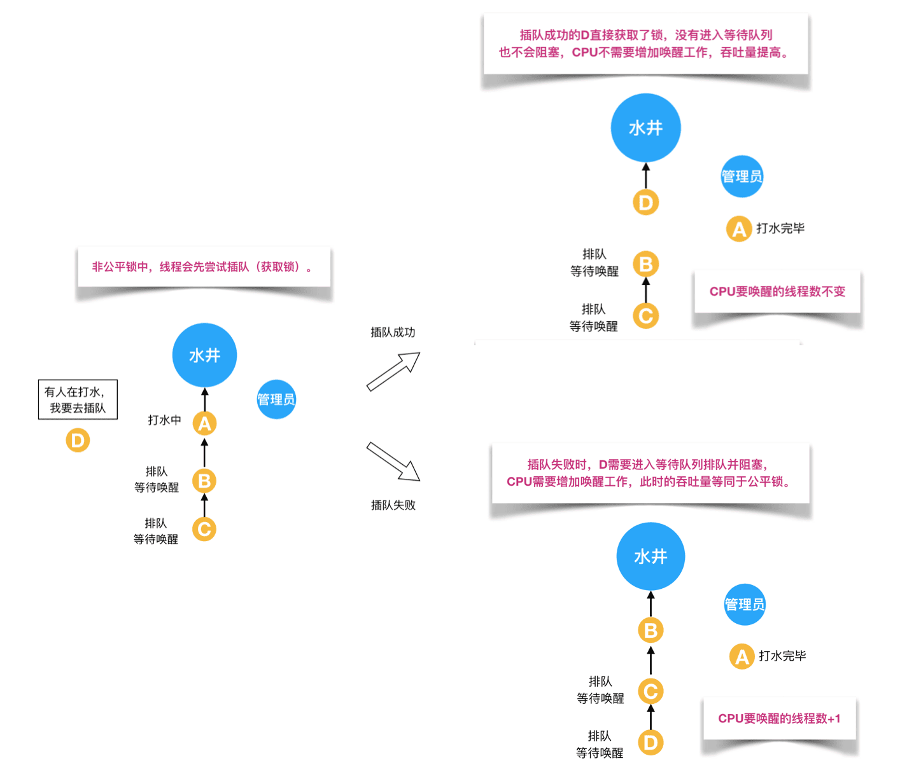

## Java对象内存模型



一个Java对象由，对象标记，类型指针，真实数据，内存对齐四部分组成。

- 对象标记也称Mark Word字段，存储当前对象的一些运行时数据。
- 类型指针，JVM根据该指针确定该对象是哪个类的实例化对象。
- 真实数据自然是对象的属性值。
- 内存补齐，是当数据不是对齐数的整数倍的时候，进行调整，使得对象的整体大小是对齐数的整数倍方便寻址。典型的以空间换时间的思想。

**其中对象标记和类型指针统称为Java对象头。**

##### Mark Word字段

Mark Word用于存储对象自身运行时的数据，如hashcode，GC分代年龄，锁状态标志位，线程持有的锁，偏向线程ID，等等。



##### 为社么Java的任意对象都可以作为锁？

**在Java对象头中，存在一个monitor对象**，每个对象自创建之后在对象头中就含有monitor对象，monitor是线程私有的，不同的对象monitor自然也是不同的，因此对象作为锁的本质是对象头中的monitor对象作为了锁。这便是为什么Java的任意对象都可以作为锁的原因。

> 当对象在**无锁的状态下进行了hashcode**的计算（equals方法等）时，无法进入到偏向锁的状态（**因为偏向锁会


## 乐观锁和悲观锁

:::tip
乐观锁和悲观锁是一种广义上的概念，在java和数据库相关操作中都有体现
:::
对于同一个数据的并发操作，悲观锁认为自己在使用数据的时候一定有别的线程来修改数据， 因此在获取数据的时候会先加锁，确保数据不会被别的线程修改。
1. Java中，`synchronized`关键字和`Lock`的实现类都是悲观锁。
2. 乐观锁认为自己在使用数据时不会有别的线程修改数据，所以不会添加锁，
只是在更新数据的时候去判断之前有没有别的线程更新了这个数据。
如果这个数据没有被更新，当前线程将自己修改的数据成功写入。
如果数据已经被其他线程更新，则根据不同的实现方式执行不同的操作（例如报错或者自动重试）。
乐观锁在Java中是通过使用无锁编程来实现，
最常采用的是`CAS算法`，Java原子类中的递增操作就通过CAS自旋实现的。


根据从上面的概念描述我们可以发现：

- **悲观锁适合写操作多的场景**，先加锁可以保证写操作时数据正确。
- **乐观锁适合读操作多的场景**，不加锁的特点能够使其读操作的性能大幅提升。

```java
// ------------------------- 悲观锁的调用方式 -------------------------
// synchronized
public synchronized void testMethod() {
	// 操作同步资源
}
// ReentrantLock
private ReentrantLock lock = new ReentrantLock(); // 需要保证多个线程使用的是同一个锁
public void modifyPublicResources() {
	lock.lock();
	// 操作同步资源
	lock.unlock();
}

// ------------------------- 乐观锁的调用方式 -------------------------
private AtomicInteger atomicInteger = new AtomicInteger();  // 需要保证多个线程使用的是同一个AtomicInteger
atomicInteger.incrementAndGet(); //执行自增1
```

通过调用方式示例，我们可以发现悲观锁基本都是在显式的锁定之后再操作同步资源，而乐观锁则直接去操作同步资源
乐观锁详见 [JUC原子类，CAS，Unsafe](08.JUC%E5%8E%9F%E5%AD%90%E7%B1%BB%EF%BC%8CCAS%EF%BC%8CUnsafe.md)


## 自旋锁

**自旋锁**是一种**忙等待**的同步机制，当一个线程试图获取锁时，它会**不断循环尝试获取锁**，直到成功为止。如果锁已经被其他线程持有，则当前线程不会进入阻塞状态，而是继续循环等待。

### 自旋锁的原理

自旋锁的原理是利用 CPU 的缓存机制来提高效率。当一个线程试图获取锁时，它会首先检查锁的状态。如果锁是空闲的，则当前线程就可以立即获取锁。如果锁已经被其他线程持有，则当前线程会进入一个循环，不断检查锁的状态。由于锁的状态通常存储在 CPU 的缓存中，因此检查锁的状态的开销很小。

### 自旋锁的优点

* **效率高**：自旋锁的效率通常比其他类型的锁更高，因为它们不需要使线程进入阻塞状态。
* **可伸缩性好**：自旋锁的可伸缩性好，因为它们不需要使用额外的同步机制，例如等待队列。

### 自旋锁的缺点

* **可能导致 CPU 浪费**：如果锁被竞争得很激烈，则自旋锁可能会导致 CPU 浪费，因为所有等待获取锁的线程都会一直循环检查锁的状态。
* **不适用于长等待时间的情况**：如果锁的持有时间很长，则自旋锁可能会降低效率，因为等待的线程会一直占用 CPU 资源。

### 自旋锁的应用场景

自旋锁通常用于**竞争不激烈的情况**，例如：

* 短小的临界区
* 访问频率高的共享资源
* 多核 CPU 环境

### Java 中的自旋锁实现

Java 中的自旋锁可以使用 `AbstractQueuedSynchronizer` (AQS) 抽象类的 `tryAcquire(int acquires)` 方法来实现。该方法会尝试获取锁，如果成功则返回 `true`，否则返回 `false`。如果锁已经被其他线程持有，则当前线程会**在有限的次数内**继续尝试获取锁，如果**仍然失败**则会进入阻塞状态。

以下是一些 Java 中常用的自旋锁实现：

* `java.util.concurrent.locks.ReentrantLock` 类的 `tryLock()` 方法
* `java.util.concurrent.atomic.AtomicInteger` 类的 `compareAndSet()` 方法
* `java.util.concurrent.locks.AbstractQueuedSynchronizer` 类的 `tryAcquire(int acquires)` 方法

### 总结

自旋锁是一种高效的同步机制，但**只适用于竞争不激烈的情况**。在选择使用自旋锁时，应根据具体的应用场景进行权衡。


## 公平锁和非公平锁
公平锁是指多个线程按照申请锁的顺序来获取锁，线程直接进入队列中排队，队列中的第一个线程才能获得锁。
公平锁的优点
1. 是等待锁的线程不会饿死。

公平锁的缺点
1. 是整体吞吐效率相对非公平锁要低，等待队列中除第一个线程以外的所有线程都会阻塞，CPU唤醒阻塞线程的开销比非公平锁大。

非公平锁是多个线程加锁时直接尝试获取锁，获取不到才会到等待队列的队尾等待。
但如果此时锁刚好可用，那么这个线程可以无需阻塞直接获取到锁，
所以非公平锁有可能出现后申请锁的线程先获取锁的场景。非公平锁的优点是可以减少唤起线程的开销，
整体的吞吐效率高，因为线程有几率不阻塞直接获得锁，CPU不必唤醒所有线程。
缺点是处于等待队列中的线程可能会饿死，或者等很久才会获得锁。



## 可重入锁和非可重入锁

**可重入锁**是指同一个线程可以重复获取同一把锁。在 Java 中，`synchronized` 关键字和 `ReentrantLock` 类都是可重入锁。

**非可重入锁**是指同一个线程只能获取同一把锁一次。如果线程再次尝试获取已持有的锁，则会发生死锁。Java 中的非可重入锁很少见，通常只在某些特定情况下使用。

### 可重入锁的优点

* **避免死锁**：可重入锁可以防止同一个线程重复获取同一把锁，从而避免死锁。
* **提高代码的可读性和可维护性**：可重入锁的使用可以使代码更加清晰易懂，更容易维护。

### 非可重入锁的优点

* **效率更高**：非可重入锁的实现通常比可重入锁更简单，因此效率更高。
* **占用更少的内存**：非可重入锁通常需要更少的内存空间来存储锁状态。

### 可重入锁和非可重入锁的应用场景

* **可重入锁**通常用于需要同步访问共享资源的代码块，例如银行账户转账操作。
* **非可重入锁**通常用于需要确保代码块只能被一个线程执行的情况，例如创建单例对象。

### 如何区分可重入锁和非可重入锁

在 Java 中，区分可重入锁和非可重入锁的最简单方法是查看锁的实现。`synchronized` 关键字和 `ReentrantLock` 类是可重入锁，而其他类型的锁可能是非可重入锁。

以下是一些常见的非可重入锁：

* `java.util.concurrent.locks.AbstractQueuedSynchronizer` 类的某些子类，例如 `ReentrantLock` 和 `Semaphore`
* `java.util.concurrent.locks.ReadWriteLock` 类的读写锁

### 总结

可重入锁和非可重入锁都是 Java 中用于同步多线程访问共享资源的机制。可重入锁可以避免死锁，提高代码的可读性和可维护性，但效率较低并占用更多的内存。非可重入锁效率更高并占用更少的内存，但可能导致死锁。在选择使用哪种类型的锁时，应根据具体的应用场景进行权衡。


## 独享锁（排他锁）和共享锁

**独享锁（排他锁）**是指**一次只能被一个线程持有的锁**。获得独享锁的线程可以对共享资源进行读写操作。其他线程在当前线程持有独享锁期间不能对共享资源进行任何操作，直到该线程释放独享锁。

**共享锁**是指**允许多个线程同时持有的锁**。获得共享锁的线程只能对共享资源进行读取操作，不能进行修改操作。其他线程可以同时获得共享锁，但不能在已经有线程持有共享锁的情况下获得独享锁。

### 独享锁和共享锁的比较

| 特性 | 独享锁 | 共享锁 |
|---|---|---|
| 持有线程数 | 一个 | 多个 |
| 操作类型 | 读写 | 只读 |
| 互斥性 | 强 | 弱 |
| 效率 | 较低 | 较高 |
| 适用场景 | 需要对共享资源进行独占访问的情况 | 需要对共享资源进行并发读取的情况 |

### 独享锁和共享锁的实现

Java 中的独享锁和共享锁都是通过 **AbstractQueuedSynchronizer** (AQS) 抽象类来实现的。AQS 提供了一套用于实现同步机制的基本方法，例如 `acquire`、`release` 和 `tryAcquire`。

独享锁通常是通过 AQS 的 `tryAcquire(int acquires)` 方法来实现的。该方法会尝试获取锁，如果成功则返回 `true`，否则返回 `false`。如果锁已经被其他线程持有，则当前线程会阻塞，直到该线程释放锁。

共享锁通常是通过 AQS 的 `hasQueuedThread` 方法来实现的。该方法会检查是否有其他线程正在等待获取锁，如果**没有**则当前线程可以获取锁，否则当前线程会加入等待队列。

### 独享锁和共享锁的应用场景

**独享锁**通常用于需要对共享资源进行**独占访问**的情况，例如：

* 银行账户转账操作
* 文件读写操作
* 数据库更新操作

**共享锁**通常用于需要对共享资源进行**并发读取**的情况，例如：

* 缓存数据读取
* 商品信息查询
* 日志文件读取

### 总结

独享锁和共享锁都是 Java 中用于同步多线程访问共享资源的机制。独享锁可以确保共享资源在同一时间只能被一个线程访问，而共享锁可以允许多个线程同时读取共享资源。在选择使用哪种类型的锁时，应根据具体的应用场景进行权衡。