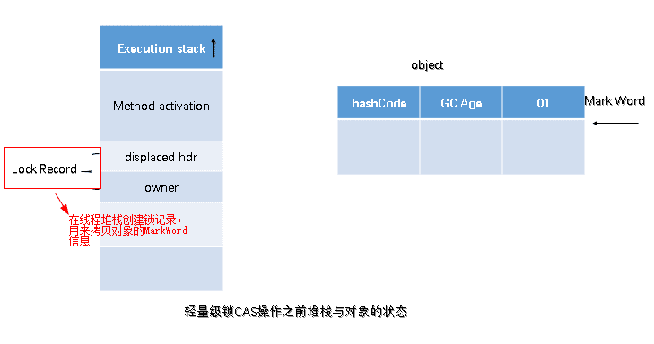
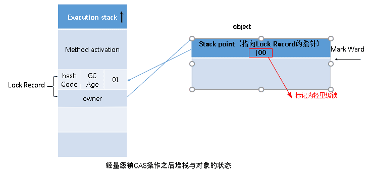
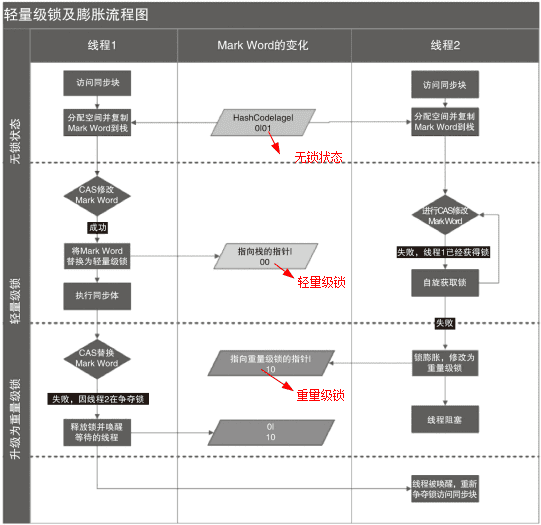
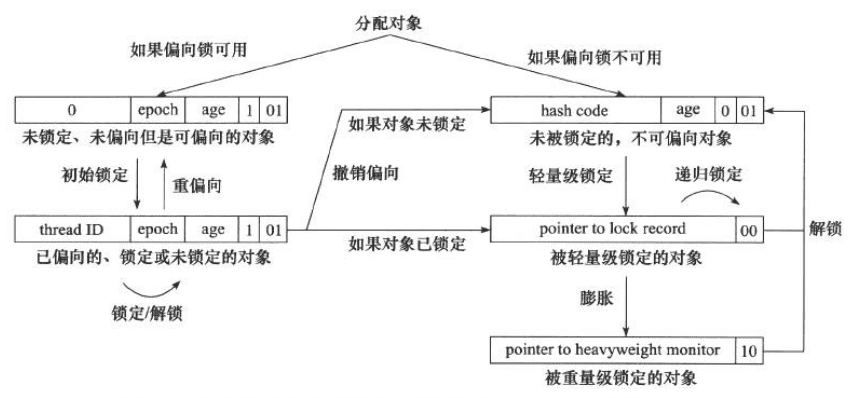

## Java对象内存模型


一个Java对象由，对象标记，类型指针，真实数据，内存对齐四部分组成。

- 对象标记也称Mark Word字段，存储当前对象的一些运行时数据。
- 类型指针，JVM根据该指针确定该对象是哪个类的实例化对象。
- 真实数据自然是对象的属性值。
- 内存补齐，是当数据不是对齐数的整数倍的时候，进行调整，使得对象的整体大小是对齐数的整数倍方便寻址。典型的以空间换时间的思想。

**其中对象标记和类型指针统称为Java对象头。**

##### Mark Word字段

Mark Word用于存储对象自身运行时的数据，如hashcode，GC分代年龄，锁状态标志位，线程持有的锁，偏向线程ID，等等。


##### 为社么Java的任意对象都可以作为锁？

**在Java对象头中，存在一个monitor对象**
，每个对象自创建之后在对象头中就含有monitor对象，monitor是线程私有的，不同的对象monitor自然也是不同的，因此对象作为锁的本质是对象头中的monitor对象作为了锁。这便是为什么Java的任意对象都可以作为锁的原因。

> 从上图中可以看到，当对象在**无锁的状态下进行了hashcode**的计算（equals方法等）时，无法进入到偏向锁的状态，
> 因为在虚拟机中对象的偏向锁标记和HashCode使用的是同一份内存 ，因此在计算HashCode时，会将对象的偏向锁标记清除。
> 同时计算HashCode也会导致线程从偏向锁退出到无所状态。

## 乐观锁和悲观锁

:::tip
乐观锁和悲观锁是一种广义上的概念，在java和数据库相关操作中都有体现
:::
对于同一个数据的并发操作，悲观锁认为自己在使用数据的时候一定有别的线程来修改数据， 因此在获取数据的时候会先加锁，确保数据不会被别的线程修改。

1. Java中，`synchronized`关键字和`Lock`的实现类都是悲观锁。
2. 乐观锁认为自己在使用数据时不会有别的线程修改数据，所以不会添加锁，
   只是在更新数据的时候去判断之前有没有别的线程更新了这个数据。
   如果这个数据没有被更新，当前线程将自己修改的数据成功写入。
   如果数据已经被其他线程更新，则根据不同的实现方式执行不同的操作（例如报错或者自动重试）。
   乐观锁在Java中是通过使用无锁编程来实现，
   最常采用的是`CAS算法`，Java原子类中的递增操作就通过CAS自旋实现的。
   

根据从上面的概念描述我们可以发现：

- **悲观锁适合写操作多的场景**，先加锁可以保证写操作时数据正确。
- **乐观锁适合读操作多的场景**，不加锁的特点能够使其读操作的性能大幅提升。

```java
// ------------------------- 悲观锁的调用方式 -------------------------
// synchronized
public synchronized void testMethod() {
    // 操作同步资源
}

// ReentrantLock
private ReentrantLock lock = new ReentrantLock(); // 需要保证多个线程使用的是同一个锁

public void modifyPublicResources() {
    lock.lock();
    // 操作同步资源
    lock.unlock();
}

// ------------------------- 乐观锁的调用方式 -------------------------
private AtomicInteger atomicInteger = new AtomicInteger();  // 需要保证多个线程使用的是同一个AtomicInteger
atomicInteger.

incrementAndGet(); //执行自增1
```

通过调用方式示例，我们可以发现悲观锁基本都是在显式的锁定之后再操作同步资源，而乐观锁则直接去操作同步资源
乐观锁详见 [JUC原子类，CAS，Unsafe](08.JUC%E5%8E%9F%E5%AD%90%E7%B1%BB%EF%BC%8CCAS%EF%BC%8CUnsafe.md)

## 自旋锁


**自旋锁**是一种**忙等待**的同步机制，当一个线程试图获取锁时，它会**不断循环尝试获取锁**
，直到成功为止。如果锁已经被其他线程持有，则当前线程不会进入阻塞状态，而是继续循环等待。

### 自旋锁的原理

自旋锁的原理是利用 CPU
的缓存机制来提高效率。当一个线程试图获取锁时，它会首先检查锁的状态。如果锁是空闲的，则当前线程就可以立即获取锁。如果锁已经被其他线程持有，则当前线程会进入一个循环，不断检查锁的状态。由于锁的状态通常存储在
CPU 的缓存中，因此检查锁的状态的开销很小。

### 自旋锁的优点

* **效率高**：自旋锁的效率通常比其他类型的锁更高，因为它们不需要使线程进入阻塞状态。
* **可伸缩性好**：自旋锁的可伸缩性好，因为它们不需要使用额外的同步机制，例如等待队列。

### 自旋锁的缺点

* **可能导致 CPU 浪费**：如果锁被竞争得很激烈，则自旋锁可能会导致 CPU 浪费，因为所有等待获取锁的线程都会一直循环检查锁的状态。
* **不适用于长等待时间的情况**：如果锁的持有时间很长，则自旋锁可能会降低效率，因为等待的线程会一直占用 CPU 资源。

### 自旋锁的应用场景

自旋锁通常用于**竞争不激烈的情况**，例如：

* 短小的临界区
* 访问频率高的共享资源
* 多核 CPU 环境

### Java 中的自旋锁实现

Java 中的自旋锁可以使用 `AbstractQueuedSynchronizer` (AQS) 抽象类的 `tryAcquire(int acquires)`
方法来实现。该方法会尝试获取锁，如果成功则返回 `true`，否则返回 `false`。如果锁已经被其他线程持有，则当前线程会**在有限的次数内
**继续尝试获取锁，如果**仍然失败**则会进入阻塞状态。

以下是一些 Java 中常用的自旋锁实现：

* `java.util.concurrent.locks.ReentrantLock` 类的 `tryLock()` 方法
* `java.util.concurrent.atomic.AtomicInteger` 类的 `compareAndSet()` 方法
* `java.util.concurrent.locks.AbstractQueuedSynchronizer` 类的 `tryAcquire(int acquires)` 方法

### 总结

自旋锁是一种高效的同步机制，但**只适用于竞争不激烈的情况**。在选择使用自旋锁时，应根据具体的应用场景进行权衡。

## 公平锁和非公平锁

公平锁是指多个线程按照申请锁的顺序来获取锁，线程直接进入队列中排队，队列中的第一个线程才能获得锁。
公平锁的优点

1. 是等待锁的线程不会饿死。

公平锁的缺点

1. 是整体吞吐效率相对非公平锁要低，等待队列中除第一个线程以外的所有线程都会阻塞，CPU唤醒阻塞线程的开销比非公平锁大。

非公平锁是多个线程加锁时直接尝试获取锁，获取不到才会到等待队列的队尾等待。
但如果此时锁刚好可用，那么这个线程可以无需阻塞直接获取到锁，
所以非公平锁有可能出现后申请锁的线程先获取锁的场景。非公平锁的优点是可以减少唤起线程的开销，
整体的吞吐效率高，因为线程有几率不阻塞直接获得锁，CPU不必唤醒所有线程。
缺点是处于等待队列中的线程可能会饿死，或者等很久才会获得锁。


## 可重入锁和非可重入锁

**可重入锁**是指同一个线程可以重复获取同一把锁。在 Java 中，`synchronized` 关键字和 `ReentrantLock` 类都是可重入锁。

**非可重入锁**是指同一个线程只能获取同一把锁一次。如果线程再次尝试获取已持有的锁，则会发生死锁。Java
中的非可重入锁很少见，通常只在某些特定情况下使用。

### 可重入锁的优点

* **避免死锁**：可重入锁可以防止同一个线程重复获取同一把锁，从而避免死锁。
* **提高代码的可读性和可维护性**：可重入锁的使用可以使代码更加清晰易懂，更容易维护。

### 非可重入锁的优点

* **效率更高**：非可重入锁的实现通常比可重入锁更简单，因此效率更高。
* **占用更少的内存**：非可重入锁通常需要更少的内存空间来存储锁状态。

### 可重入锁和非可重入锁的应用场景

* **可重入锁**通常用于需要同步访问共享资源的代码块，例如银行账户转账操作。
* **非可重入锁**通常用于需要确保代码块只能被一个线程执行的情况，例如创建单例对象。

### 如何区分可重入锁和非可重入锁

在 Java 中，区分可重入锁和非可重入锁的最简单方法是查看锁的实现。`synchronized` 关键字和 `ReentrantLock`
类是可重入锁，而其他类型的锁可能是非可重入锁。

以下是一些常见的非可重入锁：

* `java.util.concurrent.locks.AbstractQueuedSynchronizer` 类的某些子类，例如 `Semaphore`
* `java.util.concurrent.locks.ReadWriteLock` 类的读写锁

### 总结

可重入锁和非可重入锁都是 Java
中用于同步多线程访问共享资源的机制。可重入锁可以避免死锁，提高代码的可读性和可维护性，但效率较低并占用更多的内存。非可重入锁效率更高并占用更少的内存，但可能导致死锁。在选择使用哪种类型的锁时，应根据具体的应用场景进行权衡。

## 独享锁（排他锁）和共享锁

**独享锁（排他锁）**是指**一次只能被一个线程持有的锁**。获得独享锁的线程可以对共享资源进行读写操作。其他线程在当前线程持有独享锁期间不能对共享资源进行任何操作，直到该线程释放独享锁。

**共享锁**是指**允许多个线程同时持有的锁**。获得共享锁的线程只能对共享资源进行读取操作，不能进行修改操作。其他线程可以同时获得共享锁，但不能在已经有线程持有共享锁的情况下获得独享锁。

### 独享锁和共享锁的比较

| 特性    | 独享锁              | 共享锁              |
|-------|------------------|------------------|
| 持有线程数 | 一个               | 多个               |
| 操作类型  | 读写               | 只读               |
| 互斥性   | 强                | 弱                |
| 效率    | 较低               | 较高               |
| 适用场景  | 需要对共享资源进行独占访问的情况 | 需要对共享资源进行并发读取的情况 |

### 独享锁和共享锁的实现

Java 中的独享锁和共享锁都是通过 **AbstractQueuedSynchronizer** (AQS) 抽象类来实现的。AQS
提供了一套用于实现同步机制的基本方法，例如 `acquire`、`release` 和 `tryAcquire`。

独享锁通常是通过 AQS 的 `tryAcquire(int acquires)` 方法来实现的。该方法会尝试获取锁，如果成功则返回 `true`
，否则返回 `false`。如果锁已经被其他线程持有，则当前线程会阻塞，直到该线程释放锁。

共享锁通常是通过 AQS 的 `hasQueuedThread` 方法来实现的。该方法会检查是否有其他线程正在等待获取锁，如果**没有**
则当前线程可以获取锁，否则当前线程会加入等待队列。

### 独享锁和共享锁的应用场景

**独享锁**通常用于需要对共享资源进行**独占访问**的情况，例如：

* 银行账户转账操作
* 文件读写操作
* 数据库更新操作

**共享锁**通常用于需要对共享资源进行**并发读取**的情况，例如：

* 缓存数据读取
* 商品信息查询
* 日志文件读取

### 总结

独享锁和共享锁都是 Java 中用于同步多线程访问共享资源的机制。独享锁可以确保共享资源在同一时间只能被一个线程访问，而共享锁可以允许多个线程同时读取共享资源。在选择使用哪种类型的锁时，应根据具体的应用场景进行权衡。

## JVM中锁的优化

1. 锁升级: 优先加轻量级的锁
2. 自旋锁: 对轻量级锁升级重量级锁时候的一种优化
3. 锁消除: 对于线程的私有变量，不存在并发问题，没有必要加锁，即使加锁编译后，也会去掉
4. 锁粗化: 当一个循环中存在加锁操作时，可以将加锁操作提到循环外面执行，一次加锁代替多次加锁，提升性能。
5. 轻量级锁
6. 偏向锁: 优先上次获取到锁

### JVM中锁的分类及锁升级机制


| **特性**     | **无锁**           | **偏向锁**       | **轻量级锁**     | **重量级锁**              |
| ------------ | ------------------ | ---------------- | ---------------- | ------------------------- |
| **适用场景** | 单线程，非同步场景 | 单线程，低竞争   | 少量线程竞争     | 多线程高并发              |
| **实现机制** | 无锁               | Mark Word 标记   | CAS + 自旋       | 操作系统互斥锁            |
| **性能**     | 最高               | 高               | 中               | 低                        |
| **锁升级**   | 可升级为偏向锁     | 可升级为轻量级锁 | 可升级为重量级锁 | 不会再升级                |
| **锁降级**   | 不可降级           | 不可降级         | 不可降级         | GC 时可能降级（特殊情况） |

#### 偏向锁

偏向锁针对的是锁不存在竞争，每次仅有一个线程来获取该锁，为了提高获取锁的效率，因此将该锁偏向该线程。提升性能。

**偏向锁的获取：**

> 1. 首先检测是否为可偏向状态（锁标识是否设置成1，锁标志位是否为01）.
> 2. 如果处于可偏向状态，测试Mark Word中的线程ID是否指向自己，如果是，不需要再次获取锁，直接执行同步代码。
> 3. 如果线程Id，不是自己的线程Id，通过CAS获取锁，获取成功表明当前偏向锁不存在竞争，获取失败，则说明当前偏向锁存在
> 锁竞争，偏向锁膨胀为轻量级锁。

**偏向锁的撤销：**

偏向锁只有当出现竞争时，才会出现偏向锁撤销,锁会自动升级为轻量级锁或重量级锁，可以通过参数关闭jvm的偏向锁。
```shell
-XX:-UseBiasedLocking
```

::: tip 特殊说明
当线程计算了hashcode的时候，会将偏向锁标记清除,锁会自动升级为轻量级锁或重量级锁（对象头中偏向锁的线程id和hashcode存储位置一样导致无法同时存在）
:::

> 1. 等待一个全局安全点，此时所有的线程都是暂停的，检查持有锁的线程状态，如果能找到说明当前线程还存活，
> 说明还在执行同步块中的代码，首先将该线程阻塞，然后进行锁升级，升级到轻量级锁，唤醒该线程继续执行代同步码。
>
> 2. 如果持有偏向锁的线程未存活，将对象头中的线程置null，然后直接锁升级。

#### 轻量级锁

偏向锁考虑的是不存在多个线程竞争同一把锁，而轻量级锁考虑的是，多个线程不会在同一时刻来竞争同一把锁。

**轻量级锁的获取：**

> 1. 在线程的栈帧中创建用于存储锁记录得空间，
>
> 2. 并将Mark Word复制到锁记录中，（这一步不论是否存在竞争都可以执行）。
>
> 3. 尝试使用CAS将对象头中得Mark word字段变成指向锁记录得指针。
>
> 4. 操作成功，不存在锁竞争，执行同步代码。
>
> 5. 操作失败，锁已经被其它线程抢占了，这时轻量级锁膨胀为重量级锁。

**轻量级锁得释放：**

使用CAS将栈帧中得锁录空间替换到对象头，成功没有锁竞争，锁得以释放，失败说明存在竞争，那块指向锁记录得指针有别的线程在用，因此锁膨胀升级为重量级锁。

#### 重量级锁

重量级锁描述同一时刻有多个线程竞争同一把锁。

> 当多个线程共同竞争同一把锁时，竞争失败得锁会被阻塞，等到持有锁的线程将锁释放后再次唤醒阻塞的线程，因为线程的唤醒和阻塞是一个很耗费CPU资源的操作，因此此处采取自适应自旋来获取重量级锁来获取重量级锁。

#### 锁的升级

**升级过程不可逆(不是释放)**
> 无锁 –-> 偏向锁 ---> 轻量级锁 ---> 重量级锁

### 自旋锁和自适应自旋锁

自旋锁和自适应自旋锁都是Java中常用的锁机制，用于在多线程环境下控制对共享资源的访问。它们的主要区别在于自旋等待的时间不同。

#### 自旋锁

自旋锁是一种乐观锁，它会**不断尝试获取锁**，直到成功为止。如果在自旋等待期间锁被其他线程占用，当前线程会**一直循环**
，继续尝试获取锁。

自旋锁的优点是效率较高，因为它**不需要像重量级锁那样**进入操作系统内核进行阻塞。但是，自旋锁的缺点是**可能会占用大量的CPU时间**，尤其是当锁被占用时间较长时。

#### 自适应自旋锁

自适应自旋锁是一种**更加智能**的自旋锁。它会**根据以往获取锁的成功率来调整自旋等待的时间**
。如果以往获取锁的成功率较高，则自旋等待的时间会更长；如果以往获取锁的成功率较低，则自旋等待的时间会更短，甚至直接放弃自旋等待。

自适应自旋锁的优点是**兼顾了效率和公平性**。它能够在大多数情况下快速获取锁，同时也能避免在锁被占用时间较长时占用大量的CPU时间。

#### 比较

| 特性     | 自旋锁           | 自适应自旋锁   |
|--------|---------------|----------|
| 自旋等待时间 | 固定            | 自适应      |
| 优点     | 效率高           | 兼顾效率和公平性 |
| 缺点     | 可能会占用大量的CPU时间 | 实现复杂度较高  |

#### 使用场景

* **自旋锁**适用于**锁被占用时间较短**的情况，例如获取锁的代码块**执行时间很短**。
* **自适应自旋锁**适用于**锁被占用时间不确定**的情况，例如获取锁的代码块**执行时间**可能**很短**，也可能**很长**。

### 锁消除

锁消除是Java虚拟机（JVM）在运行时对一些代码上要求同步，但被检测到不可能存在共享数据竞争的锁进行消除的一种优化手段。

#### 原理

锁消除是基于**逃逸分析**技术的。逃逸分析是指分析对象的使用情况，判断对象是否可能逃逸出当前方法或线程的范围。如果一个对象不会逃逸出当前方法或线程的范围，则该对象是线程私有的，对其进行同步操作是没有必要的。

JVM通过分析代码可以发现一些**不可能存在共享数据竞争**的情况，例如：

* 对**final**修饰的变量的读写操作
* 对**局部变量**的读写操作
* 对**栈上对象**的读写操作


在这些情况下，JVM会消除相应的同步锁，从而提高程序的性能。

#### 优点

锁消除的优点是**提高程序的性能**。通过消除不必要的同步锁，可以减少对CPU资源的占用，提高程序的运行速度。

#### 缺点

锁消除的缺点是**具有一定的局限性**。它只能消除一些**特定情况**下的同步锁，并不能完全替代同步锁。

#### 使用场景

锁消除通常适用于以下场景：

* 对**final**修饰的变量进行读写操作
* 对**局部变量**进行读写操作
* 对**栈上对象**进行读写操作

#### 举例

以下代码中的同步锁可以被消除：

```java
public class Test {
    private final int num = 10;

    public void m() {
        synchronized (this) {
            System.out.println(num);
        }
    }
}
```

在上述代码中，`num`变量是**final**修饰的，因此它是线程私有的，对其进行同步操作是没有必要的。JVM会消除该同步锁，从而提高程序的性能。

### 锁粗化

锁粗化（Lock Coarsening）是一种**将多个细粒度的锁合并成一个粗粒度的锁**的优化技术，它旨在减少锁的加锁和解锁操作的次数，从而提高Java程序的并发性能。

#### 原理

锁粗化是基于这样一个假设：**如果一组操作都是对同一个共享资源进行操作，那么将这组操作的锁合并成一个粗粒度的锁，通常会比对每个操作单独加锁要高效
**。

例如，以下代码中的锁可以被粗化为一个粗粒度的锁：

```java
public class Test {
    private int num1 = 0;
    private int num2 = 0;

    public void m() {
        synchronized (this) {
            num1++;
            num2++;
        }
    }
}
```

在上述代码中，`m()`方法对`num1`和`num2`两个变量进行了操作。这两个变量都是线程私有的，因此可以将对它们的同步操作合并成一个粗粒度的锁。

#### 优点

锁粗化的优点是**提高程序的并发性能**。通过减少锁的加锁和解锁操作的次数，可以减少对CPU资源的占用，提高程序的运行速度。

#### 缺点

锁粗化的缺点是**可能会降低某些情况下的同步性**。如果多个线程同时竞争同一个粗粒度的锁，那么这些线程的执行效率会降低。

#### 使用场景

锁粗化通常适用于以下场景：

* 对**同一个共享资源进行多个操作**
* **多个操作的锁竞争概率较低**

#### 举例

以下代码中的锁可以被粗化为一个粗粒度的锁：

```java
public class Test {
    private List<Integer> list = new ArrayList<>();

    public void add(int num) {
        synchronized (list) {
            list.add(num);
        }
    }

    public int get(int index) {
        synchronized (list) {
            return list.get(index);
        }
    }
}
```

在上述代码中，`add()`方法和`get()`方法都对`list`变量进行了操作。`list`变量是一个线程安全的集合，因此可以将对它的同步操作合并成一个粗粒度的锁。

### 轻量级锁

在线程执行同步块之前，JVM会先在当前线程的栈帧中创建一个名为锁记录(Lock Record)的空间，用于存储锁对象目前的Mark Word的拷贝(
JVM会将对象头中的Mark Word拷贝到锁记录中，官方称为Displaced Mark Word)这个时候线程堆栈与对象头的状态如图：

如上图所示：如果当前对象没有被锁定，那么锁标志位为01状态，JVM在执行当前线程时，首先会在当前线程栈帧中创建锁记录Lock
Record的空间用于存储锁对象目前的Mark Word的拷贝。​ 然后，虚拟机使用CAS操作将标记字段Mark Word拷贝到锁记录中，并且将Mark
Word更新为指向Lock Record的指针。如果更新成功了，那么这个线程就拥用了该对象的锁，并且对象Mark Word的锁标志位更新为(Mark
Word中最后的2bit)00，即表示此对象处于轻量级锁定状态，如图：



如果这个更新操作失败，JVM会检查当前的`Mark Word`中是否存在指向当前线程的栈帧的指针，
如果有，说明该锁已经被获取，可以直接调用。如果没有，则说明该锁被其他线程抢占了，
如果有两条以上的线程竞争同一个锁，那轻量级锁就不再有效，直接膨胀为重量级锁，没有获得锁的线程会被阻塞。
此时，锁的标志位为10.Mark Word中存储的指向重量级锁的指针。轻量级解锁时，
会使用原子的CAS操作将Displaced Mark Word替换回到对象头中，如果成功，则表示没有发生竞争关系。
如果失败，表示当前锁存在竞争关系。锁就会膨胀成重量级锁。两个线程同时争夺锁，导致锁膨胀的流程图如下：


### 偏向锁

当一个线程访问同步块并获取锁时，会在对象头和栈帧中的锁记录里存储锁偏向的线程ID，
以后该线程在进入和退出同步块时不需要进行CAS操作来加锁和解锁。
只需要简单的测试一下对象头的Mark Word里是否存储着指向当前线程的偏向锁。如果成功，表示线程已经获取到了锁。



#### 偏向锁的撤销

Java 中的偏向锁撤销指的是一种情况，当一个对象被多个线程竞争访问时，原本已经偏向于某个线程的偏向锁可能会被撤销，从而使锁升级为轻量级锁或重量级锁。这个过程通常发生在存在竞争的情况下，JVM
会观察到偏向锁的竞争，如果竞争的情况比较严重，就会撤销偏向锁。

偏向锁撤销的目的是为了提高并发性能。因为一旦对象的偏向锁被撤销，就意味着锁的所有权将不再针对特定的线程，而是要进行竞争了。这可以防止某个线程长时间独占锁而导致其他线程等待，从而提高程序的并发性能。

在 Java 中，偏向锁的撤销通常发生在以下情况下：

1. 当前持有偏向锁的线程不再活跃，即长时间没有获取锁。
2. 当前持有偏向锁的线程尝试获取锁失败。
3. 对象被多个线程竞争访问。
4. 当前对象获取了偏向锁，但是在后续的执行过程中，对象的锁标志位发生了变化，例如计算了hashcode。

<font color=red>一旦偏向锁被撤销，JVM 将会将锁状态升级为轻量级锁或重量级锁</font>，具体升级为哪种锁取决于竞争的情况和对象的锁状态。

总的来说，偏向锁的撤销是 JVM 在高并发情况下的一种优化策略，以提高程序的并发性能。

