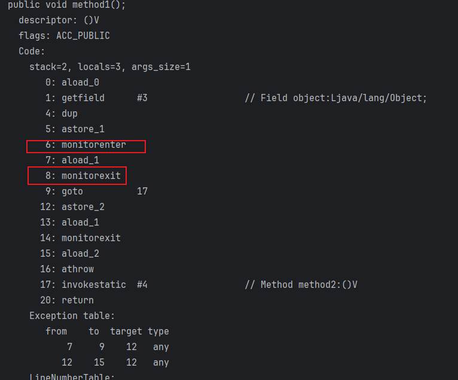
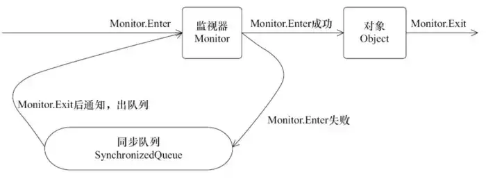

## Synchronized 的对象锁和类锁：深入理解

**Synchronized** 关键字是 Java 中用于实现同步的重要机制，它可以作用于 **方法** 和 **代码块** 两种地方，用于解决多线程并发访问导致的安全问题。

### 对象锁：细粒度同步

**对象锁** 的作用范围是 **对象**，意味着只有持有该对象锁的线程才能访问该对象的状态。它通常用于同步 **实例方法** 和 **代码块
**，确保每次只有一个线程执行这些代码，从而防止数据竞争和不一致性。

例如，考虑以下代码：

```java
class Counter {
    private int count = 0;

    public synchronized void increment() {
        count++;
    }
}
```

在这个例子中，`increment()` 方法被 `synchronized` 关键字修饰，因此它是一个 **同步方法**
。这意味着每次只有一个线程可以执行该方法。当一个线程调用 `increment()` 方法时，它会先获取该方法的锁。如果另一个线程试图同时调用该方法，它将被阻塞，直到第一个线程释放锁。

**对象锁的优点:**

* 它是 Java 中最简单的同步机制。
* 易于理解和使用。
* 在 **单一对象** 的访问场景中，它能很好地保证数据的完整性。

**对象锁的缺点:**

* 可能导致性能下降，因为每次只有一个线程可以执行同步方法或代码块。
* 容易造成 **死锁**，如果两个线程相互持有对方的锁。

### 类锁：粗粒度同步

**类锁** 的作用范围是 **类**，意味着只有持有该类锁的线程才能访问该类中所有对象的静态成员。它通常用于同步 **静态方法** 和 *
*代码块**，以及多个对象的 **创建** 和 **初始化** 过程。

例如，考虑以下代码：

```java
class Singleton {
    private static Singleton instance;

    public static synchronized Singleton getInstance() {
        if (instance == null) {
            instance = new Singleton();
        }
        return instance;
    }
}
```

在这个例子中，`getInstance()` 方法被 `synchronized`
关键字修饰，并且它是静态的。这意味着每次只有一个线程可以执行该方法。当一个线程调用 `getInstance()`
方法时，它会先获取该方法的锁。如果另一个线程试图同时调用该方法，它将被阻塞，直到第一个线程释放锁。

**类锁的优点:**

* 可以用于同步 **静态成员** 的访问，确保多个线程对静态成员的访问操作互斥。
* 可以用于同步多个对象的创建过程，防止创建多个实例。

**类锁的缺点:**

* 会限制对 **静态成员** 的访问，因为每次只有一个线程可以访问静态成员。
* 可能导致性能下降，因为每次只有一个线程可以执行同步方法或代码块。

### 对象锁与类锁的区别

**对象锁** 和 **类锁** 的主要区别在于它们的作用范围不同：

* **对象锁** 作用于 **对象**，用于同步 **实例方法** 和 **代码块**，**保护** 的是 **对象** 的状态。
* **类锁** 作用于 **类**，用于同步 **静态方法** 和 **代码块**，**保护** 的是 **静态成员** 和 **对象创建** 过程。

**形象的比喻：**

* 将对象锁想象成一个房间的门锁，只有持有钥匙的人才能进入房间。
* 将类锁想象成一栋楼的大门锁，只有持有钥匙的人才能进入整栋楼。

**选择使用对象锁还是类锁取决于具体的同步需求：**

* 如果需要同步 **单一对象** 的访问，则使用 **对象锁**。
* 如果需要同步 **静态成员** 的访问，或者需要同步多个对象的 **创建** 和 **初始化** 过程，则使用 **类锁**。

**需要注意的是，** 使用 `synchronized` 关键字会带来一些性能开销，因此应尽量避免过度使用。在 Java 5 中，引入了 *
*ReentrantLock** 类，它是一种更高级的同步机制，可以提供更高的性能和灵活性。

## Synchronized 原理分析

**Synchronized** 是 Java 中用于实现同步的重要机制，它可以作用于 **方法** 和 **代码块** 两种地方，用于解决多线程并发访问导致的安全问题。其底层实现是基于
**监视器**（Monitor）的机制。

```java
public class SynchronizedDemo2 {
    Object object = new Object();

    public void method1() {
        synchronized (object) {

        }
        method2();
    }

    private static void method2() {

    }
}

```

> javac SynchronizedDemo2.java
> javap -verbose SynchronizedDemo2.class



`Monitorenter`和`Monitorexit`指令，会让对象在执行，使其锁计数器加1或者减1。每一个对象在同一时间只与一个monitor(锁)相关联，
而一个monitor在同一时间只能被一个线程获得，一个对象在尝试获得与这个对象相关联的Monitor锁的所有权的时候，
`monitorenter`指令会发生如下3中情况之一

1. monitor计数器为0，意味着目前还没有被获得，那这个线程就会立刻获得然后把锁计数器+1，一旦+1，别的线程再想获取，就需要等待
2. 如果这个monitor已经拿到了这个锁的所有权，又重入了这把锁，那锁计数器就会累加，变成2，并且随着重入的次数，会一直累加
3. 这把锁已经被别的线程获取了，等待锁释放

`monitorexit`
指令：释放对于monitor的所有权，释放过程很简单，就是讲monitor的计数器减1，如果减完以后，计数器不是0，则代表刚才是重入进来的，当前线程还继续持有这把锁的所有权，如果计数器变成0，则代表当前线程不再拥有该monitor的所有权，即释放锁。

下图表现了对象，对象监视器，同步队列以及执行线程状态之间的关系：


### 监视器（Monitor）

**监视器**（Monitor）是一种用于实现同步的机制，它由 **锁**（Lock）和 **条件变量**（Condition Variable）组成。

* **锁**（Lock）用于保证每次只有一个线程执行同步代码块或方法。
* **条件变量**（Condition Variable）用于等待特定条件满足的线程。

**监视器** 提供了以下原子操作：

* `acquire()`: 获取锁。如果锁已经被其他线程持有，则当前线程将被阻塞，直到锁被释放。
* `release()`: 释放锁。
* `wait()`: 等待特定条件满足。在调用 `wait()` 之前，必须先获取锁。
* `notify()`: 唤醒等待的线程。
* `notifyAll()`: 唤醒所有等待的线程。

### Synchronized 的实现

**Synchronized** 的实现是基于 **对象头**（Object Header）中的 **锁标志**（Lock Flag）来实现的。

**对象头** 是 Java 对象在内存中布局的第一部分，它包含了一些用于管理对象信息的字段，例如：

* **哈希码**（HashCode）
* **GC 信息**（GC Information）
* **锁标志**（Lock Flag）
* **监视器**（Monitor）

**锁标志** 是一个 16 位的字段，它用来指示对象的同步状态。锁标志的低 15 位用于存储 **偏向锁**（Biased Lock）的信息，高位用于存储
**锁拥有者**（Lock Owner）的信息。

**偏向锁** 是一种用于提高性能的优化机制。当一个线程频繁地访问同一个对象时，Java 会将该对象的锁升级为 **偏向锁**。持有 **偏向锁
** 的线程可以直接获取锁，而无需竞争。

**锁拥有者** 是指当前持有该对象锁的线程。如果锁没有被任何线程持有，则 **锁拥有者** 为 `null`。

### Synchronized 的使用方式

**Synchronized** 可以通过以下两种方式使用：

* **同步方法**：使用 `synchronized` 关键字修饰方法。
* **同步代码块**：在代码块中使用 `synchronized` 关键字。

**同步方法** 和 **同步代码块** 的作用范围相同，都是同步 **方法** 或 **代码块** 内部的代码。但是，**同步方法** 的锁对象是 *
*调用该方法的对象**，而 **同步代码块** 的锁对象可以是任意对象。

### Synchronized 的性能问题

**Synchronized** 会带来一些性能开销，主要体现在以下几个方面：

* **竞争锁**：当多个线程竞争同一把锁时，需要进行 CAS 操作，这会带来额外的开销。
* **锁膨胀**：Java 会对频繁使用的锁进行 **锁膨胀**（Lock Inflation），以提高性能。但是，锁膨胀也会带来额外的开销。
* **全局暂停**：当一个线程持有锁时，其他线程试图获取锁时，会进入阻塞状态，导致其他线程无法执行，这会造成 **全局暂停**（Global
  Pause）。

**为了避免 Synchronized 带来的性能问题，可以考虑使用其他同步机制，例如 **ReentrantLock** 或 **Semaphores**。**

## Synchronized可重入和可见性

### Synchronized 的可重入性实现

**Synchronized** 的可重入性是通过以下机制实现的：

1. **锁记录（Lock Record）**：当一个线程第一次获取某个对象的锁时，Java 会创建一个 **锁记录**（Lock Record）。**锁记录** 包含以下信息：
    * **锁拥有者**（Lock Owner）：指向当前持有锁的线程。
    * **进入计数器**（Entry Count）：记录当前线程进入同步代码块或方法的次数。
    * **等待队列**（Wait Queue）：存储等待该锁的线程。

2. **CAS 操作**：Java 使用 **CAS**（Compare And Swap）操作来获取和释放锁。**CAS**
   操作是一种原子操作，它可以保证在一个线程修改变量值之前，没有其他线程对该变量进行修改。

**当一个线程试图获取某个对象的锁时，会执行以下步骤：**

1. 读取对象的 **锁标志**。
2. 如果 **锁标志** 为 0，则表示锁没有被任何线程持有，该线程可以直接获取锁，并更新 **锁标志** 为自己的线程 ID。
3. 如果 **锁标志** 不为 0，则表示锁已经被其他线程持有，该线程需要执行以下操作：
    * 如果 **锁拥有者** 是当前线程，则将 **进入计数器** 加 1，表示该线程再次进入同步代码块或方法。
    * 如果 **锁拥有者** 不是当前线程，则加入 **等待队列**，并阻塞等待锁被释放。

**当一个线程释放锁时，会执行以下步骤：**

1. 将 **进入计数器** 减 1。
2. 如果 **进入计数器** 为 0，则表示该线程已经完全退出同步代码块或方法，可以释放锁。
3. 如果 **进入计数器** 不为 0，则表示该线程还没有完全退出同步代码块或方法，不能释放锁。

**由于 `进入计数器` 记录了当前线程进入同步代码块或方法的次数，因此即使一个线程多次获取同一个对象的锁，也能保证锁的正确性。
**

### Synchronized 可见性原理

**Synchronized** 是 Java 中用于实现同步的重要机制，它可以作用于 **方法** 和 **代码块** 两种地方，用于解决多线程并发访问导致的安全问题。其可见性是通过
**刷新操作**（Refresh Operation）来实现的。

#### 刷新操作（Refresh Operation）

**刷新操作**（Refresh Operation）是指将共享变量的值从工作内存刷新到主内存的操作。Java 会在以下情况下执行 **刷新操作**：

* 线程执行完 **synchronized** 代码块或方法。
* 线程调用 **wait()** 方法或 **notify()** 方法。
* 线程发生 **GC**（垃圾回收）。

**当一个线程对共享变量进行修改时，首先会将修改后的值写入到自己的工作内存中。** 只有当其他线程需要访问该共享变量时，才会从主内存中读取最新值。

**例如，** 考虑以下代码：

```java
class Counter {
    private int count = 0;

    public void increment() {
        count++; // 将 count 的值增加 1，并写入到工作内存中。
    }

    public int getCount() {
        return count; // 从工作内存中读取 count 的值。
    }
}
```

在这个例子中，`increment()` 方法会对共享变量 `count` 进行修改。`getCount()` 方法会读取共享变量 `count` 的值。

**如果 `increment()` 方法和 `getCount()` 方法都是非同步的，则可能发生以下情况：**

* 线程 A 调用 `increment()` 方法，将 `count` 的值增加 1。
* 线程 B 调用 `getCount()` 方法，读取 `count` 的值。

由于 **刷新操作** 不会立即执行，因此线程 B 可能读取到旧的值 0，而不是新值 1。

**如果 `increment()` 方法是同步的，则就不会发生这个问题。** 这是因为 **Synchronized** 会在执行完 **synchronized** 代码块后执行
**刷新操作**，因此线程 B 能够立即感知到 `count` 的值已经被修改。

#### Synchronized 可见性保证

**Synchronized** 可以保证以下两个可见性：

* **happens-before** 关系：如果一个线程 A 在 **synchronized** 代码块中执行了对共享变量的写操作，那么另一个线程 B 在后续的
  **synchronized** 代码块中读取该共享变量的值，则可以看到线程 A 写入的值。
* **程序顺序可见性**：如果一个线程在程序顺序中执行了对共享变量的写操作，那么另一个线程在后续的任何地方读取该共享变量的值，都能够看到线程
  A 写入的值。

**happens-before** 关系是一种比较弱的可见性保证，它只保证了两个操作的发生顺序，但不能保证两个操作的原子性。**程序顺序可见性
** 是一种比较强的可见性保证，它不仅保证了两个操作的发生顺序，还保证了两个操作的原子性。

**需要注意的是，** Synchronized 的可见性只限于 **同一个对象** 的 **synchronized** 代码块或方法之间。如果需要跨越多个对象的可见性，则需要使用其他同步机制，例如
**volatile** 关键字或 **happens-before** 关系。


