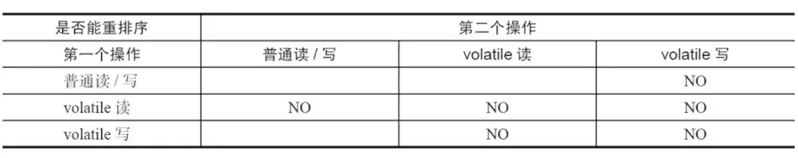
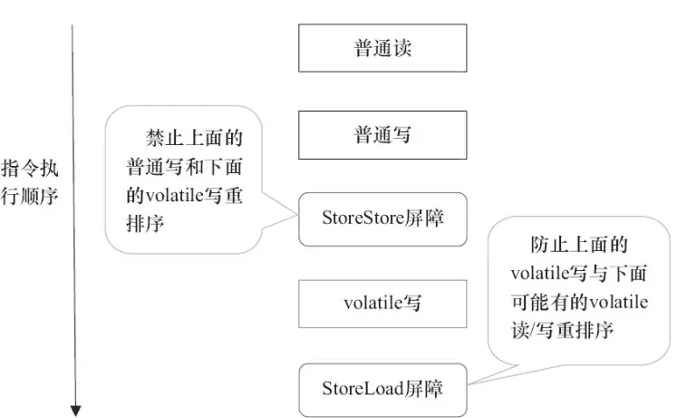
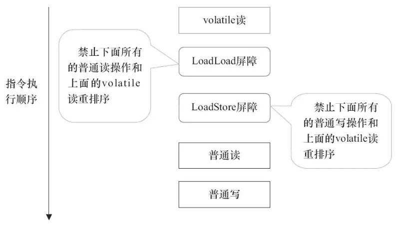

## volatile的作用详解

### 防重排序

volatile关键字可以防止指令重排序，保证指令的有序性。 单例模式中的双重检查锁定模式就是volatile关键字的一个典型应用。

```java
public class Singleton {
    public static volatile Singleton singleton;

    /**
     * 构造函数私有，禁止外部实例化
     */
    private Singleton() {
    }

    ;

    public static Singleton getInstance() {
        if (singleton == null) {
            synchronized (singleton.class) {
                if (singleton == null) {
                    singleton = new Singleton();
                }
            }
        }
        return singleton;
    }
}
```

对象实例化的过程

1. 分配内存空间
2. 初始化对象
3. 将对象指向刚分配的内存空间

如果不加volatile关键字，<font color=red>可能会发生指令重排序，导致步骤2和步骤3的顺序颠倒，</font>
导致singleton对象还没有初始化完成，就被其他线程使用。

### volatile的内存可见性

volatile关键字保证了线程之间的可见性，当一个线程修改了共享变量的值，其他线程能够立即看到修改后的值。

```java
public class TestVolatile {
    private static boolean stop = false;

    public static void main(String[] args) {
        // Thread-A
        new Thread("Thread A") {
            @Override
            public void run() {
                while (!stop) {
                }
                System.out.println(Thread.currentThread() + " stopped");
            }
        }.start();

        // Thread-main
        try {
            TimeUnit.SECONDS.sleep(1);
            System.out.println(Thread.currentThread() + " after 1 seconds");
        } catch (InterruptedException e) {
            e.printStackTrace();
        }
        stop = true;
    }
}
```

> 上述代码Thread-A会一直运行, 在变量stop未添加volatile关键字时，Thread-A线程无法感知到stop变量的变化，导致Thread-A线程无法停止。
> 在给变量添加volatile关键字之后，Thread-A能正常感知到stop变量的变化，从而停止运行。

### volatile的原子性：单次读/写操作

volatile关键字保证了变量的单次读/写操作的原子性，但是不能保证复合操作的原子性。

#### i++的原子性问题

::: tip
电脑配置过高的时候，出现的概率会比较小，因为线程执行的速度比较快，线程执行完毕后，CPU会将线程的数据刷新到主存中。
可以调整循环次数，增加循环中的线程休眠时间，增加线程执行时间，增加出现的概率。
:::

```java
public class TestPlusVolatile {
    volatile int n;

    public void addI() {
        n++;
    }

    public static void main(String[] args) throws InterruptedException {
        TestPlusVolatile testPlusVolatile = new TestPlusVolatile();
        for (int i = 0; i < 1000; i++) {
            new Thread(() -> {
                try {
                    Thread.sleep(1000);
                } catch (InterruptedException e) {
                    throw new RuntimeException(e);
                }
                testPlusVolatile.addI();
            }
            ).start();
        }
        // 等待所有线程执行完毕
        Thread.sleep(1000);
        System.out.println(testPlusVolatile.n);
    }
}
```

> 上述代码中，volatile关键字保证了变量n的可见性，但是不能保证复合操作的原子性，导致最终输出的结果不是1000。
> 如果想要保证原子性，可以使用synchronized关键字或者AtomicInteger类。

#### 共享的long和double变量的原子性问题

在Java中，long 和 double 类型是 64 位的，而 JVM 规范中并没有强制要求 64 位数据的读写操作必须是原子性的。这意味着，对一个
long 或 double 变量的读写操作，JVM 可能会将其拆分成两个 32 位的操作来执行。
> 部分商用虚拟机选择将64位数据的读写操作拆分成两个32位的操作，这样可以提高性能。
> 也就是说，long 和 double 类型的变量不具备原子性。

> 存在部分虚拟机将64位操作作为原子性操作，但是不具有可移植性。

假设有两个线程 A 和 B 同时操作一个共享的 long 变量 x。

- 线程 A 执行 x = 0xFFFFFFFFFFFFFFFFL; (写入操作)
- 线程 B 执行 long y = x; (读取操作)
  由于写入操作可能被拆分成两个 32 位的操作，例如：

1. 先写入高 32 位：0xFFFFFFFF
2. 后写入低 32 位：0xFFFFFFFF
   如果线程 B 在线程 A 写入高 32 位之后、写入低 32 位之前读取 x 的值，那么线程 B 读取到的值将会是高 32 位为 0xFFFFFFFF，低
   32
   位为旧值的组合，导致读取到的数据是错误的。**这种情况被称为“字撕裂”（word tearing)**。

> - volatile 只能保证单个 long 或 double 变量读写操作的原子性，不能保证复合操作的原子性。例如，x++ 操作虽然是对 long
    > 变量的操作，但它实际上包含读取、加 1、写入三个步骤，这三个步骤不是原子的，因此不能使用 volatile 来保证其原子性。对于复合操作，需要使用
    > synchronized、Lock 或 AtomicLong 等原子类来保证线程安全。

> - 虽然 volatile 可以保证 long 和 double 的原子性，但在大多数情况下，使用 AtomicLong 和 AtomicDouble
    > 等原子类是更好的选择，因为它们提供了更丰富的原子操作，例如原子递增、原子递减等。

## volatile的实现原理

> `volatile` 通过内存屏障和 MESI 缓存一致性协议的配合，实现了可见性

### 1. 内存屏障（Memory Barriers/Memory Fences）

这是 `volatile` 实现可见性的核心机制。内存屏障是一种 CPU 指令，它会强制执行 CPU 缓存和主内存之间的数据同步。`volatile`
关键字会在读写操作前后插入内存屏障，具体来说：

* **写操作前插入 StoreStore 屏障：** 禁止处理器将写操作重排序到屏障之前。
* **写操作后插入 StoreLoad 屏障：** 强制将缓存中的数据刷新到主内存中，并使其他处理器缓存中该变量的副本失效。
* **读操作后插入 LoadLoad 屏障：** 禁止处理器将读操作重排序到屏障之后。
* **读操作前插入 LoadStore 屏障：** 强制从主内存中读取最新的值，而不是从处理器的缓存中读取。

通过这些屏障，`volatile` 保证了：

* **写 `volatile` 变量时，强制将修改后的值立即刷新到主内存。**
* **读 `volatile` 变量时，强制从主内存中读取最新的值。**

这样，所有线程都可以立即看到 `volatile` 变量的最新值，从而保证了可见性。

### 2. MESI 缓存一致性协议

MESI 是一种缓存一致性协议，用于维护多个 CPU 缓存之间的数据一致性。当一个 CPU 修改了缓存中的数据时，MESI 协议会通知其他
CPU，使它们缓存中相应的数据失效或更新。

`volatile` 与 MESI 协议结合使用，可以进一步增强可见性：

* 当一个线程写入 `volatile` 变量并刷新到主内存时，MESI 协议会使其他线程缓存中该变量的副本失效。
* 当其他线程再次读取该 `volatile` 变量时，由于缓存已失效，它们会强制从主内存中重新加载最新的值。

**具体实现细节**

在 JVM 层面，`volatile` 的实现依赖于底层的操作系统和硬件。HotSpot 虚拟机使用 C++ 实现，它利用了操作系统提供的内存屏障指令。

在汇编层面，`volatile` 的写操作通常会使用 `lock` 前缀指令。这个指令有以下作用：

* 锁定缓存行： 确保只有一个处理器可以修改该缓存行的数据。
* 立即将修改后的数据写回主内存。
* 通过 MESI 协议使其他处理器缓存中该缓存行的数据失效。

### 3. 禁止指令重排序实现有序

为了性能优化，JMM 在不改变正确语义的前提下，会允许编译器和处理器对指令序列进行重排序。JMM 提供了内存屏障阻止这种重排序。Java
编译器会在生成指令系列时在适当的位置会插入内存屏障指令来禁止特定类型的处理器重排序。JMM 会针对编译器制定 volatile 重排序规则表。



" NO " 表示禁止重排序。为了实现 volatile
内存语义时，编译器在生成字节码时，会在指令序列中插入内存屏障来禁止特定类型的处理器重排序。对于编译器来说，发现一个最优布置来最小化插入屏障的总数几乎是不可能的，为此，JMM
采取了保守的策略。

- 在每个 volatile 写操作的前面插入一个 StoreStore 屏障。
- 在每个 volatile 写操作的后面插入一个 StoreLoad 屏障。
- 在每个 volatile 读操作的后面插入一个 LoadLoad 屏障。在每个 volatile 读操作的后面插入一个 LoadStore 屏障。

volatile 写是在前面和后面分别插入内存屏障，而 volatile 读操作是在后面插入两个内存屏障。

| 内存屏障       | 说明                            |
|------------|-------------------------------|
| StoreStore | 禁止 StoreLoad 和 StoreStore 重排序 |
| StoreLoad  | 禁止 StoreLoad 和 LoadLoad 重排序   |
| LoadLoad   | 禁止 LoadLoad 重排序               |
| LoadStore  | 禁止 LoadStore 和 LoadLoad 重排序   |



