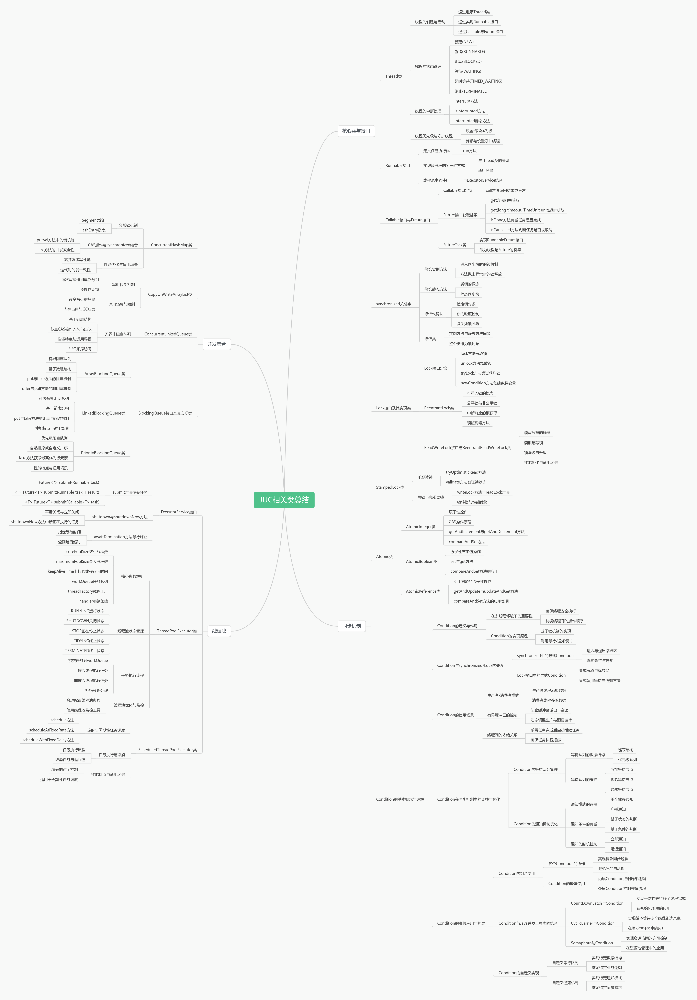

## overview



以下是对该链接内容的总结，并为你生成了一篇全新的文章，内容涉及 Java 并发编程及其在多线程开发中的重要工具类。

---

## 深入理解 Java 并发工具包（JUC）

Java 提供了丰富的并发编程支持，尤其是通过 `java.util.concurrent` 包（简称 JUC）来实现。JUC
包含了一些非常强大的工具类，它们帮助开发者在多线程编程中高效地管理线程池、同步机制、线程安全的数据结构等，避免了许多传统并发编程中的常见问题，如死锁、竞态条件等。

在本篇文章中，我们将对 JUC 中的一些重要工具进行总结和分析，帮助大家全面理解并发编程的核心组件。

### 1. **Java 并发编程概述**

Java 并发编程使得我们能够在多个线程之间共享资源、协作完成任务。传统的多线程管理方式主要依赖 `Thread` 类和 `synchronized`
关键字，但是随着 Java 语言的演进，`java.util.concurrent` 包提供了更高效、灵活的解决方案。

JUC 包提供了以下几类常用工具：

- **线程池**：高效管理线程的创建与销毁，避免频繁创建线程带来的性能损失。
- **同步工具**：如 `ReentrantLock`、`Condition` 等，可以提供更精细的锁机制。
- **线程安全的数据结构**：如 `ConcurrentHashMap`、`CopyOnWriteArrayList` 等，能够确保线程间数据访问的安全性。
- **并发控制工具**：如 `CountDownLatch`、`CyclicBarrier` 等，用于线程之间的协调和控制。

### 2. **线程池**

线程池是管理线程的核心工具，JUC 提供了 `Executor` 框架来简化线程管理。线程池通过预创建一定数量的线程并复用这些线程，避免了频繁创建和销毁线程的开销。

#### 核心接口

- **Executor**：用于执行任务的接口。
- **ExecutorService**：继承自 `Executor`，提供了更为丰富的功能，特别是用于任务的提交和管理。

#### 线程池实现

- **ThreadPoolExecutor**：最常用的线程池实现类，提供了精细的控制。
- **ScheduledThreadPoolExecutor**：用于定时或周期性任务的执行。

```java
ExecutorService executor = Executors.newFixedThreadPool(10);
executor.

submit(() ->System.out.

println("Hello from thread pool"));
```

### 3. **锁机制**

JUC 提供了比传统 `synchronized` 更强大的锁机制。`ReentrantLock` 是常用的显式锁，它支持公平锁、可中断锁等特性，相比传统的
`synchronized`，它提供了更大的灵活性和可控性。

#### 关键类

- **ReentrantLock**：提供可重入的独占锁，支持公平性、锁的中断等。
- **ReadWriteLock**：提供读写锁，在高并发读取场景下有显著性能优势。

```java
ReentrantLock lock = new ReentrantLock();
lock.

lock();
try{
        // 需要同步的代码
        }finally{
        lock.

unlock();
}
```

#### Condition

`Condition` 类允许线程在满足某个条件时进行等待和通知，比传统的 `Object.wait()` 和 `notify()` 更加灵活。

### 4. **并发容器**

JUC 提供了一些线程安全的集合类，确保在多线程环境下的高效访问。这些容器能够帮助我们避免传统集合类的并发问题。

#### 关键类

- **ConcurrentHashMap**：线程安全的哈希映射实现，支持高并发读写。
- **CopyOnWriteArrayList**：线程安全的 List 实现，适用于读多写少的场景。
- **BlockingQueue**：线程安全的队列，支持阻塞操作。

```java
ConcurrentHashMap<String, String> map = new ConcurrentHashMap<>();
map.

put("key","value");
```

### 5. **同步工具类**

JUC 提供了多种工具类，用于线程间的协调和控制，常见的有：

- **CountDownLatch**：一个同步工具，允许一个或多个线程等待直到其他线程完成一系列操作。
- **CyclicBarrier**：允许一组线程在某个点上相互等待，直到所有线程到达同步点后再继续执行。
- **Semaphore**：用于限制同时访问某个资源的线程数量，常用于流量控制。

```java
CountDownLatch latch = new CountDownLatch(3);
latch.

await(); // 当前线程等待直到 latch 计数为 0
```

### 6. **Fork/Join 框架**

`ForkJoinPool` 是 JUC 中为并行计算设计的一个框架，它能够高效地分解大任务，使用多个线程并行执行子任务，最后将结果合并。

#### 关键类

- **ForkJoinPool**：管理 Fork/Join 任务的线程池。
- **RecursiveTask**：表示一个可以返回结果的任务。
- **RecursiveAction**：表示一个没有返回值的任务。

```java
ForkJoinPool pool = new ForkJoinPool();
RecursiveTask<Integer> task = new RecursiveTask<Integer>() {
    @Override
    protected Integer compute() {
        // 任务分解和合并
        return 1;
    }
};
pool.

invoke(task);
```

### 7. **总结与最佳实践**

Java 并发工具包提供了一整套高效、灵活的并发编程解决方案，帮助开发者避免了传统多线程编程中的很多复杂性。无论是线程池管理、锁机制、线程安全容器，还是线程协调工具，JUC
都提供了比传统方式更为高效和可靠的方案。

在实际开发中，我们可以根据不同的场景选择合适的工具：

- 使用线程池来管理和复用线程。
- 在需要精确控制线程执行顺序时，使用 `ReentrantLock` 和 `Condition`。
- 在处理高并发场景时，选择合适的并发容器，如 `ConcurrentHashMap` 或 `BlockingQueue`。
- 使用 `CountDownLatch` 和 `CyclicBarrier` 进行线程间的同步。

通过合理运用这些工具，能够大大简化并发编程的复杂度，提升应用程序的性能和可维护性。
