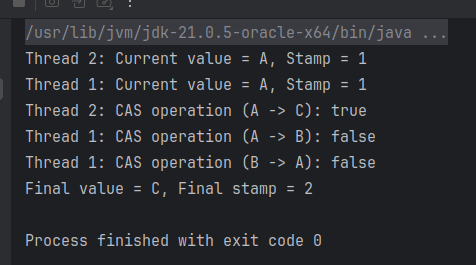
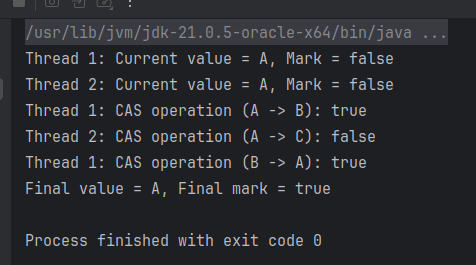

## CAS

### 什么是CAS

CAS（Compare-And-Swap）是一种原子操作，常用于并发编程中，特别是在实现无锁数据结构和算法时。它的核心思想是，通过比较一个内存位置的值是否与预期的旧值相等，如果相等，则将其更新为新值。这个过程是原子的，即不可中断的，能够在并发环境下安全地更新共享变量。

### CAS 的基本原理

CAS 操作通常涉及三个操作数：

1. **内存地址（V）**：要进行更新的内存位置（例如一个变量）。
2. **旧值（A）**：期望的当前值。
3. **新值（B）**：希望将旧值更新为的新值。

CAS 操作的步骤：

- 比较内存地址 `V` 中的值是否等于旧值 `A`。
- 如果相等，更新 `V` 的值为新值 `B`。
- 如果不相等，则不做任何修改。

CAS 操作的核心特点是它的原子性，意味着它在执行时不会被其他线程打断。这个操作通常是在硬件层面上通过处理器的原子指令来实现，因此执行非常快速。

### CAS 的应用

CAS 是构建无锁数据结构和并发算法的基础。Java 的 `java.util.concurrent.atomic` 包中的一些类（如 `AtomicInteger`、
`AtomicLong`、`AtomicReference` 等）就是通过 CAS 来实现原子性操作的。

例如，`AtomicInteger` 中的 `compareAndSet()` 方法就是典型的 CAS 操作，它的工作原理如下：

```java
AtomicInteger atomicInteger = new AtomicInteger(0);

// CAS操作：如果当前值是0，则将其更新为1
boolean success = atomicInteger.compareAndSet(0, 1);  // 返回 true
```

在这个例子中，如果 `atomicInteger` 的当前值是 0，`compareAndSet()` 将其更新为 1，并返回 `true`。如果当前值不是 0，
`compareAndSet()` 将不进行任何更新，并返回 `false`。

### CAS 的优缺点

**优点：**

- **无锁机制**：CAS 是一种基于乐观锁的机制，不需要传统的互斥锁（如 `synchronized`），从而减少了锁竞争，提高了并发性能。
- **高效**：CAS 操作通常由硬件直接支持，性能非常高。

**缺点：**

- **ABA 问题**：CAS 无法检测一个值是否经历过变化，只能判断值是否为某个预期的旧值。如果某个值从 A 变成 B，再变回 A，CAS
  会误认为值没有变化，这被称为 ABA 问题。为了解决这个问题，可以使用带有版本号或者时间戳的 CAS 变种（如
  `AtomicStampedReference`）。
- **自旋开销**：如果多个线程频繁地失败（即多次 CAS 操作不能成功），会导致 CPU 资源浪费，增加系统开销。

## UnSafe类

`Unsafe` 类是 Java 中一个非常特殊且强大的类，它位于 `sun.misc` 包下，用于直接操作内存、修改对象字段、管理线程等底层操作。由于
`Unsafe` 提供了直接的底层操作功能，它有时被称为 "不安全" 的类，因此命名为 `Unsafe`。`Unsafe` 是一个非常强大的工具，但也正因为它能够绕过
Java 的安全机制，因此需要非常小心使用。

### `Unsafe` 类的功能

`Unsafe` 类提供了对内存的低级控制，它有很多底层操作方法，常见的功能包括：

1. **内存分配与释放**：能够直接分配和释放内存，甚至可以操作直接内存（off-heap memory）。
2. **对象字段操作**：通过 `Unsafe`，可以直接操作对象的字段，甚至可以跳过访问权限检查（例如，访问私有字段）。
3. **内存屏障**：能够显式地管理 CPU 的内存屏障（memory barriers），用来控制多线程程序的内存可见性。
4. **CAS 操作**：`Unsafe` 提供了底层的 `compareAndSwap` 方法（与 Java 中的 `AtomicInteger` 类似），用于实现无锁并发算法。
5. **类加载和对象创建**：`Unsafe` 能够绕过构造函数创建对象，并可以用来加载类，甚至不调用构造函数。

### 常用的 `Unsafe` 方法

1. **`allocateMemory(long size)`**  
   分配一块指定大小的本地内存（off-heap memory），返回该内存的地址。

   ```java
   long address = unsafe.allocateMemory(1024);
   ```

2. **`freeMemory(long address)`**  
   释放通过 `allocateMemory` 分配的内存。

   ```java
   unsafe.freeMemory(address);
   ```

3. **`getObjectField(Object obj, long fieldOffset)`**  
   获取对象字段的值，绕过字段访问控制。

   ```java
   Object value = unsafe.getObjectField(obj, fieldOffset);
   ```

4. **`putObjectField(Object obj, long fieldOffset, Object value)`**  
   设置对象字段的值，绕过字段访问控制。

   ```java
   unsafe.putObjectField(obj, fieldOffset, value);
   ```

5. **`compareAndSwapInt(Object obj, long offset, int expected, int update)`**  
   进行原子操作：比较内存中对象字段的值是否与预期值相等，如果相等则更新为新值。

   ```java
   boolean success = unsafe.compareAndSwapInt(obj, offset, expected, update);
   ```

6. **`objectFieldOffset(Field field)`**  
   获取对象字段在内存中的偏移量（即该字段相对于对象的内存地址的偏移）。

   ```java
   long offset = unsafe.objectFieldOffset(field);
   ```

7. **`ensureClassInitialized(Class<?> clazz)`**  
   确保类的初始化（即类的静态代码块被执行）。

   ```java
   unsafe.ensureClassInitialized(MyClass.class);
   ```

### 获取 `Unsafe` 实例

由于 `Unsafe` 类存在于 `sun.misc` 包下，它不是标准 Java API 的一部分，并且在默认情况下无法直接访问。因此，获取 `Unsafe`
的实例并不简单。`Unsafe` 实际上是通过反射来访问的，通常有以下几种方式来获取 `Unsafe` 实例：

1. **通过反射获取**：
   你可以通过反射来访问 `Unsafe` 类的实例：

   ```java
   import sun.misc.Unsafe;
   import java.lang.reflect.Field;

   public class UnsafeExample {
       public static void main(String[] args) throws Exception {
           Field field = Unsafe.class.getDeclaredField("theUnsafe");
           field.setAccessible(true);
           Unsafe unsafe = (Unsafe) field.get(null);
       }
   }
   ```

2. **通过 `Unsafe` 类的静态方法**：
   `Unsafe` 类提供了一个静态方法 `getUnsafe()`，可以在某些情况下通过它来获取 `Unsafe` 实例。但在普通的应用程序中，这个方法会抛出安全异常。只有在
   JVM 中运行时，或者通过某些特殊配置（如通过启动参数开启 `-Xbootclasspath`）才能访问它。

### `Unsafe` 类的危险性

1. **绕过安全检查**：
   `Unsafe` 可以直接修改对象字段，包括私有字段，绕过了 Java 安全机制中的访问控制，这意味着它能直接操作对象的状态，容易导致潜在的内存问题和数据不一致。

2. **可能导致内存泄漏**：
   使用 `Unsafe` 直接管理内存（例如分配和释放内存）时，必须非常小心，错误的内存操作可能导致内存泄漏、内存溢出等问题。

3. **非标准 API**：
   `Unsafe` 是一个非标准 API，它并不是 Java 官方推荐的公共 API，未来可能会被移除或更改。因此，依赖 `Unsafe`
   会导致代码的可维护性和兼容性问题。

4. **不安全的操作**：
   由于 `Unsafe` 可以直接操作底层内存，它能够执行一些非常低级的操作，这些操作可能导致崩溃、未定义行为等非常危险的情况。

### 何时使用 `Unsafe`？

`Unsafe` 主要用于性能敏感的应用，尤其是在开发高性能的并发程序和底层框架时。它为开发者提供了能够直接操作内存、进行原子操作等底层能力，适用于以下场景：

- 实现无锁数据结构（例如并发队列、栈等）。
- 高性能的内存管理和垃圾回收。
- 低级别的系统编程，或者用于一些 Java 不提供的底层特性。

但是，由于 `Unsafe` 的危险性和不安全性，通常不建议普通应用程序直接使用，只有在非常特定的性能优化需求下才会考虑使用它。

### Unsafe和CAS的关系

`Unsafe` 和 **CAS（Compare-And-Swap）** 之间的关系主要体现在 `Unsafe` 提供了对 CAS 操作的底层支持，特别是在并发编程中实现无锁原子操作时。具体来说，
`Unsafe` 提供了一些原子操作的方法，其中就包括 **CAS 操作**，它们是高效的并发控制机制。

#### **`Unsafe` 中的 CAS 方法**

`Unsafe` 提供了多个原子方法，最常见的 CAS 方法是 `compareAndSwap` 系列的方法，用于进行原子比较和交换操作。这些方法通过硬件指令来实现原子性操作。常见的方法有：

- `compareAndSwapInt(Object obj, long offset, int expected, int update)`
- `compareAndSwapLong(Object obj, long offset, long expected, long update)`
- `compareAndSwapObject(Object obj, long offset, Object expected, Object update)`

这些方法的作用是：

- **`expected`**：期望值
- **`update`**：新的值
- **`obj`**：要操作的对象
- **`offset`**：字段在对象内存中的偏移量

例如，`compareAndSwapInt` 方法的调用逻辑如下：

```java
boolean success = unsafe.compareAndSwapInt(obj, offset, expected, update);
```

- 它会先检查 `obj` 中对应位置的值是否等于 `expected`（期望的值）。
- 如果相等，`unsafe` 会将该位置的值更新为 `update`（新值），并返回 `true`。
- 如果不相等，则返回 `false`。

## AtomicStampedReference解决CAS的ABA问题

### **AtomicStampedReference 解决 ABA 问题的原理**

`AtomicStampedReference` 通过引入一个 **“时间戳”** 或 **“版本号”**（`stamp`），将变量的值和版本号一起存储。当 CAS
操作发生时，它不仅会检查当前值是否与期望值相同，还会检查版本号（`stamp`）是否一致。这样，即使变量的值发生了变化，只要版本号不同，CAS
操作就能检测到这一点，避免了由于值相同但内在发生过变化所引发的错误。

`AtomicStampedReference` 内部存储了一个对象引用（即 `reference`）和一个整型的版本号（即 `stamp`）。每次更新时，都会更新
`stamp`，这样即使对象的值回到了原来的状态，只要 `stamp` 不同，CAS 操作就能够发现变化，避免了 ABA 问题。

### **AtomicStampedReference 的用法**

`AtomicStampedReference` 是 Java 5 引入的 `java.util.concurrent.atomic` 包的一部分，用于处理带有版本号的引用类型。它包含以下主要方法：

- `getReference()`: 获取当前引用对象。
- `getStamp()`: 获取当前版本号（`stamp`）。
- `compareAndSet(reference, stamp, newReference, newStamp)`: 进行 CAS 操作，比较引用值和版本号，如果它们都与期望的值一致，则更新引用值和版本号。

### **示例代码**

下面是一个使用 `AtomicStampedReference` 解决 ABA 问题的示例：

```java
import java.util.concurrent.atomic.AtomicStampedReference;

public class AtomicStampedReferenceExample {
    public static void main(String[] args) throws InterruptedException {
        {
            // 初始值是 "A"，版本号是 1
            String initialValue = "A";
            int initialStamp = 1;

            // 创建一个 AtomicStampedReference 对象
            AtomicStampedReference<String> atomicStampedRef = new AtomicStampedReference<>(initialValue, initialStamp);

            // 模拟多个线程的并发操作
            Thread thread1 = new Thread(() -> {
                // 获取当前引用值和版本号
                int[] stampHolder = new int[1];
                String currentRef = atomicStampedRef.get(stampHolder);
                int currentStamp = stampHolder[0];
                System.out.println("Thread 1: Current value = " + currentRef + ", Stamp = " + currentStamp);

                // 模拟 A -> B -> A 的变化
                boolean success1 = atomicStampedRef.compareAndSet(currentRef, "B", currentStamp, currentStamp + 1);
                System.out.println("Thread 1: CAS operation (A -> B): " + success1);

                boolean success2 = atomicStampedRef.compareAndSet("B", "A", currentStamp + 1, currentStamp + 2);
                System.out.println("Thread 1: CAS operation (B -> A): " + success2);
            });

            Thread thread2 = new Thread(() -> {
                // 获取当前引用值和版本号
                int[] stampHolder = new int[1];
                String currentRef = atomicStampedRef.get(stampHolder);
                int currentStamp = stampHolder[0];
                System.out.println("Thread 2: Current value = " + currentRef + ", Stamp = " + currentStamp);

                // CAS 操作，期望值是 "A"，版本号是 1
                boolean success = atomicStampedRef.compareAndSet("A", "C", 1, 2);
                System.out.println("Thread 2: CAS operation (A -> C): " + success);
            });

            thread1.start();
            thread2.start();

            thread1.join();
            thread2.join();

            // 最终值和版本号
            int[] finalStampHolder = new int[1];
            String finalRef = atomicStampedRef.get(finalStampHolder);
            int finalStamp = finalStampHolder[0];
            System.out.println("Final value = " + finalRef + ", Final stamp = " + finalStamp);
        }
    }
}
```



1. **初始化**：我们创建了一个 `AtomicStampedReference` 实例 `atomicStampedRef`，它持有初始值 `"A"` 和版本号 `1`。

2. **线程 1 的操作**：线程 1 获取当前的引用值 `"A"` 和版本号 `1`，然后模拟了一次从 `"A"` -> `"B"` -> `"A"` 的值变化。通过
   CAS 操作，成功将 `"A"` 更新为 `"B"`，然后再更新回 `"A"`。

3. **线程 2 的操作**：线程 2 获取当前值和版本号，尝试执行一个 CAS 操作，期望值是 `"A"`，版本号是 `1`，将其更新为 `"C"` 和版本号
   `2`。

4. **ABA 问题解决**：由于 `AtomicStampedReference` 引入了版本号（`stamp`），线程 2 在尝试执行 CAS 操作时，尽管变量的值从
   `"A"` 更新为 `"B"`，然后又变回 `"A"`，但版本号发生了变化。线程 2 会因为版本号不匹配而无法成功执行 CAS 操作。

## AtomicMarkableReference解决CAS的ABA问题
### **`AtomicMarkableReference` 的原理**

`AtomicMarkableReference` 通过为引用添加一个 **布尔标记（mark）** 来解决 ABA 问题。这个标记是一个简单的 `boolean` 值，表示引用当前的状态。当引用值发生变化时，标记也会变化。这样，即使引用的值看似相同，标记的变化可以让 CAS 操作正确识别出引用经历了变化，从而避免了 ABA 问题。

`AtomicMarkableReference` 内部存储了两个值：
- **引用值（reference）**：实际存储的对象引用。
- **标记（mark）**：一个布尔值，用来标识该引用是否发生过变化。

每次更新时，`AtomicMarkableReference` 会更新引用和标记，以确保 CAS 操作的正确性。

### **`AtomicMarkableReference` 的方法**

`AtomicMarkableReference` 提供了以下关键方法：
- `getReference()`: 获取当前存储的引用。
- `getMark()`: 获取当前存储的标记。
- `compareAndSet(reference, mark, newReference, newMark)`: 执行 CAS 操作，比较当前的引用值和标记是否与期望值一致，如果一致，则更新引用值和标记。

### **示例代码：使用 `AtomicMarkableReference` 解决 ABA 问题**

下面是一个示例，演示了如何使用 `AtomicMarkableReference` 解决 CAS 的 ABA 问题。

```java
import java.util.concurrent.atomic.AtomicMarkableReference;

public class AtomicMarkableReferenceExample {
    public static void main(String[] args) throws InterruptedException {
       // 初始引用值是 "A"，标记是 false
       String initialValue = "A";
       boolean initialMark = false;

       // 创建一个 AtomicMarkableReference 对象
       AtomicMarkableReference<String> atomicMarkableRef = new AtomicMarkableReference<>(initialValue, initialMark);

       // 模拟多个线程的并发操作
       Thread thread1 = new Thread(() -> {
          // 获取当前引用值和标记
          boolean[] markHolder = new boolean[1];
          String currentRef = atomicMarkableRef.get(markHolder);
          boolean currentMark = markHolder[0];
          System.out.println("Thread 1: Current value = " + currentRef + ", Mark = " + currentMark);

          // 模拟 A -> B -> A 的变化
          boolean success1 = atomicMarkableRef.compareAndSet(currentRef, "B", currentMark, !currentMark);
          System.out.println("Thread 1: CAS operation (A -> B): " + success1);

          boolean success2 = atomicMarkableRef.compareAndSet("B", "A", !currentMark, !currentMark);
          System.out.println("Thread 1: CAS operation (B -> A): " + success2);
       });

       Thread thread2 = new Thread(() -> {
          // 获取当前引用值和标记
          boolean[] markHolder = new boolean[1];
          String currentRef = atomicMarkableRef.get(markHolder);
          boolean currentMark = markHolder[0];
          System.out.println("Thread 2: Current value = " + currentRef + ", Mark = " + currentMark);

          // CAS 操作，期望值是 "A"，标记是 false
          boolean success = atomicMarkableRef.compareAndSet("A", "C", false, true);
          System.out.println("Thread 2: CAS operation (A -> C): " + success);
       });

       thread1.start();
       thread2.start();

       thread1.join();
       thread2.join();

       // 最终值和标记
       boolean[] finalMarkHolder = new boolean[1];
       String finalRef = atomicMarkableRef.get(finalMarkHolder);
       boolean finalMark = finalMarkHolder[0];
       System.out.println("Final value = " + finalRef + ", Final mark = " + finalMark);
    }
}
```



### **代码解析**

1. **初始化**：创建了一个 `AtomicMarkableReference` 对象 `atomicMarkableRef`，它保存了一个初始值 `"A"` 和标记 `false`。

2. **线程 1 的操作**：
   - 线程 1 获取当前的引用值和标记。
   - 线程 1 模拟了从 `"A"` -> `"B"` -> `"A"` 的引用值变化，并通过 CAS 操作更新引用值和标记。
   - 由于标记也一起更新，CAS 操作能够正确检测到引用值的变化。

3. **线程 2 的操作**：
   - 线程 2 获取当前的引用值和标记，尝试执行 CAS 操作，将引用值 `"A"` 和标记 `false` 更新为 `"C"` 和标记 `true`。
   - 线程 2 可以正确地检测到标记和引用值的变化。

4. **ABA 问题解决**：
   - 如果线程 2 在执行 CAS 操作时，引用值 `"A"` 已经经历了变化（例如从 `"A"` -> `"B"` -> `"A"`），但标记已经变化，CAS 操作依然能够成功地检测到这一变化，并避免了错误更新。


在多线程环境中，`AtomicMarkableReference` 可以有效地解决 CAS 操作中的 ABA 问题，确保引用更新的正确性。