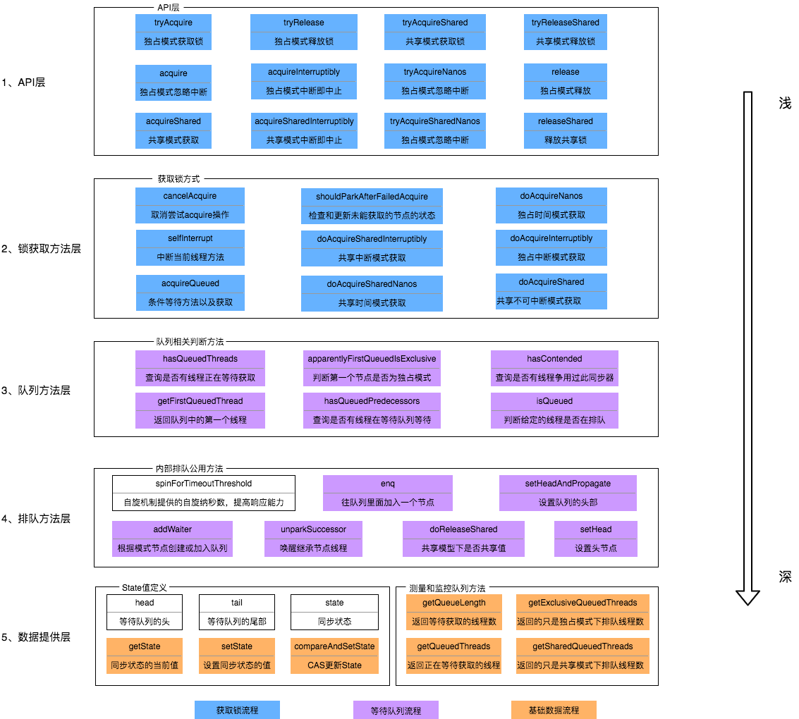
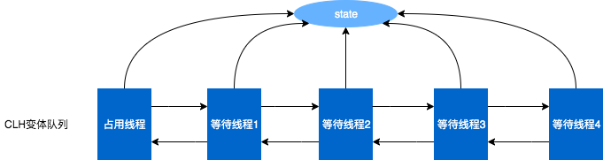
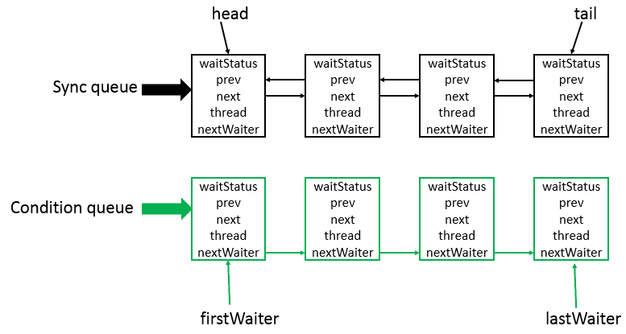

## AQS框架

Java中的大部分同步类（Lock、Semaphore、ReentrantLock等）都是基于AbstractQueuedSynchronizer（简称为AQS）实现的。
AQS是一种提供了原子式管理同步状态、阻塞和唤醒线程功能以及队列模型的简单框架。

上图中有颜色的为Method，无颜色的为Attribution。

总的来说，AQS框架共分为五层，自上而下由浅入深，从AQS对外暴露的API到底层基础数据。

当有自定义同步器接入时，只需重写第一层所需要的部分方法即可，不需要关注底层具体的实现流程。
当自定义同步器进行加锁或者解锁操作时，先经过第一层的API进入AQS内部方法，然后经过第二层进行锁的获取，接着对于获取锁失败的流程，
进入第三层和第四层的等待队列处理，而这些处理方式均依赖于第五层的基础数据提供层。

## 原理概述

AQS核心思想是，如果被请求的共享资源空闲，那么就将当前请求资源的线程设置为有效的工作线程，将共享资源设置为锁定状态；如果共享资源被占用，就需要一定的阻塞等待唤醒机制来保证锁分配。这个机制主要用的是CLH队列的变体实现的，将暂时获取不到锁的线程加入到队列中。

CLH：Craig、Landin and Hagersten队列，是单向链表，AQS中的队列是CLH变体的虚拟双向队列（FIFO），AQS是通过将每条请求共享资源的线程封装成一个节点来实现锁的分配。

主要原理图如下：


AQS使用一个Volatile的int类型的成员变量来表示同步状态，通过内置的FIFO队列来完成资源获取的排队工作，通过CAS完成对State值的修改。

```java
private volatile int state;//共享变量，使用volatile修饰保证线程可见性
```

状态信息 state 可以通过 protected 类型的getState()、setState()和compareAndSetState() 进行操作。并且，这几个方法都是
final 修饰的，在子类中无法被重写。

```java
//返回同步状态的当前值
protected final int getState() {
    return state;
}

// 设置同步状态的值
protected final void setState(int newState) {
    state = newState;
}

//原子地（CAS操作）将同步状态值设置为给定值update如果当前同步状态的值等于expect（期望值）
protected final boolean compareAndSetState(int expect, int update) {
    return unsafe.compareAndSwapInt(this, stateOffset, expect, update);
}
```

以可重入的互斥锁 ReentrantLock 为例，它的内部维护了一个 state 变量，用来表示锁的占用状态。state 的初始值为 0，表示锁处于未锁定状态。当线程
A 调用 lock() 方法时，会尝试通过 tryAcquire() 方法独占该锁，并让 state 的值加 1。如果成功了，那么线程 A 就获取到了锁。如果失败了，那么线程
A 就会被加入到一个等待队列（CLH 变体队列）中，直到其他线程释放该锁。假设线程 A 获取锁成功了，释放锁之前，A
线程自己是可以重复获取此锁的（state 会累加）。这就是可重入性的体现：一个线程可以多次获取同一个锁而不会被阻塞。
但是，这也意味着，一个线程必须释放与获取的次数相同的锁，才能让
state 的值回到 0，也就是让锁恢复到未锁定状态。只有这样，其他等待的线程才能有机会获取该锁。


## 资源的共享方式

AQS中的资源共享方式有两种：独占和共享。

* Exclusive(独占)：只有一个线程能执行，如ReentrantLock。又可分为公平锁和非公平锁：
    * 公平锁：按照线程在队列中的排队顺序，先到者先拿到锁
    * 非公平锁：当线程要获取锁时，无视队列顺序直接去抢锁，谁抢到就是谁的
* Share(共享)：多个线程可同时执行，如Semaphore/CountDownLatch。Semaphore、CountDownLatCh、 CyclicBarrier、ReadWriteLock
  我们都会在后面讲到。

ReentrantReadWriteLock 可以看成是组合式，因为ReentrantReadWriteLock也就是读写锁允许多个线程同时对某一资源进行读。

## 模板方法

使用者继承AbstractQueuedSynchronizer并重写指定的方法。(这些重写方法很简单，无非是对于共享资源state的获取和释放)
将AQS组合在自定义同步组件的实现中，并调用其模板方法，而这些模板方法会调用使用者重写的方法。
AQS使用了模板方法模式，自定义同步器时需要重写下面几个AQS提供的模板方法：

```java
isHeldExclusively();//该线程是否正在独占资源。只有用到condition才需要去实现它。

tryAcquire(int);//独占方式。尝试获取资源，成功则返回true，失败则返回false。

tryRelease(int);//独占方式。尝试释放资源，成功则返回true，失败则返回false。

tryAcquireShared(int);//共享方式。尝试获取资源。负数表示失败；0表示成功，但没有剩余可用资源；正数表示成功，且有剩余资源。

tryReleaseShared(int);//共享方式。尝试释放资源，成功则返回true，失败则返回false。

```

默认情况下，每个方法都抛出 UnsupportedOperationException。 这些方法的实现必须是内部线程安全的，并且通常应该简短而不是阻塞。AQS类中的其他方法都是final
，所以无法被其他类使用，只有这几个方法可以被其他类使用。

## AQS数据结构

AbstractQueuedSynchronizer类底层的数据结构是使用CLH(Craig,Landin,and Hagersten)队列是一个虚拟的双向队列(
虚拟的双向队列即不存在队列实例，仅存在结点之间的关联关系)。AQS是将每条请求共享资源的线程封装成一个CLH锁队列的一个结点(
Node)来实现锁的分配。其中Sync queue，即同步队列，是双向链表，包括head结点和tail结点，head结点主要用作后续的调度。而Condition
queue不是必须的，其是一个单向链表，只有当使用Condition时，才会存在此单向链表。并且可能会有多个Condition queue。


