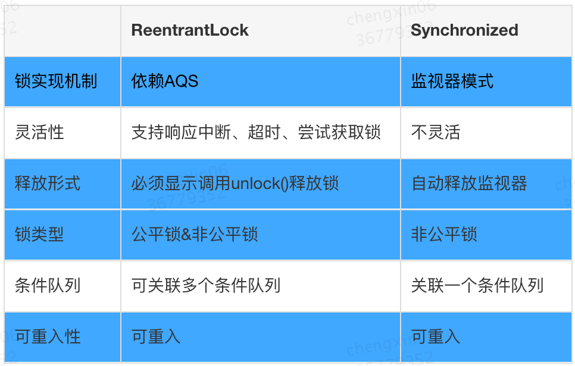
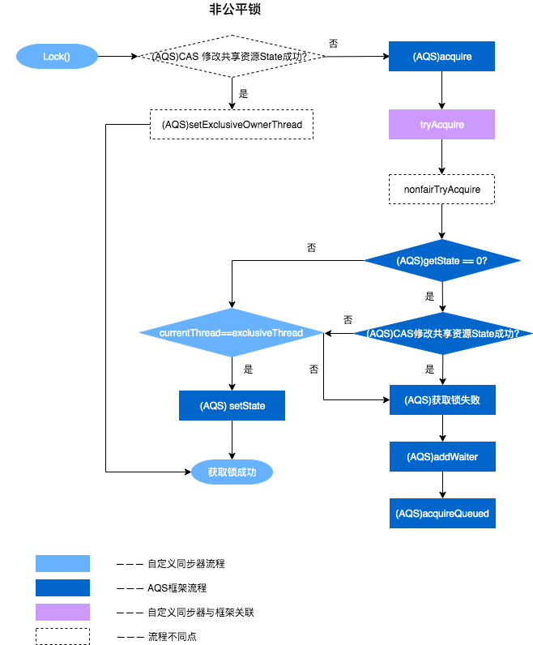
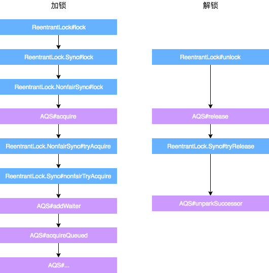
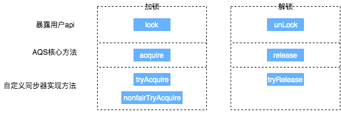
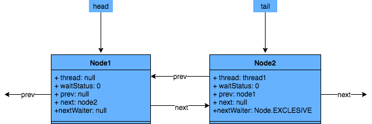
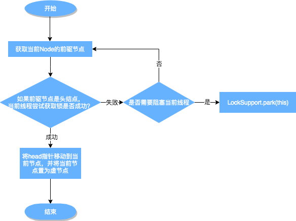
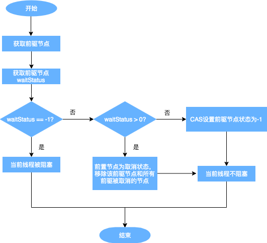
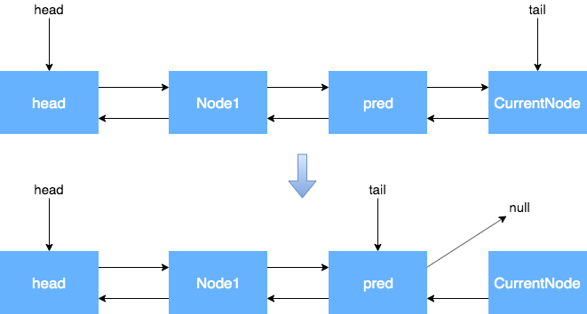
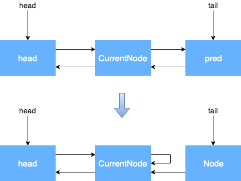
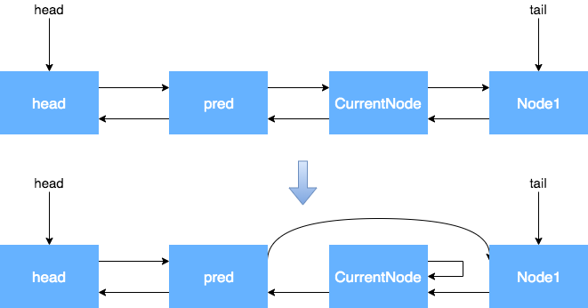

::: danger 说明
本文中相关源码为JDK1.8版本，相关实现细节在JDK21中存在部分源码变更，但整体思想和实现逻辑基本一致。
:::

## ReentrantLock特性

ReentrantLock意思为可重入锁，指的是一个线程能够对一个临界资源重复加锁。为了帮助大家更好地理解ReentrantLock的特性，
我们先将ReentrantLock跟常用的Synchronized进行比较，其特性如下（蓝色部分为本篇文章主要剖析的点）：



伪代码比较

```
// **************************Synchronized的使用方式**************************
// 1.用于代码块
synchronized (this) {}
// 2.用于对象
synchronized (object) {}
// 3.用于方法
public synchronized void test () {}
// 4.可重入
for (int i = 0; i < 100; i++) {
	synchronized (this) {}
}
// **************************ReentrantLock的使用方式**************************
public void test () throw Exception {
	// 1.初始化选择公平锁、非公平锁
	ReentrantLock lock = new ReentrantLock(true);
	// 2.可用于代码块
	lock.lock();
	try {
		try {
			// 3.支持多种加锁方式，比较灵活; 具有可重入特性
			if(lock.tryLock(100, TimeUnit.MILLISECONDS)){ }
		} finally {
			// 4.手动释放锁
			lock.unlock();
		}
	} finally {
		lock.unlock();
	}
}
```
## ReentrantLock的使用方式
```java
public class ReentrantLockTest {

    ReentrantLock lock = new ReentrantLock();

    public static void main(String[] args) {
        ReentrantLockTest demo = new ReentrantLockTest();
        new Thread(() -> demo.method(), "t1").start();
        new Thread(() -> demo.method(), "t2").start();
    }

    public void method() {
        lock.lock();  // 获取锁
        try {
            System.out.println(Thread.currentThread().getName() + " 获取了锁");
            Thread.sleep(10000);  // 模拟任务执行,调整睡眠时间观察本地debug代码用
        } catch (InterruptedException e) {
            e.printStackTrace();
        } finally {
            //println放上面是因为如果在unlock下面可能存在先打印出其他线程获取锁（打印过程方法时候其他线程获取到了锁），后打印本线程出释放锁
            System.out.println(Thread.currentThread().getName() + " 释放了锁");
            lock.unlock();  // 必须手动释放锁
        
        }
    }
}
```


## ReentrantLock与AQS的关联

ReentrantLock的底层就是由AQS来实现的，，AQS提供了大量用于自定义同步器实现的Protected方法。
自定义同步器实现的相关方法也只是为了通过修改State字段来实现多线程的独占模式或者共享模式。
自定义同步器需要实现以下方法（ReentrantLock需要实现的方法如下，并不是全部）：

| 方法名	                                         | 描述                                                           |
|----------------------------------------------|--------------------------------------------------------------|
| protected boolean isHeldExclusively()	       | 该线程是否正在独占资源。只有用到Condition才需要去实现它。                            |
| protected boolean tryAcquire(int arg)	       | 独占方式。arg为获取锁的次数，尝试获取资源，成功则返回True，失败则返回False。                 |
| protected boolean tryRelease(int arg)	       | 独占方式。arg为释放锁的次数，尝试释放资源，成功则返回True，失败则返回False。                 |
| protected int tryAcquireShared(int arg)	     | 共享方式。arg为获取锁的次数，尝试获取资源。负数表示失败；0表示成功，但没有剩余可用资源；正数表示成功，且有剩余资源。 |
| protected boolean tryReleaseShared(int arg)	 | 共享方式。arg为释放锁的次数，尝试释放资源，如果释放后允许唤醒后续等待结点返回True，否则返回False。      |

一般来说，自定义同步器要么是独占方式，要么是共享方式，它们也只需实现tryAcquire-tryRelease、tryAcquireShared-tryReleaseShared中的一种即可。AQS也支持自定义同步器同时实现独占和共享两种方式，
如ReentrantReadWriteLock。ReentrantLock是独占锁，所以实现了tryAcquire-tryRelease。





### 加锁：

* 通过ReentrantLock的加锁方法Lock进行加锁操作。

* 会调用到内部类Sync的Lock方法，由于Sync#lock是抽象方法，根据ReentrantLock初始化选择的公平锁和非公平锁，执行相关内部类的Lock方法，本质上都会执行AQS的Acquire方法。

* AQS的Acquire方法会执行tryAcquire方法，但是由于tryAcquire需要自定义同步器实现，
  因此执行了ReentrantLock中的tryAcquire方法，由于ReentrantLock是通过公平锁和非公平锁内部类实现的tryAcquire方法，因此会根据锁类型不同，执行不同的tryAcquire。

* tryAcquire是获取锁逻辑，获取失败后，会执行框架AQS的后续逻辑，跟ReentrantLock自定义同步器无关。

### 解锁：

* 通过ReentrantLock的解锁方法Unlock进行解锁。

* Unlock会调用内部类Sync的Release方法，该方法继承于AQS。

* Release中会调用tryRelease方法，tryRelease需要自定义同步器实现，tryRelease只在ReentrantLock中的Sync实现，因此可以看出，释放锁的过程，并不区分是否为公平锁。

* 释放成功后，所有处理由AQS框架完成，与自定义同步器无关。

通过上面的描述，大概可以总结出ReentrantLock加锁解锁时API层核心方法的映射关系。



## 通过ReentrantLock理解AQS

ReentrantLock中公平锁和非公平锁在底层是相同的

``` java

// java.util.concurrent.locks.ReentrantLock

static final class NonfairSync extends Sync {
	...
	final void lock() {
		if (compareAndSetState(0, 1))
			setExclusiveOwnerThread(Thread.currentThread());
		else
			acquire(1);
	}
  ...
}

// java.util.concurrent.locks.AbstractQueuedSynchronizer

public final void acquire(int arg) {
	if (!tryAcquire(arg) && acquireQueued(addWaiter(Node.EXCLUSIVE), arg))
		selfInterrupt();
}

// java.util.concurrent.locks.AbstractQueuedSynchronizer

protected boolean tryAcquire(int arg) {
	throw new UnsupportedOperationException();
}
```

这里只是AQS的简单实现，具体获取锁的实现方法是由各自的公平锁和非公平锁单独实现的（以ReentrantLock为例）。
如果该方法返回了True，则说明当前线程获取锁成功，就不用往后执行了；如果获取失败，就需要加入到等待队列中

### 线程加入等待队列

#### 加入队列的时机

当执行Acquire(1)时，会通过tryAcquire获取锁。在这种情况下，如果获取锁失败，就会调用addWaiter加入到等待队列中去。

#### 如何加入队列

```java
// java.util.concurrent.locks.AbstractQueuedSynchronizer

private Node addWaiter(Node mode) {
    Node node = new Node(Thread.currentThread(), mode);
    // Try the fast path of enq; backup to full enq on failure
    Node pred = tail;
    if (pred != null) {
        node.prev = pred;
        if (compareAndSetTail(pred, node)) {
            pred.next = node;
            return node;
        }
    }
    enq(node);
    return node;
}

private final boolean compareAndSetTail(Node expect, Node update) {
    return unsafe.compareAndSwapObject(this, tailOffset, expect, update);
}
```

主要流程

* 通过当前的线程和锁模式新建一个节点。

* Pred指针指向尾节点Tail。

* 将New中Node的Prev指针指向Pred。

* 通过compareAndSetTail方法，完成尾节点的设置。这个方法主要是对tailOffset和Expect进行比较，如果tailOffset的Node和Expect的Node地址是相同的，那么设置Tail的值为Update的值。

``` java
// java.util.concurrent.locks.AbstractQueuedSynchronizer

static {
	try {
		stateOffset = unsafe.objectFieldOffset(AbstractQueuedSynchronizer.class.getDeclaredField("state"));
		headOffset = unsafe.objectFieldOffset(AbstractQueuedSynchronizer.class.getDeclaredField("head"));
		tailOffset = unsafe.objectFieldOffset(AbstractQueuedSynchronizer.class.getDeclaredField("tail"));
		waitStatusOffset = unsafe.objectFieldOffset(Node.class.getDeclaredField("waitStatus"));
		nextOffset = unsafe.objectFieldOffset(Node.class.getDeclaredField("next"));
	} catch (Exception ex) { 
    throw new Error(ex); 
  }
}
```

从AQS的静态代码块可以看出，都是获取一个对象的属性相对于该对象在内存当中的偏移量，这样我们就可以根据这个偏移量在对象内存当中找到这个属性。tailOffset指的是tail对应的偏移量，
所以这个时候会将new出来的Node置为当前队列的尾节点。同时，由于是双向链表，也需要将前一个节点指向尾节点。

* 如果Pred指针是Null（说明等待队列中没有元素），或者当前Pred指针和Tail指向的位置不同（说明被别的线程已经修改），就需要看一下Enq的方法。

```java
// java.util.concurrent.locks.AbstractQueuedSynchronizer

private Node enq(final Node node) {
    for (; ; ) {
        Node t = tail;
        if (t == null) { // Must initialize
            if (compareAndSetHead(new Node()))
                tail = head;
        } else {
            node.prev = t;
            if (compareAndSetTail(t, node)) {
                t.next = node;
                return t;
            }
        }
    }
}
```

如果没有被初始化，需要进行初始化一个头结点出来。但请注意，初始化的头结点并不是当前线程节点，而是调用了无参构造函数的节点。
如果经历了初始化或者并发导致队列中有元素，则与之前的方法相同。
其实，addWaiter就是一个在双端链表添加尾节点的操作，需要注意的是，双端链表的头结点是一个无参构造函数的头结点。

总结一下，线程获取锁的时候，过程大体如下：

1. 当没有线程获取到锁时，线程1获取锁成功。
2. 线程2申请锁，但是锁被线程1占有。
   

3. 如果再有线程要获取锁，依次在队列中往后排队即可。 hasQueuedPredecessors是公平锁加锁时判断等待队列中是否存在有效节点的方法。
   如果返回False，说明当前线程可以争取共享资源；如果返回True，说明队列中存在有效节点，当前线程必须加入到等待队列中。

```java
// java.util.concurrent.locks.ReentrantLock

public final boolean hasQueuedPredecessors() {
    // The correctness of this depends on head being initialized
    // before tail and on head.next being accurate if the current
    // thread is first in queue.
    Node t = tail; // Read fields in reverse initialization order
    Node h = head;
    Node s;
    return h != t && ((s = h.next) == null || s.thread != Thread.currentThread());
}
```

h != t && ((s = h.next) == null || s.thread != Thread.currentThread());为什么要判断的头结点的下一个节点？第一个节点储存的数据是什么？
> 双向链表中，第一个节点为虚节点，其实并不存储任何信息，只是占位。真正的第一个有数据的节点，是在第二个节点开始的。当h != t时：
> 如果(s = h.next) == null，等待队列正在有线程进行初始化，但只是进行到了Tail指向Head，没有将Head指向Tail，此时队列中有元素，需要返回True（这块具体见下边代码分析）。
> 如果(s = h.next) != null，说明此时队列中至少有一个有效节点。如果此时s.thread == Thread.currentThread()
> ，说明等待队列的第一个有效节点中的线程与当前线程相同，那么当前线程是可以获取资源的；如果s.thread !=
> Thread.currentThread()
> ，说明等待队列的第一个有效节点线程与当前线程不同，当前线程必须加入进等待队列。


节点入队不是原子操作，所以会出现短暂的head != tail，此时Tail指向最后一个节点，而且Tail指向Head。
如果Head没有指向Tail，这种情况下也需要将相关线程加入队列中。所以下方代码是为了解决极端情况下的并发问题。

```
// java.util.concurrent.locks.AbstractQueuedSynchronizer#enq

if (t == null) { // Must initialize
	if (compareAndSetHead(new Node()))
		tail = head;
} else {
	node.prev = t;
	if (compareAndSetTail(t, node)) {
		t.next = node;
		return t;
	}
}
```

#### 等待队列中线程出队列的时机


从上图可以看出，跳出当前循环的条件是当“前置节点是头结点，且当前线程获取锁成功”。为了防止因死循环导致CPU资源被浪费，我们会判断前置节点的状态来决定是否要将当前线程挂起，具体挂起流程用流程图表示如下（shouldParkAfterFailedAcquire流程）：



### CANCELLED状态节点的生成

通过cancelAcquire方法，将Node的状态标记为CANCELLED。接下来，我们逐行来分析这个方法的原理：

``` java
// java.util.concurrent.locks.AbstractQueuedSynchronizer

private void cancelAcquire(Node node) {
  // 将无效节点过滤
	if (node == null)
		return;
  // 设置该节点不关联任何线程，也就是虚节点
	node.thread = null;
	Node pred = node.prev;
  // 通过前驱节点，跳过取消状态的node
	while (pred.waitStatus > 0)
		node.prev = pred = pred.prev;
  // 获取过滤后的前驱节点的后继节点
	Node predNext = pred.next;
  // 把当前node的状态设置为CANCELLED
	node.waitStatus = Node.CANCELLED;
  // 如果当前节点是尾节点，将从后往前的第一个非取消状态的节点设置为尾节点
  // 更新失败的话，则进入else，如果更新成功，将tail的后继节点设置为null
	if (node == tail && compareAndSetTail(node, pred)) {
		compareAndSetNext(pred, predNext, null);
	} else {
		int ws;
    // 如果当前节点不是head的后继节点，1:判断当前节点前驱节点的是否为SIGNAL，2:如果不是，则把前驱节点设置为SINGAL看是否成功
    // 如果1和2中有一个为true，再判断当前节点的线程是否为null
    // 如果上述条件都满足，把当前节点的前驱节点的后继指针指向当前节点的后继节点
		if (pred != head && ((ws = pred.waitStatus) == Node.SIGNAL || (ws <= 0 && compareAndSetWaitStatus(pred, ws, Node.SIGNAL))) && pred.thread != null) {
			Node next = node.next;
			if (next != null && next.waitStatus <= 0)
				compareAndSetNext(pred, predNext, next);
		} else {
      // 如果当前节点是head的后继节点，或者上述条件不满足，那就唤醒当前节点的后继节点
			unparkSuccessor(node);
		}
		node.next = node; // help GC
	}
}
```

当前的流程：

* 获取当前节点的前驱节点，如果前驱节点的状态是CANCELLED，那就一直往前遍历，找到第一个waitStatus <=
  0的节点，将找到的Pred节点和当前Node关联，将当前Node设置为CANCELLED。

* 根据当前节点的位置，考虑以下三种情况：

    1. 当前节点是尾节点。

    2. 当前节点是Head的后继节点。

    3. 当前节点不是Head的后继节点，也不是尾节点。

  根据上述第二条，我们来分析每一种情况的流程。

1. 当前节点是尾节点。
   
2. 当前节点是Head的后继节点。
   

3. 当前节点不是Head的后继节点，也不是尾节点。
   

>
执行cancelAcquire的时候,当前节点的前置节点可能已经从队列中出去了（已经执行过Try代码块中的shouldParkAfterFailedAcquire方法了）,如果此时修改Prev指针，有可能会导致Prev指向另一个已经移除队列的Node，因此这块变化Prev指针不安全
shouldParkAfterFailedAcquire方法中，会执行下面的代码，其实就是在处理Prev指针。shouldParkAfterFailedAcquire是获取锁失败的情况下才会执行，进入该方法后，说明共享资源已被获取，当前节点之前的节点都不会出现变化，因此这个时候变更Prev指针比较安全。

### 如何解锁

由于ReentrantLock在解锁的时候，并不区分公平锁和非公平锁，所以我们直接看解锁的源码：

```java
// java.util.concurrent.locks.ReentrantLock

public void unlock() {
    sync.release(1);
}
```

可以看到，本质释放锁的地方，是通过框架来完成的。

```java
// java.util.concurrent.locks.AbstractQueuedSynchronizer

public final boolean release(int arg) {
    if (tryRelease(arg)) {
        Node h = head;
        if (h != null && h.waitStatus != 0)
            unparkSuccessor(h);
        return true;
    }
    return false;
}
```

在ReentrantLock里面的公平锁和非公平锁的父类Sync定义了可重入锁的释放锁机制。

```java
// java.util.concurrent.locks.ReentrantLock.Sync

// 方法返回当前锁是不是没有被线程持有
protected final boolean tryRelease(int releases) {
    // 减少可重入次数
    int c = getState() - releases;
    // 当前线程不是持有锁的线程，抛出异常
    if (Thread.currentThread() != getExclusiveOwnerThread())
        throw new IllegalMonitorStateException();
    boolean free = false;
    // 如果持有线程全部释放，将当前独占锁所有线程设置为null，并更新state
    if (c == 0) {
        free = true;
        setExclusiveOwnerThread(null);
    }
    setState(c);
    return free;
}

// java.util.concurrent.locks.AbstractQueuedSynchronizer

public final boolean release(int arg) {
    // 上边自定义的tryRelease如果返回true，说明该锁没有被任何线程持有
    if (tryRelease(arg)) {
        // 获取头结点
        Node h = head;
        // 头结点不为空并且头结点的waitStatus不是初始化节点情况，解除线程挂起状态
        if (h != null && h.waitStatus != 0)
            unparkSuccessor(h);
        return true;
    }
    return false;
}

```

> 判断条件为什么是h != null && h.waitStatus != 0？
> h == null Head还没初始化。初始情况下，head ==
> null，第一个节点入队，Head会被初始化一个虚拟节点。所以说，这里如果还没来得及入队，就会出现head == null 的情况。
> h != null && waitStatus == 0 表明后继节点对应的线程仍在运行中，不需要唤醒。
> h != null && waitStatus < 0 表明后继节点可能被阻塞了，需要唤醒。

```java
// java.util.concurrent.locks.AbstractQueuedSynchronizer

private void unparkSuccessor(Node node) {
    // 获取头结点waitStatus
    int ws = node.waitStatus;
    if (ws < 0)
        compareAndSetWaitStatus(node, ws, 0);
    // 获取当前节点的下一个节点
    Node s = node.next;
    // 如果下个节点是null或者下个节点被cancelled，就找到队列最开始的非cancelled的节点
    if (s == null || s.waitStatus > 0) {
        s = null;
        // 就从尾部节点开始找，到队首，找到队列第一个waitStatus<0的节点。
        for (Node t = tail; t != null && t != node; t = t.prev)
            if (t.waitStatus <= 0)
                s = t;
    }
    // 如果当前节点的下个节点不为空，而且状态<=0，就把当前节点unpark
    if (s != null)
        LockSupport.unpark(s.thread);
}


```

节点入队并不是原子操作，也就是说，node.prev = pred; compareAndSetTail(pred, node)
这两个地方可以看作Tail入队的原子操作，但是此时pred.next =
node;还没执行，如果这个时候执行了unparkSuccessor方法，就没办法从前往后找了，所以需要从后往前找。
还有一点原因，在产生CANCELLED状态节点的时候，先断开的是Next指针，Prev指针并未断开，因此也是必须要从后往前遍历才能够遍历完全部的Node。

综上所述，如果是从前往后找，由于极端情况下入队的非原子操作和CANCELLED节点产生过程中断开Next指针的操作，可能会导致无法遍历所有的节点。
所以，唤醒对应的线程后，对应的线程就会继续往下执行。继续执行acquireQueued方法以后，中断如何处理？

### 中断恢复后的执行流程

唤醒后，会执行return Thread.interrupted();，这个函数返回的是当前执行线程的中断状态，并清除。

```java
// java.util.concurrent.locks.AbstractQueuedSynchronizer

private final boolean parkAndCheckInterrupt() {
    LockSupport.park(this);
    return Thread.interrupted();
}
```

再回到acquireQueued代码，当parkAndCheckInterrupt返回True或者False的时候，interrupted的值不同，但都会执行下次循环。如果这个时候获取锁成功，就会把当前interrupted返回。

```java
// java.util.concurrent.locks.AbstractQueuedSynchronizer

final boolean acquireQueued(final Node node, int arg) {
    boolean failed = true;
    try {
        boolean interrupted = false;
        for (; ; ) {
            final Node p = node.predecessor();
            if (p == head && tryAcquire(arg)) {
                setHead(node);
                p.next = null; // help GC
                failed = false;
                return interrupted;
            }
            if (shouldParkAfterFailedAcquire(p, node) && parkAndCheckInterrupt())
                interrupted = true;
        }
    } finally {
        if (failed)
            cancelAcquire(node);
    }
}
```

如果acquireQueued为True，就会执行selfInterrupt方法。

```java
// java.util.concurrent.locks.AbstractQueuedSynchronizer

static void selfInterrupt() {
    Thread.currentThread().interrupt();
}
```

该方法其实是为了中断线程。但为什么获取了锁以后还要中断线程呢？这部分属于Java提供的协作式中断知识内容

1. 线程在等待资源的过程中被唤醒，唤醒后还是会不断地去尝试获取锁，直到抢到锁为止。也就是说，在整个流程中，并不响应中断，只是记录中断记录。最后抢到锁返回了，那么如果被中断过的话，就需要补充一次中断。 
2. 在终端线程被唤醒是，并不知道被唤醒的原因，可能是当前线程在等待中被中断，也可能是释放了锁以后被唤醒.因此我们通过Thread.interrupted()方法检查中断标记，并记录下来，如果发现该线程被中断过，就再中断一次。 这里的处理方式主要是运用线程池中基本运作单元Worder中的runWorker，通过Thread.interrupted()进行额外的判断处理

参考文档：

* [从ReentrantLock的实现看AQS的原理及应用](https://tech.meituan.com/2019/12/05/aqs-theory-and-apply.html)