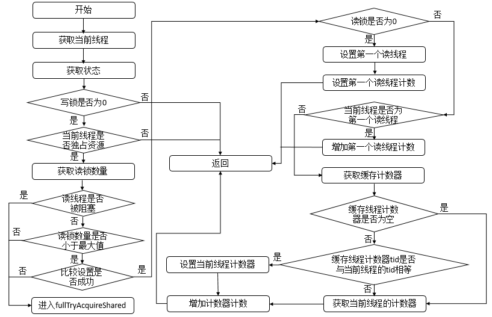
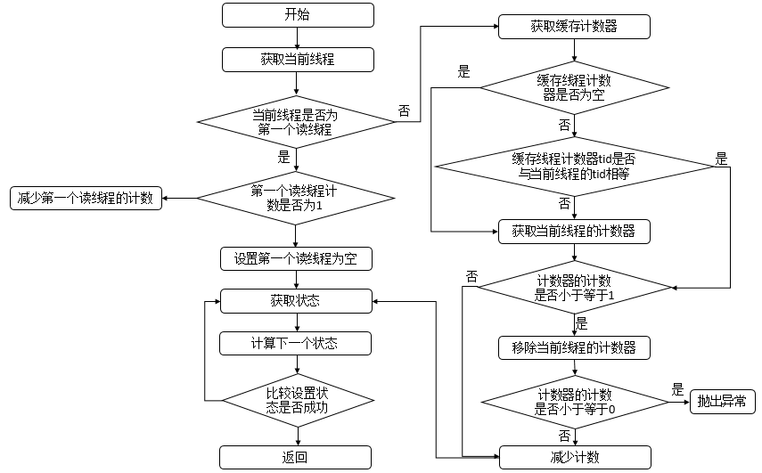
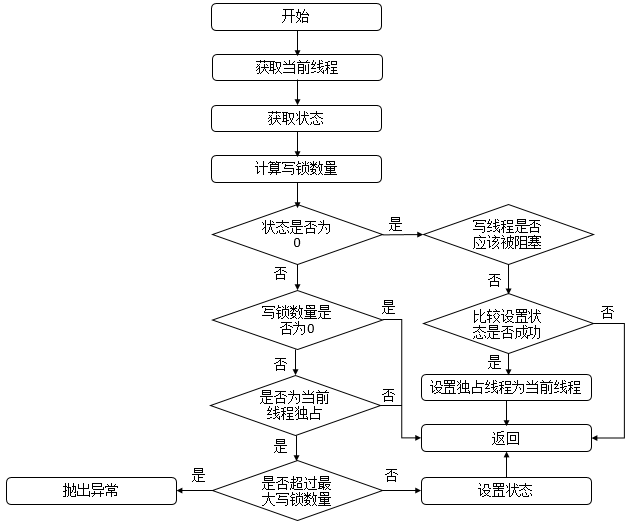
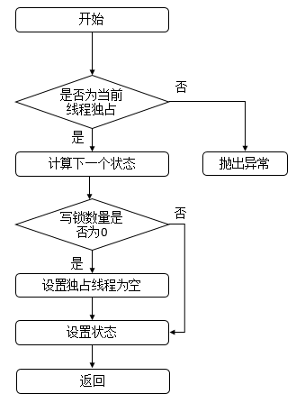

## ReentrantReadWriteLock的说明

`ReentrantReadWriteLock` 是 Java 并发包（`java.util.concurrent.locks`）中的读写锁实现。它允许：

- **多个线程同时读取**（共享读锁）
- **只有一个线程写入**（独占写锁）

这种机制在**读多写少**的场景中显著提高并发性能，因为读操作不会相互阻塞。

### 主要特点

1. 可重入性：读写锁都支持可重入性，即同一个线程可以多次获取同一把锁。
2. 读写分离: 读写锁允许多个线程同时读取，但只允许一个线程写入。
3. 公平性：读写锁默认是非公平的，但可以通过构造函数指定为公平锁。
4. 适合场景：适用于读多写少的场景，提高并发性能。

### 使用示例

```java
import java.util.concurrent.locks.ReentrantReadWriteLock;

public class ReadWriteLockDemo {
    private final ReentrantReadWriteLock lock = new ReentrantReadWriteLock();
    private String message = "初始消息";

    public void read() {
        lock.readLock().lock();
        try {
            System.out.println(Thread.currentThread().getName() + " 开始读取: " + message);
            Thread.sleep(2000);  // 模拟读取耗时
            System.out.println(Thread.currentThread().getName() + " 读取完成");
        } catch (InterruptedException e) {
            e.printStackTrace();
        } finally {
            lock.readLock().unlock();
        }
    }

    public void write(String newMessage) {
        lock.writeLock().lock();
        try {
            System.out.println(Thread.currentThread().getName() + " 开始写入: " + newMessage);
            Thread.sleep(2000);  // 模拟写入耗时
            message = newMessage;
            System.out.println(Thread.currentThread().getName() + " 写入完成");
        } catch (InterruptedException e) {
            e.printStackTrace();
        } finally {
            lock.writeLock().unlock();
        }
    }

    public static void main(String[] args) {
        ReadWriteLockDemo demo = new ReadWriteLockDemo();

        // 两个读线程
        Thread reader1 = new Thread(demo::read, "读线程-1");
        Thread reader2 = new Thread(demo::read, "读线程-2");

        // 写线程
        Thread writer = new Thread(() -> demo.write("新消息"), "写线程");

        reader1.start();
        reader2.start();

        // 确保读线程先启动
        try {
            Thread.sleep(500);
        } catch (InterruptedException e) {
            e.printStackTrace();
        }

        writer.start();
    }
}

```

默认情况下(公平锁)：如果存在1，2 两个线程已经在读数据，此时3线程要写数据，那么3线程会被阻塞，直到1，2线程读完数据后，3线程才能写数据。
当3线程获取到写锁之后，后续的读锁需要等到3线程释放写锁之后才能获取读锁。

## ReentrantReadWriteLock源码解析

### 类的基本结构

```java
public class ReentrantReadWriteLock implements ReadWriteLock, java.io.Serializable {
    private final ReentrantReadWriteLock.ReadLock readerLock;   // 读锁
    private final ReentrantReadWriteLock.WriteLock writerLock;  // 写锁
    final Sync sync;  // 内部同步器，基于 AQS 实现
}
```

- `ReentrantReadWriteLock` 内部是由两个锁组成
    - `readerLock`：读锁（共享锁）
    - `writerLock`：写锁（独占锁）
- `sync`：内部同步器，基于 `AbstractQueuedSynchronizer`（AQS）实现，实现读写锁的核心逻辑

### Sync:同步器

sync: 负责控制锁的获取和释放

#### 类的继承关系

```java
abstract static class Sync extends AbstractQueuedSynchronizer {
    // ...
}
```

- `Sync` 类继承自 `AbstractQueuedSynchronizer`（AQS），是 `ReentrantReadWriteLock` 的内部同步器。

#### 内部类

HoldCounter和ThreadLocalHoldCounter ，其中HoldCounter主要与读锁配套使用，其中，HoldCounter源码如下。

```java
// 计数器
static final class HoldCounter {
    // 计数
    int count = 0;
    // Use id, not reference, to avoid garbage retention
    // 获取当前线程的TID属性的值
    final long tid = getThreadId(Thread.currentThread());
}
```

说明: count主要是记录当前程序中获取读锁的次数，tid主要是记录当前线程的TID属性的值，表示唯一线程。

```java
// 本地线程计数器
static final class ThreadLocalHoldCounter
        extends ThreadLocal<HoldCounter> {
    // 重写初始化方法，在没有进行set的情况下，获取的都是该HoldCounter值
    public HoldCounter initialValue() {
        return new HoldCounter();
    }
}
```

说明：ThreadLocalHoldCounter重写了ThreadLocal的initialValue方法，
ThreadLocal类可以将线程与对象相关联。在没有进行set的情况下，get到的均是initialValue方法里面生成的那个HolderCounter对象。

#### 类的属性

```java
abstract static class Sync extends AbstractQueuedSynchronizer {
    // 版本序列号
    private static final long serialVersionUID = 6317671515068378041L;
    // 高16位为读锁，低16位为写锁
    static final int SHARED_SHIFT = 16;
    // 读锁单位
    static final int SHARED_UNIT = (1 << SHARED_SHIFT);
    // 读锁最大数量
    static final int MAX_COUNT = (1 << SHARED_SHIFT) - 1;
    // 写锁最大数量
    static final int EXCLUSIVE_MASK = (1 << SHARED_SHIFT) - 1;
    // 本地线程计数器
    private transient ThreadLocalHoldCounter readHolds;
    // 缓存的计数器
    private transient HoldCounter cachedHoldCounter;
    // 第一个读线程
    private transient Thread firstReader = null;
    // 第一个读线程的计数
    private transient int firstReaderHoldCount;
}
```

说明: 该属性中包括了读锁、写锁线程的最大量。本地线程计数器等。

### ReentrantReadWriteLock的加锁过程

ReentrantReadWriteLock中大部分操作都是通过sync对象完成的

#### sharedCount函数

表示占有读锁的线程数量，源码如下

```java
// 获取读锁数量
static int sharedCount(int c) {
    return c >>> SHARED_SHIFT;
}
```

说明：直接将state右移16位，就可以得到读锁的线程数量，因为state的高16位表示读锁，对应的第十六位表示写锁数量。

#### exclusiveCount函数

表示占有写锁的线程数量，源码如下

```java
// 获取写锁数量
static int exclusiveCount(int c) {
    return c & EXCLUSIVE_MASK;
}
```

说明：直接将state与EXCLUSIVE_MASK进行与运算，就可以得到写锁的线程数量，因为state的低16位表示写锁，对应的第十六位表示读锁数量。

#### tryAcquireShared函数

```java
protected final int tryAcquireShared(int unused) {
    Thread current = Thread.currentThread();
    int c = getState();
    // 写锁被占用或者写锁的数量大于0，返回-1
    if (exclusiveCount(c) != 0 &&
            getExclusiveOwnerThread() != current)
        return -1;
    int r = sharedCount(c);
    // 写锁的数量大于0，返回-1
    if (!readerShouldBlock() &&
            r < MAX_COUNT &&
            compareAndSetState(c, c + SHARED_UNIT)) {
        if (r == 0) {
            firstReader = current;
            firstReaderHoldCount = 1;
        } else if (firstReader == current) {
            firstReaderHoldCount++;
        } else {
            HoldCounter rh = cachedHoldCounter;
            if (rh == null || rh.tid != getThreadId(current))
                cachedHoldCounter = rh = readHolds.get();
            else if (rh.count == 0)
                readHolds.set(rh);
            rh.count++;
        }
        return 1;
    }
    return fullTryAcquireShared(current);
}
```

说明：tryAcquireShared函数主要是用来获取读锁的，首先获取当前线程，然后获取state的值，如果写锁被占用或者写锁的数量大于0，返回-1，如果写锁的数量大于0，返回-1，如果读锁的数量小于最大值并且当前线程可以获取读锁，那么就将state的值加上SHARED_UNIT，表示当前线程获取了读锁，如果读锁的数量为0，那么将当前线程设置为第一个读线程，如果不是第一个读线程，那么就将当前线程的读锁数量加1。



#### tryReleaseShared函数

```java
protected final boolean tryReleaseShared(int unused) {
    Thread current = Thread.currentThread();
    if (firstReader == current) {
        if (firstReaderHoldCount == 1)
            firstReader = null;
        else
            firstReaderHoldCount--;
    } else {
        HoldCounter rh = cachedHoldCounter;
        if (rh == null || rh.tid != getThreadId(current))
            rh = readHolds.get();
        int count = rh.count;
        if (count <= 1) {
            readHolds.remove();
            if (count <= 0)
                throw unmatchedUnlockException();
        }
        --rh.count;
    }
    for (; ; ) {
        int c = getState();
        int nextc = c - SHARED_UNIT;
        if (compareAndSetState(c, nextc))
            return nextc == 0;
    }
}
```

此函数表示读锁线程释放锁。首先判断当前线程是否为第一个读线程firstReader，若是，则判断第一个读线程占有的资源数firstReaderHoldCount是否为1，若是，则设置第一个读线程firstReader为空，否则，将第一个读线程占有的资源数firstReaderHoldCount减1；若当前线程不是第一个读线程，那么首先会获取缓存计数器（上一个读锁线程对应的计数器
），若计数器为空或者tid不等于当前线程的tid值，则获取当前线程的计数器，如果计数器的计数count小于等于1，则移除当前线程对应的计数器，如果计数器的计数count小于等于0，则抛出异常，之后再减少计数即可。无论何种情况，都会进入无限循环，该循环可以确保成功设置状态state。其流程图如下


#### tryAcquire函数

```java
protected final boolean tryAcquire(int acquires) {
    Thread current = Thread.currentThread();
    int c = getState();
    int w = exclusiveCount(c);
    if (c != 0) {
        if (w == 0 || current != getExclusiveOwnerThread())
            return false;
        if (w + exclusiveCount(acquires) > MAX_COUNT)
            throw new Error("Maximum lock count exceeded");
        setState(c + acquires);
        return true;
    }
    if (writerShouldBlock() ||
            !compareAndSetState(c, c + acquires))
        return false;
    setExclusiveOwnerThread(current);
    return true;
}
```

说明：此函数用于获取写锁，首先会获取state，判断是否为0，若为0，表示此时没有读锁线程，再判断写线程是否应该被阻塞，而在非公平策略下总是不会被阻塞，在公平策略下会进行判断（判断同步队列中是否有等待时间更长的线程，若存在，则需要被阻塞，否则，无需阻塞），之后在设置状态state，然后返回true。若state不为0，则表示此时存在读锁或写锁线程，若写锁线程数量为0或者当前线程为独占锁线程，则返回false，表示不成功，否则，判断写锁线程的重入次数是否大于了最大值，若是，则抛出异常，否则，设置状态state，返回true，表示成功。其函数流程图如下



#### tryRelease函数

```java
protected final boolean tryRelease(int releases) {
    if (!isHeldExclusively())
        throw new IllegalMonitorStateException();
    int nextc = getState() - releases;
    boolean free = exclusiveCount(nextc) == 0;
    if (free)
        setExclusiveOwnerThread(null);
    setState(nextc);
    return free;
}
```

说明：此函数用于释放写锁资源，首先会判断该线程是否为独占线程，若不为独占线程，则抛出异常，否则，计算释放资源后的写锁的数量，若为0，表示成功释放，资源不将被占用，否则，表示资源还被占用。其函数流程图如下。



# 参考文档

https://www.cnblogs.com/leesf456/p/5419132.html
https://pdai.tech/md/java/thread/java-thread-x-lock-ReentrantReadWriteLock.html


