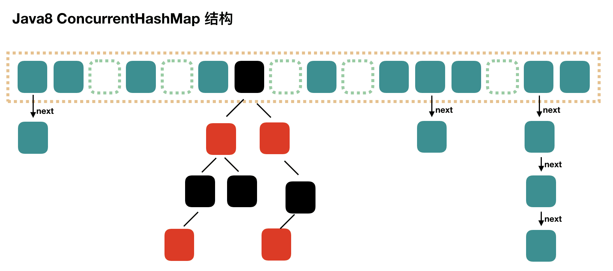

## HashTable为什么慢

Hashtable之所以效率低下主要是因为其实现使用了synchronized关键字对put等操作进行加锁，而synchronized关键字加锁是对整个对象进行加锁，也就是说在进行put等修改Hash表的操作时，锁住了整个Hash表，从而使得其表现的效率低下。

## ConcurrentHashMap

::: tip
ConcurrentHashMap 在1.8的版本调整了实现，
本文章主要写1.8版本的ConcurrentHashMap，无特殊说明，相关代码均为1.8版本。

:::

### 1.8和1.7的区别

| 特性     | JDK 1.7                   | JDK 1.8            |
|--------|---------------------------|--------------------|
| 数据结构   | `Segment + HashEntry` 分段锁 | `Node[]` 数组 + 红黑树  |
| 并发控制方式 | 分段锁                       | CAS + Synchronized |
| 扩容机制   | 分段扩容                      | 并行扩容，效率更高          |
| 红黑树    | ❌ 无红黑树                    | ✅ 链表超阈值转红黑树        |
| 并发性能   | 较低                        | 更高，支持多线程并行扩容       |

### 数据结构

在结构上，ConcurrentHashMap和HashMap类似，都是由数组+链表+红黑树组成。数组是ConcurrentHashMap的主体，是用来存储元素的。链表和红黑树是为了解决哈希冲突而存在的，链表结构的长度大于8时会转换为红黑树。
只是部分方法为了保证线程安全，使用了synchronized进行加锁或者在方法内部使用CAS操作。

::: danger 注意
ConcurrentHashMap的初始化，扩容，put，get等操作都是通过CAS或者Synchronized来保证线程安全的。
里面的细节代码和HashMap有很大的不同，但是基本思路都和HashMap相同
可以参考HashMap的源码解析

[HashMap源码解析](../03.JDK%E9%9B%86%E5%90%88%E6%BA%90%E7%A0%81/02.HashMap%E6%BA%90%E7%A0%81%E8%A7%A3%E6%9E%90.md)
:::
