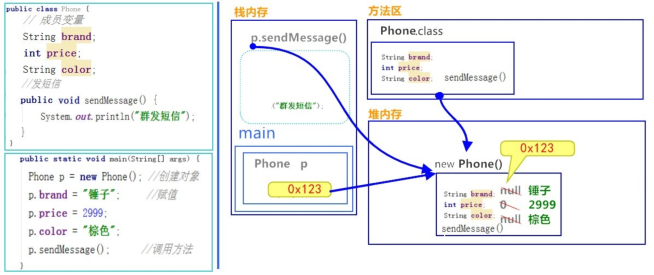
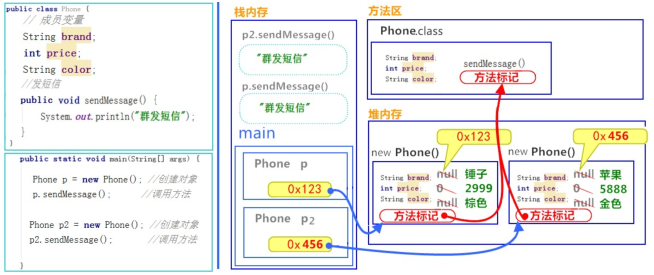
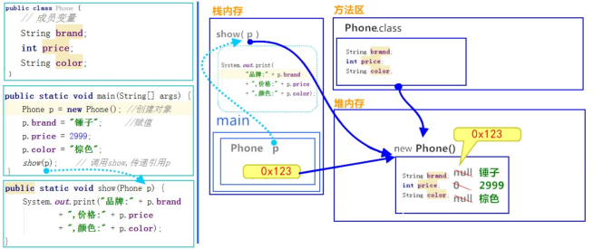
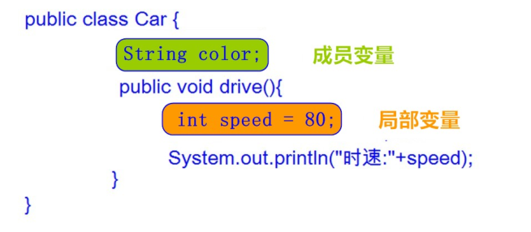

## 面向对象思想

### 面向对象思想概述

#### 概述

Java语言是一种面向对象的程序设计语言，而面向对象思想是一种程序设计思想，我们在面向对象思想的指引下，使用Java语言去设计、开发计算机程序。 这里的对象泛指现实中一切事物，每种事物都具备自己的属性和行为。面向对象思想就是在计算机程序设计过程中，参照现实中事物，将事物的属性特征、行为特征抽象出来，描述成计算机事件的设计思想。 它区别于面向过程思想，强调的是通过调用对象的行为来实现功能，而不是自己一步一步的去
操作实现。

#### 面向对象和面向过程区别

**举例**：洗衣服

- 面向过程：把衣服脱下来 -->找一个盆-->放点洗衣粉-->加点水-->浸泡10分钟-->揉一揉-->清洗衣服-->拧干-->晾起来
- 面向对象：把衣服脱下来 -->打开全自动洗衣机-->扔衣服-->按钮-->晾起来

**区别**

- 面向过程：强调步骤。
- 面向对象：强调对象，这里的对象就是洗衣机。

### 特点

面向对象思想是一种更符合我们思考习惯的思想，它可以将复杂的事情简单化，并将我们从执行者变成了指挥者。面向对象的语言中，包含了三大基本特征，**即封装、继承和多态**

## 类和对象

### 什么是类

- **类** ：是一组相关**属性**和**行为**的集合。可以看成是一类事物的模板，使用事物的属性特征和行为特征来描述该类事物。

**现实中，描述一类事物：**

- **属性** ：就是该事物的状态信息。
- **行为** ：就是该事物能够做什么

**举例**：小猫。
属性：名字、体重、年龄、颜色。 行为：走、跑、叫。

### 什么是对象

- **对象** ：是一类事物的具体体现。对象是类的一个实例（对象并不是找个女朋友），必然具备该类事物的属性和行为。

现实中，一类事物的一个实例：一只小猫。
举例：一只小猫。
属性：tom、5kg、2 years、yellow。 行为：溜墙根走、蹦跶的跑、喵喵叫。

### 类与对象的关系

- 类是对一类事物的描述，是 **抽象**的。
- 对象是一类事物的实例，是 **具体**的。
- **类是对象的模板，对象是类的实体**

类的定义

### 事物与类的对比

现实世界的一类事物：

**属性**：事物的状态信息。 **行为**：事物能够做什么。

Java中用class描述事物也是如此：

**成员变量**：对应事物的**属性**

**成员方法**：对应事物的**行为**

### 类的定义格式

```java
public  class  ClassName  {
    //成员变量
    //成员方法
}
```

- **定义类** ：就是定义类的成员，包括**成员变量**和**成员方法**。
- **成员变量** ：和以前定义变量几乎是一样的。只不过位置发生了改变。**在类中**，**方法外**
- **成员方法** ：和以前定义方法几乎是一样的。只不过**把static去掉**，static的作用在面向对象后面课程中再详细
  讲解

**类的定义格式举例**

```java
public  class  Student  {
     //成员变量   
     String  name;//姓名   
        int  age;//年龄
        //成员方法
        //学习的方法
        publicvoid  study()  {
        System.out.println("好好学习，天天向上");
    }
    //吃饭的方法
    public void  eat()  {
        System.out.println("学习饿了要吃饭");
    }
}
```

### 对象的使用

#### 对象的使用格式

创建对象：

```java
类名  对象名  =  new  类名();
```

使用对象访问类中的成员:

```
对象名.成员变量；
对象名.成员方法()；
```

对象的使用格式举例:

``` java
public  class  Test01_Student  {
    public  static  void  main(String[]  args)  {
        //创建对象格式：类名  对象名  =  new  类名();
        Student  s  =  new  Student();
        System.out.println("s:"+s);  //cn.itcast.Student@100363
        //直接输出成员变量值
        System.out.println("姓名："+s.name);  //null
        System.out.println("年龄："+s.age);  //0
        System.out.println("‐‐‐‐‐‐‐‐‐‐");
        //给成员变量赋值
        s.name  =  "赵丽颖";
        s.age  =  18;
        //再次输出成员变量的值
        System.out.println("姓名："+s.name);  //赵丽颖
        System.out.println("年龄："+s.age);  //18
        System.out.println("‐‐‐‐‐‐‐‐‐‐");
        //调用成员方法
        s.study();  //  "好好学习，天天向上"
        s.eat();  //  "学习饿了要吃饭"
    }
    ｝
```

### 成员变量的默认值

|          | 数据类型                       | 默认值   |
| -------- | ------------------------------ | -------- |
| 基本类型 | 整数（byte，short，int，long） | 0        |
|          | 浮点数（float，double          | 0.0      |
|          | 字符（char）                   | '\u0000' |
|          | 布尔（boolean）                | false    |
| 引用类型 | 数组，类，接口                 | null     |

#### 对象内存图

#### 一个对象，调用一个方法内存图



> 通过上图，我们可以理解，在栈内存中运行的方法，遵循"先进后出，后进先出"的原则。变量p指向堆内存中的空间，寻找方法信息，去执行该方法。
>
> 但是，这里依然有问题存在。创建多个对象时，如果每个对象内部都保存一份方法信息，这就非常浪费内存了，因为所有对象的方法信息都是一样的。那么如何解决这个问题呢？请看如下图解。

#### 两个对象，调用同一方法内存图



> 对象调用方法时，根据对象中方法标记（地址值），去类中寻找方法信息。这样哪怕是多个对象，方法信息只保存一份，节约内存空间

#### 一个引用，作为参数传递到方法中内存图



> 引用类型作为参数，传递的是地址值

#### 成员变量和局部变量区别

变量根据**定义位置的不同**，我们给变量起了不同的名字。如下图所示：



- <font color=red>在类中的位置不同 </font>
    - 成员变量：类中，方法外
    - 局部变量：方法中或者方法声明上 (形式参数)
- <font color=red>作用范围不一样</font>
    - 成员变量：类中
    - 局部变量：方法中
- <font color=red>初始化值的不同 </font>
    - 成员变量：有默认值
    - 局部变量：没有默认值。必须先定义，赋值，最后使用
- 在内存中的位置不同
    - 成员变量：堆内存
    - 局部变量：栈内存
- 生命周期不同
    - 成员变量：随着对象的创建而存在，随着对象的消失而消失
    - 局部变量：随着方法的调用而存在，随着方法的调用完毕而消失


