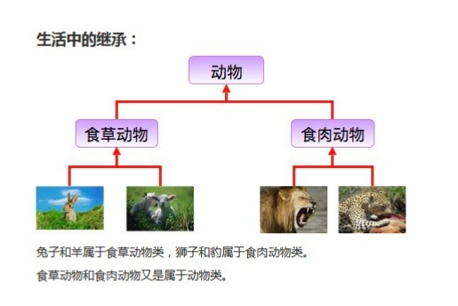
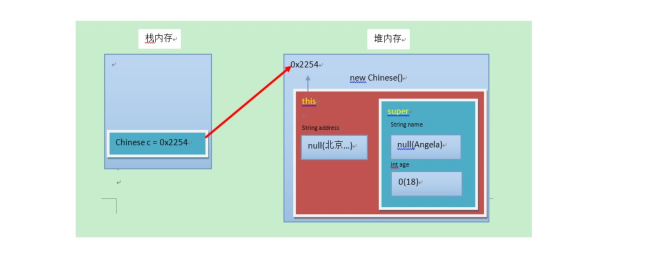

##  封装

### 封装概述

#### 概述

面向对象编程语言是对客观世界的模拟，客观世界里成员变量都是隐藏在对象内部的，外界无法直接操作和修改。封装可以被认为是一个保护屏障，防止该类的代码和数据被其他类随意访问。要访问该类的数据，必须通过指定的方式。适当的封装可以让代码更容易理解与维护，也加强了代码的安全性

#### 原则

将**属性隐藏**起来，若需要访问某个属性，**提供公共方法**对其访问。

#### 封装的步骤

1. 使用  private 关键字来修饰成员变量
2. 对需要访问的成员变量，提供对应的一对  getXxx 方法 、 setXxx 方法

#### 封装的操作——private关键字

### private的含义

1. private是一个权限修饰符，代表最小权限。
2. 可以修饰成员变量和成员方法。
3. 被private修饰后的成员变量和成员方法，只在本类中才能访问。

### private的使用格式

```java
private  数据类型  变量名 ;
```

1. 使用  `private` 修饰成员变量，代码如下：

   ```java
   public  class  Student  {
       private  String  name;
       private  int  age;
   }
   ```

2. 提供  getXxx 方法 /  setXxx 方法，可以访问成员变量，代码如下：

   ```java
   public  class  Student  {
       private  String  name;
       private  int  age;
       public  void  setName(String  n)  {
           name  =  n;
       }
       public  String  getName()  {
           return  name;
       }
       public  void  setAge(int  a)  {
           age  =  a;
       }
       public  int  getAge()  {
           return  age;
       }
   }
   ```

### 封装优化1——this关键字

我们发现 setXxx 方法中的形参名字并不符合见名知意的规定，那么如果修改与成员变量名一致，是否就见名知意了呢？代码如下：

```java
public  class  Student  {
    private  String  name;
    private  int  age;
    public  void  setName(String  name)  {
        name  =  name;
    }
    public  void  setAge(int  age)  {
        age  =  age;
    }
}
```

经过修改和测试，我们发现新的问题，成员变量赋值失败了。也就是说，在修改了 `setXxx()` 的形参变量名后，方法并没有给成员变量赋值！这是由于形参变量名与成员变量名重名，导致成员变量名被隐藏，方法中的变量名，无法访问到成员变量，从而赋值失败。所以，我们只能使用this关键字，来解决这个重名问题。

#### this的含义

this代表所在类的当前对象的引用（地址值），即对象自己的引用。

> 记住 ：方法被哪个对象调用，方法中的this就代表那个对象。即谁在调用，this就代表谁。

#### this使用格式

```
this.成员变量名;
```

使用  this 修饰方法中的变量，解决成员变量被隐藏的问题，代码如下：

```java
public  class  Student  {
    private  String  name;
    private  int  age;
    public  void  setName(String  name)  {
        //name  =  name;
        this.name  =  name;
    }
    public  String  getName()  {
        return  name;
    }
    public  void  setAge(int  age)  {
        //age  =  age;
        this.age  =  age;
    }
    public  int  getAge()  {
        return  age;
        }
      }
```

> 小贴士：方法中只有一个变量名时，默认也是使用 this 修饰，可以省略不写。

### 封装优化2——构造方法

当一个对象被创建时候，构造方法用来初始化该对象，给对象的成员变量赋初始值。

> 小贴士：无论你与否自定义构造方法，所有的类都有构造方法，因为Java自动提供了一个无参数构造方法，一旦自己定义了构造方法，Java自动提供的默认无参数构造方法就会失效。

#### 构造方法的定义格式

```
修饰符  构造方法名(参数列表){
//  方法体       
}
```

构造方法的写法上，方法名与它所在的类名相同。它没有返回值，所以不需要返回值类型，甚至不需要void。使用构造方法后，代码如下：

```java
public  class  Student  {
    private  String  name;
    private  int  age;
    //  无参数构造方法
    public  Student()  {}
    //  有参数构造方法
    public  Student(String  name,int  age)  {
        this.name  =  name;
        this.age  =  age;
    }
}
```

### 注意事项

1. 如果不提供构造方法，系统会给出无参数构造方法。
2. 如果提供了构造方法，系统将不再提供无参数构造方法
3. 构造方法是可以重载的，既可以定义参数，也可以不定义参数。

### 标准代码——`JavaBean`

`JavaBean` 是 Java语言编写类的一种标准规范。符合 `JavaBean` 的类，要求类必须是具体的和公共的，并且具有无参数的构造方法，提供用来操作成员变量的 `set` 和 `get` 方法。

```java
public  class  ClassName{
    //成员变量
    //构造方法
    //无参构造方法【必须】
    //有参构造方法【建议】
    //成员方法      
    //getXxx()
    //setXxx()
}
```

编写符合 `JavaBean` 规范的类，以学生类为例，标准代码如下：

```java
public  class  Student  {
    //成员变量
    private  String  name;
    private  int  age;
    //构造方法
    public  Student()  {}
    public  Student(String  name,int  age)  {
        this.name  =  name;
        this.age  =  age;
    }
    //成员方法
    publicvoid  setName(String  name)  {
        this.name  =  name;
    }
    public  String  getName()  {
        return  name;
    }
    publicvoid  setAge(int  age)  {
        this.age  =  age;
    }
    publicint  getAge()  {
        return  age;
    }
}
```

测试类，代码如下：

```java
public  class  TestStudent  {
    public  static  void  main(String[]  args)  {
        //无参构造使用
        Student  s=  new  Student();
        s.setName("柳岩");
        s.setAge(18);
        System.out.println(s.getName()+"‐‐‐"+s.getAge());
                //带参构造使用
        Student  s2=  new  Student("赵丽颖",18);
        System.out.println(s2.getName()+"‐‐‐"+s2.getAge());
    }
}
```

## 继承

### 由来

多个类中存在相同属性和行为时，将这些内容抽取到单独一个类中，那么多个类无需再定义这些属性和行为，只要继承那一个类即可。如图所示：



其中，多个类可以称为子类，单独那一个类称为**父类**、**超类（superclass）**或者**基类**。

继承描述的是事物之间的所属关系，这种关系是： `is -a` 的关系。例如，图中兔子属于食草动物，食草动物属于动物。可见，父类更通用，子类更具体。我们通过继承，可以使多种事物之间形成一种关系体系。

### 定义

- **继承** ：就是子类继承父类的属性和行为，使得子类对象具有与父类相同的属性、相同的行为。子类可以直接访问父类中的非私有的属性和行为

### 好处

1. 提高代码的复用性。
2. 类与类之间产生了关系，是多态的前提。

## 继承的格式

通过  `extends` 关键字，可以声明一个子类继承另外一个父类，定义格式如下：

```
class   父类   {
...          
}
class   子类   extends   父类   {
...          
}
```

继承演示，代码如下

```java
/*定义员工类Employee，做为父类
*/
class   Employee   {
String   name;   //   定义name属性          
//   定义员工的工作方法          
public   void   work()   {          
System.out.println("尽心尽力地工作");                      
}          
}
/*
   *   定义讲师类Teacher   继承   员工类Employee
   */
class   Teacher   extends   Employee   {
//   定义一个打印name的方法          
public   void   printName()   {          
System.out.println("name="   +   name);                      
}          
}
/*
   *   定义测试类
   */
public   class   ExtendDemo01   {
public   static   void   main(String[]   args)   {          
                        //   创建一个讲师类对象
Teacher   t   =   new   Teacher();                      
               
                        //   为该员工类的name属性进行赋值
t.name   =   "小明";                         
               
                   //   调用该员工的printName()方法    
t.printName();   //   name   =   小明                      
                     
                   //   调用Teacher类继承来的work()方法    
                   t.work();      //   尽心尽力地工作    
}          
}

```

## 继承后的特点——成员变量

### 成员变量不重名

如果子类父类中出现**不重名**的成员变量，这时的访问是**没有影响**的。代码如下：

```java
class   Fu   {
//   Fu中的成员变量。          
int   num   =   5;          
}
class   Zi   extends   Fu   {
//   Zi中的成员变量          
int   num2   =   6;          
//   Zi中的成员方法          
public   void   show()   {          
//   访问父类中的num，                      
System.out.println("Fu   num="+num);   //   继承而来，所以直接访问。                      
//   访问子类中的num2                      
System.out.println("Zi   num2="+num2);                      
}          
}
class   ExtendDemo02   {
public   static   void   main(String[]   args)   {          
                        //   创建子类对象
Zi   z   =   new   Zi();                         
                   //   调用子类中的show方法    
z.show();                            
}          
}
/*
运行结果
Fu   num   =   5
Zi   num2   =   6*/

```

### 成员变量重名

如果子类父类中出现**重名**的成员变量，这时的访问是**有影响的**。代码如下

```java
class   Fu   {
//   Fu中的成员变量。          
int   num   =   5;          
}
class   Zi   extends   Fu   {
//   Zi中的成员变量          
int   num   =   6;          
public   void   show()   {          
//   访问父类中的num                      
System.out.println("Fu   num="   +   num);                      
//   访问子类中的num                      
System.out.println("Zi   num="   +   num);                      
}          
}
class   ExtendsDemo03   {
public   static   void   main(String[]   args)   {          
                   //   创建子类对象    
Zi   z   =   new   Zi();                         
                   //   调用子类中的show方法    
z.show();                         
}          
}
/*
演示结果：
Fu   num   =   6
Zi   num   =   */

```

子父类中出现了同名的成员变量时，在子类中需要访问父类中非私有成员变量时，需要使用 `super` 关键字，修饰父类成员变量，类似于之前学过的  `this`

使用格式：

```
super.父类成员变量名
```

子类方法需要修改，代码如下

```java
class   Zi   extends   Fu   {
//   Zi中的成员变量          
int   num   =   6;          
public   void   show()   {          
//访问父类中的num                      
System.out.println("Fu   num="   +   super.num);                      
//访问子类中的num                      
System.out.println("Zi   num="   +   this.num);                      
}          
}
/*
演示结果：
Fu   num   =   5
Zi   num   =   6*/

```

> 小贴士：Fu 类中的成员变量是非私有的，子类中可以直接访问。若Fu 类中的成员变量私有了，子类是不能直接访问的。通常编码时，我们遵循封装的原则，使用private修饰成员变量，那么访问**父类的私有成员变量**可以在父类中提供公共的**getXxx**方法和**setXxx**方法

## 继承后的特点——成员方法

### 成员方法不重名

如果子类父类中出现**不重名**的成员方法，这时的调用是**没有影响的**。对象调用方法时，会先在子类中查找有没有对应的方法，若子类中存在就会执行子类中的方法，若子类中不存在就会执行父类中相应的方法。代码如下：

```java
class   Fu{
public   void   show(){          
System.out.println("Fu类中的show方法执行");                      
}          
}
class   Zi   extends   Fu{
public   void   show2(){          
System.out.println("Zi类中的show2方法执行");                      
}          
}
public      class   ExtendsDemo04{
public   static   void   main(String[]   args)   {          
Zi   z   =   new   Zi();                      
                //子类中没有show方法，但是可以找到父类方法去执行
                z.show();                         
z.show2();                      
}          
}
```

### 成员方法重名 ——重写(Override)

如果子类父类中**出现重名的成员方法**，这时的访问是一种特殊情况，叫做**方法重写** (Override)

- **方法重写** ：子类中出现与父类一模一样的方法时（返回值类型，方法名和参数列表都相同），会出现覆盖效果，也称为重写或者复写。**声明不变，重新实现**。

  ```java
  class   Fu   {
  public   void   show()   {          
  System.out.println("Fu   show");                      
  }          
  }
  class   Zi   extends   Fu   {
  //子类重写了父类的show方法          
  public   void   show()   {          
  System.out.println("Zi   show");                      
  }          
  }
  public   class   ExtendsDemo05{
  public   static   void   main(String[]   args)   {          
  Zi   z   =   new   Zi();                      
                  //   子类中有show方法，只执行重写后的show方法       
  z.show();      //   Zi   show                      
  }          
  }
  ```

**重写的应用**

子类可以根据需要，定义特定于自己的行为。既沿袭了父类的功能名称，又根据子类的需要重新实现父类方法，从而进行扩展增强。比如新的手机增加来电显示头像的功能，代码如下：

```java
class   Phone   {
public   void   sendMessage(){          
System.out.println("发短信");                      
}          
public   void   call(){          
System.out.println("打电话");                      
}          
public   void   showNum(){          
System.out.println("来电显示号码");                      
}          
}
//智能手机类
class   NewPhone   extends   Phone   {
         
//重写父类的来电显示号码功能，并增加自己的显示姓名和图片功能          
public   void   showNum(){          
//调用父类已经存在的功能使用super                      
super.showNum();                      
//增加自己特有显示姓名和图片功能                      
System.out.println("显示来电姓名");                      
System.out.println("显示头像");                      
}          
}
public   class   ExtendsDemo06   {
public   static   void   main(String[]   args)   {          
                   //   创建子类对象    
                   NewPhone   np   =   new   NewPhone();    
                     
                        //   调用父类继承而来的方法
                        np.call();
               
                   //   调用子类重写的方法    
                   np.showNum();    
}          
}
```

> 小贴士：这里重写时，用到 super.父类成员方法，表示调用父类的成员方法。

**注意事项**

1. 子类方法覆盖父类方法，必须要保证权限大于等于父类权限。
2. 子类方法覆盖父类方法，返回值类型、函数名和参数列表都要一模一样。

## 继承后的特点——构造方法

构造方法的定义格式和作用。

1. 构造方法的名字是与类名一致的。所以子类是无法继承父类构造方法的。
2. 构造方法的作用是初始化成员变量的。所以子类的初始化过程中，必须先执行父类的初始化动作。子类的构造方法中默认有一个 super() ，表示调用父类的构造方法，父类成员变量初始化后，才可以给子类使用。代
   码如下

```java
class   Fu   {
      private   int   n;
      Fu(){
            System.out.println("Fu()");
      }
}
class   Zi   extends   Fu   {
      Zi(){
            //   super（），调用父类构造方法
            super();
            System.out.println("Zi()");
      }   
}
public   class   ExtendsDemo07{
      public   static   void   main   (String   args[]){
            Zi   zi   =   new   Zi();
      }
}
/*
输出结果：
Fu()
Zi()*/

```

## super 和this

### 父类空间优先于子类对象产生

在每次创建子类对象时，**先初始化父类空间**，再创建其子类对象本身。目的在于子类对象中包含了其对应的父类空间，便可以包含其父类的成员，如果父类成员非private修饰，则子类可以随意使用父类成员。代码体现在子类的构造方法调用时，一定先调用父类的构造方法。理解图解如下：



### super和this的含义

- **super** ：代表父类的存储空间标识(可以理解为父亲的引用)。
- **this** ：代表当前对象的引用(谁调用就代表谁)

### super和this的用法

1. 访问成员

```
this.成员变量         ‐‐            本类的       
super.成员变量        ‐‐            父类的    
this.成员方法名()      ‐‐            本类的                
super.成员方法名()     ‐‐            父类的
```

用法演示，代码如下：

```java
class   Animal   {
            public   void   eat()   {
                        System.out.println("animal   :   eat");
            }
}
class   Cat   extends   Animal   {
            public   void   eat()   {
                        System.out.println("cat   :   eat");
            }
            public   void   eatTest()   {
                        this.eat();         //   this      调用本类的方法
                        super.eat();      //   super   调用父类的方法
            }
}
public   class   ExtendsDemo08   {
            public   static   void   main(String[]   args)   {
                        Animal   a   =   new   Animal();
                        a.eat();
                        Cat   c   =   new   Cat();
                        c.eatTest();
            }
}
/*
输出结果为：
animal   :   eat
cat   :   eat
animal   :   eat*/

```

2. 访问构造方法

```
this(...)             ‐‐            本类的构造方法       
super(...)          ‐‐            父类的构造方法
```

> 子类的每个构造方法中均有默认的super()，调用父类的空参构造。手动调用父类构造会覆盖默认的super()。super() 和 this() 都必须是在构造方法的第一行，所以不能同时出现

## 继承的特点

1. Java只支持单继承，不支持多继承

```
//一个类只能有一个父类，不可以有多个父类。
class   C   extends   A{}    //ok          
class   C   extends   A,B... //erro
```

2. Java支持多层继承(继承体系)。

```java
class   A{}
class   B   extends   A{}
class   C   extends   B{}
```

> 顶层父类是Object类。所有的类默认继承Object，作为父类

3. 子类和父类是一种相对的概念。

## 多态

### 引入

多态是继**封装**、**继承**之后，面向对象的**第三大特性**。

### 定义

- 多态 ： 是指同一行为，具有多个不同表现形式。

### 前提

1.  继承或者实现【二选一】

2.  方法的重写【意义体现：不重写，无意义】

3.  父类引用指向子类对象【格式体现】

## 多态的体现

多态体现的格式：

```
父类类型 变量名 = new 子类对象；
变量名.方法名();
```

> 父类类型：指子类对象继承的父类类型，或者实现的父接口类型。


**当使用多态方式调用方法时，首先检查父类中是否有该方法，如果没有，则编译错误；如果有，执行的是子类重写后方法。**

代码如下：

定义父类：

```java
public abstract class Animal { 
    public abstract void eat(); 
}
```

定义子类：

```java
class Cat extends Animal { 
    public void eat() { 
        System.out.println("吃鱼"); 
    } 
} 
class Dog extends Animal { 
    public void eat() { 
        System.out.println("吃骨头"); 
    } 
}
```

定义测试类：

```java
public class Test {
    public static void main(String[] args) {
        // 多态形式，创建对象
        Animal a1 = new Cat(); 
        // 调用的是 Cat 的 eat
        a1.eat();         
        // 多态形式，创建对象
        Animal a2 = new Dog();
        // 调用的是 Dog 的 eat
        a2.eat();              
    } 
}
```

### 多态的好处

实际开发的过程中，父类类型作为方法形式参数，传递子类对象给方法，进行方法的调用，更能体现出多态的扩展性与便利。代码如下：

定义父类：

```java
public abstract class Animal { 
    public abstract void eat(); 
}
```

定义子类：

```java
class Cat extends Animal { 
    public void eat() { 
        System.out.println("吃鱼"); 
    } 
} 
class Dog extends Animal { 
    public void eat() { 
        System.out.println("吃骨头"); 
    } 
}
```

定义测试类：

```java
public class Test {
    public static void main(String[] args) {
        // 多态形式，创建对象
        Cat c = new Cat(); 
        Dog d = new Dog();
        // 调用showCatEat
        showCatEat(c);
        // 调用showDogEat
        showDogEat(d);
        /*
        以上两个方法, 均可以被showAnimalEat(Animal a)方法所替代
        而执行效果一致
        */
        showAnimalEat(c);
        showAnimalEat(d);
    }
    public static void showCatEat (Cat c){
        c.eat();
    }
    public static void showDogEat (Dog d){
        d.eat();
    }
    public static void showAnimalEat (Animal a){
        a.eat();
    }
}
```

由于多态特性的支持， `showAnimalEat`方法的Animal类型，是Cat和Dog的父类类型，父类类型接收子类对象，当然可以把Cat对象和Dog对象，传递给方法。

当eat方法执行时，多态规定，执行的是子类重写的方法，那么效果自然与`showCatEat`、`showDogEat`方法一致，所以`showAnimalEat`完全可以替代以上两方法。

不仅仅是替代，在扩展性方面，无论之后再多的子类出现，我们都不需要编写`showXxxEat`方法了，直接使用`showAnimalEat`都可以完成。

所以，多态的好处，体现在，可以使程序编写的更简单，并有良好的扩展。

## 引用类型转换

多态的转型分为向上转型与向下转型两种

### 向上转型

- 向上转型 ：多态本身是子类类型向父类类型向上转换的过程，这个过程是默认的。

当父类引用指向一个子类对象时，便是向上转型。

使用格式：

```
父类类型  变量名 = new 子类类型();
如：Animal a = new Cat();
```

### 向下转型

- 向下转型 ：父类类型向子类类型向下转换的过程，这个过程是强制的

一个已经向上转型的子类对象，将父类引用转为子类引用，可以使用强制类型转换的格式，便是向下转型。

使用格式：

```
变量名 = (子类类型) 父类变量名;
如:Cat c =(Cat) a; 
```

### 为什么要转型

当使用多态方式调用方法时，首先检查父类中是否有该方法，如果没有，则编译错误。也就是说，不能调用子类拥有，而父类没有的方法。编译都错误，更别说运行了。这也是多态给我们带来的一点"小麻烦"。所以，想要调用子类特有的方法，必须做向下转型。

转型演示，代码如下：

定义类：

```java
abstract class Animal { 
    abstract void eat(); 
} 
class Cat extends Animal { 
    public void eat() { 
        System.out.println("吃鱼"); 
    } 
    public void catchMouse() { 
        System.out.println("抓老鼠"); 
    } 
} 
class Dog extends Animal { 
    public void eat() { 
        System.out.println("吃骨头"); 
    } 
    public void watchHouse() { 
        System.out.println("看家"); 
    } 
}
```

定义测试类：

```java
public class Test {
    public static void main(String[] args) {
        // 向上转型 
        Animal a = new Cat(); 
        a.eat();  // 调用的是 Cat 的 eat               
        // 向下转型 
        Cat c = (Cat)a;      
        c.catchMouse();  // 调用的是 Cat 的 catchMouse        
    } 
}
```

# 接口多态的综合案例

## 案例分析

进行描述笔记本类，实现笔记本使用USB鼠标、USB键盘

- USB 接口，包含开启功能、关闭功能
- 笔记本类，包含运行功能、关机功能、使用 USB设备功能
- 鼠标类，要实现 USB接口，并具备点击的方法
- 键盘类，要实现 USB接口，具备敲击的方法

## 案例实现

定义USB接口：

```java
interface USB {
    void open();// 开启功能
    void close();// 关闭功能
}
```

定义鼠标类：

```java
class Mouse implements USB {
    public void open() {
        System.out.println("鼠标开启，红灯闪一闪");
    }
    public void close() {
        System.out.println("鼠标关闭，红灯熄灭");
    }
    public void click(){
        System.out.println("鼠标单击");
    }
}
```

定义键盘类：

```java
class KeyBoard implements USB {
    public void open() {
        System.out.println("键盘开启，绿灯闪一闪");
    }
    public void close() {
        System.out.println("键盘关闭，绿灯熄灭");
    }
    public void type(){
        System.out.println("键盘打字");
    }
}
```

定义笔记本类：

```java
class Laptop {
    // 笔记本开启运行功能
    public void run() {
        System.out.println("笔记本运行");
    }
    // 笔记本使用usb设备，这时当笔记本对象调用这个功能时，必须给其传递一个符合USB规则的USB设备
    public void useUSB(USB usb) {
        // 判断是否有USB设备
        if (usb != null) {
            usb.open();
            // 类型转换,调用特有方法
            if(usb instanceof Mouse){
                Mouse m = (Mouse)usb;
                    m.click();
            }else if (usb instanceof KeyBoard){
                KeyBoard kb = (KeyBoard)usb;
                kb.type();
            }
            usb.close();
        }
    }
    public void shutDown() {
        System.out.println("笔记本关闭");
    }
}
```

> java 中的`instanceof` 运算符是用来在运行时指出对象是否是特定类的一个实例。`instanceof`通过返回一个布尔值来指出，这个对象是否是这个特定类或者是它的子类的一个实例。

测试类，代码如下：

```java
public class Test {
    public static void main(String[] args) {
        // 创建笔记本实体对象
        Laptop lt = new Laptop();
        // 笔记本开启
        lt.run();
        // 创建鼠标实体对象
                Usb u = new Mouse();
        // 笔记本使用鼠标
        lt.useUSB(u);
        // 创建键盘实体对象
        KeyBoard kb = new KeyBoard();
        // 笔记本使用键盘
        lt.useUSB(kb);
        // 笔记本关闭
        lt.shutDown();
    }
}
```

