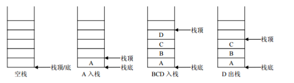
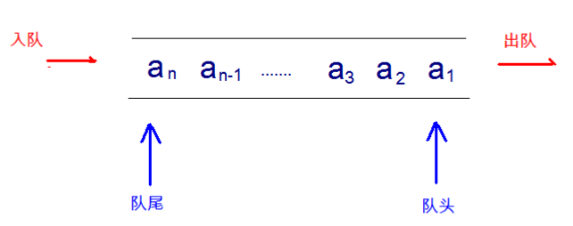
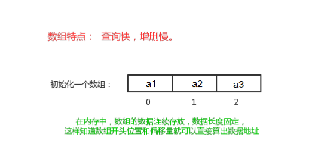
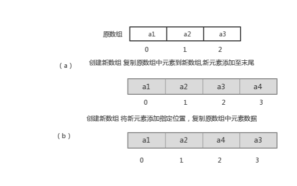
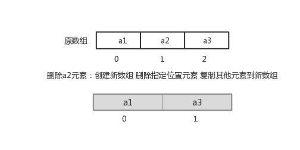
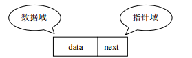
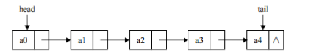
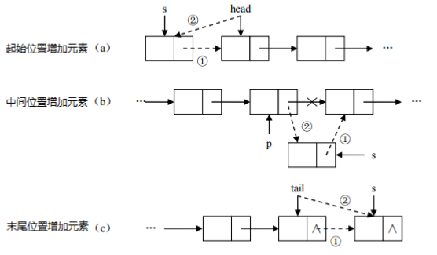
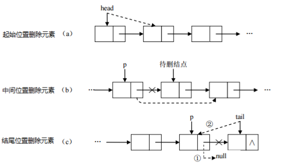
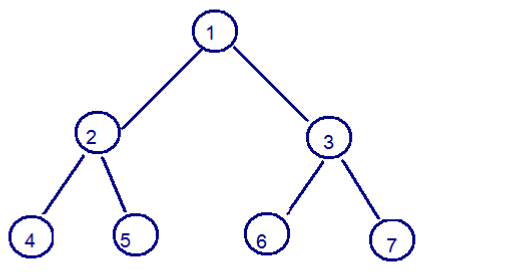

## 常见的数据结构

数据存储的常用结构有：栈、队列、数组、链表和红黑树

#### 栈

* **栈**：**stack**,又称堆栈，它是运算受限的线性表，其限制是仅允许在标的一端进行插入和删除操作，不允许在其他任何位置进行添加、查找、删除等操作。

简单的说：采用该结构的集合，对元素的存取有如下的特点

* 先进后出（即，存进去的元素，要在后它后面的元素依次取出后，才能取出该元素）。例如，子弹压进弹夹，先压进去的子弹在下面，后压进去的子弹在上面，当开枪时，先弹出上面的子弹，然后才能弹出下面的子弹。

* 栈的入口、出口的都是栈的顶端位置。

这里两个名词需要注意：

* **压栈**：就是存元素。即，把元素存储到栈的顶端位置，栈中已有元素依次向栈底方向移动一个位置。
* **弹栈**：就是取元素。即，把栈的顶端位置元素取出，栈中已有元素依次向栈顶方向移动一个位置。

#### 队列

* **队列**：**queue**,简称队，它同堆栈一样，也是一种运算受限的线性表，其限制是仅允许在表的一端进行插入，而在表的另一端进行删除。

简单的说，采用该结构的集合，对元素的存取有如下的特点：

* 先进先出（即，存进去的元素，要在后它前面的元素依次取出后，才能取出该元素）。例如，小火车过山洞，车头先进去，车尾后进去；车头先出来，车尾后出来。
* 队列的入口、出口各占一侧。例如，下图中的左侧为入口，右侧为出口。

#### 数组

* **数组**:**Array**,是有序的元素序列，数组是在内存中开辟一段连续的空间，并在此空间存放元素。就像是一排出租屋，有100个房间，从001到100每个房间都有固定编号，通过编号就可以快速找到租房子的人。

简单的说,采用该结构的集合，对元素的存取有如下的特点：

*  查找元素快：通过索引，可以快速访问指定位置的元素

  

*  增删元素慢
* **指定索引位置增加元素**：需要创建一个新数组，将指定新元素存储在指定索引位置，再把原数组元素根据索引，复制到新数组对应索引的位置。如下图
  

* **指定索引位置删除元素：**需要创建一个新数组，把原数组元素根据索引，复制到新数组对应索引的位置，原数组中指定索引位置元素不复制到新数组中。如下图

 

####  链表

* **链表**:**linked list**,由一系列结点node（链表中每一个元素称为结点）组成，结点可以在运行时i动态生成。每个结点包括两个部分：一个是存储数据元素的数据域，另一个是存储下一个结点地址的指针域。我们常说的链表结构有单向链表与双向链表，那么这里给大家介绍的是**单向链表**。

  

简单的说，采用该结构的集合，对元素的存取有如下的特点：

* 多个结点之间，通过地址进行连接。例如，多个人手拉手，每个人使用自己的右手拉住下个人的左手，依次类推，这样多个人就连在一起了。

* 查找元素慢：想查找某个元素，需要通过连接的节点，依次向后查找指定元素

  

* 增删元素快：

    *  增加元素：只需要修改连接下个元素的地址即可。

  

    *  删除元素：只需要修改连接下个元素的地址即可。

  

#### 红黑树

* **二叉树**：**binary tree** ,是每个结点不超过2的有序**树（tree）** 。

简单的理解，就是一种类似于我们生活中树的结构，只不过每个结点上都最多只能有两个子结点。

二叉树是每个节点最多有两个子树的树结构。顶上的叫根结点，两边被称作“左子树”和“右子树”。

如图：

我们要说的是二叉树的一种比较有意思的叫做**红黑树**，红黑树本身就是一颗二叉查找树，将节点插入后，该树仍然是一颗二叉查找树。也就意味着，树的键值仍然是有序的。

红黑树的约束:

1. 节点可以是红色的或者黑色的

2. 根节点是黑色的

3. 叶子节点(特指空节点)是黑色的
4. 每个红色节点的子节点都是黑色的
5. 任何一个节点到其每一个叶子节点的所有路径上黑色节点数相同

红黑树的特点:

速度特别快,趋近平衡树,查找叶子元素最少和最多次数不多于二倍
