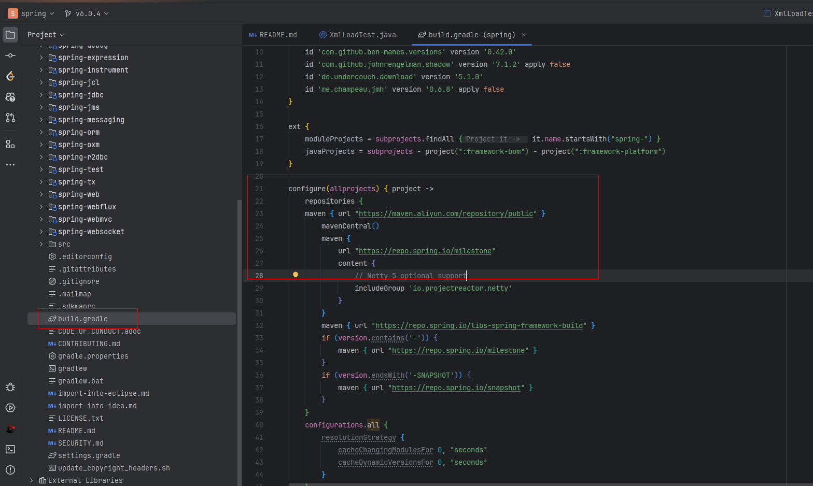
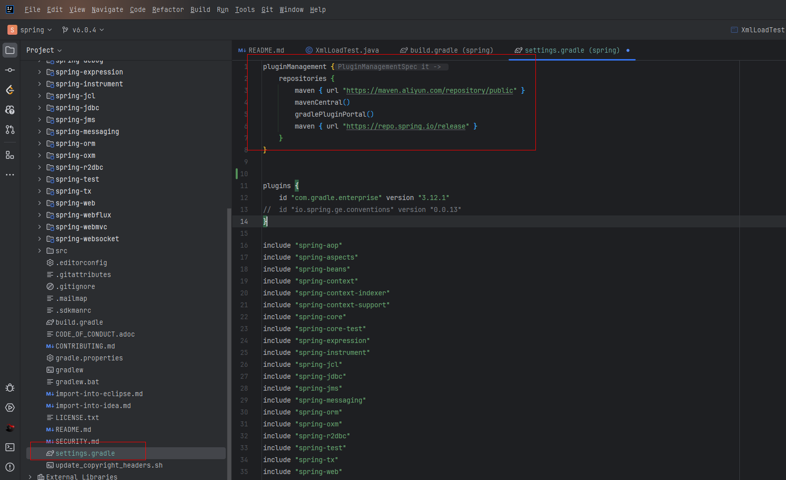

## 一、版本说明

1. spring源码版本： 6.0.4
2. jdk版本： 17  (idea可以直接设置,不需要修改环境变量)
3. IDEA: 2023.2.2

## 二、源码下载

```shell
git clone https://github.com/spring-projects/spring-framework.git
```

### 注意事项

使用https协议下载可能会提示缓存区过小错误

解决方案

1. 加大缓冲区

```shell
git config --global http.postBuffer 524288000
```

2. 换git方案clone代码

```shell
git clone git://github.com/spring-projects/spring-framework.git
```

## 源码编译

直接将相关项目导入idea中，注意设置jdk版本及gradle配置，然后使用idea编译即可

::: tip 提示
编译过程过慢可以将gradle的下载地址修改为国内镜像
:::

修改配置

1. build.gradle

```groovy
maven { url "https://maven.aliyun.com/repository/public" }
```



2. settings.gradle

```groovy
maven { url "https://maven.aliyun.com/repository/public" }
```




