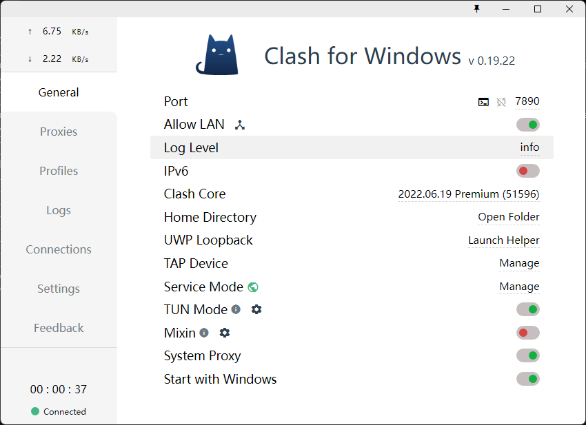

## 安装docker

::: tip 提示
本文相关系统版本均为Ubuntu 24.04 参考文档：[docker官方文档](https://docs.docker.com/engine/install/ubuntu/)
:::

```shell
#更新软件源
# Add Docker's official GPG key:
sudo apt-get update
sudo apt-get install ca-certificates curl
sudo install -m 0755 -d /etc/apt/keyrings
sudo curl -fsSL https://download.docker.com/linux/ubuntu/gpg -o /etc/apt/keyrings/docker.asc
sudo chmod a+r /etc/apt/keyrings/docker.asc

# Add the repository to Apt sources:
echo \
  "deb [arch=$(dpkg --print-architecture) signed-by=/etc/apt/keyrings/docker.asc] https://download.docker.com/linux/ubuntu \
  $(. /etc/os-release && echo "$VERSION_CODENAME") stable" | \
  sudo tee /etc/apt/sources.list.d/docker.list > /dev/null
sudo apt-get update
#安装docker
sudo apt install docker-ce docker-ce-cli containerd.io
#查看docker版本
docker -v
# 设置docker开机自启
sudo systemctl enable docker
# 设置非root用户可执行docker命令
sudo usermod -aG docker $USER
```

## 开启docker远程访问

```shell
# 编辑docker配置文件
sudo vi /usr/lib/systemd/system/docker.service
# 修改配置 -H tcp://0.0.0.0:2375 放到ExecStart行最后
ExecStart=/usr/bin/dockerd -H tcp://0.0.0.0:2375
# 重启docker
sudo systemctl daemon-reload
sudo systemctl restart docker
```

## ~~docker切换镜像源~~
    
```shell
# 编辑docker配置文件
sudo vi /etc/docker/daemon.json
# 修改配置
{
    "registry-mirrors": [
        "https://dockerproxy.com",
        "https://docker.m.daocloud.io",
        "https://docker.nju.edu.cn"
    ]
}

```
重启docker
```shell
sudo systemctl daemon-reload
sudo systemctl restart docker
```

### 用科学上网



## 安装docker-compose

```shell
sudo apt install -y docker-compose
```


## 卸载docker

### 如果您是通过 APT 包管理器安装的 Docker（最常见）：

```bash
# 1. 停止所有正在运行的 Docker 容器
docker stop $(docker ps -aq)

# 2. 删除所有 Docker 容器
docker rm $(docker ps -aq)

# 3. 卸载 Docker 包
sudo apt-get purge -y docker-ce docker-ce-cli containerd.io docker-buildx-plugin docker-compose-plugin docker-ce-rootless-extras

# 4. 删除所有 Docker 镜像
sudo docker rmi $(docker images -aq)

# 5. 删除 Docker 卷 (Volumes)
# 注意：这会删除所有数据，请谨慎操作！
sudo docker volume rm $(docker volume ls -q)

# 6. 删除 Docker 网络
sudo docker network rm $(docker network ls -q)

# 7. 删除 Docker 相关的数据目录
# 这一步非常重要，可以删除 Docker 的所有配置、镜像、容器数据等。
sudo rm -rf /var/lib/docker
sudo rm -rf /var/lib/containerd
```

###  Snap 安装的 Docker：

```bash
# 1. 停止所有正在运行的 Docker 容器 (如果还能运行的话)
# 通常通过 Snap 安装的 Docker，其命令可能需要加 snap 前缀，例如：
# snap run docker stop $(snap run docker ps -aq)
# 如果不确定，可以尝试常规的 docker 命令，或者跳过这步，直接卸载。

# 2. 卸载 Docker Snap 包
sudo snap remove docker

# 3. 清理 Snap 缓存（可选）
# 这会清理 Snap 的一些旧版本缓存，可以释放磁盘空间。
sudo snap set system refresh.retain=2 # 设置只保留最近2个版本
sudo snap refresh --amend
```


###  清理残留文件和配置

卸载 Docker 包后，还需要手动删除一些可能残留的文件和用户配置。

```bash
# 1. 删除 Docker 用户配置文件和历史记录
rm -rf ~/.docker
rm -f ~/.bash_history # 如果想彻底清除 docker 命令历史，但也会清除所有 bash 历史

# 2. 检查并删除可能残留的 Docker 组
# Docker 会创建一个名为 docker 的用户组。如果您的系统上没有其他程序依赖这个组，可以删除它。
sudo delgroup docker

# 3. 删除旧的 Docker GPG 密钥（如果之前添加过）
# 这通常位于 /etc/apt/trusted.gpg.d/ 或 /etc/apt/trusted.gpg 中。
# 需要根据您实际添加时的文件名进行删除，例如：
sudo rm /etc/apt/keyrings/docker.gpg

# 4. 删除 Docker 的 APT 源列表（如果之前添加过）
sudo rm /etc/apt/sources.list.d/docker.list

# 5. 更新 APT 软件包列表，确保所有 Docker 相关的源都被移除
sudo apt update

sudo reboot
```
