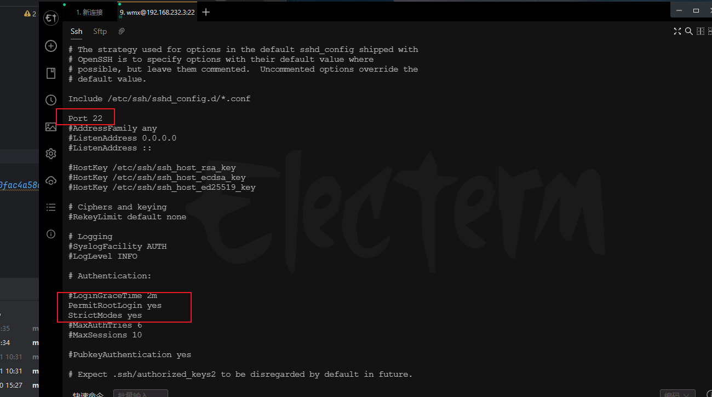

## Ubuntu切换镜像源
### 切换Ubuntu镜像源
1. 备份原有的源
```shell
sudo cp /etc/apt/sources.list /etc/apt/sources.list.bak
```
2. 修改源
```shell
sudo sed -i 's@//.*archive.ubuntu.com@//mirrors.ustc.edu.cn@g' /etc/apt/sources.list
```
3. 更新原件源
```shell
sudo apt update
```

### 文件权限

```shell
sudo chomd -R 777 文件名
```

### 端口

```shell
# 查看端口情况
netstat -ano|grep 8080
netstat -nalp|grep 8080

```

### 上传下载文件

```shell
###从服务器上下载文件
###例如scp root@192.168.0.101:/var/www/test.txt  把192.168.0.101上的/var/www/test.txt 的文件下载到/var/www/local_dir（本地目录）
scp username@servername:/path/filename /var/www/local_dir（本地目录）


###上传本地文件到服务器
###例如scp /var/www/test.php  root@192.168.0.101:/var/www/  把本机/var/www/目录下的test.php文件上传到192.168.0.101这台服务器上的/var/www/目录中

scp /path/filename username@servername:/path


###从服务器下载整个目录
###scp -r root@192.168.0.101:/var/www/test  /var/www/
scp -r username@servername:/var/www/remote_dir/（远程目录） /var/www/local_dir（本地目录）

###上传目录到服务器
###scp -r test  root@192.168.0.101:/var/www/   把当前目录下的test目录上传到服务器的/var/www/ 目录
scp  -r local_dir username@servername:remote_dir

#查看资源使用
free -h

```


## Ubuntu 关闭防火墙
```shell
# 查看防火墙状态
sudo systemctl status ufw
# 关闭防火墙
sudo systemctl stop ufw
# 禁止开机启动
sudo ufw disable
# 开启防火墙
sudo start ufw
# 开机启动
systemctl ufw enable
```

## 设置时间
```shell
# 查看时间
date
# 设置时间
date -s 2021-09-09
# 设置时区
timedatectl set-timezone Asia/Shanghai
# 设置时间24小时制
sudo /etc/default/locale
# 在/etc/default/locale添加
LC_TIME=en_DK.UTF-8
# 防止重启失效
sudo hwclock --systohc
# 重启系统
sudo reboot
```

## 修改root密码并开启root连接
```shell
sudo passwd
sudo passwd
#然后会提示输入当前用户密码，回车后
#终端会提示我们输入新的密码并确认，此时的密码就是root新密码。
#修改成功后，输入命令 
su root 

```

### 开启ssh
1. 安装ssh
```shell
# 删除原有ssh
sudo apt-get remove openssh-server
# 更新源
sudo apt update
# 安装ssh
sudo apt-get install openssh-server
```
2. 开启ssh
```shell

sudo service ssh start
```

3. 查看ssh状态
```shell
sudo service ssh status
```

4. 设置ssh开机自启
```shell
sudo systemctl enable ssh
```
5. 开启ssh登录配置
```shell
sudo vim /etc/ssh/sshd_config
```


6. 重启ssh
```shell
sudo service ssh restart
```
