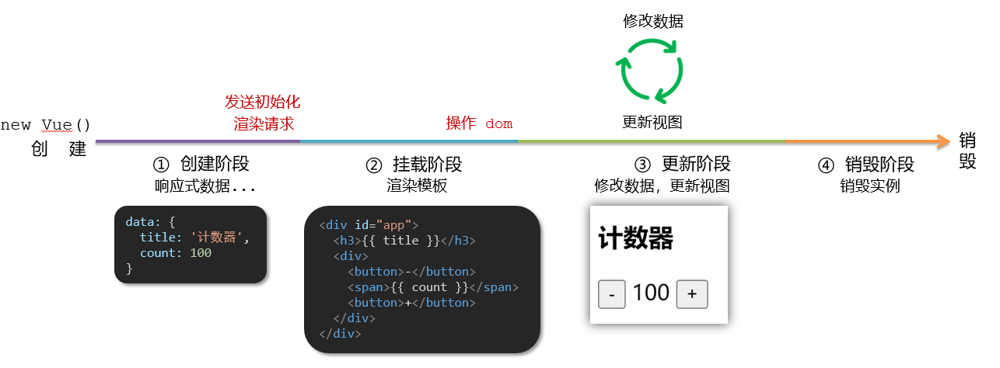
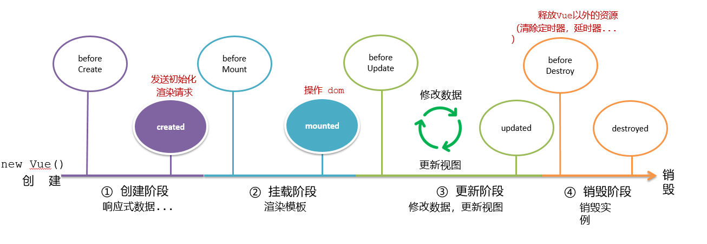

## Vue的生命周期

Vue生命周期：就是一个Vue实例从创建 到 销毁 的整个过程。

生命周期四个阶段：① 创建 ② 挂载 ③ 更新 ④ 销毁

1.创建阶段：创建响应式数据

2.挂载阶段：渲染模板

3.更新阶段：修改数据，更新视图

4.销毁阶段：销毁Vue实例



## Vue生命周期钩子函数


Vue的生命周期钩子函数是在Vue实例的不同生命周期阶段自动调用的函数。以下是常见的生命周期钩子函数：

1. **beforeCreate**: 实例初始化之后，数据观测和事件配置之前调用。
2. **created**: 实例创建完成，数据观测和事件配置完成，但未挂载DOM。
3. **beforeMount**: 在挂载开始之前调用，相关的render函数首次被调用。
4. **mounted**: 实例挂载到DOM后调用。
5. **beforeUpdate**: 数据更新时调用，发生在虚拟DOM重新渲染和打补丁之前。
6. **updated**: 由于数据更改导致的虚拟DOM重新渲染和打补丁之后调用。
7. **beforeDestroy**: 实例销毁之前调用。
8. **destroyed**: 实例销毁后调用。

### 示例代码

```js
new Vue({
    el: '#app',
    data: {
        message: 'Hello Vue!'
    },
    beforeCreate() {
        console.log('beforeCreate');
    },
    created() {
        console.log('created');
    },
    beforeMount() {
        console.log('beforeMount');
    },
    mounted() {
        console.log('mounted');
    },
    beforeUpdate() {
        console.log('beforeUpdate');
    },
    updated() {
        console.log('updated');
    },
    beforeDestroy() {
        console.log('beforeDestroy');
    },
    destroyed() {
        console.log('destroyed');
    }
});
```


