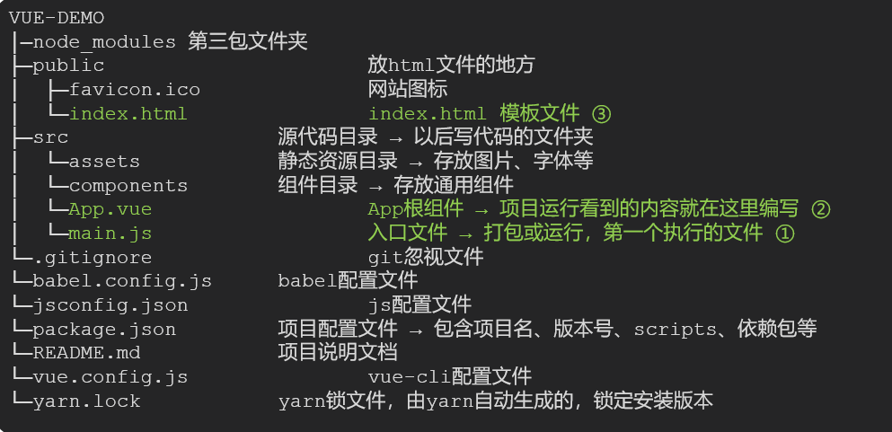
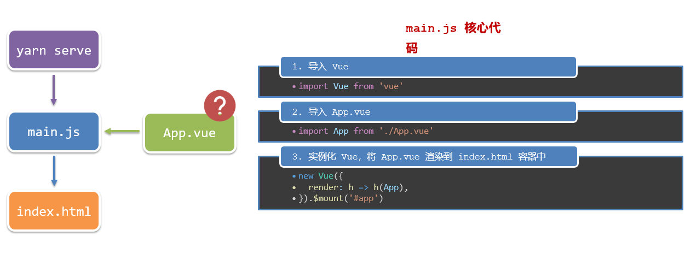

## 脚手架Vue-cli
####   基本介绍：

Vue CLI 是Vue官方提供的一个**全局命令工具**

可以帮助我们**快速创建**一个开发Vue项目的**标准化基础架子**。【集成了webpack配置】

####    好处：

1. 开箱即用，零配置
2. 内置babel等工具
3. 标准化的webpack配置

####    使用步骤：

1. 全局安装（只需安装一次即可） yarn global add @vue/cli 或者 npm i @vue/cli -g
2. 查看vue/cli版本： vue --version
3. 创建项目架子：**vue create project-name**(项目名不能使用中文)
4. 启动项目：**yarn serve** 或者 **npm run serve**(命令不固定，找package.json)

## 项目目录介绍和运行流程

### 运行流程

