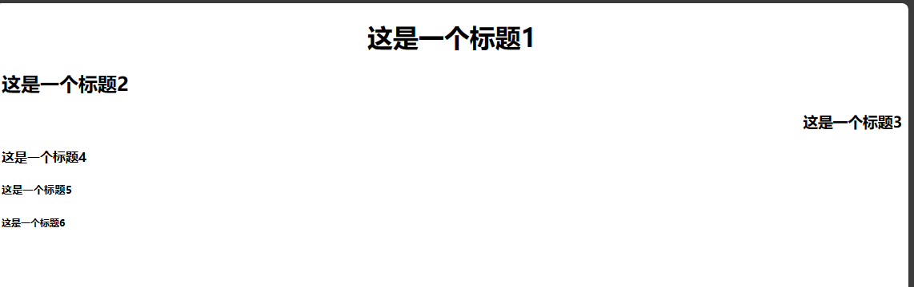

## 标题标签

标题使用`<h1>`至`<h6>`标签进行定义。`<h1>`定义最大的标题，`<h6>`定义最小的标题。具有align属性，属性值可以是：left、center、right。

```html
<h1 align="center">这是一个标题1</h1>
<h2 align="left">这是一个标题2</h2>
<h3 align="right">这是一个标题3</h3>
<h4>这是一个标题4</h4>
<h5>这是一个标题5</h5>
<h6>这是一个标题6</h6>
```



## 段落标签`<p>`

[段落元素](https://developer.mozilla.org/zh-CN/docs/Web/HTML/Element/p)

段落，是英语“paragraph“缩写。

**作用**：可以把 HTML 文档分割为若干段落。在网页中如果要把文字有条理地显示出来，离不开段落标签。就如同我们平常写文章一样，整个网页也可以分为若干个段落。

```html
<p>这是一个段落。</p>
<p>这是另一个段落。</p>
```

属性：

- `align="属性值"`：对齐方式。属性值包括left center right。
  HTML标签是分等级的，HTML将所有的标签分为两种：

- **文本级标签**：p、span、a、b、i、u、em。文本级标签里只能放**文字、图片、表单元素**。（a标签里不能放a和input）

- **容器级标签**：div、h系列、li、dt、dd。容器级标签里可以放置任何东西。

::: warning 注意事项
**p标签是一个文本级标签，p里面只能放文字、图片、表单元素**。其他的一律不能放。
:::

## 水平线标签`<hr />`

[水平线标签](https://developer.mozilla.org/zh-CN/docs/Web/HTML/Element/hr)

> horizontal 单词的发音：[ˌhɒrɪˈzɒntl]。

水平分隔线（horizontal rule）可以在视觉上将文档分隔成各个部分。在网页中常常看到一些水平线将段落与段落之间隔开，使得文档结构清晰，层次分明。

```html
<p>这是一个段落。</p>
<hr>
<p>这是另一个段落。</p>
```

属性介绍：

- `align="属性值"`：设定线条置放位置。属性值可选择：left right center。
- `size="2" `：设定线条粗细。以像素为单位，内定为2。
- `width="500"`或`width="70%"`：设定线条长度。可以是绝对值（单位是像素）或相对值。如果设置为相对值的话，内定为100%。
- `color="#0000FF"`：设置线条颜色。
- `noshade`：不要阴影，即设定线条为平面显示。若没有这个属性则表明线条具阴影或立体。

## 换行标签`<br />`

[换行标签](https://developer.mozilla.org/zh-CN/docs/Web/HTML/Element/br)

如果希望某段文本强制换行显示，就需要使用换行标签。

```html
This <br/> is a para<br/>graph with line breaks
```

## `<div>`和`<span>`标签

[内容划分元素](https://developer.mozilla.org/zh-CN/docs/Web/HTML/Element/div)

[短语内容的通用行内容器](https://developer.mozilla.org/zh-CN/docs/Web/HTML/Element/span)

div和span是非常重要的标签，div的语义是division“分割”； span的语义就是span“范围、跨度”。想必你应该听说过“div + css”布局。

### div和span的介绍

- **div标签**：可以把标签中的内容分割为独立的区块。必须单独占据一行。

- **span标签**：和div的作用一致，但不换行。

div标签的属性：

- `align="属性值"`：设置块儿的位置。属性值可选择：left、right、 center。

### div和span的区别

`<span>`和`<div>`唯一的区别在于：`<span>`是不换行的，而`<div>`是换行的。

如果单独在网页中插入这两个元素，不会对页面产生任何的影响。这两个元素是专门为定义CSS样式而生的。或者说，DIV+CSS来实现各种样式。

div在浏览器中，默认是不会增加任何的效果的，但是语义变了，div中的所有元素是一个小区域。
div标签是一个**容器级**标签，里面什么都能放，甚至可以放div自己。

span也是表达“小区域、小跨度”的标签，但只是一个**文本级**的标签。
就是说，span里面只能放置文字、图片、表单元素。 span里面不能放p、h、ul、dl、ol、div。

这种模式叫做“**div+css**”：**div标签负责布局、结构、分块，css负责样式**。

## ~~内容居中标签 `<center>`~~

[~~center元素~~](https://developer.mozilla.org/zh-CN/docs/Web/HTML/Element/center)

此时center代表是一个标签，而不是一个属性值了。只要是在这个标签里面的内容，都会居于浏览器的中间。
到了HTML5里面，center标签不建议使用，建议使用css布局来实现。

## 预定义（预格式化）标签`<pre>`

[预定义格式文本](https://developer.mozilla.org/zh-CN/docs/Web/HTML/Element/pre)

`<pre>`标签用于定义预格式化的文本。被包围在`<pre>`标签中的文本通常会保留空格和换行符。而文本也会呈现为等宽字体。

说明：真正排网页过程中，`<pre>`标签几乎用不着。

## 列表标签

HTML提供了三种列表标签：无序列表、有序列表和定义列表。

### 无序列表`<ul>`

[无序列表](https://developer.mozilla.org/zh-CN/docs/Web/HTML/Element/ul)

无序列表是一个项目的列表，此列表中的项目使用粗体圆点（典型的小黑圆圈）进行标记。无序列表使用`<ul>`标签。

```html

<ul>
    <li>Coffee</li>
    <li>Tea</li>
    <li>Milk</li>
</ul>
```

### 有序列表`<ol>`

[有序列表](https://developer.mozilla.org/zh-CN/docs/Web/HTML/Element/ol)

有序列表是一个项目的列表，此列表中的项目使用数字进行标记。有序列表使用`<ol>`标签。

```html

<ol>
    <li>Coffee</li>
    <li>Tea</li>
    <li>Milk</li>
</ol>
```

### 定义列表`<dl>`

[定义列表](https://developer.mozilla.org/zh-CN/docs/Web/HTML/Element/dl)

定义列表是一个项目的列表，此列表中的项目使用粗体字定义。定义列表使用`<dl>`标签。

```html

<dl>
    <dt>Coffee</dt>
    <dd>Black hot drink</dd>
    <dt>Milk</dt>
    <dd>White cold drink</dd>
</dl>
```

## 表格标签

[表格](https://developer.mozilla.org/zh-CN/docs/Web/HTML/Element/table)

表格是由行和列组成的，每个单元格可以包含文本、图片、链接、段落、列表、表单、水平线、表格等等。

### 表格的基本结构

```html

<table border="1">
    <tr>
        <td>单元格1</td>
        <td>单元格2</td>
    </tr>
    <tr>
        <td>单元格3</td>
        <td>单元格4</td>
    </tr>
</table>

```

### `<tr>`：行

[tr元素](https://developer.mozilla.org/zh-CN/docs/Web/HTML/Element/tr)

`<tr>`标签定义表格中的行。

### `<td>`：单元格

[td元素](https://developer.mozilla.org/zh-CN/docs/Web/HTML/Element/td)

`<td>`标签定义表格中的标准单元格。

- `align`：内容的横向对齐方式。属性值可以填：left right center。如果想让每个单元格的内容都居中，这个属性太麻烦了，以后用css来解决。
- `valign`：内容的纵向对齐方式。属性值可以填：top middle bottom
- `width`：绝对值或者相对值(%)
- `height`：单元格的高度
- `bgcolor`：设置这个单元格的背景色。
- `background`：设置这个单元格的背景图片。

### `<th>`：表头单元格

[th元素](https://developer.mozilla.org/zh-CN/docs/Web/HTML/Element/th)

`<th>`标签定义表格中的表头单元格。

- 属性同`<td>`标签。

### `<caption>`：表格标题

`<caption>`标签定义表格的标题。

属性：`align`，表示标题相对于表格的位置。属性取值可以是：left、center、right、top、bottom

### 表格的`<thead>`标签、`<tbody>`标签、`<tfoot>`标签

[thead元素](https://developer.mozilla.org/zh-CN/docs/Web/HTML/Element/thead)
[tbody元素](https://developer.mozilla.org/zh-CN/docs/Web/HTML/Element/tbody)
[tfoot元素](https://developer.mozilla.org/zh-CN/docs/Web/HTML/Element/tfoot)

这三个标签有与没有的区别：

- 1、如果写了，那么这三个部分的**代码顺序可以任意**
  ，浏览器显示的时候还是按照thead、tbody、tfoot的顺序依次来显示内容。如果不写thead、tbody、tfoot，那么浏览器解析并显示表格内容的时候是从按照代码的从上到下的顺序来显示。
- 2、当表格非常大内容非常多的时候，如果用thead、tbody、tfoot标签的话，那么**数据可以边获取边显示**
  。如果不写，则必须等表格的内容全部从服务器获取完成才能显示出来。

## 内嵌框架

[iframe元素](https://developer.mozilla.org/zh-CN/docs/Web/HTML/Element/iframe)

内嵌框架用`<iframe>`表示。`<iframe>`是`<body>`的子标记。

内嵌框架inner frame：嵌入在一个页面上的框架(仅仅IE、新版google浏览器支持，可能有其他浏览器也支持，暂时我不清楚)。

`<iframe>`标签用于在网页中显示一个独立的HTML页面。

**属性：**

- `src="subframe/the_second.html"`：内嵌的那个页面
- `width=800`：宽度
- `height=“150`：高度
- `scrolling="no"`：是否需要滚动条。默认值是true。
- `name="mainFrame"`：窗口名称。公有属性。

```html

<iframe src="demo_iframe.htm" width="200" height="200"></iframe>
```

**属性：**

- `src="subframe/the_second.html"`：内嵌的那个页面
- `width=800`：宽度
- `height=“150`：高度
- `scrolling="no"`：是否需要滚动条。默认值是true。
- `name="mainFrame"`：窗口名称。公有属性。

## 表单标签

[表单](https://developer.mozilla.org/zh-CN/docs/Web/HTML/Element/form)

表单标签用`<form>`表示，用于与服务器的交互。表单就是收集用户信息的，就是让用户填写的、选择的。

**属性：**

- `name`：表单的名称，用于JS来操作或控制表单时使用；
- `id`：表单的名称，用于JS来操作或控制表单时使用；
- `action`：指定表单数据的处理程序，一般是PHP，如：action=“login.php”
- `method`：表单数据的提交方式，一般取值：get(默认)和post

::: tip 注意
表单和表格嵌套时，是在`<form>`标记中套`<table>`标记。
:::

form标签里面的action属性和method属性,action属性就是表示，表单将提交到哪里。 method属性表示用什么HTTP方法提交，有get、post两种。

### `<input>`：输入标签（文本框）

[input元素](https://developer.mozilla.org/zh-CN/docs/Web/HTML/Element/input)

`<input>`标签用于表单中的输入框。

**属性：**

- `type`
  ：输入框的类型。常用的有：text、password、radio、checkbox、submit、reset、button、file、hidden、image、email、url、number、range、date、month、week、time、datetime、datetime-local、search、color
- `name`：输入框的名称，用于JS来操作或控制表单时使用；
- `value`：输入框的默认值；
- `size`：输入框的长度；
- `maxlength`：输入框的最大长度；
- `readonly`：只读；
- `disabled`：禁用；
- `checked`：默认选中；
- `placeholder`：输入框的提示信息；
- `autofocus`：自动获取焦点；

```html

<form>
    姓名：<input value="呵呵">逗比<br>
    昵称：<input value="哈哈" readonly=""><br>
    名字：<input type="text" value="name" disabled=""><br>
    密码：<input type="password" value="pwd" size="50"><br>
    性别：<input type="radio" name="gender" id="radio1" value="male" checked="">男
    <input type="radio" name="gender" id="radio2" value="female">女<br>
    爱好：<input type="checkbox" name="love" value="eat">吃饭
    <input type="checkbox" name="love" value="sleep">睡觉
    <input type="checkbox" name="love" value="bat">打豆豆
</form>
```

::: tip 注意
多个单选框的input标签中，name 的属性值可以相同，但是 **id 的属性值必须是唯一的**。我们知道，html的标签中，id的属性值是唯一的
:::

**四种按钮的举例**：

```html

<form>
    <input type="button" value="普通按钮"><br>
    <input type="submit" value="提交按钮"><br>
    <input type="reset" value="重置按钮"><br>
    <input type="image" value="图片按钮1"><br>
    <input type="image" src="1.jpg" width="800" value="图片按钮2"><br>
    <input type="file" value="文件选择框">
</form>
```

### `<select>`：下拉列表标签

`<select>`标签里面的每一项用`<option>`表示。select就是“选择”，option“选项”。

select标签和ul、ol、dl一样，都是组标签。

**`<select>`标签的属性：**

- `multiple`：可以对下拉列表中的选项进行多选。属性值为 multiple，也可以没有属性值。也就是说，既可以写成 `multiple=""`
  ，也可以写成`multiple="multiple"`。
- `size="3"`：如果属性值大于1，则列表为滚动视图。默认属性值为1，即下拉视图。

**`<option>`标签的属性：**

- `selected`：预选中。没有属性值。

举例：

```html

<form>
    <select>
        <option>小学</option>
        <option>初中</option>
        <option>高中</option>
        <option>大学</option>
        <option selected="">研究生</option>
    </select>
    <br><br><br>

    <select size="3">
        <option>小学</option>
        <option>初中</option>
        <option>高中</option>
        <option>大学</option>
        <option>研究生</option>
    </select>
    <br><br><br>

    <select multiple="">
        <option>小学</option>
        <option>初中</option>
        <option selected="">高中</option>
        <option selected="">大学</option>
        <option>研究生</option>
    </select>
    <br><br><br>

</form>
```

### `<textarea>`标签：多行文本输入框

text 就是“文本”，area 就是“区域”。

**属性：**

- `rows="4"`：指定文本区域的行数。
- `cols="20"`：指定文本区域的列数。
- `readonly`：只读。

举例：

```html
	<form>
		<textarea name="txtInfo" rows="4" cols="20">1、不爱摄影不懂设计的程序猿不是一个好的产品经理。</textarea>
	</form>
```

### `<label>`标签

我们先来看下面一段代码：

```html
<input type="radio" name="sex" /> 男
<input type="radio" name="sex" /> 女

```

对于上面这样的单选框，我们只有点击那个单选框（小圆圈）才可以选中，点击“男”、“女”这两个文字时是无法选中的；于是，label标签派上了用场。

本质上来讲，“男”、“女”这两个文字和input标签时没有关系的，而label就是解决这个问题的。我们可以通过label把input和汉字包裹起来作为整体。

解决方法如下：

```html
<input type="radio" name="sex" id="nan" /> <label for="nan">男</label>
<input type="radio" name="sex" id="nv"  /> <label for="nv">女</label>
```

上方代码中，让label标签的**for 属性值**，和 input 标签的 **id 属性值相同**，那么这个label和input就有绑定关系了。


复选框也有label：（任何表单元素都有label）

```html
<input type="checkbox" id="kk" />
<label for="kk">10天内免登陆</label>
```