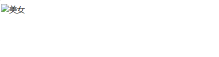
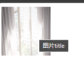

## img标签介绍

[图像嵌入元素](https://developer.mozilla.org/zh-CN/docs/Web/HTML/Element/img)

### 介绍

img: 英文全称 image（图像），代表的是一张图片。

如果要想在网页中显示图像，就可以使用img 标签，它是一个单标签。语法如下：

```html

```

### 能插入的图片类型

- 能够插入的图片类型是：jpg(jpeg)、gif、png、bmp等。

- 不能往网页中插入的图片格式是：psd、ai等。

HTML页面不是直接插入图片，而是插入图片的引用地址，所以要先把图片上传到服务器上。

## img标签的`src`属性

这里涉及到图片的一个属性：

- `src`属性：指图片的路径。英文名称 source。

在写**图片的路径**时，有两种写法：相对路径、绝对路径

### 图片的相对路径

相对当前页面所在的路径。两个标记 `.` 和 `..` 分表代表当前目录和上一层目录。

```html
<!-- 当前目录中的图片 -->


<!-- 上一级目录中的图片 -->

```

### 图片的绝对路径

绝对路径是指图片的完整路径，包括协议、域名、路径等。

```html
<!--域名-->

<!--盘符开始路径-->

```

## img标签的其他属性

### width、height 属性

- `width`：图像的宽度。

- `height`：图像的高度。

width和height，在 HTML5 中的单位是 CSS 像素，在 HTML 4 中既可以是像素，也可以是百分比。可以只指定 width 和 height
中的一个值，浏览器会根据原始图像进行缩放。

**重要提示**：如果要想保证图片等比例缩放，请只设置width和height中其中一个。

### Alt 属性

- `alt`：当图片不可用（无法显示）的时候，代替图片显示的内容。alt是英语 alternate “替代”的意思，代表替换资源。

`Alt`属性效果演示：

```html

<body>

</body>
```



如上图所示：当图片 src 不可用的时候，显示文字。这样做，至少能让用户知道，这个图片大概是什么内容。


### title 属性

- `title`：**提示性文本**。鼠标悬停时出现的文本。

title 属性不该被用作一幅图片在 alt 之外的补充说明信息。如果一幅图片需要小标题，使用 figure 或 figcaption 元素。

title 元素的值一般作为提示条(tooltip)呈现给用户，在光标于图片上停下后显示出来。尽管这确实能给用户提供更多的信息，您不该假定用户真的能看到：用户可能只有键盘或触摸屏。如果要把特别重要的信息提供给用户，可以选择上面提供的一种方法将其内联显示，而不是使用 title。




### align 属性

- 图片的`align`属性：**图片和周围文字的相对位置**。属性取值可以是：bottom（默认）、center、top、left、right。

如果想实现图文混排的效果，请使用align属性，取值为left或right。

1. `align=""`，图片和文字底端对齐。即默认情况下的显示效果
2. `align="center"`：图片和文字水平方向上居中对齐
3. `align="top"`：图片和文字顶端对齐
4. `align="left"`：图片和文字左对齐
5. `align="right"`：图片和文字右对齐


