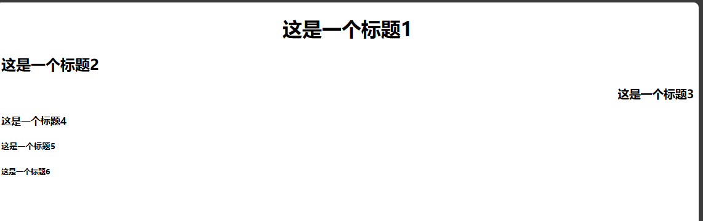

## 标题标签
标题使用`<h1>`至`<h6>`标签进行定义。`<h1>`定义最大的标题，`<h6>`定义最小的标题。具有align属性，属性值可以是：left、center、right。

```html
<h1 align="center">这是一个标题1</h1>
<h2 align="left">这是一个标题2</h2>
<h3 align="right">这是一个标题3</h3>
<h4>这是一个标题4</h4>
<h5>这是一个标题5</h5>
<h6>这是一个标题6</h6>
```


## 段落标签`<p>`
段落，是英语“paragraph“缩写。

**作用**：可以把 HTML 文档分割为若干段落。在网页中如果要把文字有条理地显示出来，离不开段落标签。就如同我们平常写文章一样，整个网页也可以分为若干个段落。

```html
<p>这是一个段落。</p>
<p>这是另一个段落。</p>
```
属性：

- `align="属性值"`：对齐方式。属性值包括left center right。
  HTML标签是分等级的，HTML将所有的标签分为两种：

- **文本级标签**：p、span、a、b、i、u、em。文本级标签里只能放**文字、图片、表单元素**。（a标签里不能放a和input）

- **容器级标签**：div、h系列、li、dt、dd。容器级标签里可以放置任何东西。

::: warning 注意事项
**p标签是一个文本级标签，p里面只能放文字、图片、表单元素**。其他的一律不能放。
:::