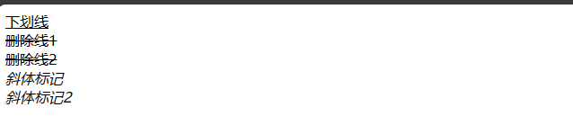
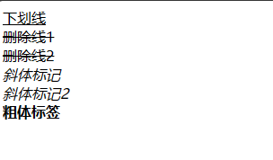
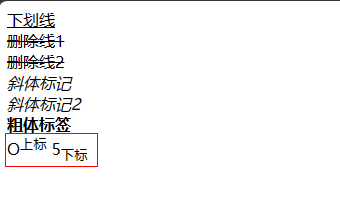

## 字体标签
### 特殊字符（转义字符）
- `&nbsp;`：空格	（non-breaking spacing，不断打空格）
- `&lt;`：小于号`<`（less than）
-  `&gt;`：大于号`>`（greater than）
- `&amp;`：符号`&`
- `&quot;`：双引号
- `&apos;`：单引号
- `&copy;`：版权`©`
- `&trade;`：商标`™`
-  `&#32464;`：文字`绐`。其实，`#32464`是汉字`绐`的unicode编码。

| 特殊字符 | 描述 |字符的代码 |
|:----:|:------------:|:----:|
|      |空格符|`&nbsp;`|
|  <   |小于号|`&lt;`|
|  \>  |大于号|`&gt;`|
|  &   |和号|`&amp;`|
|  ￥   |人民币|`&yen;`|
|  ©   |版权|`&copy;`|
|  ®   |注册商标|`&reg;`|
|  °   |摄氏度|`&deg;`|
|  ±   |正负号|`&plusmn;`|
|  ×   |乘号|`&times;`|
|  ÷   |除号|`&divide;`|
|  ²   |平方2（上标2）|`&sup2;`|
|  ³   |立方3（上标3）|`&sup3;`|

### 下划线、中划线、斜体
- `<u>`：下划线标记

- `<s>`或`<del>`：中划线标记（删除线）

- `<i>`或`<em>`：斜体标记

```html

<body>
<u>下划线</u>
<br>
<del>删除线1</del>
<br>
<s>删除线2</s>
<br>
<i>斜体标记</i>
<br>
<em>斜体标记2</em>
</body>
```


### 粗体标签`<b>`

```html
<b>粗体</b>
```


### 上标`<sup>`   下标`<sub>`

```html
O<sup>上标</sup>    5<sub>下标</sub>
```



## 三、超链接
[a标签](https://developer.mozilla.org/zh-CN/docs/Web/HTML/Element/a)
### 1、外部链接：链接到外部文件或者网站
- `href`：链接的地址
- `target`：链接的打开方式
  - `_blank`：在新窗口中打开
  - `_self`：在当前窗口中打开
  - `_parent`：在父窗口中打开
  - `_top`：在顶层窗口中打开

```html
<a href="//example.com">相对于协议的 URL</a>
<a href="/zh-CN/docs/Web/HTML">相对于源的 URL</a>
<a href="./p">相对于路径的 URL</a>

```

### 2、锚链接
- `href`：`#`+锚点名称
- `name`：锚点名称

```html
<!-- <a> 元素链接到下面部分 -->
<p><a href="#Section_further_down"> 跳转到下方标题 </a></p>

<!-- 要链接到的标题 -->
<h2 id="Section_further_down">更下面的部分</h2>

```
::: tip 说明 

name属性是HTML4.0以前使用的，id属性是HTML4.0后才开始使用。为了向前兼容，因此，name和id这两个属性都要写上，并且值是一样的。
:::

### 3、电子邮件链接
- `href`：`mailto:`+邮箱地址
- `target`：链接的打开方式

```html
<a href="mailto:nowhere@mozilla.org">Send email to nowhere</a>

```

### 4、下载链接
- `href`：文件的地址
- `download`：下载文件的名称

```html
<a href="path/to/file" download>下载文件</a>
```
::: warning 注意事项
1. download 只在同源 URL 或 blob:、data: 协议起作用。
2. 浏览器对待下载的方式因浏览器、用户设置和其他因素而异。在下载开始之前，可能会提示用户，或者自动保存文件，或者自动打开。自动打开要么在外部应用程序中，要么在浏览器本身中。
3. 如果 Content-Disposition 标头的信息与 download 属性不同，产生的行为可能不同：
如果文件头指定了一个 filename，它将优先于 download 属性中指定的文件名。
如果标头指定了 inline 的处置方式，Chrome 和 Firefox 会优先考虑该属性并将其视为下载资源。旧的 Firefox 浏览器（版本 82 之前）优先考虑该标头，并将内联显示内容。
4. `download`属性的值是下载文件的名称，如果不设置，则默认使用文件的名称。
:::

### 5、电话链接
- `href`：`tel:`+电话号码

```html
<a href="tel:+1234567890">Call me</a>
```

