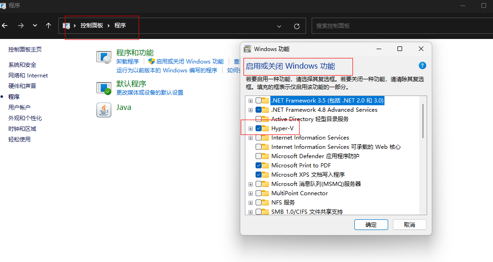
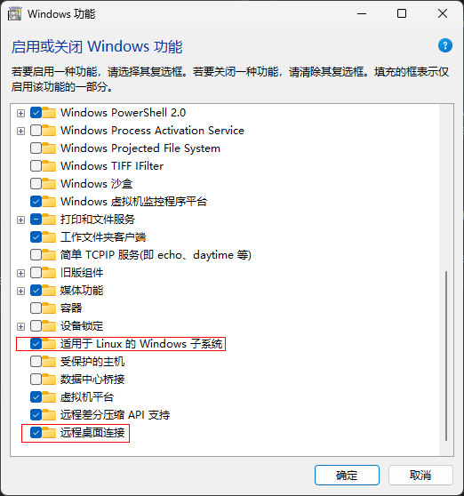
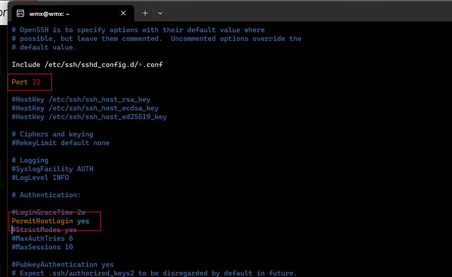
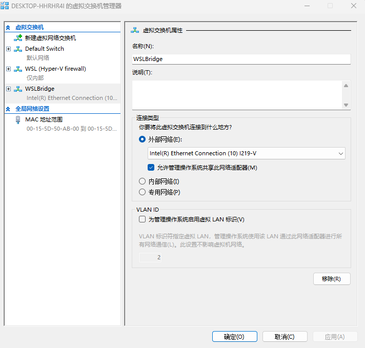

## 开启wsl2
1. 在系统中搜索“启用或关闭Windows功能”，勾选相关功能，点击确定，重启电脑。




2. 设置wsl2为默认版本
```shell
wsl --set-default-version 2
```

3. 在微软商店中搜索Ubuntu，点击安装即可。

安装可能提示的错误

[升级内核版本](https://wslstorestorage.blob.core.windows.net/wslblob/wsl_update_x64.msi)

### wsl2相关命令
```shell
# 查看wsl2版本
wsl -l -v
# 设置默认版本
wsl --set-default-version 2
# 安装指定版本
#使用 'wsl.exe --list --online' 列出可用的分发版
# 和 'wsl.exe --install <Distro>' 进行安装。
wsl.exe --install Ubuntu-22.04
# 移除子系统
wsl --unregister Ubuntu-22.04
# 彻底关闭指定的子系统
wsl -s Ubuntu-22.04
# 启动指定的子系统
wsl -d Ubuntu-22.04
# 后台开启Ubuntu(无命令窗)
wsl -d Ubuntu-22.04 -u root -e /etc/init.d/ssh start
```

## Ubuntu相关配置
### 切换Ubuntu镜像源
1. 备份原有的源
```shell
sudo cp /etc/apt/sources.list /etc/apt/sources.list.bak
```
2. 修改源
```shell
sudo sed -i 's@//.*archive.ubuntu.com@//mirrors.ustc.edu.cn@g' /etc/apt/sources.list
```


### 开启ssh
进入Ubuntu子系统
1. 安装ssh
```shell
# 删除原有ssh
sudo apt-get remove openssh-server
# 更新源
sudo apt update
# 安装ssh
sudo apt-get install openssh-server
```
2. 开启ssh
```shell

sudo service ssh start
```

3. 查看ssh状态
```shell
sudo service ssh status
```

4. 设置ssh开机自启
```shell
sudo systemctl enable ssh
```
5. 开启ssh登录配置
```shell
sudo vim /etc/ssh/sshd_config
```


6. 重启ssh
```shell
sudo service ssh restart
```

### Ubuntu22.04配置静态ip
1. 在hyper-v管理器中新建虚拟交换机

2. 配置window网卡信息
   首先，需要在Windows端为WSL2的虚拟网卡分配一个静态IP地址。
请以管理员权限打开PowerShell或命令提示符，然后执行以下命令：
    ```shell
    # 查询当前WSL2虚拟网卡名称
    Get-NetAdapter | Where-Object { $_.Name -like "*WSL*" } | Select-Object Name

    # 假设查询结果显示虚拟网卡名为 "vEthernet (WSLBridge)"
    # 为该网卡设置静态IP地址、子网掩码、默认网关和DNS（根据实际情况调整）
    New-NetIPAddress -InterfaceAlias "vEthernet (WSLBridge)" -IPAddress 192.168.232.129 -PrefixLength 24 -DefaultGateway 192.168.232.1
    Set-DnsClientServerAddress -InterfaceAlias "vEthernet (WSLBridge)" -ServerAddresses "192.168.232.1"
    ```
3. 在用户目录下创建`.wslconfig`新增文件
    ```shell
    [wsl2]
    networkingMode=bridged
    vmSwitch=WSLBridge
    ipv6=true
    dhcp=false
    ```
4. 配置Ubuntu静态ip

    ```shell
    sudo vim /etc/netplan/00-wsl.yaml
    ```

::: tip 提示
addresses按照实际修改
:::
```yaml
network:
  ethernets:
    ens33:
      dhcp4: no
      addresses:
        - 192.168.232.129/24
      routes:
        - to: default
          via: 192.168.232.1
      nameservers:
        addresses:
          - 8.8.8.8
          - 8.8.4.4
          - 192.168.232.1
  version: 2

```

2. 配置权限
```shell
# 不配置权限会提示 Permissions for /etc/netplan/00-wsl.yaml are too open
chmod 0600 /etc/netplan/00-wsl.yaml 
```

3. 重启网络
```shell
# 生成与后端管理工具对应的配置；
sudo netplan generate 
# 应用配置，必要时重启管理工具；
sudo netplan apply 
```

