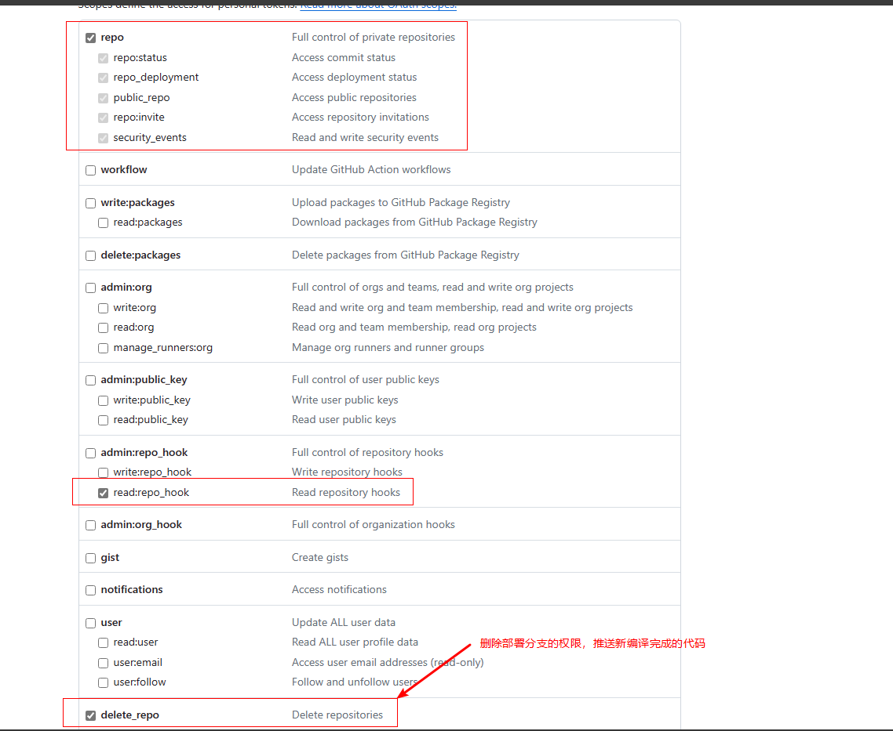

## 本项目使用github page发布

1. 安装 `gh-pages`

```sh
yarn add -D gh-pages
# OR npm install -D gh-pages
```

2. 在 `package.json` 中添加如下脚本

```json
{
  "deploy": "gh-pages -d dist -m deploy",
  "deploy:build": "npm run build && npm run deploy"
}
```

3. 运行 `deploy` 脚本

```sh
yarn deploy
# OR npm run deploy
```

## 使用 GitHub Actions 自动部署

[GitHub Actions](https://github.com/features/actions) 是 GitHub 的持续集成服务

### 配置 Secrets

> Action 需要有操作仓库的权限

GitHub 官方的帮助文档：[创建用于命令行的个人访问令牌](https://help.github.com/cn/github/authenticating-to-github/creating-a-personal-access-token-for-the-command-line)
#### 配置token需要勾选的权限



打开需要配置 Actions 的仓库，进入 `Settings/Secrets` 页面，配置 `ACCESS_TOKEN` 变量，储存内容为刚刚创建的个人访问令牌

### 编写 `workflow` 文件

1. 点击仓库的 `Actions` 按钮
2. 点击 `Set up a workflow yourself` 按钮
3. 复制如下内容

::: tip 提示: 相关内容按照需要修改
:::

```yml
name: GitHub Actions Build and Deploy

# 触发条件: push 到 master 分支后
on:
  push:
    branches:
      - master

# 设置上海时区
env:
  TZ: Asia/Shanghai

# 任务
jobs:
  build-and-deploy:
    # 服务器环境：最新版 ubuntu
    runs-on: ubuntu-latest
    steps:
      # 拉取代码
      - name: Checkout
        uses: actions/checkout@v2
        with:
          persist-credentials: false

      # 打包静态文件
      - name: Build
        run: npm install && npm run build

      # 部署
      - name: Deploy
        uses: JamesIves/github-pages-deploy-action@releases/v3
        with:
          # GitHub 密钥
          ACCESS_TOKEN: ${{ secrets.ACCESS_TOKEN }}
          # GitHub Pages 读取的分支
          BRANCH: gh-pages
          # 静态文件所在目录
          FOLDER: dist
```

详细教程可以参考阮一峰老师的[GitHub Actions 入门教程](http://www.ruanyifeng.com/blog/2019/09/getting-started-with-github-actions.html)

[GitHub Actions 中文文档](https://docs.github.com/cn/actions/reference)

## git log 格式化

### 修改默认时间格式

```sh
git config --global log.date iso8601
```

- `relative`: 相对时间格式
- `local`: 本地格式
- `iso` OR `iso8601`: `ISO8601` 格式
- `rfc`: `RFC2822` 格式
- `short`: `YYYY-MM-DD` 格式
- `raw`: 时间戳格式
- `default`: 默认格式

### 自定义输出格式

```sh
# 格式为: [commit hash] [提交时间] [提交信息] [branch tag 信息] [作者名称]
git log --pretty='%C(yellow)%h%C(reset) %ad %C(green)%s%C(reset) %C(red)%d%C(reset) %C(bold blue)[%an]%C(reset)'

# 配置别名
alias glogp="git log --pretty='%C(yellow)%h%C(reset) %ad %C(green)%s%C(reset) %C(red)%d%C(reset) %C(bold blue)[%an]%C(reset)'"
```

- `%C(颜色值)`: 修改输出颜色
- `%H`: 完整的 `commit hash`
- `%h`: 缩写的 `commit hash`
- `%ad`: 提交时间(绝对时间 可以使用 `-date=` 定制格式)
- `%ar`: 提交时间(相对时间 按多久之前显示)
- `%s`: `commit message`
- `%d`: `branch tag` 信息
- `%an`: 作者名称
- `%ae`: 作者的邮箱地址
